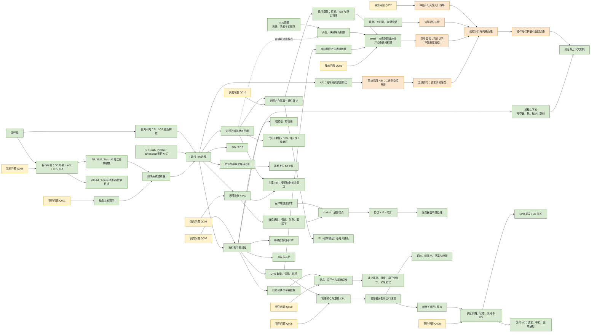
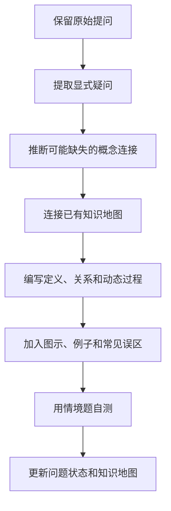

# 操作系统个人知识体系

这是一个由我的真实问题驱动、持续生长的操作系统学习仓库。

这里不会一下子塞进整本操作系统教材。先用知识地图告诉我“操作系统大概分成哪些部分”；我问到哪里，就把哪里拆开讲。每次出现新问题，先把问题原样记下来，再说明它和以前学过的东西怎样连起来，最后把新知识放回总图。

讲解顺序固定为：**先说人话 → 给具体场景 → 把动作一步一步拆开 → 再介绍正式术语 → 最后补平台差异和严格定义**。这里不要求先背术语；真正的目标是让我能够在脑中演出“电脑下一步会做什么”。

## 当前入口

| 入口 | 用途 | 当前状态 |
| --- | --- | --- |
| [操作系统知识地图](docs/00-operating-system-knowledge-map.md) | 查看操作系统有哪些主要知识领域，以及它们怎样连接 | 框架已建立 |
| [第 1 章：从程序到进程](docs/01-from-program-to-process.md) | 详细理解程序、进程、装载、内存布局、文本文件和语言运行时 | 已整理，待复习 |
| [第 2 章：CPU、上下文与指令](docs/02-cpu-context-registers-and-instructions.md) | 理解寄存器、地址空间、PID、PCB，以及中断入口怎样先保护现场、再决定是否上下文切换 | 已整理，待复习 |
| [第 3 章：MMU、特权模式、中断与系统调用](docs/03-mmu-privilege-modes-interrupts-and-apis.md) | 理解内存地址翻译、用户态与内核态、API、系统调用、异常和中断怎样连成一条安全边界 | 已整理，待复习 |
| [第 4 章：进程协作、IPC、端口与客户端/服务器](docs/04-process-cooperation-ipc-ports-and-client-server.md) | 理解隔离进程怎样通过共享内存、消息和套接字协作，并分清端口与客户端/服务器 | 已整理，待复习 |
| [第 5 章：多核 CPU、轮转调度、并发与线程](docs/05-multicore-scheduling-and-threads.md) | 理解物理核心、逻辑 CPU、轮转调度、CPU 利用率、并发/并行和线程为何被调度 | 已整理，待复习 |
| [第 6 章：平台、ABI、可执行文件与 CPU 架构](docs/06-platforms-abi-executables-and-cpu-architectures.md) | 理解 Windows、macOS、Linux、系统调用、ABI、`.exe`、PE/ELF/Mach-O 和 x86-64/Arm64 怎样共同决定软件兼容性 | 已整理，待复习 |
| [第 7 章：CPU 调度、进程状态、队列与 I/O](docs/07-cpu-scheduling-process-states-and-io.md) | 理解 CPU / I/O 突发、状态和队列、FCFS/SJF/RR/优先级/反馈队列、调度延迟，以及文件读写为何会等待和被唤醒 | 已整理，待复习 |
| [第 8 章：竞态条件、原子性与同步](docs/08-race-conditions-atomicity-and-synchronization.md) | 理解非原子操作怎样交错成半成品、丢失更新和过时判断，以及互斥、原子读改写、减少共享和消息协议怎样分工 | 已整理，待复习 |
| [第 9 章：内存隔离、基址限长与分页保护](docs/09-memory-isolation-base-limit-and-paging.md) | 理解硬件怎样逐次检查进程访存，基址/限长教学模型怎样工作，以及它与现代页表、TLB、逐页权限和异常处理的区别 | 已整理，待复习 |
| [问题档案](questions/README.md) | 保存原始问题、待澄清连接、对应章节和复习状态 | Q001 至 Q010 已登记 |
| [图片来源、版权与制作说明](assets/images/ATTRIBUTION.md) | 查看本地保存的外部教学图片和本仓库原创图的来源、许可与使用边界 | 已收录 14 张 |
| [用户提问原图档案](assets/questions/README.md) | 保留用户提问时附带的原图，并连接到对应解释 | Q002 已归档 |

## 当前学习主线

这张图表达的不是一堆孤立名词，而是十条已经连起来的因果链：程序保存在磁盘上，操作系统根据程序建立进程，线程在进程中执行；线程执行时依赖寄存器、地址空间和其他运行状态；中断或陷入到来时，硬件先护住最小返回状态，内核才决定直接返回原线程还是保存 A、恢复 B；普通程序使用 API 请求服务，CPU 用模式位和 MMU 守住边界，系统调用、异常和设备中断再让内核从规定入口接手处理；彼此隔离的进程再通过受控映射或消息通道协作，网络场景下由套接字、协议、IP 和端口把请求送到服务器；多核硬件向调度器提供多个逻辑 CPU，线程可通过时间片并发推进，也可在多个逻辑 CPU 上并行推进；第 7 章再把“就绪、运行、等待”状态、CPU / I/O 突发、队列、调度策略和文件 I/O 完成通知接成一条线；第 8 章说明同进程线程共享可变数据后，非原子步骤怎样交错成竞态，以及基础同步怎样重新建立秩序；第 9 章把进程隔离慢放成内核安装地址规则、CPU/MMU 逐次检查、非法访问同步进入内核，并把基址/限长教学模型与现代分页分开；同一份主要源代码还会针对“操作系统环境 + ABI + CPU ISA”构建成不同二进制映像。不同编程语言最终也要落到这些操作系统机制上。

## 图文材料怎样使用

Mermaid 适合画概念关系和时序，但不应成为唯一图形载体。对于内存布局、寄存器、硬件结构、真实界面或空间映射等问题，详细章节会优先补充许可明确的外部图片、动画、交互资源或本仓库原创图，并在图片旁解释“该看什么、它省略了什么”。第 1、2 章各有一张本地保存的开放许可 SVG；第 3、4 章各有两张原创 SVG；第 5 章又用两张原创 SVG 把“物理核心/逻辑 CPU/时间片”和“栈、堆、SP、函数返回”画成慢动作；第 6 章再用两张原创 SVG 解释“同源代码为何需要不同平台成品”和“一次系统调用怎样受控来回”；Q007 在第 2 章加入一张原创 SVG，专门把“寄存器组切换 / 自动最小保存 → 内核补齐现场 → 返回或切换线程”画出来；Q008 再以一张原创 SVG 把就绪 / I/O 等待队列、调度器、分派器、CPU、设备完成通知和 CPU / I/O 突发放进同一个文件复制场景；Q009 用一张原创 SVG 演出共享字符串从 `AAAAAA` 更新到 `BBBBBB` 期间，读线程为何会取得 `BBBAAA`；Q010 用一张原创 SVG 把基址/限长连续区间与页表/MMU 的离散分页保护并排对照。全部来源、许可和制作边界记录在[图片来源、版权与制作说明](assets/images/ATTRIBUTION.md)。

## 学习状态说明

- `框架`：知道它在整个操作系统中的位置，但还没有深入学习。
- `正在学习`：问题已经出现，正在建立概念和连接。
- `已整理`：已经形成图、关系、例子、误区和自测题。
- `待复习`：内容已经整理，但还需要通过复述和练习确认真正掌握。

“已整理”不等于“已经掌握”。是否掌握，以能否脱离文档回答情境题、画出关系图并解释原因来判断。

## 这个知识库怎样生长

知识库的长期维护规则写在 [AGENTS.md](AGENTS.md) 中。它要求后续整理始终围绕我的提问展开，不能自行改变学习主线，也不能把“通常如此”的入门模型写成没有条件的绝对规律。

## 首版边界

当前只详细展开了我已经提出的十组问题：

- 程序和进程分别是什么？
- 程序怎样进入内存并开始执行？
- 代码、数据、BSS、堆和栈怎样变化？
- 打开两个 txt 文件时，文件、句柄、缓冲区和进程分别是什么？
- C、Rust、Python 和 JavaScript 在操作系统眼中怎样运行？
- 同一段指令为什么能在不同进程中得到不同结果？
- CPU 怎样使用寄存器执行指令、保存并恢复线程上下文？
- PID、PCB、地址空间、并发和源代码到机器码之间怎样连接？
- MMU 是硬件还是操作系统？它怎样翻译地址并检查权限？
- 软件怎样通过 API、系统调用、驱动和中断安全地使用硬件？
- 用户态、受限模式、内核态、特权模式和模式位分别在说什么？
- 用户动作、系统调用、同步异常和外部硬件中断怎样区分？
- 独立进程与协作进程怎样从隔离变成合作？IPC 到底解决什么？
- 共享内存和消息传递各自怎样工作？为什么同步和协议仍然不可少？
- 端口、socket、IP、PID、客户端和服务器怎样区分并连接？
- 多核中的物理核心、逻辑 CPU 与软件线程分别是什么？核心数怎样影响同时执行的线程数？
- CPU 怎样通过时间片轮转调度？线程阻塞、唤醒和上下文切换怎样连接？
- 怎样提高有效 CPU 利用率？为什么并发不等于并行、线程多不等于更快？
- 栈、堆和栈指针怎样跟随一次函数调用变化？为什么现代操作系统通常调度线程而不是整个进程？
- 监听进程在监听什么？程序的源代码可移植性和二进制兼容性又有什么区别？
- macOS、Windows 和 Linux 系统的边界在哪里？系统调用怎样真正受控地进入内核？
- 相同软件怎样在不同系统下兼容？CPU、加载器和内核各自“认识”什么？
- ABI、`.exe`、PE/ELF/Mach-O、x86-64 与 Arm64 分别处在什么层次？
- CPU 在中断发生时如何保存上下文？硬件和内核分别保护什么？
- P08 中“软件/硬件触发”和“寄存器组切换/自动保存现场”为什么是两套不同的“两种方式”？
- 通用寄存器、程序计数器、栈指针以及课程所说“禁用寄存器组”各在恢复线程时扮演什么角色？
- CPU 调度有哪些经典策略？FCFS、SJF、RR、优先级、多级队列和多级反馈队列分别怎样取舍？
- 调度器、分派器、抢占、调度延迟、CPU / I/O 突发与进程状态队列怎样接成一次真正的切换？
- 文件读取、写入、缓存、等待、设备完成通知和线程唤醒之间发生了什么？
- I/O 操作、I/O 密集型与 CPU 密集型分别表示什么？
- 为什么共享字符串会偶尔变成新旧内容拼接的半成品？一行 `count++` 为什么会丢失更新？
- 竞态条件、数据竞争、原子操作、临界区和同步怎样区分？
- 为什么普通标志、`volatile`、短操作、单核或长时间片都不能自动消除竞态？
- 互斥量、原子读改写、减少共享、不可变快照和消息传递分别适合什么场景？
- 内存只接收地址和读写请求，硬件怎样阻止进程访问其他进程或内核的内存？
- P11 的基址/限长模型怎样检查半开区间？它与现代分页、页表、TLB 和逐页 R/W/X 权限有什么区别？
- 非法访存怎样触发同步异常？合法缺页、段错误与 Windows 访问冲突怎样区分？
- 进程默认隔离、共享内存和同进程线程共享为什么并不矛盾？

实时 / 负载平衡 / CPU 亲和性等更具体的调度策略、高级同步与死锁、多级页表和页面置换、文件系统内部数据结构和崩溃一致性、驱动实现、DMA / IOMMU、安全攻防、TCP 细节和虚拟化等主题目前仍只在总图中定位；第 7 章只建立经典 CPU 调度、状态队列和“文件 I/O → 等待 → 完成通知 → 重新就绪”的主线；第 8 章只展开 P10 所需的竞态与基础同步方向，不提前写成完整锁实现、语言内存模型或无锁算法教程；第 9 章只建立基址/限长与分页保护主线，不提前展开具体 CPU 页表格式、页面置换或内核源码；第 2、6 章也继续保持既有的中断入口和平台兼容学习边界。
