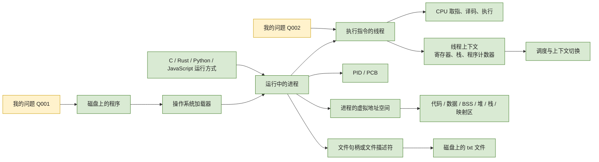
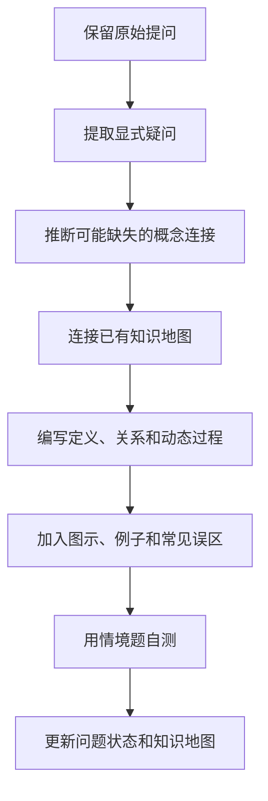

# 操作系统个人知识体系

这是一个由我的真实问题驱动、持续生长的操作系统学习仓库。

这里不会一开始就把整本操作系统教材全部铺开。知识地图先告诉我“操作系统包含哪些系统”，而详细章节只展开我已经问到、正在理解的部分。每次出现新问题，先保留问题，再找出概念之间缺失的连接，最后把新知识接回总图。

## 当前入口

| 入口 | 用途 | 当前状态 |
| --- | --- | --- |
| [操作系统知识地图](docs/00-operating-system-knowledge-map.md) | 查看操作系统有哪些主要知识领域，以及它们怎样连接 | 框架已建立 |
| [第 1 章：从程序到进程](docs/01-from-program-to-process.md) | 详细理解程序、进程、装载、内存布局、文本文件和语言运行时 | 已整理，待复习 |
| [第 2 章：CPU、上下文与指令](docs/02-cpu-context-registers-and-instructions.md) | 理解寄存器、地址空间、PID、PCB、上下文切换、并发和代码执行路径 | 已整理，待复习 |
| [问题档案](questions/README.md) | 保存原始问题、待澄清连接、对应章节和复习状态 | Q001、Q002 已登记 |
| [外部图片署名与许可](assets/images/ATTRIBUTION.md) | 查看已本地保存的开放许可教学图片、来源和使用边界 | 已引入 2 张 |
| [用户提问原图档案](assets/questions/README.md) | 保留用户提问时附带的原图，并连接到对应解释 | Q002 已归档 |

## 当前学习主线

这张图表达的不是一堆孤立名词，而是两条已经连起来的因果链：程序保存在磁盘上，操作系统根据程序建立进程，线程在进程中执行；线程执行时依赖寄存器、地址空间和其他运行状态，调度器切换线程时保存并恢复这些状态。进程还通过虚拟内存和文件接口使用机器资源；不同编程语言最终也要落到这些操作系统机制上。

## 图文材料怎样使用

Mermaid 适合画概念关系和时序，但不应成为唯一图形载体。对于内存布局、寄存器、硬件结构、真实界面或空间映射等问题，详细章节会优先补充许可明确的外部图片、动画或交互资源，并在图片旁解释“该看什么、它省略了什么”。当前第 1、2 章已经各加入一张本地保存的开放许可 SVG；全部来源和许可记录在[外部图片署名与许可](assets/images/ATTRIBUTION.md)。

## 学习状态说明

- `框架`：知道它在整个操作系统中的位置，但还没有深入学习。
- `正在学习`：问题已经出现，正在建立概念和连接。
- `已整理`：已经形成图、关系、例子、误区和自测题。
- `待复习`：内容已经整理，但还需要通过复述和练习确认真正掌握。

“已整理”不等于“已经掌握”。是否掌握，以能否脱离文档回答情境题、画出关系图并解释原因来判断。

## 这个知识库怎样生长

知识库的长期维护规则写在 [AGENTS.md](AGENTS.md) 中。它要求后续整理始终围绕我的提问展开，不能自行改变学习主线，也不能把“通常如此”的入门模型写成没有条件的绝对规律。

## 首版边界

当前只详细展开了我已经提出的两组问题：

- 程序和进程分别是什么？
- 程序怎样进入内存并开始执行？
- 代码、数据、BSS、堆和栈怎样变化？
- 打开两个 txt 文件时，文件、句柄、缓冲区和进程分别是什么？
- C、Rust、Python 和 JavaScript 在操作系统眼中怎样运行？
- 同一段指令为什么能在不同进程中得到不同结果？
- CPU 怎样使用寄存器执行指令、保存并恢复线程上下文？
- PID、PCB、地址空间、并发和源代码到机器码之间怎样连接？

具体调度算法、线程同步原语、死锁、页面置换、文件系统内部结构、驱动、安全攻防和虚拟化等主题目前仍只出现在总图中，不提前展开；第 2 章只建立了理解这些主题所需的 CPU、上下文、保护与并发基础。
