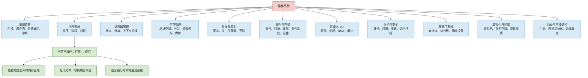
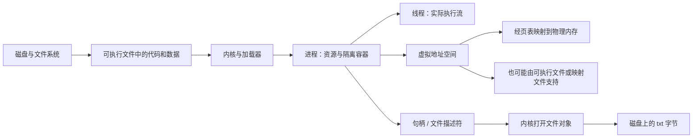

# 操作系统知识地图

[返回仓库首页](../README.md) · [进入当前章节：从程序到进程](01-from-program-to-process.md) · [查看问题档案](../questions/README.md)

## 1. 先看全局：操作系统包含哪些“系统”

人体不是只有一个器官，而是由神经、循环、消化、呼吸等系统协作完成生命活动。操作系统也不是一个孤立功能，而是一组互相协作的资源管理机制。

这个类比只用于定位：人体系统和计算机机制并不存在严格一一对应关系，操作系统也没有生物意义上的“器官”。

颜色含义：绿色是本次已经详细整理的链路，蓝色是只建立位置的知识框架。

## 2. 各知识系统的作用

| 知识系统 | 它主要回答什么问题 | 与当前主题的连接 | 状态 |
| --- | --- | --- | --- |
| 基础边界 | 应用程序为什么不能随意操作硬件？怎样请求内核服务？ | 进程通过系统调用申请内存、打开文件和进行 I/O | 框架 |
| 程序、进程与线程 | 磁盘上的代码怎样成为正在执行的活动？谁拥有资源，谁真正执行指令？ | 本次学习主线 | 已整理 |
| CPU 管理 | 多个可运行线程怎样轮流获得 CPU？切换时保存什么？ | 一个进程可能包含多个线程，线程需要被调度 | 框架 |
| 内存管理 | 每个进程怎样获得看似独立的地址空间？内存不够时怎么办？ | 本次已学习虚拟地址空间和典型内存区域 | 部分已整理 |
| 并发与同步 | 多个执行流同时访问共享数据时，怎样保持正确？ | 同一进程内的线程通常共享代码、全局数据和堆 | 框架 |
| 文件与存储 | 字节怎样长期保存在设备上？路径、文件和目录怎样组织？ | 本次已学习进程怎样通过句柄打开 txt 文件 | 部分已整理 |
| 设备与 I/O | 键盘、屏幕、磁盘、串口和网卡怎样与软件协作？ | 读取文件最终会经过存储设备和 I/O 路径 | 框架 |
| 保护与安全 | 谁能访问哪些进程、内存、文件和设备？ | 进程带有身份和权限，地址空间提供隔离 | 框架 |
| 网络子系统 | 进程怎样跨机器交换数据？ | 套接字也常以句柄或文件描述符形式被进程持有 | 框架 |
| 虚拟化与容器 | 怎样在一台机器上构造多个隔离的运行环境？ | 它们会进一步隔离或虚拟化进程看到的资源 | 框架 |
| 启动与内核结构 | 开机后内核怎样建立系统并启动第一个用户进程？ | 所有普通进程都建立在内核已完成初始化的基础上 | 框架 |

## 3. 用“人体系统”建立第一层直觉

| 操作系统机制 | 可以暂时类比为 | 类比能帮助理解什么 | 类比不能代表什么 |
| --- | --- | --- | --- |
| CPU 调度 | 神经系统协调行动 | 多项活动需要被安排执行顺序 | CPU 不是大脑，调度也不是意识 |
| 内存管理 | 工作空间和短期记忆分配 | 不同活动需要各自空间并避免互相破坏 | RAM 不是人的记忆机制 |
| 文件系统 | 档案室 | 信息可以被命名、分类和长期保存 | 文件并不天然具有纸张或文件夹的物理形态 |
| 设备驱动 | 翻译和传递机制 | 不同硬件需要统一接口和专用适配 | 驱动不是普通语言翻译器 |
| 权限与隔离 | 门禁系统 | 资源访问需要身份和规则 | 安全策略远比一把门锁复杂 |

类比的正确使用方式是先建立方向，然后回到真实机制。不能用类比代替定义。

## 4. 当前知识链在总图中的位置

当前章节从磁盘上的程序开始，沿着操作系统创建进程的过程，连接到内存和文件。后续学习 CPU 调度、分页算法或文件系统内部结构时，都可以回到这条主干继续向外扩展。

## 5. 三组贯穿操作系统的关系

### 5.1 持久状态与运行状态

- 程序文件、普通文件通常用于持久保存。
- 进程、线程、寄存器和内存缓冲区属于运行状态。
- 保存文件就是把运行中的修改转化为新的持久状态之一。

### 5.2 抽象与物理资源

- 进程看到虚拟地址，硬件实际访问物理内存。
- 程序看到文件和路径，存储设备实际保存字节块。
- 应用看到句柄和系统调用，内核负责检查权限并操作真实资源。

### 5.3 隔离与共享

- 不同进程通常拥有相互隔离的虚拟地址空间。
- 同一程序的只读代码物理页可能由多个进程共享。
- 同一进程内的线程通常共享代码、全局数据、堆和打开资源，但每个线程有自己的寄存器状态和栈。

## 6. 当前边界

本地图只回答“操作系统有哪些主要部分、它们和当前问题怎样连接”。以下主题尚未详细展开：

- 具体调度算法；
- 线程同步原语和死锁处理；
- 页表结构、缺页处理和页面置换算法；
- 文件系统内部数据结构和崩溃一致性；
- 中断、DMA 和驱动实现；
- 网络协议栈；
- 权限模型、攻击与防护；
- 虚拟机和容器实现；
- 引导过程与不同内核架构。

它们会在后续真实问题出现时，逐步接入现有知识图，而不是一次性灌入。
