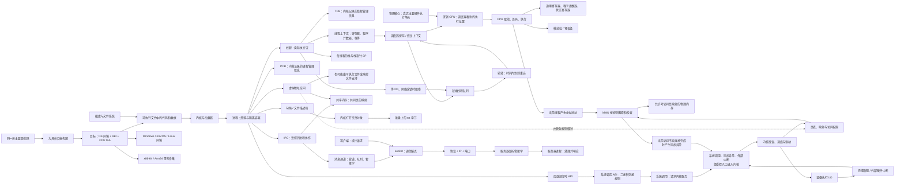

# 操作系统知识地图

[返回仓库首页](../README.md) · [第 1 章：从程序到进程](01-from-program-to-process.md) · [第 2 章：CPU、上下文与指令](02-cpu-context-registers-and-instructions.md) · [第 3 章：MMU、特权模式、中断与系统调用](03-mmu-privilege-modes-interrupts-and-apis.md) · [第 4 章：进程协作、IPC、端口与客户端/服务器](04-process-cooperation-ipc-ports-and-client-server.md) · [第 5 章：多核、调度与线程](05-multicore-scheduling-and-threads.md) · [第 6 章：平台、ABI、可执行文件与 CPU 架构](06-platforms-abi-executables-and-cpu-architectures.md) · [查看问题档案](../questions/README.md)

## 1. 先看全局：操作系统包含哪些“系统”

人体不是只有一个器官，而是由神经、循环、消化、呼吸等系统协作完成生命活动。操作系统也不是一个孤立功能，而是一组互相协作的资源管理机制。

这个类比只用于定位：人体系统和计算机机制并不存在严格一一对应关系，操作系统也没有生物意义上的“器官”。

```mermaid
flowchart TB
    OS["操作系统"]

    OS --> BASE["基础边界<br/>内核、用户态、系统调用、中断"]
    OS --> EXEC["执行系统<br/>程序、进程、线程"]
    OS --> CPU["处理器管理<br/>状态、调度、上下文切换"]
    OS --> MEM["内存管理<br/>地址空间、分页、虚拟内存、保护"]
    OS --> CONC["并发与同步<br/>竞态、锁、信号量、死锁"]
    OS --> FS["文件与存储<br/>文件、目录、缓存、文件系统、磁盘"]
    OS --> IO["设备与 I/O<br/>驱动、中断、DMA、缓冲"]
    OS --> SEC["保护与安全<br/>身份、权限、隔离、访问控制"]
    OS --> NET["网络子系统<br/>套接字、协议栈、网络设备"]
    OS --> VIRT["虚拟化与容器<br/>虚拟机、命名空间、资源隔离"]
    OS --> BOOT["启动与内核结构<br/>引导、内核初始化、系统服务"]
    OS --> PLATFORM["平台与二进制兼容<br/>系统接口、ABI、可执行格式、CPU ISA"]

    EXEC --> CURRENT1["已展开：程序 → 进程"]
    CURRENT1 --> MEMNOW["虚拟地址空间和内存区域"]
    CURRENT1 --> FILENOW["打开文件、句柄和缓冲区"]
    CURRENT1 --> RUNTIME["语言运行时如何落到进程"]
    CURRENT1 --> CURRENT2["已展开：线程上下文 → CPU 执行"]
    CURRENT2 --> CPUNOW["寄存器、PID / PCB / TCB、上下文切换"]
    CURRENT2 --> CONCNOW["并发、调度与基础保护"]
    BASE --> CURRENT3["已展开：MMU 与受控进入内核"]
    CURRENT3 --> MMUNOW["虚拟地址、页表、MMU 与访问权限"]
    CURRENT3 --> PRIVNOW["用户态、内核态、特权级与模式位"]
    CURRENT3 --> ENTRYNOW["API、系统调用、同步异常与外部中断"]
    CURRENT3 --> IONOW["内核、驱动与设备完成通知的基础链路"]
    EXEC --> CURRENT4["已展开：进程协作与 IPC"]
    CURRENT4 --> IPCNOW["独立 / 协作进程、通信、同步与协议"]
    CURRENT4 --> SHMNOW["共享内存：同一批物理页的受控映射"]
    CURRENT4 --> MSGNOW["消息传递：管道、队列与套接字"]
    CURRENT4 --> NETNOW["端口、监听、客户端与服务器"]
    CPU --> CURRENT5["已展开：多核、调度与线程"]
    CURRENT5 --> CORENOW["物理核心、逻辑 CPU 与 SMT"]
    CURRENT5 --> RRNOW["轮转、时间片、阻塞与唤醒"]
    CURRENT5 --> PARANOW["并发、并行、利用率与线程执行单位"]
    CURRENT5 --> STACKNOW["每线程栈、SP 与函数调用"]
    PLATFORM --> CURRENT6["已展开：不同系统怎样运行同一份软件"]
    CURRENT6 --> OSNOW["Windows、macOS、Linux 环境"]
    CURRENT6 --> ABINOW["API、ABI、系统调用 ABI"]
    CURRENT6 --> IMAGENOW["PE、ELF、Mach-O 与 .exe"]
    CURRENT6 --> ISANOW["x86-64、Arm64 与机器码"]

    classDef root fill:#f4cccc,stroke:#990000,color:#222;
    classDef current fill:#d9ead3,stroke:#38761d,color:#222;
    classDef framework fill:#d9eaf7,stroke:#3d85c6,color:#222;
    class OS root;
    class CURRENT1,CURRENT2,CURRENT3,CURRENT4,CURRENT5,CURRENT6,MEMNOW,FILENOW,RUNTIME,CPUNOW,CONCNOW,MMUNOW,PRIVNOW,ENTRYNOW,IONOW,IPCNOW,SHMNOW,MSGNOW,NETNOW,CORENOW,RRNOW,PARANOW,STACKNOW,OSNOW,ABINOW,IMAGENOW,ISANOW current;
    class BASE,EXEC,CPU,MEM,CONC,FS,IO,SEC,NET,VIRT,BOOT,PLATFORM framework;
```

颜色含义：绿色是本次已经详细整理的链路，蓝色是只建立位置的知识框架。

## 2. 各知识系统的作用

| 知识系统 | 它主要回答什么问题 | 与当前主题的连接 | 状态 |
| --- | --- | --- | --- |
| 基础边界 | 应用程序为什么不能随意操作硬件？怎样请求内核服务？ | 已学习用户态/内核态、模式位、API、系统调用、同步异常和外部中断的基础关系 | 部分已整理 |
| 程序、进程与线程 | 磁盘上的代码怎样成为正在执行的活动？谁拥有资源，谁真正执行指令？ | 已学习进程、线程、PID、PCB 与 TCB 的基本关系，也补上每线程的栈、SP 与执行状态 | 已整理 |
| CPU 管理 | 多个可运行线程怎样轮流获得 CPU？切换时保存什么？ | 已学习物理核心、逻辑 CPU、时间片轮转、阻塞/唤醒与“线程通常是被调度单位”的基础 | 部分已整理 |
| 内存管理 | 每个进程怎样获得看似独立的地址空间？内存不够时怎么办？ | 已学习虚拟地址空间、页表规则、MMU 翻译与权限检查的直觉 | 部分已整理 |
| 并发与同步 | 多个执行流同时访问共享数据时，怎样保持正确？ | 已学习单逻辑 CPU 的并发、多逻辑 CPU 的并行、抢占和竞态的基础，也知道共享内存协作仍需同步；同步原语仍待展开 | 部分已整理 |
| 文件与存储 | 字节怎样长期保存在设备上？路径、文件和目录怎样组织？ | 本次已学习进程怎样通过句柄打开 txt 文件 | 部分已整理 |
| 设备与 I/O | 键盘、屏幕、磁盘、串口和网卡怎样与软件协作？ | 已学习“应用请求 → 内核/驱动 → 设备完成通知”的基础链路 | 部分已整理 |
| 保护与安全 | 谁能访问哪些进程、内存、文件和设备？ | 已学习特权级、MMU 权限、异常、内核检查，以及 IPC 端点不等于自动授权的基础边界 | 部分已整理 |
| 网络子系统 | 进程怎样跨机器交换数据？ | 已学习套接字、端口、监听、客户端/服务器的入门关系；协议栈和网络可靠性仍待展开 | 部分已整理 |
| 平台与二进制兼容 | 为什么同一软件在不同系统和 CPU 上常要准备不同成品？ | 已学习 Windows、macOS、Linux 环境，API/ABI、PE/ELF/Mach-O、`.exe` 和 x86-64/Arm64 怎样共同决定原生兼容性 | 已整理，待复习 |
| 虚拟化与容器 | 怎样在一台机器上构造多个隔离的运行环境？ | 它们会进一步隔离或虚拟化进程看到的资源 | 框架 |
| 启动与内核结构 | 开机后内核怎样建立系统并启动第一个用户进程？ | 所有普通进程都建立在内核已完成初始化的基础上 | 框架 |

## 3. 用“人体系统”建立第一层直觉

| 操作系统机制 | 可以暂时类比为 | 类比能帮助理解什么 | 类比不能代表什么 |
| --- | --- | --- | --- |
| CPU 调度 | 神经系统协调行动 | 多项活动需要被安排执行顺序 | CPU 不是大脑，调度也不是意识 |
| 内存管理 | 工作空间和短期记忆分配 | 不同活动需要各自空间并避免互相破坏 | RAM 不是人的记忆机制 |
| 文件系统 | 档案室 | 信息可以被命名、分类和长期保存 | 文件并不天然具有纸张或文件夹的物理形态 |
| 设备驱动 | 翻译和传递机制 | 不同硬件需要统一接口和专用适配 | 驱动不是普通语言翻译器 |
| 权限与隔离 | 门禁系统 | 资源访问需要身份和规则 | 安全策略远比一把门锁复杂 |

类比的正确使用方式是先建立方向，然后回到真实机制。不能用类比代替定义。

## 4. 当前知识链在总图中的位置

第 1 章从磁盘上的程序开始，沿着操作系统创建进程的过程连接到内存和文件；第 2 章再从线程追踪到 CPU、寄存器、上下文和基础保护；第 3 章补上了“普通程序怎样受控地进入内核、内核怎样和设备协作”的边界；第 4 章从进程隔离出发，解释怎样通过共享映射或消息通道合作，再把套接字、端口和客户端/服务器接进来；第 5 章把物理核心、逻辑 CPU、就绪队列、轮转时间片、阻塞/唤醒、每线程的栈和 SP 接回这条主干；第 6 章再从同一份主要源代码出发，补上目标操作系统环境、ABI、可执行文件格式和 CPU 指令集为什么必须同时匹配。后续学习更完整的调度策略、同步原语、分页算法或文件系统内部结构时，都可以回到这条主干继续向外扩展。

## 5. 三组贯穿操作系统的关系

### 5.1 持久状态与运行状态

- 程序文件、普通文件通常用于持久保存。
- 进程、线程、寄存器和内存缓冲区属于运行状态。
- 保存文件就是把运行中的修改转化为新的持久状态之一。

### 5.2 抽象与物理资源

- 进程看到虚拟地址，硬件实际访问物理内存。
- 程序看到文件和路径，存储设备实际保存字节块。
- 应用看到 API、句柄和系统调用；CPU/MMU 负责强制一部分访问边界，内核负责检查权限并操作真实资源。

### 5.3 隔离与共享

- 不同进程通常拥有相互隔离的虚拟地址空间。
- 同一程序的只读代码物理页可能由多个进程共享。
- 同一进程内的线程通常共享代码、全局数据、堆和打开资源，但每个线程有自己的寄存器状态和栈。
- 两个进程若要合作，需要内核建立受控的共享映射或消息通道；共享的是明确允许的区域或交接的数据，不是默认开放彼此整个地址空间。

## 6. 当前边界

本地图只回答“操作系统有哪些主要部分、它们和当前问题怎样连接”。以下主题尚未详细展开：

- 优先级、实时、负载平衡、亲和性等更完整的调度策略比较（本次只用轮转建立时间片、就绪/阻塞和切换直觉）；
- 线程同步原语和死锁处理（目前知道共享内存为什么需要同步，尚未展开锁、信号量等机制）；
- 页表结构、地址转换缓存（TLB）、完整缺页处理和页面置换算法；
- 文件系统内部数据结构和崩溃一致性；
- 不同架构/系统的具体系统调用寄存器表、快速路径、内核入口现场保存和返回实现；
- 驱动实现、DMA、IOMMU 与设备中断控制器；
- 网络协议栈、TCP/UDP 细节、可靠性与拥塞控制（目前只介绍了端口、套接字和客户端/服务器的入口关系）；
- 账户/文件权限模型、攻击与防护（目前只介绍了硬件保护和内核检查的基础边界）；
- 虚拟机和容器实现；
- 引导过程与不同内核架构。

它们会在后续真实问题出现时，逐步接入现有知识图，而不是一次性灌入。
