# 第 1 章：从程序到进程

[返回仓库首页](../README.md) · [查看操作系统知识地图](00-operating-system-knowledge-map.md) · [查看 Q001](../questions/README.md#q001程序进程内存文件与语言) · [进入第 2 章：CPU、上下文与指令](02-cpu-context-registers-and-instructions.md)

## 1. 本章要解决什么

本章来自 Q001，不把问题拆成互不相关的定义，而是追踪一条完整链路：

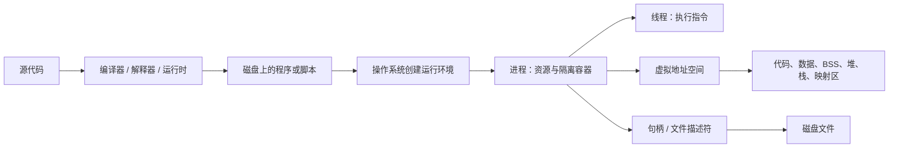

学完后，应该能够：

1. 区分源代码、程序、可执行文件、进程和线程；
2. 解释程序为什么不是一次性完整复制进物理内存；
3. 画出典型进程虚拟地址空间，并解释每个区域怎样变化；
4. 区分两个文件、两个打开句柄、两个标签页和两个内存缓冲区；
5. 从操作系统视角比较 C、Rust、Python 和 JavaScript 的常见运行路径。

建议第一遍阅读时保持所有“更准确一点”折叠区关闭，只沿着 `editor.exe`、两个 txt 和 C 示例的时间顺序往下看。能用自己的话说清主线后，再展开实现差异和例外。

---

## 2. 程序、进程与线程

### 2.1 先看一个真实场景

假设磁盘里有一个编辑器文件 `editor.exe`：

1. 你还没有双击它时，它只是磁盘里一份不会自己运行的文件。
2. 你双击一次，操作系统为“这一次运行”准备内存、执行进度和打开文件的能力。现在出现了一个正在运行的编辑器。
3. 你再双击一次，如果编辑器允许建立两个独立实例，操作系统会再准备一套运行状态。现在是同一份 `editor.exe` 带来了两个正在运行的编辑器。

把这三步换成正式术语：

- **源代码**：人写出的 C、Rust、Python、JavaScript 等文本。
- **程序**：为了完成某项任务而组织起来的代码和数据。磁盘上的可执行文件或脚本是程序的具体载体。
- **可执行文件**：操作系统能够识别并加载的一类程序文件，例如 Windows 的 `.exe`。
- **进程**：程序的某一次运行，以及操作系统为这次运行管理的资源和状态。
- **线程**：进程里真正沿着一条执行路线、一步步执行指令的部分。

> 一句话记忆：程序是静态的“做事说明”，进程是一次正在发生的运行，线程负责把这次运行向前推进。

### 2.2 进程里面不只有代码

继续看刚才的编辑器。它要真正运行，至少需要记住这些事情：

| 大白话 | 正式名称 | 在编辑器例子中有什么用 |
| --- | --- | --- |
| “你是哪一个运行实例” | PID（进程标识符） | 让操作系统区分两个编辑器进程 |
| “你能使用哪些内存地址” | 虚拟地址空间 | 为这次运行的代码和数据安排地址，并记录这些地址怎样映射 |
| “当前执行到哪里” | 线程及其寄存器状态 | 让 CPU 知道下一条应执行什么 |
| “当前打开了哪些文件” | 句柄或文件描述符 | 让编辑器读取、保存不同的 txt 文件 |
| “你被允许做什么” | 身份与权限 | 决定它能否访问某个文件或设备 |

所以，“进程就是放进内存的程序”只说到了一小部分。更完整的理解是：**进程是操作系统为某一次运行建立的整套现场。**

PID、寄存器和上下文切换会在[第 2 章](02-cpu-context-registers-and-instructions.md)继续拆开讲。本章先抓住“每次运行都有自己的状态”。

### 2.3 为什么同一个程序能产生多个进程

假设进程 A 打开 `A.txt`，光标停在第 3 行；进程 B 打开 `B.txt`，光标停在第 10 行。它们使用的是同一个编辑器程序，但文件内容、光标位置和当前操作都可以不同。

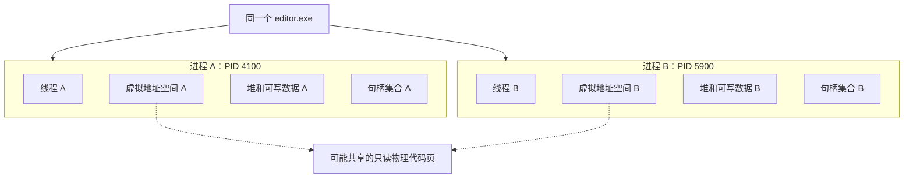

图中最先要看懂的是：上面只有一份 `editor.exe`，下面却有两套独立的运行现场。它们通常有不同 PID、不同虚拟地址空间、不同线程状态和不同文件句柄。

> 一句话记忆：同一个程序可以运行多次；每运行一次，通常就会形成一个新的进程现场。

<details>
<summary>更准确一点（首轮可跳过）</summary>

为了节约物理内存，两个进程可能共享同一可执行文件的只读代码页，但各自可写的堆和栈通常仍然分开。创建进程时还可能使用写时复制等机制。

“有物理页面被共享”和“两个进程拥有同一套运行状态”不是一回事。两个进程仍各自通过自己的虚拟地址空间使用内存；即使虚拟地址数字相同，也不保证对应同一个物理页。

</details>

### 2.4 菜谱类比及其边界

- 菜谱像程序；一次实际做菜像一个进程。
- 同一菜谱可以同时做两次菜，每次有自己的食材、厨具状态和进度。
- 厨师正在执行某一步，可以帮助理解线程。

类比到这里就应停止：真实进程还涉及虚拟内存、CPU 寄存器、权限和操作系统管理状态，菜谱不能表达这些机制。

---

## 3. 程序怎样开始运行

### 3.1 从双击或命令到第一条用户代码

仍以双击 `editor.exe` 为例。先不用背加载器、寄存器这些词，只看电脑依次要完成什么：

1. **收到启动请求**：你双击图标，或者另一个程序请求启动它。
2. **确认能不能运行**：操作系统检查文件是否存在、格式是否认识、当前用户是否有权限。
3. **建立这次运行的现场**：操作系统创建进程，并为它准备一套虚拟地址空间。
4. **安排代码和数据放在哪里**：加载器读取可执行文件的信息，把代码、初始数据和需要的动态库安排到虚拟地址空间中。
5. **准备第一条执行路线**：操作系统创建主线程，设置“从哪里开始执行”和“栈从哪里开始使用”等初始状态。
6. **交给 CPU 执行**：CPU 从程序入口开始取指令。这时程序才真正动起来。

下面的图把同一过程换成了正式术语。第一遍只沿着箭头从上往下看，不必立即记住所有名词。

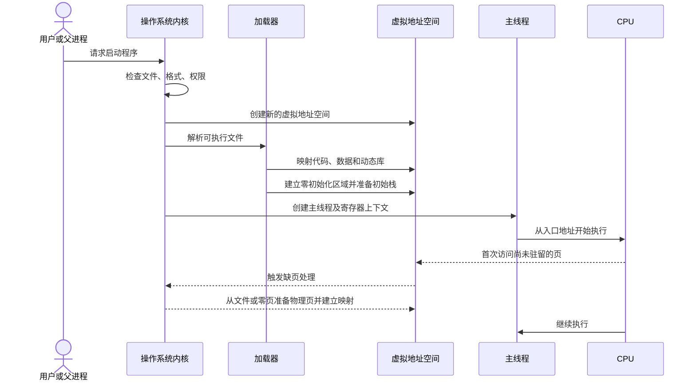

这里的几个正式名词可以这样对应：

- **加载器**：负责读懂可执行文件的组织信息，并安排哪些内容映射到进程地址空间。
- **程序入口**：CPU 开始执行这个程序时得到的第一个指令地址。对于 C 程序，它通常先进入启动代码和运行库初始化，不是保证直接跳到 `main`。
- **程序计数器和栈指针**：CPU 寄存器中的重要状态，分别帮助记录“接下来执行哪里”和“当前线程的栈用到哪里”。

> 一句话记忆：双击并不是让磁盘文件自己动起来，而是让操作系统为它创建一次运行现场，再让 CPU 从入口开始执行。

<details>
<summary>更准确一点（首轮可跳过）</summary>

上图把“创建运行实例”和“装入程序映像”合并为一条概念主线，不表示所有平台都调用同一组接口。

Windows 的一次进程创建请求通常可以同时指定要运行的程序。POSIX 系统常把“产生或准备进程”和“用新程序替换进程映像”区分开，例如 `fork`、`posix_spawn` 与 `execve` 所表达的模型。成功的 `execve` 通常保留调用进程的 PID，但把原来的程序映像换成新程序。动态库也可能由用户态动态链接器在进入 `main` 前继续处理。

</details>

### 3.2 “装载”通常不是完整复制

很容易把程序启动想成搬家：把整个 `.exe` 从磁盘一次性搬到 RAM 的一块连续区域，然后再开始运行。现代通用操作系统通常不是这样做的。

> 启动程序 = 立刻把整个可执行文件复制到一块连续的物理 RAM。

更接近实际的过程是：

1. 操作系统先在进程的虚拟地址空间里记下“哪一段地址对应程序的哪部分内容”。
2. CPU 真正访问某一小块内容时，系统再保证这块内容此刻能在 RAM 中使用。
3. 程序一直没有访问的部分，可能始终不需要进入物理内存。

操作系统通常按固定大小的**页**管理这些小块。某个虚拟页第一次被访问、但还没有可用物理页时，会触发缺页处理；内核准备好页面和映射后，CPU 再继续执行。这属于**按需调页**。

因此，三个层次必须分开：

- **磁盘文件**：保存程序的持久字节，关机后仍然存在；
- **虚拟地址空间**：这一次运行看到的内存地址地图；
- **物理内存**：RAM 中此刻真正放着的页面。

程序结束后，进程的虚拟地址空间和运行状态会被回收，但磁盘上的程序文件仍然存在。

> 一句话记忆：装载首先是“建立地址关系”，不等于“把整个文件一次搬完”。

<details>
<summary>更准确一点（首轮可跳过）</summary>

并非所有页面都直接从可执行文件读取。代码或带初值的数据常由文件支持；BSS 一类零初始化区域可以通过零页或新准备的零填充页面建立；动态内存还可能来自匿名映射。页面也可能在运行中被回收，之后再次访问时重新准备。

</details>

### 3.3 section 与运行时内存区域不是简单同义词

教材常把可执行文件里的 `.text`、`.data`、`.bss` 直接画成运行后的代码区、数据区和 BSS。这能帮助入门，但要先记住：**文件内部怎样分类，和进程运行时怎样映射，是两个相关但不同的问题。**

> 一句话记忆：磁盘文件中的“栏目”不会原封不动地变成 RAM 里的同名房间。

<details>
<summary>更准确一点（首轮可跳过）</summary>

ELF 文件可以同时包含便于链接器组织内容的 **section**，以及由 program header 描述、面向装载的 **segment**；加载器主要按照 `PT_LOAD` 等 segment 建立映射。PE 的组织方式不同，通常依据 section 的虚拟地址、大小和权限等信息进行映射。

进程运行时看到的是一组虚拟内存区域。合并、对齐、权限、链接方式、可执行格式和动态链接器行为都会影响最终映射，因此不能推导出“每个文件 section 必然对应一个同名且独立的运行时区域”。

</details>

---

## 4. 虚拟内存和物理内存不是同一张图

### 4.1 每个进程看到自己的地址空间

先看一个看起来奇怪的场景：

- 进程 A 说：“我要把数字 7 写到地址 `0x1000`。”
- 进程 B 也说：“我要把数字 9 写到地址 `0x1000`。”

两个进程使用了相同的地址数字，为什么通常不会互相覆盖？因为 `0x1000` 是各自在自己地址空间里的编号。操作系统可以让 A 的 `0x1000` 对应 RAM 中的物理页甲，让 B 的 `0x1000` 对应另一个物理页乙。

这个过程可以分成三层：

1. 程序中的机器指令发出一个地址；
2. CPU 根据当前进程的地址转换关系查找它对应哪里；
3. 如果允许访问，CPU 最终读写对应的物理内存；如果没有映射或权限不允许，就触发异常交给内核处理。

换成正式术语：

- **虚拟地址**：进程在自己的地址空间里使用的编号；
- **物理页框**：RAM 中真正能够存放一个页面的位置；
- **页表**：记录虚拟页应当怎样转换到物理页，以及能否读、写、执行等权限的数据结构。

下面的图用 A、B 两个进程展示这种关系。

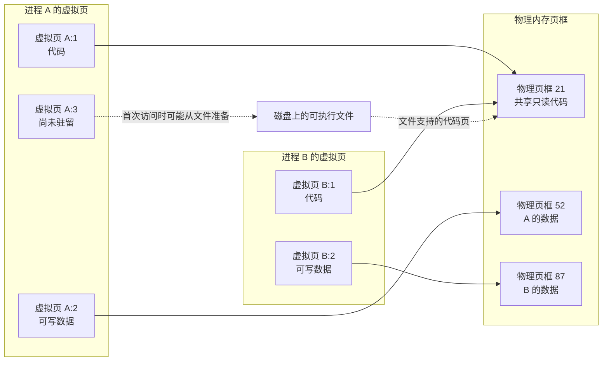

图中最重要的结论：

- A 和 B 的“虚拟页 1”属于不同地址空间，虚拟地址相同不代表对象相同。
- 只读代码页可以安全地映射到同一个物理页框。
- 可写数据通常映射到不同物理页框，避免一个进程随意修改另一个进程的数据。
- 某个虚拟页可以暂时没有物理页；第一次访问时再由内核处理。

> 一句话记忆：虚拟地址是进程手里的编号，不是 RAM 芯片上的直接位置。

#### 外部图解：把“连续的虚拟地址”与“离散的物理页框”同时看见


观察这张图时，第一遍只看两件事：左边是进程看到的地址范围，右边是 RAM 中的物理页框；中间的箭头说明两边不需要按相同位置直接对应。蓝色表示当前进程映射或可使用的页面，粉色表示没有映射给当前进程的物理页框。

这幅图回答的是：“进程眼中的连续地址，为什么可以落到分散的物理位置？”它没有画出两个进程，所以上面的 Mermaid 图负责补充“两个进程可能共享只读代码页，但通常分开保存可写数据”的关系。

<details>
<summary>更准确一点（首轮可跳过）</summary>

蓝色页面不一定由当前进程独占，只读共享页也可能同时映射给其他进程。这幅图采用较早的 32 位教学布局，其中的固定地址、`text/data/stack` 位置和箭头数量都不是现代系统的通用规则。

来源：[Virtual address space and physical address space relationship.svg](https://commons.wikimedia.org/wiki/File:Virtual_address_space_and_physical_address_space_relationship.svg)，作者 Stannered（描摹）、原作者 Dysprosia，3-Clause BSD License，访问日期 2026-08-22；本仓库原样保存。完整许可见[图片署名与许可](../assets/images/ATTRIBUTION.md#virtual-address-space-physical-address-spacesvg)。

</details>

### 4.2 地址簿类比及其边界

可以把每个进程的虚拟地址空间想成一本私人地址簿：进程只按自己地址簿中的编号寻找内容，操作系统和硬件负责把编号翻译到真实物理位置。

这个类比只能帮助理解“相同编号可以查到不同位置”。真实地址转换按页进行，还会检查页面是否存在、是否允许读写执行，以及当前 CPU 权限级别是否允许访问。

### 4.3 虚拟内存带来的主要能力

- **各用各的编号**：每个进程可以使用自己的地址布局，不用知道 RAM 的真实位置。
- **默认互相隔开**：一个普通进程不能只靠自己的虚拟地址，随意访问另一个进程的内存。
- **给不同区域不同权限**：代码页可以允许执行但不允许随意改写，普通数据页可以允许读写但不允许执行。
- **需要时也能共享**：操作系统可以有意识地让两个虚拟页对应同一物理资源，例如共享库的只读代码。
- **用到时再准备**：程序启动时不必让所有映射内容立即占用物理页。

分页、页表层级、页面置换和缺页算法属于内存管理的后续主题，本章只建立它们与进程的连接。

---

## 5. 典型进程虚拟地址空间

### 5.1 先看示意图

进程有了自己的虚拟地址空间后，还要回答一个问题：代码、长期保存的全局数据、运行中临时申请的数据、函数调用的临时状态，分别放在这张地址地图的什么区域？

下面是常见的教学模型。它画的是**一个进程的虚拟地址空间**，不是把 RAM 芯片永久切成这些房间。第一遍先看每个区域“负责什么”，暂时不用背高地址、低地址和增长方向。

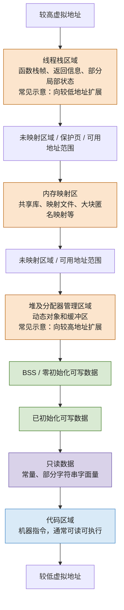

“高地址”和“低地址”只是在这张虚拟地址地图中的相对方向。它们不表示 RAM 芯片上固定切出了这些连续房间。

### 5.2 先用大白话认识每个区域

| 区域 | 把它想成什么 | 典型内容和变化 |
| --- | --- | --- |
| 代码区域 | “CPU 可以照着做的步骤” | 主要是机器指令；运行时通常读取并执行，不随普通变量赋值改变 |
| 只读数据 | “程序要查阅但不应随意涂改的资料” | 常量、部分字符串字面量和只读表；通常随程序或库一起映射 |
| 已初始化数据 | “开机时已经写好初值的长期数据” | 例如全局变量 `int count = 3;`；进程开始时是 3，之后可以改 |
| BSS | “开机时先全部清零的长期数据” | 常见于未显式初始化或零初始化的全局、静态对象；开始时为 0，之后也可以改 |
| 堆或动态内存 | “运行到一半才申请的空间” | `malloc`、`Box`、`Vec` 缓冲区和许多运行时对象；申请时出现，释放后对象不再有效 |
| 内存映射区 | “把文件、共享库或其他内存资源接入地址空间的窗口” | 可以在启动时或运行中增加、删除，并拥有不同权限和共享方式 |
| 线程栈 | “当前这条执行路线的函数调用工作区” | 保存返回信息、部分参数、局部状态等；调用函数时使用，函数返回后相应栈帧失效 |

> 一句话记忆：代码区放“做什么”，data/BSS 放“启动或模块加载时准备的长期可写数据”，堆放“运行中申请的对象”，栈记录“当前函数调用进行到哪里”。

<details>
<summary>更准确一点（首轮可跳过）</summary>

| 区域 | 建立或获得内容的时机 | 何时释放或失效 | 典型权限与共享 |
| --- | --- | --- | --- |
| 代码区域 | 加载器映射可执行文件和共享库 | 库被卸载或进程退出时解除映射 | 常见为读+执行、不可写；物理页可能跨进程共享 |
| 只读数据 | 随程序或库映射 | 对应映射解除或进程退出时 | 常见为只读、不可执行；可能共享 |
| 已初始化数据 | 加载时获得可执行文件中的初值 | 通常随对应模块或进程生命周期结束 | 常见为读写、不可执行；通常进程私有 |
| BSS | 进程建立时获得逻辑上的零值 | 通常随对应模块或进程生命周期结束 | 常见为读写、不可执行；通常进程私有 |
| 堆/分配器区域 | 分配器响应程序请求，必要时向 OS 获得更多映射 | 对象先交还分配器；进程退出时整体回收 | 常见为读写、不可执行；通常进程私有 |
| 内存映射区 | 程序启动或运行中建立映射 | 显式解除映射、模块卸载或进程退出时 | 权限和共享方式由映射参数决定 |
| 线程栈 | 每个线程创建时得到自己的栈范围 | 栈帧随函数返回失效；线程退出后整段栈被回收 | 常见为读写、不可执行；每个线程通常有自己的栈范围 |

具体对象放在哪里仍受编译器优化、链接方式、语言运行时、CPU 架构和操作系统影响。“典型位置”不是语言保证。

</details>

### 5.3 BSS 为什么值得单独理解

假设程序定义了一个包含一百万个元素、初始值全为 0 的全局数组。如果可执行文件真的保存一百万份 0，会白白变大。

更常见的做法是：文件只记录“运行时需要这么大的一块零初始化区域”；建立进程时，再保证程序看到的这些字节初始为 0。教学中通常把这种区域称为 BSS。

这说明“可执行文件大小”和“进程运行时虚拟内存大小”不是简单相等关系。

### 5.4 堆和栈不是两块固定物理房间

教材常把堆画成向上增长、栈画成向下增长。这首先是在画虚拟地址方向，不是说 RAM 里有两堵墙正在相向移动。

首轮先记住两个区别：

- 函数调用产生的临时状态通常跟着调用和返回反复使用线程栈；
- 程序主动申请的动态对象通常由分配器在堆或其他动态映射中管理，不会因为创建它的函数返回就自动消失。

<details>
<summary>更准确一点（首轮可跳过）</summary>

- 大块动态分配可能直接使用独立内存映射，不一定来自一段单一连续堆；
- 分配器释放内存后可能先留作复用，并不立即归还操作系统；
- 栈增长方向由 CPU 架构和应用二进制接口约定（ABI）等实现细节决定；
- 每个线程通常有自己的栈，因此一个多线程进程并不是只有一个栈；
- 编译器优化可能让某些局部变量只存在于寄存器，甚至完全消失。

地址空间布局也可能因为地址空间布局随机化（ASLR）在每次运行时有所变化，因此图中的具体位置和方向都不是跨平台保证。

</details>

---

## 6. 这些区域在运行时怎样变化

### 6.1 用一个 C 示例追踪对象

只看内存布局图，很容易把代码区、数据区、堆和栈背成四个孤立名词。下面让一段程序真正跑起来，观察对象什么时候出现、值怎样改变、什么时候失效。

```c
#include <stdlib.h>

int initialized_global = 7;
int zero_global;
static int file_static = 3;
const char message[] = "hello";

void work(int argument) {
    int local = argument + 1;
    int *pointer = malloc(sizeof(int));

    if (pointer != NULL) {
        *pointer = local;
        free(pointer);
    }
}

int main(void) {
    work(10);
    return 0;
}
```

按执行时间一步一步看：

| 时刻 | 此时发生了什么 | 哪些区域或对象发生变化 |
| --- | --- | --- |
| 程序还没启动 | 磁盘里只有可执行文件；还没有这一次运行中的变量状态 | 还没有进程地址空间 |
| 进程刚建立 | `initialized_global=7`、`zero_global=0`、`file_static=3`、`message="hello"` 已获得初始值 | 代码、只读数据、已初始化数据和 BSS 等映射准备好 |
| 调用 `work(10)` | 本次调用得到 `argument=10`，计算出 `local=11` | 当前线程产生一份函数调用状态，常使用栈帧和寄存器 |
| `malloc` 成功 | 出现一个动态 `int` 对象；`pointer` 保存它的地址 | 分配器提供动态内存，`pointer` 和它指向的对象是两个对象 |
| 执行 `*pointer = local` | 动态 `int` 的值变成 11 | 被指向的动态对象内容改变 |
| 执行 `free(pointer)` | 动态对象的生命周期结束，不能再通过旧地址使用它 | 空间交还分配器，但不保证立刻归还操作系统 |
| `work` 返回 | 本次调用的 `argument`、`local`、`pointer` 不再有效 | 相应栈帧失效，栈空间可被后续调用复用 |
| 进程退出 | 这次运行的全部地址空间被回收 | 全局数据、动态映射和线程栈等都随进程结束 |

这里最容易混淆的是 `pointer` 与它指向的动态对象：

> `pointer` 像一张写着储物柜编号的纸条，动态对象像那个储物柜里的物品。纸条和物品不是同一个对象，也不必放在同一个区域。

如果删掉 `free(pointer)`，函数返回时“纸条”会失效，但动态对象不会因为这张局部纸条消失就自动归还给 C 分配器。这是典型内存泄漏的一种来源。

<details>
<summary>更准确一点（首轮可跳过）</summary>

在未考虑特殊链接方式和编译器优化的典型模型中：

| 名称或对象 | 典型位置 | 关键区别 |
| --- | --- | --- |
| `initialized_global` | 已初始化数据区域 | 进程开始时值为 7，之后可修改 |
| `zero_global` | BSS 对应的零初始化区域 | 进程开始时值为 0 |
| `file_static` | 已初始化数据区域 | 文件作用域对象本来就有静态存储期；这里的 `static` 主要使名称具有内部链接，不表示它在栈上 |
| `message` | 常见为只读数据区域 | 具体放置由编译器、链接器和平台决定 |
| `argument`、`local` | 常作为栈帧或寄存器中的状态 | 不能绝对说局部变量一定占有一个栈地址 |
| `pointer` 这个指针变量 | 常在栈帧或寄存器 | 它和它指向的对象是两个不同对象 |
| `malloc` 返回的 `int` 对象 | 分配器管理的动态内存 | 生命周期从成功分配到 `free`，不随 `work` 返回自动结束 |

编译器可能把变量放入寄存器、合并对象、传播常量，甚至把没有可观察影响的对象和操作完全优化掉。上面的表是用来理解关系的典型模型，不是每次编译后的逐字节保证。

</details>

### 6.2 用时间线观察变化

把刚才八个时刻压缩成一条线，就是下面这幅图：


沿着箭头观察，各区域的变化可以概括为：

- **代码和只读数据**：通常映射后保持不变；加载新动态库可能增加新映射。
- **已初始化数据和 BSS**：大小通常由程序映像确定，内容会随全局/静态变量赋值改变。
- **堆或动态映射**：随分配、扩容、复用和释放发生变化。
- **线程栈**：随函数调用和返回反复使用；创建新线程会得到另一个栈。
- **整个地址空间**：进程退出后由操作系统统一解除映射和回收相关资源。

### 6.3 生命周期比“在哪一段”更重要

学习内存布局不能只背“局部变量在栈、动态变量在堆”。每看到一个对象，先用下面五个问题追踪它：

1. 这个对象由谁创建？
2. 谁持有或引用它？
3. 它可以被哪些线程访问？
4. 什么时候失效或释放？
5. 操作系统、语言运行时和程序员分别负责哪一层？

只要能沿时间回答这五个问题，就不是在死背段名，而是在理解对象怎样活着、变化和消失。资源管理、所有权和垃圾回收都在回答其中不同部分；本章只建立这条连接。

### 6.4 栈、堆和栈指针

你问“栈的本质是什么、栈指针又是什么”，可以先用一次函数调用来想：`main` 正在做事，调用 `work`；`work` 又调用 `format`。`format` 要先结束，`work` 才能继续，最后才轮到 `main`。后进来的调用先离开，这就是**后进先出**的顺序。


第一遍请只沿图看这四件事：左边的堆属于整个进程，右边每条线程各有一条调用栈；线程 A 调用 `format` 时，新的调用状态叠到最上面；`SP` 是 CPU 寄存器，记住这条线程当前栈的位置；`format` 返回后，`SP` 回退，刚才那一层调用状态就可以被后续调用复用。图中“向下”只是这张图采用的常见画法，不是所有平台的绝对规律。

#### 先把三个词拆开

| 词 | 先说人话 | 在 `main → work → format` 场景中是什么 |
| --- | --- | --- |
| 栈（stack） | 按“最后放进去的先取出来”使用的一叠位置 | 当前线程记住函数调用次序、返回位置和一部分临时状态的工作区 |
| 栈帧（stack frame） | 这一次函数调用临时占用的一层 | `work(10)` 这一层保存它需要的参数、局部状态或被保存的寄存器等 |
| 栈指针（stack pointer，SP） | CPU 工作台上的一个“当前位置标记” | 它的值帮助当前线程和机器指令找到“调用栈目前用到哪里” |
| 堆（heap） | 可以按需要申请、在以后任意合适时刻归还的动态对象区域/来源 | `malloc` 得到的 `int` 对象；`work` 返回后它不自动消失 |

**栈不是“所有局部变量必定住在这里”的法律。**它首先是调用顺序很适合使用的工作区。编译器会按平台的调用约定安排返回信息、要保存的寄存器和局部状态；能放进寄存器的局部变量可能根本没有栈地址，优化后某些变量也可能消失。

#### 把 `work(10)` 放慢四步

继续看本节前面的 C 代码，假设 `main` 调用 `work(10)`，其中又暂时需要一段格式化工作：

| 时刻 | 这条线程和 SP 在做什么 | 堆上的动态对象怎样变化 |
| --- | --- | --- |
| `main` 正在运行 | SP 标记着 `main` 当前调用状态的边界附近 | 还没有 `malloc` 得到的对象 |
| 进入 `work(10)` | 编译器生成的调用序列为这次调用安排状态，SP 挪到新的位置 | 仍没有动态对象 |
| `malloc` 成功 | SP 仍只管 `work` 的调用状态；指针变量本身常在栈帧或寄存器 | 分配器交给程序一个 `int` 对象，指针保存它的地址 |
| `work` 返回 | 调用状态不再有效；SP 恢复到调用前的边界，位置可复用 | 若没有 `free`，对象仍活着；若已 `free`，对象的生命周期已结束 |

这里最重要的不是背“SP 加几或减几”。不同 CPU、ABI 和优化策略的具体字节安排不同。你只要能演出这件事：**进入一层调用时需要留下以后返回所需的状态；返回时不再需要这一层，所以恢复到先前的栈位置。**

堆解决的是另一种需要：对象的寿命可能比创建它的函数更长，而且释放顺序不必和申请顺序相反。例如一个函数创建一份文档对象，把地址交给调用者后返回；文档对象不能因为函数离开就自动消失。C 里由程序员正确配对 `malloc/free`；Rust 通过所有权和析构规则组织释放；Python、JavaScript 等常由运行时和垃圾回收处理。它们的规则不同，但都在回答“这个动态对象什么时候还能用、什么时候该回收”。

同一进程的多个线程通常共享堆，因此两个线程若同时修改同一个堆对象，需要后续学习的同步规则；但每个线程都需要自己的栈和自己的 SP，才能分别从各自暂停的位置继续。这也解释了为什么第 5 章会把“线程的栈、寄存器状态”和“调度线程”连在一起。

> **一句话记忆：栈让一条线程按调用的倒序回来；SP 记住它现在叠到哪一层；堆让动态对象不必跟着某次函数返回一起消失。**

<details>
<summary>更准确一点（首轮可跳过）</summary>

- 某些架构的栈向低地址增长，另一些实现可以不同；SP 具体指向“最后已用位置”还是“下一可用位置”也取决于约定。
- `call`、`return`、`push`、`pop` 不是所有 CPU 都以相同指令或相同方式实现；编译器可能把栈帧省略、内联函数，或直接用寄存器传递参数。
- “堆”是编程语言和分配器常用的概念，不保证是一段唯一、连续、向某一个方向增长的内存。大对象可能来自独立映射，释放后的空间也可能先被分配器保留复用。
- 函数返回后，旧栈字节不一定立刻被清零；正确的说法是该次调用的对象生命周期或可用性结束，不能再把旧地址当作仍有效的对象来使用。

</details>

---

## 7. 进程和线程分别共享什么

继续用编辑器理解。一个编辑器进程可能同时做这些事：主线程响应你的输入，另一个线程执行搜索，还有线程等待文件操作完成。它们属于同一个进程，因此都能看到这个进程中的文档数据；但每条执行路线必须分别记住“自己当前执行到哪里”。

所以可以先这样区分：

- **进程**主要划定一整套资源和地址空间属于哪一次运行；
- **线程**主要保存一条执行路线当前走到哪里；
- 同一进程的线程共享很多数据，但各自需要独立的执行进度和线程栈。

下面的图把“共享的”和“各自拥有的”分开放：

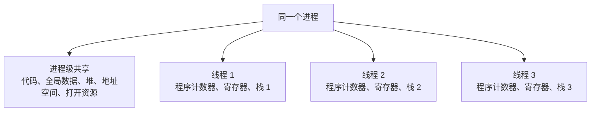

图中间的代码、全局数据、堆、地址空间和打开资源属于进程级共享部分；线程 1、2、3 各自保留程序计数器、寄存器状态和栈。

同一进程的线程交流方便，是因为它们能访问共同的进程内存。多个线程若同时修改同一份数据，就必须进一步考虑先后顺序；线程同步属于后续知识点，本章只建立这条连接。

不同进程默认不共享整个地址空间。它们需要通过文件、管道、套接字、共享内存等进程间通信机制交换数据。

> 一句话记忆：进程像一间共同工作室，线程像里面各自推进任务的人；他们共享房间里的材料，但每个人要记住自己做到哪一步。

<details>
<summary>更准确一点（首轮可跳过）</summary>

“每个线程有自己的栈”表示每个线程有自己的栈范围和栈指针，不表示该栈在硬件上与同一进程的其他线程完全隔离。线程共享进程地址空间，因此另一个线程若获得有效地址，通常仍可能访问这段内存；是否安全还取决于对象生命周期和同步规则。

文件、管道、套接字和共享内存只是进程间通信的例子；它们的具体机制现在在[第 4 章：进程协作、IPC、端口与客户端/服务器](04-process-cooperation-ipc-ports-and-client-server.md)中展开。

</details>

---

## 8. 打开两个 txt 文件时到底有什么不同

### 8.1 先跟着两个文件走一遍

假设磁盘上有两个文件：

- `A.txt` 保存“苹果”；
- `B.txt` 保存“香蕉”。

你用同一个编辑器依次打开它们，通常会发生这些事情：

1. 编辑器请求操作系统打开 `A.txt`，读取它的字节，在自己的内存里建立缓冲区 A，再把“苹果”显示到标签页 A。
2. 编辑器用同样方式读取 `B.txt`，建立另一份缓冲区 B，把“香蕉”显示到标签页 B。
3. 你把标签页 A 改成“橘子”，但还没保存。此时变化的主要是内存缓冲区 A；磁盘中的 `A.txt` 通常仍是“苹果”。
4. 你点击保存 A，编辑器才请求操作系统把缓冲区 A 的新内容写回 `A.txt`。缓冲区 B 和 `B.txt` 不会自动跟着改变。

这个场景说明：一个编辑器进程完全可以同时管理两个文件，并不需要为每个标签页创建一个进程。

### 8.2 再给这四层起正式名称

一个 `.txt` 文件本质上保存一串字节。这些字节显示成什么字符，还取决于 UTF-8、GBK 等编码方式。打开文件时，至少要区分下面四层：

1. **磁盘文件**：长期保存的文件对象，拥有字节内容、路径、大小和时间等信息。
2. **内核打开文件状态**：操作系统内核记录“以什么方式打开、当前读写到哪里、对应哪个文件”等状态。
3. **进程持有的引用**：进程用一个小标识引用内核资源；Windows 常称句柄 `HANDLE`，POSIX 系统常用整数文件描述符 `fd`。
4. **编辑器缓冲区和标签页**：编辑器把读到的字节解码成文字，在自己的进程内存中维护可编辑内容，再显示到界面。

下面的图把 A、B 两条数据流并排画出。第一遍只沿着 A 这一行看：磁盘文件 A → 内核打开状态 A → 句柄 A → 内存缓冲区 A → 标签页 A；B 走另一条独立路线。

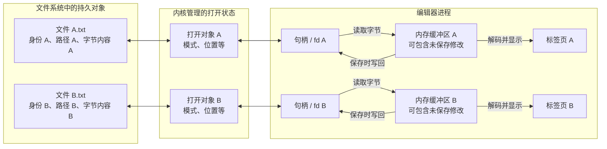

如果 A 和 B 内容不同，它们至少有不同的字节内容；作为两个独立文件时，通常也有不同的文件身份、路径或元数据。编辑器通常为它们维护不同缓冲区和标签页。

重要的是：打开两个文件不一定产生两个编辑器进程。一个编辑器进程完全可以持有两个文件句柄和两个缓冲区。

> 一句话记忆：文件是磁盘里的持久内容，缓冲区是编辑器进程里正在使用和修改的工作副本，标签页只是把它显示出来。

### 8.3 三种容易混淆的情况

#### 情况 A：同一个编辑器打开两个不同文件

可能只有一个编辑器进程，但它维护两个缓冲区。文件 A 和 B 是两个持久对象；修改缓冲区 A 不会自动修改缓冲区 B。

#### 情况 B：两个文件内容完全相同

内容相同不等于身份相同。例如两个文件都写着“苹果”，但一个位于 `D:\学习\A.txt`，另一个位于 `D:\备份\A.txt`；修改其中一个时，另一个通常不会改变。

#### 情况 C：同一个文件被打开两次

可能出现两个标签页、两个应用缓冲区或两个句柄，但最终都关联同一个持久文件。两个缓冲区若各自修改并保存，就可能出现覆盖、冲突或编辑器的外部修改提示。

所以必须分别问两个问题：“现在有几个缓冲区？”以及“它们最后关联的是几个磁盘文件？”这两个答案不一定相同。

<details>
<summary>更准确一点（首轮可跳过）</summary>

编辑器读取文件后可能关闭句柄，保存时再重新打开，因此“标签页存在”不保证底层句柄一直保持打开。

不同路径还可能通过硬链接指向同一个底层文件对象。因此判断两个路径是否代表同一对象，不能只比较路径字符串或字节内容，具体身份规则取决于文件系统。

同一文件被打开多次时，文件当前位置是否共享，取决于它们是分别打开得到的状态，还是通过复制或继承同一个打开描述得到的引用，不能一概而论。

</details>

### 8.4 修改但未保存时，内容在哪里

回到“把苹果改成橘子”的场景。通常可以按时间这样看：

1. 刚打开：磁盘文件和编辑器缓冲区都表示“苹果”；
2. 改完未保存：缓冲区表示“橘子”，磁盘文件通常仍表示“苹果”；
3. 点击保存：编辑器通过句柄请求操作系统写回；
4. 保存成功后：再次读取磁盘文件时应当看到新内容。

本章只需要先记住：**编辑器中看到的文字、内存缓冲区和磁盘文件不是同一个层次的对象。**

<details>
<summary>更准确一点（首轮可跳过）</summary>

写入调用返回不一定表示数据已经永久落到物理介质，内核、文件系统和设备可能还有缓存与刷新过程。编辑器也可能使用自动保存、临时恢复文件或“写新文件再替换旧文件”等策略。这些属于文件系统与持久化语义的后续主题。

</details>

### 8.5 档案室类比及其边界

- 磁盘文件像档案室原件；
- 句柄像某个进程拿到的取用编号；
- 编辑器缓冲区像拿到桌面上正在修改的工作副本；
- 保存像请求把工作副本写回档案。

类比边界：真实系统处理的是字节，并且可能有应用缓存、内核缓存、设备缓存和并发访问，不是简单地搬动一张纸。

---

## 9. C Rust Python JavaScript 在操作系统眼中有什么区别

### 9.1 先看操作系统实际启动了谁

假设四个文件都只做一件事：在屏幕上输出 `hello`。你可能这样运行它们：

| 你写的内容 | 一种常见运行方式 | 操作系统主要创建什么进程 |
| --- | --- | --- |
| C 源码 | 先编译成 `c-demo.exe`，再运行它 | `c-demo.exe` 对应的进程 |
| Rust 源码 | 先编译成 `rust-demo.exe`，再运行它 | `rust-demo.exe` 对应的进程 |
| Python 源码 `demo.py` | 执行 `python.exe demo.py` | Python 解释器进程；`demo.py` 是它读取的输入 |
| JavaScript 源码 `demo.js` | 执行 `node.exe demo.js` | Node.js 进程；`demo.js` 在这个进程里被执行 |

如果 JavaScript 放在网页中，操作系统先看到的是浏览器的一个或多个进程；浏览器里的 JavaScript 引擎再处理网页脚本，并不保证每个 `.js` 文件对应一个独立进程。

四种情况最后都要让 CPU 执行机器指令，也都会使用进程、线程、虚拟内存和文件等操作系统能力。主要区别是：

1. 源代码在什么时候、由谁变成 CPU 能执行的机器行为；
2. 程序运行时需要多大一套语言运行环境；
3. 动态对象主要由程序员还是运行时负责管理。

> 一句话记忆：操作系统直接运行的是某个可执行程序；脚本通常要由解释器、引擎或其他宿主在它自己的进程里读取和执行。

### 9.2 常见执行路径

下面把刚才的四种运行方式画成路径。第一遍只看两条主线：C/Rust 常先得到原生可执行文件；Python/JavaScript 常由解释器或宿主进程读取用户代码。

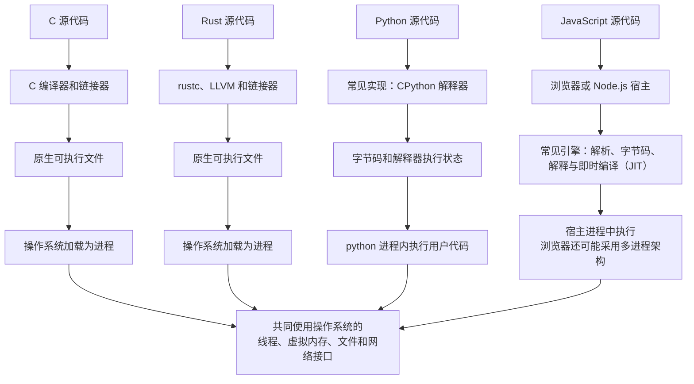

### 9.3 对照表

先用这张简表抓住主干：

| 语言 | 源码怎样开始执行（常见情况） | 动态内存通常由谁管理 |
| --- | --- | --- |
| C | 提前编译、链接为原生机器码 | 程序员配合分配器，用 `malloc/free` 等接口管理 |
| Rust | 提前编译、链接为原生机器码 | 编译器检查所有权和借用，并在确定位置插入释放逻辑 |
| Python（以 CPython 为例） | CPython 先把源码处理成字节码，再由解释器执行 | Python 运行时管理对象和回收 |
| JavaScript（以常见引擎为例） | 引擎解析源码，并可能组合字节码、解释和即时编译（JIT） | JavaScript 引擎通过垃圾回收管理对象 |

这不是“谁更好”的排名。它只是回答：从源码到机器行为，中间是谁在工作；对象不用后，又是谁负责处理。

### 9.4 C：程序员直接承担更多资源责任

C 常先被编译成原生可执行文件。运行后，C 代码中的指针访问的是这个进程被允许访问的虚拟内存，不是绕过操作系统直接操作任意物理内存。

程序调用 `malloc` 得到动态对象后，通常也要在合适时间调用 `free`。如果越界读写、重复释放、释放后继续使用或忘记释放，C 运行时通常不会自动替程序员解决。

> C 的核心直觉：给程序员较直接的控制，也把更多内存正确性责任交给程序员。

<details>
<summary>更准确一点（首轮可跳过）</summary>

局部指针变量和它指向的对象必须分开看：指针本身可能位于寄存器或栈帧，而指向的对象可能在堆、全局数据、映射文件或其他有效区域。编译器诊断器、静态分析和测试能帮助发现问题，但不能把所有内存错误自动变成不可能。

</details>

### 9.5 Rust：所有权不是“所有数据都在栈上”

Rust 也常先编译为原生可执行文件。它让编译器在运行前检查很多资源使用规则，例如“谁负责这个值”“引用能活多久”“能否同时修改”。

这些规则叫所有权、借用和生命周期。它们描述的是责任与使用约束，不是在规定“所有数据都必须放在栈上”。

> Rust 的核心直觉：仍然生成原生程序，但尽量让编译器提前阻止一批内存和并发使用错误。

<details>
<summary>更准确一点（首轮可跳过）</summary>

例如局部 `Vec<T>` 的长度、容量和数据指针等控制信息通常可位于栈帧或寄存器，而元素缓冲区通常动态分配；`Box<T>` 的局部句柄和它指向的 `T` 也可位于不同区域。具体放置仍受编译器优化和实现影响。

Rust 通常不依赖强制垃圾回收器。所有者到达编译器确定的 drop 点时，编译器通常插入相应析构逻辑。但 `Rc`、`Arc`、引用环、显式泄漏、`unsafe` 和 FFI 等情况仍需要额外理解，不能把它简化成“Rust 绝不会泄漏或出错”。

</details>

### 9.6 Python：操作系统运行的是解释器进程

执行 `python demo.py` 时，操作系统通常启动的是 `python` 或 `python.exe` 对应的解释器进程。这个进程读取 `demo.py`，生成或加载字节码，再在解释器的执行循环中完成你的 Python 代码。

所以，`demo.py` 通常不是一个像 C 的 `.exe` 那样被操作系统直接装载的原生进程映像。Python 对象也主要由解释器运行时管理，不需要程序员为每个对象手动调用 `free`。

> Python 的核心直觉：操作系统运行解释器，解释器再在自己的进程里执行 Python 程序。

<details>
<summary>更准确一点（首轮可跳过）</summary>

上面以 CPython 为常见例子。CPython 常用引用计数及时处理许多对象，并使用循环垃圾回收处理部分引用环；其他 Python 实现可以采用不同策略，不能把 CPython 细节当成 Python 语言规范本身。

Python 也有函数调用状态和“调用栈”概念，但 Python 帧对象、C 调用栈和解释器内部结构并不是教科书 C 栈帧的简单一一对应。

</details>

### 9.7 JavaScript：语言需要宿主环境

JavaScript 通常在浏览器或 Node.js 这样的宿主中运行。宿主进程里有 JavaScript 引擎；引擎读取源码，并把它变成最终可由 CPU 执行的行为。

现代引擎可能先生成字节码并解释执行，还可能把频繁运行的热点代码即时编译成机器码，这叫 JIT。JavaScript 对象通常由引擎的垃圾回收器管理。

> JavaScript 的核心直觉：操作系统先运行浏览器或 Node.js，宿主中的引擎再执行 JavaScript。

<details>
<summary>更准确一点（首轮可跳过）</summary>

浏览器或 Node.js 中的事件循环描述任务、回调和异步完成事件怎样被安排。它不表示整个宿主完全没有其他线程，也不等于异步任务必然并行。浏览器可能使用渲染线程、网络线程、Worker 和多个进程；Node.js 也可能借助系统异步 I/O 或线程池完成工作。

因此，“JavaScript 单线程”必须结合具体执行上下文理解，不能扩展成“浏览器或 Node.js 只有一个操作系统线程”。

</details>

### 9.8 为什么不能只分成“编译型”和“解释型”

把它们简单记成“C/Rust 是编译型，Python/JavaScript 是解释型”，可以帮助第一眼分类，但不能当作完整结论。更有用的问法是：

1. 现在使用的是哪一种具体实现？
2. 源码中间经过了原生机器码、字节码，还是两者都有？
3. 谁最终生成或选择 CPU 要执行的机器指令？
4. 对象由程序员、编译器还是运行时管理？

<details>
<summary>更准确一点（首轮可跳过）</summary>

- C 和 Rust 也存在即时编译、解释或特殊运行环境；
- Python 源码常先被编译为字节码；某些 Python 实现带有 JIT；
- JavaScript 引擎广泛使用 JIT，把部分代码变成机器码；
- “语言”与“某个语言实现”是两个层次。

因此，本节描述的是常见实现路径，不是语言规范允许的唯一方式。

</details>

---

## 10. 把全部概念重新连接起来

这一章名词很多，最后不要从大图开始背。先只回答：“磁盘里的程序怎样变成一次正在运行的进程？”

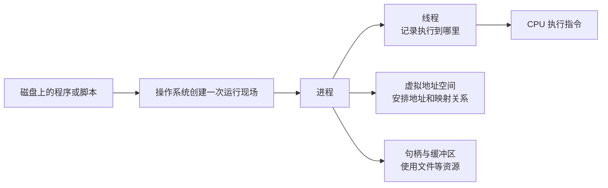

这条主线可以读成一句话：**程序原本只是磁盘里的代码和数据；操作系统为它创建进程，线程让 CPU 执行指令，进程同时使用自己的地址空间和文件资源。**

再单独回答：“进程的地址空间怎样连接到 RAM？”

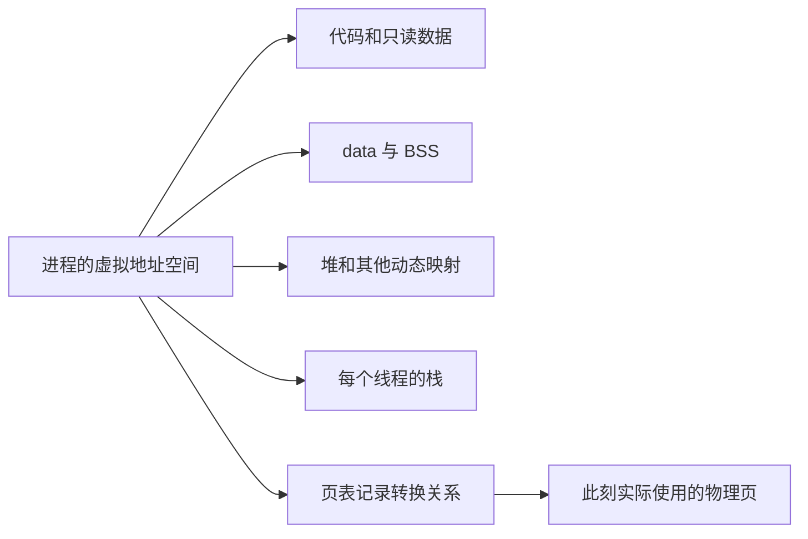

这张图的重点不是各区域画在哪个高度，而是：它们都先属于进程的虚拟地址空间，CPU 访问时再通过地址转换找到此刻对应的物理页。

<details>
<summary>完整关系图（理解前两张图后再看）</summary>

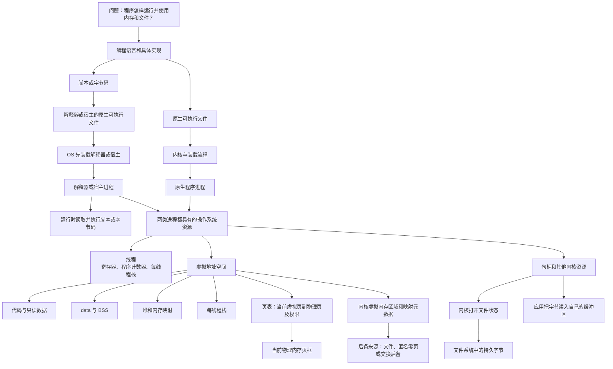

这幅完整图补充了原生程序与解释器/宿主两条路径，以及文件后备、匿名内存和内核映射记录等关系。第一遍阅读不需要逐个记住。

</details>

最后用四句话检查有没有把不同层次混在一起：

1. **程序与进程**：程序是可供运行的代码和数据；进程是它的某一次实际运行。
2. **虚拟与物理**：进程使用虚拟地址；RAM 中真正存放内容的是当前对应的物理页。
3. **文件与缓冲区**：磁盘文件负责持久保存；编辑器缓冲区保存进程正在使用或尚未保存的内容。
4. **语言与运行时**：语言告诉你代码应当表达什么；编译器、解释器或引擎负责把这种意思变成 CPU 最终执行的机器行为。

> 全章一句话：磁盘上的程序被启动后，操作系统为它建立进程；线程在 CPU 上执行指令，进程通过虚拟地址空间使用内存，并通过句柄和缓冲区使用文件。

---

## 11. 常见误区速查

| 容易说错的话 | 更准确的说法 |
| --- | --- |
| 程序就是进程 | 进程是程序的一次运行实例，并包含线程、地址空间、句柄和权限等状态 |
| 程序启动就是完整复制到 RAM | 通常先建立虚拟映射，物理页可以按需准备 |
| 内存布局图就是物理 RAM 的固定切块 | 它首先描述进程的典型虚拟地址空间 |
| 局部变量一定在栈上 | 局部状态常使用栈帧，但也可能在寄存器中或被优化掉 |
| `malloc` 得到的对象和指针变量在同一处 | 指针本身与它指向的动态对象是两个对象，位置可以不同 |
| 堆一定向上，栈一定向下 | 这是常见教学示意，不是所有平台的保证 |
| 一个编辑器打开两个文件就是两个进程 | 一个进程可以持有多个文件句柄和缓冲区 |
| 两个文件内容相同就是同一个文件 | 内容相等不代表文件身份相同 |
| 句柄里面保存文件内容 | 句柄是进程引用内核资源的标识，内容通常读入应用缓冲区 |
| C/Rust 只有编译，Python/JavaScript 只有解释 | 应区分语言与实现；字节码、解释、提前编译和 JIT 可以组合使用 |
| Rust 所有权意味着数据都在栈上 | 所有权描述责任和引用约束，不决定所有对象的物理位置 |
| JavaScript 事件循环意味着没有线程 | 它描述任务调度模型；宿主仍可能使用多个线程或进程 |

---

## 12. 情境自测

先尝试独立回答，再展开答案。目标不是背名词，而是沿概念关系解释原因。

### 题目

1. 假设同一个 `editor.exe` 的两次启动请求确实建立了两个独立进程，分别有几个程序、几个进程和几套虚拟地址空间？
2. 为什么不能说“进程启动时，整个程序一次性复制进物理内存”？
3. 两个进程都访问虚拟地址 `0x1000`，是否必然访问同一个物理页？
4. 两个进程由同一个可执行文件启动，它们有什么内容可能共享，什么内容通常保持私有？
5. C 中 `int g = 1;`、`static int z;`、局部指针 `p` 和 `malloc` 返回的对象通常分别在哪里？哪些判断需要加限定条件？
6. 递归调用不断加深时，主要消耗哪类区域？动态数组扩容通常影响哪类区域？
7. 同一进程创建第二个线程时，哪些资源通常共享，新增了什么线程私有状态？
8. 两个内容完全一样、路径不同的 txt 文件，必然是同一个文件吗？
9. 编辑器中修改文字但尚未保存时，新内容主要在哪里？磁盘文件是否已经一定改变？
10. 一个编辑器窗口打开两个 txt 标签页，操作系统中必然有两个编辑器进程吗？
11. 运行 `python demo.py` 时，从操作系统视角，主要创建的是 `demo.py` 进程还是 Python 解释器进程？
12. 为什么“Rust 的 `Vec` 使用所有权，所以所有数据都在栈上”是错误的？
13. JavaScript 使用事件循环，能否推出浏览器或 Node.js 完全没有其他线程？
14. 为什么“C/Rust 是编译型，Python/JavaScript 是解释型”只能算粗略入门说法？

<details>
<summary>展开参考答案</summary>

1. 磁盘上仍是同一个程序；题设已说明建立了两个独立进程，因此有两个进程和两套彼此隔离的虚拟地址空间。两个进程还有各自的 PID、线程、堆、栈和句柄状态。现实中的单实例应用也可能把第二次启动请求转交给已有进程，所以必须先观察具体程序行为。
2. 加载器通常建立文件到虚拟地址空间的映射，页面可在首次实际访问时按需进入物理内存；部分映射甚至可能始终没有驻留。因此“完整、一次性、连续复制”不准确。
3. 不必然。虚拟地址只在对应进程的地址空间中有意义，各自页表可以把它映射到不同物理页、同一个共享物理页，或暂时没有有效映射。
4. 只读代码和只读库页可能共享物理页；可写全局数据、堆、线程栈和大多数运行状态通常保持进程私有。显式共享内存等机制可以改变默认共享关系。
5. `g` 通常在已初始化数据区域；`z` 通常在 BSS；局部指针 `p` 常在栈帧或寄存器；`malloc` 成功返回的对象由分配器在动态内存中管理。编译器优化、链接方式和平台可能改变具体放置，所以不能把“局部一定在栈”写成绝对规律。
6. 递归通常不断建立调用状态，主要消耗当前线程栈；动态数组扩容通常申请更大的动态内存缓冲区，影响堆或匿名映射。具体实现由语言运行时和分配器决定。
7. 线程通常共享进程的虚拟地址空间、代码、全局数据、堆和打开资源；新线程获得自己的程序计数器、寄存器上下文和线程栈等状态。
8. 不必然。不同文件可以具有完全相同的字节内容，但仍有不同身份和元数据。反过来，硬链接还可能让不同路径指向同一个底层文件对象。
9. 新内容主要在编辑器进程的内存缓冲区。未执行保存时，磁盘文件通常仍是旧内容；具体编辑器也可能有自动保存或恢复文件，因此要结合实际行为。
10. 不必然。一个进程可以持有多个句柄、维护多个缓冲区并显示多个标签页。有些编辑器也可能采用多进程架构，所以最终数量要观察具体实现。
11. 操作系统通常运行的是 Python 解释器可执行文件对应的进程。`demo.py` 是解释器在该进程中读取并执行的程序输入，而不是通常意义上独立的原生进程映像。
12. 所有权规定值的责任、移动、借用和释放关系，不规定所有字节都放在栈上。`Vec` 的控制信息通常可位于栈帧或寄存器，元素缓冲区通常动态分配。
13. 不能。事件循环描述当前执行上下文怎样处理任务；浏览器、Node.js、系统 I/O、线程池和 Worker 都可能涉及其他线程或进程。
14. 现代实现可以组合提前编译、字节码、解释和 JIT。更准确的比较需要指定具体实现，并追踪源代码怎样转成机器指令、运行时承担哪些工作。

</details>

## 13. 下一步怎样复习

1. 不看本文，自己画出“程序 → 进程 → 线程、虚拟内存、文件句柄”的关系图。
2. 用一段包含全局变量、局部变量和动态分配的代码，解释每个对象的典型位置与生命周期。
3. 打开两个 txt 文件，口头区分磁盘对象、内核打开状态、进程句柄、编辑器缓冲区和标签页。
4. 分别说明运行一个 C 可执行文件、Rust 可执行文件、Python 脚本和 Node.js 脚本时，操作系统首先看到什么进程。
5. 完成后把 [Q001 的复习记录](../questions/README.md#后续复习记录) 更新为实际结果。

本章的“每线程栈、SP 与进程资源”已在[第 5 章：多核 CPU、轮转调度、并发与线程](05-multicore-scheduling-and-threads.md)接到调度主线；同进程线程共享堆后怎样产生竞态，已在[第 8 章：竞态条件、原子性与同步](08-race-conditions-atomicity-and-synchronization.md)展开；不同进程的虚拟地址为何默认隔离，已在[第 9 章：内存隔离、基址限长与分页保护](09-memory-isolation-base-limit-and-paging.md)继续慢放。多级页表、完整缺页处理、文件系统缓存和持久化仍会在对应问题出现后继续补充。
