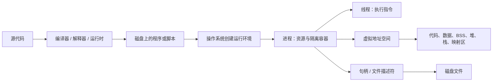
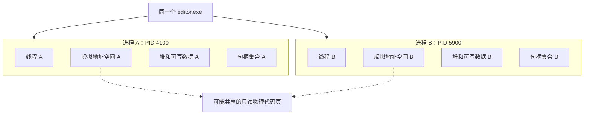
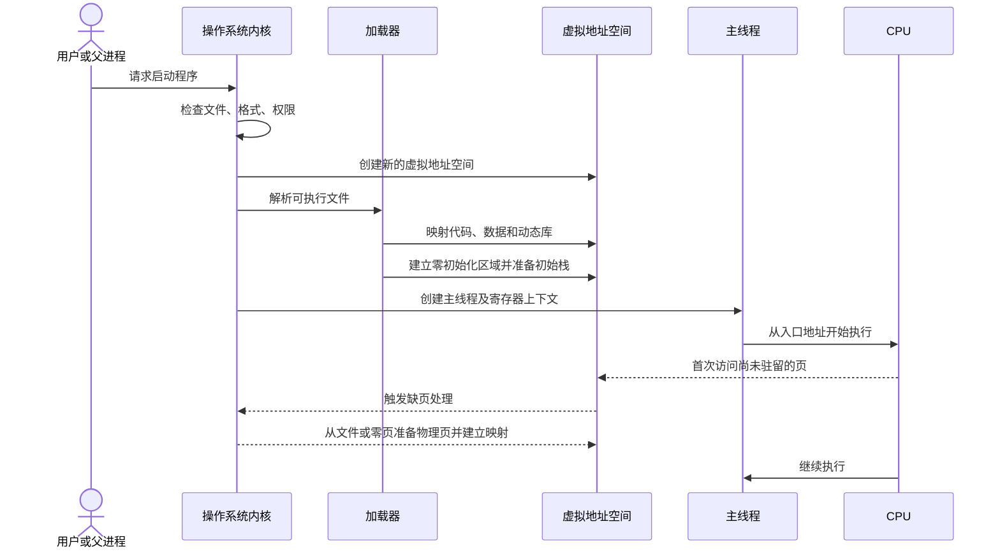
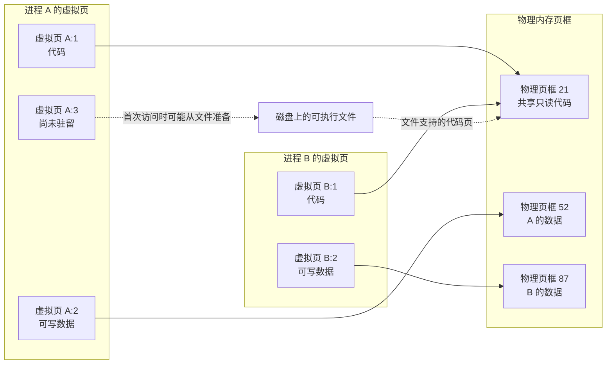
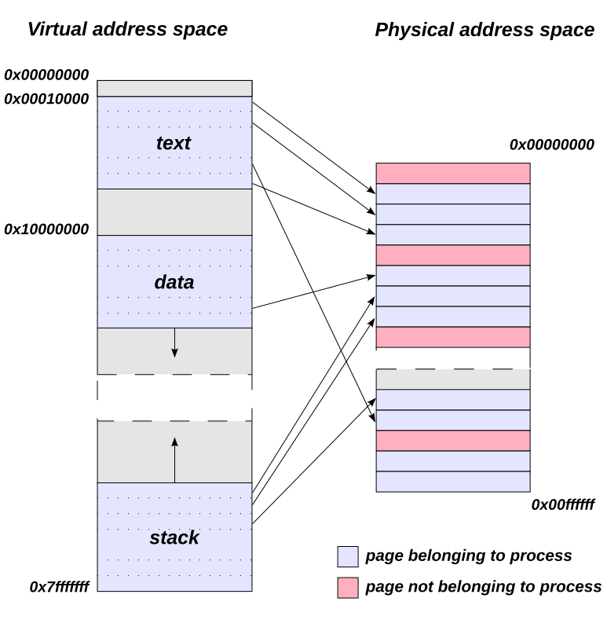
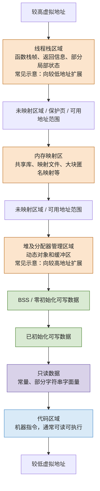
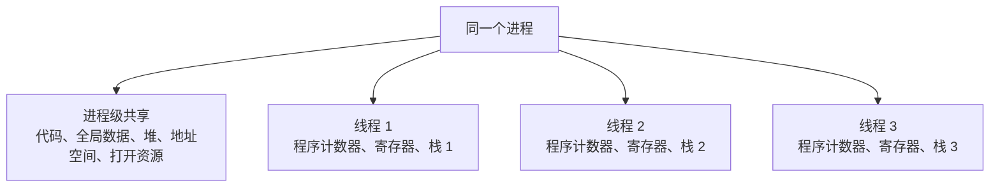
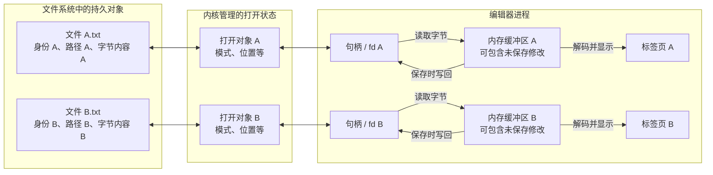
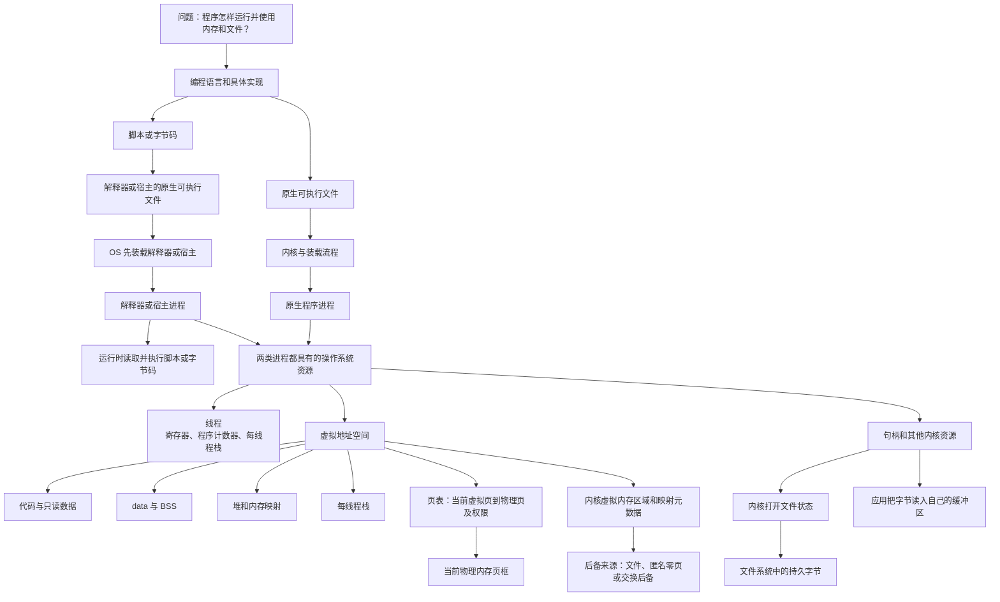

# 第 1 章：从程序到进程

[返回仓库首页](../README.md) · [查看操作系统知识地图](00-operating-system-knowledge-map.md) · [查看 Q001](../questions/README.md#q001程序进程内存文件与语言) · [进入第 2 章：CPU、上下文与指令](02-cpu-context-registers-and-instructions.md)

## 1. 本章要解决什么

本章来自 Q001，不把问题拆成互不相关的定义，而是追踪一条完整链路：



学完后，应该能够：

1. 区分源代码、程序、可执行文件、进程和线程；
2. 解释程序为什么不是一次性完整复制进物理内存；
3. 画出典型进程虚拟地址空间，并解释每个区域怎样变化；
4. 区分两个文件、两个打开句柄、两个标签页和两个内存缓冲区；
5. 从操作系统视角比较 C、Rust、Python 和 JavaScript 的常见运行路径。

---

## 2. 程序、进程与线程

### 2.1 先给出最短定义

- **源代码**：人编写的 C、Rust、Python、JavaScript 等文本，还不是 CPU 可以直接执行的全部机器指令。
- **程序**：为了完成某项任务而组织起来的代码和相关数据。磁盘上的可执行文件或脚本是程序的具体载体。
- **可执行文件**：具有特定格式、可被操作系统加载的文件，例如 Windows 的 PE `.exe`、Linux 常见的 ELF 文件。
- **进程**：程序的一次运行实例，也是操作系统进行资源管理和隔离的重要容器。
- **线程**：进程中的执行流。现代 Windows/Linux 的操作系统调度器通常选择线程等可调度执行实体，CPU 执行被选中执行实体的指令；一个普通用户态进程至少需要一个执行流才能运行代码。

一句话记忆：

> 程序描述“要做什么”，进程表示“这一次正在做”，线程负责“沿着哪条执行路径做”。

### 2.2 进程不仅是代码

一个运行中的进程通常关联：

- 一个进程标识符，例如 PID；
- 一套虚拟地址空间；
- 至少一个线程及其寄存器状态、程序计数器和栈；
- 打开的文件、套接字或设备句柄；
- 身份、权限和安全信息；
- 当前工作目录、环境变量等运行上下文；
- 内核用于管理该进程的各种记录。

因此，“进程就是被加载到内存里的程序”只能算很粗的入门说法。它漏掉了线程、寄存器、文件句柄、权限和大量内核状态。

### 2.3 一个程序可以产生多个进程



同一个程序启动两次，通常会得到两个 PID、两套虚拟地址空间、两组线程和两组运行状态。两个进程可以看到数值相同的虚拟地址，但这些地址不一定映射到相同物理页。

为了节约物理内存，同一可执行文件的只读代码页可能被多个进程共享。可写数据、堆和栈通常保持进程私有；创建进程时还可能使用写时复制等机制。这些共享不会改变“进程在虚拟地址空间层面相互隔离”的基本模型。

### 2.4 菜谱类比及其边界

- 菜谱像程序；一次实际做菜像一个进程。
- 同一菜谱可以同时做两次菜，每次有自己的食材、厨具状态和进度。
- 厨师正在执行某一步，可以帮助理解线程。

类比到这里就应停止：真实进程还涉及虚拟内存、CPU 寄存器、内核权限和系统调用，菜谱并不能表达这些机制。

---

## 3. 程序怎样开始运行

### 3.1 从双击或命令到第一条用户代码

下面是把“创建运行实例”和“装入程序映像”合在一起的概念流程图，用于先建立共同主干，不代表所有操作系统都使用同一组系统调用。Windows、POSIX 系统、不同可执行格式和动态链接方式会有重要差异。



可以按七步理解：

1. 用户、命令行或父进程请求操作系统启动目标程序。
2. 内核检查路径、权限和可执行格式。
3. 操作系统为新进程建立虚拟地址空间和内核管理结构。
4. 加载器把可执行文件中的相关部分映射到虚拟地址空间，并处理所需动态库。
5. 数据区域获得初始内容，BSS 对应的内存被初始化为零，初始线程栈准备好参数和环境信息。
6. 操作系统创建主线程，设置程序计数器、栈指针等寄存器状态。
7. 线程从入口地址开始执行，之后才会逐步进入运行库初始化和 `main` 等用户代码。

在 Windows 中，一次进程创建请求通常可以同时指定要运行的程序。POSIX 系统则常把“产生或准备一个进程”和“用新程序替换进程映像”分开，例如 `fork`/`posix_spawn` 与 `execve` 所表达的模型；成功的 `execve` 通常保留 PID，并把调用进程的映像替换为新程序。动态库也可能由用户态动态链接器在进入 `main` 前继续处理。因此，上图应读成概念顺序，而不是某个平台的逐条 API 清单。

### 3.2 “装载”通常不是完整复制

一个常见误区是：

> 启动程序 = 立刻把整个可执行文件复制到一块连续的物理 RAM。

现代通用操作系统通常会把可执行文件的部分内容建立为虚拟内存映射。某个虚拟页第一次被实际访问时，如果它还没有驻留在物理内存中，CPU 和内核通过缺页处理把对应内容准备到物理页，再继续执行。这叫**按需调页**的一部分。

因此，三个层次必须分开：

- 磁盘上保存的是可执行文件及其字节；
- 进程看到的是虚拟地址和内存映射；
- RAM 中实际驻留的是此时需要的物理页。

程序结束后，进程的虚拟地址空间和运行状态会被回收，但磁盘上的程序文件仍然存在。

### 3.3 section 与运行时内存区域不是简单同义词

ELF 文件可以同时包含用于链接组织的 **section**，以及由 program header 描述、面向装载的 **segment**；加载器主要按照 `PT_LOAD` 等 segment 建立映射。PE 的组织方式不同，通常依据 section 的虚拟地址、大小和权限等信息进行映射。进程运行时统一看到的是一组虚拟内存区域，而不是文件内部结构的原样复制。

教学中常把 `.text`、`.rodata`、`.data`、`.bss` 直接画成进程内存区域，这有助于入门，但不能推导出“每个文件 section 必然对应一个同名且独立的运行时区域”。合并、对齐、权限、链接方式、可执行格式和动态链接器行为都会影响最终映射。

---

## 4. 虚拟内存和物理内存不是同一张图

### 4.1 每个进程看到自己的地址空间

进程执行机器指令时使用的是虚拟地址。CPU 的内存管理硬件结合操作系统建立的页表，把虚拟页转换到物理页框。映射不存在或权限不允许时，会触发异常并由内核处理。



图中最重要的结论：

- A 和 B 的“虚拟页 1”属于不同地址空间，虚拟地址相同不代表对象相同。
- 只读代码页可以安全地映射到同一个物理页框。
- 可写数据通常映射到不同物理页框，避免一个进程随意修改另一个进程的数据。
- 某个虚拟页可以暂时没有物理页；第一次访问时再由内核处理。

#### 外部图解：把“连续的虚拟地址”与“离散的物理页框”同时看见



观察这张图时，先只看两件事：左边是进程看到的连续编号，右边是实际物理页框；中间的箭头说明两边不是按相同位置直接对应。蓝色表示当前进程映射或可使用的页面，但不一定由它独占；只读共享页也可能同时映射给其他进程。粉色表示未映射给当前进程的物理页框。这正是“同一个虚拟地址数字不必等于物理位置”的直观版本。

它采用的是较早的 32 位教学布局，图中的固定地址、`text/data/stack` 位置和箭头数量都**不是**现代系统的通用规则；本章的 Mermaid 图负责补充“两个进程、共享代码页、按需调页”的关系。来源：[Virtual address space and physical address space relationship.svg](https://commons.wikimedia.org/wiki/File:Virtual_address_space_and_physical_address_space_relationship.svg)，作者 Stannered（描摹）、原作者 Dysprosia，3-Clause BSD License，访问日期 2026-08-22；本仓库原样保存。完整许可见[图片署名与许可](../assets/images/ATTRIBUTION.md#virtual-address-space-physical-address-spacesvg)。

### 4.2 地址簿类比及其边界

可以把每个进程的虚拟地址空间想成一本私人地址簿：进程只按自己地址簿中的编号寻找内容，操作系统和硬件负责把编号翻译到真实物理位置。

类比边界是：真实翻译按页进行，并包含存在位、读写执行权限、用户态/内核态权限等信息，不只是简单的地址替换。

### 4.3 虚拟内存带来的主要能力

- **隔离**：一个普通进程不能直接通过自己的虚拟地址访问另一个进程的任意内存。
- **统一视图**：每个进程可以使用自己的地址布局，不必知道 RAM 中真实页框在哪里。
- **保护**：代码页可设为可读可执行但不可写，数据页可设为可读写但不可执行。
- **共享**：不同进程可以有意识地把虚拟页映射到同一物理资源，例如共享库代码或共享内存。
- **按需使用**：不必在启动瞬间为所有映射内容都准备物理页。

分页、页表层级、页面置换和缺页算法属于内存管理的后续主题，本章只建立它们与进程的连接。

---

## 5. 典型进程虚拟地址空间

### 5.1 先看示意图

下面是常见的教学模型，不是所有操作系统、CPU 架构、编译方式和运行时都必须采用的固定地址排列。地址空间布局还可能因为 ASLR 每次运行有所变化。



“高地址”和“低地址”只是在一个进程虚拟地址空间中的相对方向。它们不表示 RAM 芯片上固定切出了这些连续房间。

### 5.2 各区域分别放什么

| 区域 | 典型内容 | 建立或获得内容的时机 | 运行中怎样变化 | 何时释放或失效 | 典型权限与共享 |
| --- | --- | --- | --- | --- | --- |
| 代码区域 | 编译后的机器指令 | 加载器映射可执行文件和共享库 | 指令内容通常不变；更多动态库可后来映射 | 库被卸载或进程退出时解除映射 | 常见为读+执行、不可写；物理页可跨进程共享 |
| 只读数据 | 常量、部分字符串字面量、只读表 | 随程序或库映射 | 通常不应被程序修改 | 对应映射解除或进程退出时 | 常见为只读、不可执行；可能共享 |
| 已初始化数据 | 需要在文件中保存初始内容的可写静态存储对象；非零显式初值通常在此 | 加载时获得可执行文件中的初值 | 变量赋值会修改该进程自己的内容 | 通常随对应模块或进程生命周期结束 | 常见为读写、不可执行；通常进程私有 |
| BSS | 工具链选择为零填充的静态存储对象；常包括未显式初始化或零初始化对象 | 进程建立时获得逻辑上的零值 | 之后可像普通全局变量一样修改 | 通常随对应模块或进程生命周期结束 | 常见为读写、不可执行；通常进程私有 |
| 堆/分配器区域 | `malloc`、`new`、`Box`、`Vec` 缓冲区、运行时对象等动态数据 | 程序向分配器请求；分配器必要时向 OS 获得更多映射 | 申请、复用、释放；不保证物理或虚拟上始终连续增长 | 对象先交还分配器；部分映射稍后归还 OS；进程退出时整体回收 | 常见为读写、不可执行；通常进程私有 |
| 内存映射区 | 共享库、映射文件、共享内存、大块匿名映射 | 程序启动或运行中建立映射 | 可增加、删除、改变保护；内容可能由文件支持 | 显式解除映射、模块卸载或进程退出时 | 权限和共享方式由映射参数决定 |
| 线程栈 | 调用约定所需信息、返回地址、保存的寄存器、部分参数和局部状态 | 每个线程创建时得到自己的栈范围 | 调用函数建立栈帧，返回时撤销；递归过深可能耗尽 | 栈帧随返回失效；整段线程栈在线程退出后回收 | 常见为读写、不可执行；每个线程有自己的栈范围，但仍处于进程地址空间中 |

### 5.3 BSS 为什么值得单独理解

假设程序定义了一个很大的零初始化全局数组。可执行文件通常不必真的保存同样数量的零字节，只需记录“运行时需要一块这么大的零初始化区域”。加载器和操作系统建立内存时保证其初始值为零。

这说明“可执行文件大小”和“进程运行时虚拟内存大小”不是简单相等关系。

### 5.4 堆和栈不是两块固定物理房间

常见教材图把堆画成向上增长、栈画成向下增长，这能展示二者可能利用中间地址空间，但不是跨平台保证：

- 大块动态分配可能直接使用独立内存映射，不一定来自一段单一连续堆；
- 分配器释放内存后可能先留作复用，并不立即归还操作系统；
- 栈增长方向由架构和 ABI 等实现约定决定；
- 每个线程通常有自己的栈，因此一个多线程进程并不是只有一个栈；
- 编译器优化可能让某些局部变量只存在于寄存器，甚至完全消失。

---

## 6. 这些区域在运行时怎样变化

### 6.1 用一个 C 示例追踪对象

```c
#include <stdlib.h>

int initialized_global = 7;
int zero_global;
static int file_static = 3;
const char message[] = "hello";

void work(int argument) {
    int local = argument + 1;
    int *pointer = malloc(sizeof(int));

    if (pointer != NULL) {
        *pointer = local;
        free(pointer);
    }
}

int main(void) {
    work(10);
    return 0;
}
```

在未考虑特殊链接方式和编译器优化的典型模型中：

| 名称或对象 | 典型位置 | 关键区别 |
| --- | --- | --- |
| `initialized_global` | 已初始化数据区域 | 进程开始时值为 7，之后可修改 |
| `zero_global` | BSS 对应的零初始化区域 | 进程开始时值为 0 |
| `file_static` | 已初始化数据区域 | 文件作用域对象本来就有静态存储期；这里的 `static` 主要使名称具有内部链接，不表示它在栈上 |
| `message` | 常见为只读数据区域 | 具体放置由编译器、链接器和平台决定 |
| `argument`、`local` | 常作为栈帧或寄存器中的状态 | 不能绝对说局部变量一定占有一个栈地址 |
| `pointer` 这个指针变量 | 常在栈帧或寄存器 | 它和它指向的对象是两个不同对象 |
| `malloc` 返回的 `int` 对象 | 分配器管理的动态内存 | 生命周期从成功分配到 `free`，不随 `work` 返回自动结束 |

如果删掉 `free(pointer)`，指针变量仍会在函数返回后消失，但动态分配对象不会因为这个局部指针消失就自动归还给 C 分配器。这就是典型内存泄漏的一种来源。

### 6.2 用时间线观察变化


各区域的变化可以概括为：

- **代码和只读数据**：通常映射后保持不变；加载新动态库可能增加新映射。
- **已初始化数据和 BSS**：大小通常由程序映像确定，内容会随全局/静态变量赋值改变。
- **堆或动态映射**：随分配、扩容、复用和释放发生变化。
- **线程栈**：随函数调用和返回反复使用；创建新线程会得到另一个栈。
- **整个地址空间**：进程退出后由操作系统统一解除映射和回收相关资源。

### 6.3 生命周期比“在哪一段”更重要

学习内存布局不能只背“局部变量在栈、动态变量在堆”。更应该问：

1. 这个对象由谁创建？
2. 谁持有或引用它？
3. 它可以被哪些线程访问？
4. 什么时候失效或释放？
5. 操作系统、语言运行时和程序员分别负责哪一层？

这些问题会自然连接到后续的资源管理、所有权、垃圾回收和并发安全。

---

## 7. 进程和线程分别共享什么

一个典型多线程进程可以这样理解：



进程主要回答“资源和隔离属于谁”，线程主要回答“哪条执行流正在运行”。同一进程内的线程共享许多资源，因此交流方便，但同时修改共享数据会引出竞态和同步问题。线程同步属于后续知识点，本章只建立连接。

不同进程默认不共享整个地址空间。它们需要通过文件、管道、套接字、共享内存等进程间通信机制交换数据。

“每个线程有自己的栈”主要表示每个线程有自己的栈范围和栈指针，不等于该栈在硬件上与同一进程的其他线程隔离。因为线程共享进程地址空间，另一个线程若获得有效地址，通常仍可能访问这段内存；是否这样做安全，还取决于对象生命周期和同步规则。

---

## 8. 打开两个 txt 文件时到底有什么不同

### 8.1 先区分四个层次

一个 `.txt` 文件本质上是一串持久字节。“这些字节显示成什么字符”还取决于 UTF-8、GBK 等编码解释。

当编辑器打开文件时，至少涉及：

1. **磁盘文件**：具有路径、文件身份、字节内容、大小、时间等元数据。
2. **内核打开文件状态**：内核记录访问模式、当前位置及底层文件对象等信息；具体结构因操作系统而异。
3. **进程持有的引用**：Windows 常称句柄 `HANDLE`，POSIX 系统常用整数文件描述符 `fd`。
4. **编辑器缓冲区和标签页**：编辑器把读到的字节解码成文本，在自己的进程内存中维护可编辑状态，再把结果显示出来。

### 8.2 两个不同 txt 的数据流



如果 A 和 B 内容不同，它们至少有不同的字节内容；作为两个独立文件时，还通常具有不同的文件身份、路径或元数据。编辑器通常为它们维护不同缓冲区和标签页。

重要的是：打开两个文件不一定产生两个编辑器进程。一个编辑器进程完全可以持有两个文件句柄和两个缓冲区。

### 8.3 三种容易混淆的情况

#### 情况 A：同一个编辑器打开两个不同文件

- 可能只有一个编辑器进程；
- 进程在读取或保存时可分别建立两组打开关系，并通常维护两个编辑缓冲区；有些编辑器读完后会关闭句柄，保存时再重新打开；
- 文件 A 和 B 是两个持久对象；
- 修改 A 的缓冲区不会自动修改 B。

#### 情况 B：两个文件内容完全相同

内容相同不等于文件身份相同。两个不同路径下的独立文件可以恰好拥有相同字节，但它们仍可分别重命名、修改或删除。

还存在硬链接等特殊情况：不同路径可能指向同一个底层文件对象。因此判断文件是否为同一个对象，不能只比较路径字符串或内容；具体身份规则取决于文件系统。

#### 情况 C：同一个文件被打开两次

可能出现两个标签页、两个应用缓冲区或两个句柄，但最终都关联同一个持久文件。两个缓冲区若各自修改并保存，就可能出现覆盖、冲突或编辑器的外部修改提示。

文件当前位置是否共享，取决于它们是分别打开得到的状态，还是通过复制/继承同一个打开描述获得的引用，不能一概而论。

### 8.4 修改但未保存时，内容在哪里

通常情况下：

1. 磁盘文件仍保存上一次成功写入的字节；
2. 新修改主要存在于编辑器进程的内存缓冲区；
3. 点击保存后，编辑器通过句柄请求操作系统写回；
4. 写入调用返回也不一定等于数据已经永久落到物理介质，内核和设备可能还有缓存与刷新过程。

最后一点属于文件系统和持久化语义的后续主题。本章只需要先记住：**编辑器中的文字、内存缓冲区和磁盘文件不是同一个层次的对象。**

### 8.5 档案室类比及其边界

- 磁盘文件像档案室原件；
- 句柄像某个进程持有的访问凭证；
- 编辑器缓冲区像拿到桌面上正在修改的工作副本；
- 保存像请求把工作副本写回档案。

类比边界：真实系统可能有页缓存、应用缓存、设备缓存、并发访问和崩溃一致性问题，不是简单的一张纸来回搬运。

---

## 9. C Rust Python JavaScript 在操作系统眼中有什么区别

### 9.1 先说共同点

当这些语言作为现代通用操作系统中的普通用户态应用运行时，最终执行机器指令的仍是 CPU，资源由操作系统与语言运行时分层管理。它们的常见实现都会涉及：

- 进程和线程；
- 虚拟地址空间；
- 代码、栈、动态内存和运行时数据；
- 文件、网络等系统接口；
- 某种把源代码转变为可执行机器行为的实现。

区别主要在于：源代码怎样成为机器指令、运行时承担多少工作、对象生命周期由谁管理、哪些错误在什么时候被阻止。

### 9.2 常见执行路径

下面比较的是常见实现，不是语言规范允许的唯一实现。

```mermaid
flowchart TB
    C["C 源代码"] --> CC["C 编译器和链接器"]
    CC --> CNATIVE["原生可执行文件"]
    CNATIVE --> CPROC["操作系统加载为进程"]

    R["Rust 源代码"] --> RC["rustc、LLVM 和链接器"]
    RC --> RNATIVE["原生可执行文件"]
    RNATIVE --> RPROC["操作系统加载为进程"]

    P["Python 源代码"] --> PY["常见实现：CPython 解释器"]
    PY --> PBC["字节码和解释器执行状态"]
    PBC --> PPROC["python 进程内执行用户代码"]

    J["JavaScript 源代码"] --> HOST["浏览器或 Node.js 宿主"]
    HOST --> ENG["常见引擎：解析、字节码、解释与 JIT"]
    ENG --> JPROC["宿主进程中执行<br/>浏览器还可能采用多进程架构"]

    OS["共同使用操作系统的<br/>线程、虚拟内存、文件和网络接口"]
    CPROC --> OS
    RPROC --> OS
    PPROC --> OS
    JPROC --> OS
```



### 9.3 对照表

| 维度 | C | Rust | Python（以 CPython 为常见例子） | JavaScript（以 V8 等常见引擎为例） |
| --- | --- | --- | --- | --- |
| 常见起点 | `.c` 源码 | `.rs` 源码 | `.py` 源码及可能生成的字节码缓存 | `.js` 源码 |
| 常见执行路径 | 提前编译、链接为原生机器码 | 提前编译、链接为原生机器码 | CPython 解析/编译为字节码，再由虚拟机执行 | 引擎解析，可能使用字节码、解释和 JIT 编译 |
| OS 主要看到什么 | 原生程序对应的进程 | 原生程序对应的进程 | 通常首先看到 `python`/`python.exe` 解释器进程 | Node.js 进程，或浏览器的一个或多个宿主进程 |
| 动态内存管理 | 程序员配合分配器手动管理，例如 `malloc/free` | 所有权、借用和生命周期在编译期约束；资源常通过 `Drop` 释放 | 对象由运行时管理；CPython 常用引用计数并处理引用环 | 对象由引擎垃圾回收器管理 |
| 主要安全检查时机 | 编译期类型检查有限，许多内存正确性由程序员保证 | 安全 Rust 在编译期阻止大量悬垂引用、数据竞争和生命周期错误；`unsafe`/FFI 需要维护额外不变量 | 运行时类型和边界检查较多，仍可能有逻辑错误 | 运行时类型和引擎检查较多，仍可能有逻辑错误 |
| 典型代价 | 控制直接，但越界、释放后使用和泄漏风险高 | 编译规则更严格，换取较强内存与并发安全保证 | 开发方便，但每个对象和解释执行通常有运行时开销 | 动态对象、JIT 和垃圾回收带来复杂运行时行为 |

### 9.4 C：程序员直接承担更多资源责任

C 常被编译成原生可执行文件。普通用户态程序可以通过指针直接访问进程权限允许的虚拟内存，也可以调用 `malloc/free` 管理动态对象。

这种控制力允许编写操作系统、驱动和嵌入式软件，但越界访问、重复释放、释放后继续使用、未初始化读取和内存泄漏等问题往往需要程序员、编译器诊断器和测试共同防止。

局部指针变量和它指向的对象必须分开看：指针本身可能位于寄存器或栈帧，而指向的对象可能在堆、全局数据、映射文件甚至别的有效区域。

### 9.5 Rust：所有权不是“所有数据都在栈上”

Rust 也常编译为原生可执行文件。所有权和借用主要回答“谁负责这个值、引用能活多久、能否同时读写”，它们不是一套物理地址布局规则。

例如局部 `Vec<T>` 的长度、容量和数据指针等控制信息通常可位于栈帧或寄存器，而元素缓冲区通常动态分配；`Box<T>` 的局部句柄和它指向的 `T` 也可位于不同区域。具体放置仍受编译器优化和实现影响。

Rust 通常不依赖强制垃圾回收器。所有者到达编译器确定的 drop 点时，如果值没有被移动、遗忘或放入 `ManuallyDrop` 等特殊容器，编译器会插入相应的析构逻辑。`Rc`、`Arc`、引用环、显式泄漏和 `unsafe` 等情况仍需要准确理解，不能简化成“Rust 绝不会泄漏”。

### 9.6 Python：操作系统运行的是解释器进程

执行 `python demo.py` 时，操作系统通常创建或使用的是 CPython 解释器对应的进程。CPython 在该进程中读取 Python 源码、生成或加载字节码，并在自己的执行循环中运行用户代码。

Python 对象通常由运行时在动态内存中管理。CPython 常以引用计数及时回收许多对象，并使用循环垃圾回收处理部分引用环。其他 Python 实现可以采用不同策略，所以不能把 CPython 的细节当成 Python 语言规范本身。

Python 也有函数调用状态和“调用栈”概念，但 Python 帧对象、C 调用栈、解释器内部结构之间不是教科书 C 栈帧的简单一一对应。

### 9.7 JavaScript：语言需要宿主环境

JavaScript 源码由浏览器或 Node.js 等宿主中的引擎执行。现代引擎可能结合解析、字节码、解释、性能分析和 JIT，把热点代码编译为机器码。

浏览器或 Node.js 等宿主/运行时中的事件循环描述任务、回调和异步完成事件怎样被调度；它不是 ECMAScript 语言本身规定的唯一宿主执行模型，也不表示整个系统完全没有线程，更不等于异步任务必然并行：

- 浏览器可能有渲染、网络、工作线程和多个进程；
- Node.js 除主事件循环外，也可能通过系统异步 I/O 或线程池完成工作；
- JavaScript 还提供 Worker 等并发机制。

因此，“JavaScript 单线程”必须结合具体执行上下文理解，不能扩展成“浏览器或 Node.js 只有一个操作系统线程”。

### 9.8 为什么不能只分成“编译型”和“解释型”

“C/Rust 是编译型，Python/JavaScript 是解释型”可以作为第一眼印象，但不足以解释现代实现：

- C 和 Rust 也存在即时编译、解释或特殊运行环境；
- Python 源码常先被编译为字节码；某些 Python 实现带有 JIT；
- JavaScript 引擎广泛使用 JIT，把部分代码变成机器码；
- “语言”与“某个语言实现”是两个层次。

更可靠的提问方式是：**具体使用哪个实现？源码经过哪些中间形式？谁在什么时候生成或执行机器指令？对象由谁管理？**

---

## 10. 把全部概念重新连接起来



从图中应当看到四个边界：

1. **程序与进程**：一个是可供执行的代码/数据，一个是具体运行实例和资源集合。
2. **虚拟与物理**：进程使用虚拟地址；页表描述当前硬件翻译，内核映射元数据记录文件或匿名内存等后备关系。
3. **文件与缓冲区**：磁盘文件是持久对象，应用缓冲区是进程内的工作状态。
4. **语言与运行时**：语言规定语义，具体实现负责把语义变成进程中的机器行为。

---

## 11. 常见误区速查

| 容易说错的话 | 更准确的说法 |
| --- | --- |
| 程序就是进程 | 进程是程序的一次运行实例，并包含线程、地址空间、句柄和权限等状态 |
| 程序启动就是完整复制到 RAM | 通常先建立虚拟映射，物理页可以按需准备 |
| 内存布局图就是物理 RAM 的固定切块 | 它首先描述进程的典型虚拟地址空间 |
| 局部变量一定在栈上 | 局部状态常使用栈帧，但也可能在寄存器中或被优化掉 |
| `malloc` 得到的对象和指针变量在同一处 | 指针本身与它指向的动态对象是两个对象，位置可以不同 |
| 堆一定向上，栈一定向下 | 这是常见教学示意，不是所有平台的保证 |
| 一个编辑器打开两个文件就是两个进程 | 一个进程可以持有多个文件句柄和缓冲区 |
| 两个文件内容相同就是同一个文件 | 内容相等不代表文件身份相同 |
| 句柄里面保存文件内容 | 句柄是进程引用内核资源的标识，内容通常读入应用缓冲区 |
| C/Rust 只有编译，Python/JavaScript 只有解释 | 应区分语言与实现；字节码、解释、提前编译和 JIT 可以组合使用 |
| Rust 所有权意味着数据都在栈上 | 所有权描述责任和引用约束，不决定所有对象的物理位置 |
| JavaScript 事件循环意味着没有线程 | 它描述任务调度模型；宿主仍可能使用多个线程或进程 |

---

## 12. 情境自测

先尝试独立回答，再展开答案。目标不是背名词，而是沿概念关系解释原因。

### 题目

1. 假设同一个 `editor.exe` 的两次启动请求确实建立了两个独立进程，分别有几个程序、几个进程和几套虚拟地址空间？
2. 为什么不能说“进程启动时，整个程序一次性复制进物理内存”？
3. 两个进程都访问虚拟地址 `0x1000`，是否必然访问同一个物理页？
4. 两个进程由同一个可执行文件启动，它们有什么内容可能共享，什么内容通常保持私有？
5. C 中 `int g = 1;`、`static int z;`、局部指针 `p` 和 `malloc` 返回的对象通常分别在哪里？哪些判断需要加限定条件？
6. 递归调用不断加深时，主要消耗哪类区域？动态数组扩容通常影响哪类区域？
7. 同一进程创建第二个线程时，哪些资源通常共享，新增了什么线程私有状态？
8. 两个内容完全一样、路径不同的 txt 文件，必然是同一个文件吗？
9. 编辑器中修改文字但尚未保存时，新内容主要在哪里？磁盘文件是否已经一定改变？
10. 一个编辑器窗口打开两个 txt 标签页，操作系统中必然有两个编辑器进程吗？
11. 运行 `python demo.py` 时，从操作系统视角，主要创建的是 `demo.py` 进程还是 Python 解释器进程？
12. 为什么“Rust 的 `Vec` 使用所有权，所以所有数据都在栈上”是错误的？
13. JavaScript 使用事件循环，能否推出浏览器或 Node.js 完全没有其他线程？
14. 为什么“C/Rust 是编译型，Python/JavaScript 是解释型”只能算粗略入门说法？

<details>
<summary>展开参考答案</summary>

1. 磁盘上仍是同一个程序；题设已说明建立了两个独立进程，因此有两个进程和两套彼此隔离的虚拟地址空间。两个进程还有各自的 PID、线程、堆、栈和句柄状态。现实中的单实例应用也可能把第二次启动请求转交给已有进程，所以必须先观察具体程序行为。
2. 加载器通常建立文件到虚拟地址空间的映射，页面可在首次实际访问时按需进入物理内存；部分映射甚至可能始终没有驻留。因此“完整、一次性、连续复制”不准确。
3. 不必然。虚拟地址只在对应进程的地址空间中有意义，各自页表可以把它映射到不同物理页、同一个共享物理页，或暂时没有有效映射。
4. 只读代码和只读库页可能共享物理页；可写全局数据、堆、线程栈和大多数运行状态通常保持进程私有。显式共享内存等机制可以改变默认共享关系。
5. `g` 通常在已初始化数据区域；`z` 通常在 BSS；局部指针 `p` 常在栈帧或寄存器；`malloc` 成功返回的对象由分配器在动态内存中管理。编译器优化、链接方式和平台可能改变具体放置，所以不能把“局部一定在栈”写成绝对规律。
6. 递归通常不断建立调用状态，主要消耗当前线程栈；动态数组扩容通常申请更大的动态内存缓冲区，影响堆或匿名映射。具体实现由语言运行时和分配器决定。
7. 线程通常共享进程的虚拟地址空间、代码、全局数据、堆和打开资源；新线程获得自己的程序计数器、寄存器上下文和线程栈等状态。
8. 不必然。不同文件可以具有完全相同的字节内容，但仍有不同身份和元数据。反过来，硬链接还可能让不同路径指向同一个底层文件对象。
9. 新内容主要在编辑器进程的内存缓冲区。未执行保存时，磁盘文件通常仍是旧内容；具体编辑器也可能有自动保存或恢复文件，因此要结合实际行为。
10. 不必然。一个进程可以持有多个句柄、维护多个缓冲区并显示多个标签页。有些编辑器也可能采用多进程架构，所以最终数量要观察具体实现。
11. 操作系统通常运行的是 Python 解释器可执行文件对应的进程。`demo.py` 是解释器在该进程中读取并执行的程序输入，而不是通常意义上独立的原生进程映像。
12. 所有权规定值的责任、移动、借用和释放关系，不规定所有字节都放在栈上。`Vec` 的控制信息通常可位于栈帧或寄存器，元素缓冲区通常动态分配。
13. 不能。事件循环描述当前执行上下文怎样处理任务；浏览器、Node.js、系统 I/O、线程池和 Worker 都可能涉及其他线程或进程。
14. 现代实现可以组合提前编译、字节码、解释和 JIT。更准确的比较需要指定具体实现，并追踪源代码怎样转成机器指令、运行时承担哪些工作。

</details>

## 13. 下一步怎样复习

1. 不看本文，自己画出“程序 → 进程 → 线程、虚拟内存、文件句柄”的关系图。
2. 用一段包含全局变量、局部变量和动态分配的代码，解释每个对象的典型位置与生命周期。
3. 打开两个 txt 文件，口头区分磁盘对象、内核打开状态、进程句柄、编辑器缓冲区和标签页。
4. 分别说明运行一个 C 可执行文件、Rust 可执行文件、Python 脚本和 Node.js 脚本时，操作系统首先看到什么进程。
5. 完成后把 [Q001 的复习记录](../questions/README.md#后续复习记录) 更新为实际结果。

与本章相连但尚未详细展开的主题包括：CPU 调度、线程同步、页表与缺页处理、文件系统缓存和持久化。它们会在对应问题出现后继续补充。
