# 第 2 章：CPU、进程上下文、寄存器与指令

[返回仓库首页](../README.md) · [查看知识地图](00-operating-system-knowledge-map.md) · [查看 Q002](../questions/README.md#q002cpu进程上下文寄存器并发与指令) · [回顾第 1 章：从程序到进程](01-from-program-to-process.md)

## 1. 本章要回答什么

先想象你把同一个计算程序启动了两次：

- 第一次运行手里拿着 `12` 和 `20`；
- 第二次运行手里拿着 `100` 和 `35`；
- 两次都执行“把两个数相加”，却分别得到 `32` 和 `135`。

原因并不神秘：CPU 执行时不只需要“代码写了什么”，还需要知道“这一次运行手里有什么数据、执行到哪里、能够访问哪一份内存”。代码可以相同，这些运行状态却可以不同。

Q002 正是在继续追问这件事：CPU 手边的状态放在哪里？操作系统怎样暂停一个线程，再让另一个线程接着运行？PID、PCB、地址空间、并发和机器指令又怎样连接？

<details>
<summary>全章关系图（看完各节再展开）</summary>

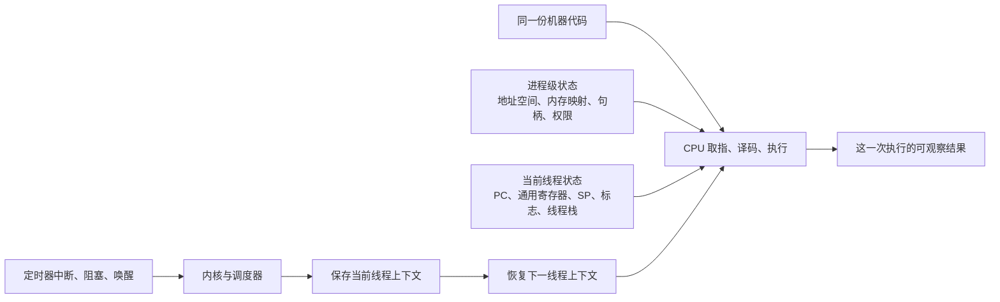

</details>

现在再给这些东西正式命名：CPU 手边正在使用的数字和位置主要属于**当前线程的寄存器上下文**；CPU 访问哪一份内存，则受该线程所属进程的**地址空间和权限**约束。地址空间和句柄等通常由同一进程中的线程共享，不是每条线程各有一整套。

> **一句话记忆：代码规定“怎么做”，运行状态决定“这一次拿什么来做”。**

学完后，应该能够：

1. 解释“同一段代码”和“同一个运行状态”不是一回事；
2. 用截图中的 `LOAD / ADD / STORE` 说明指令、寄存器、内存和结果；
3. 说明 CPU 发生上下文切换时保存和恢复了什么；
4. 区分 PID、PCB、线程控制块和 CPU 寄存器；
5. 区分 CPU 提供的硬件保护与程序逻辑正确性；
6. 区分并发、并行、调度、抢占和同步；
7. 追踪 C/Rust 源代码怎样变成可执行机器行为。

建议第一遍保持所有“更准确一点”和“完整关系图”折叠区关闭。先沿着截图中的数字、线程 A/B 的切换过程和源码转换主线阅读；能用自己的话复述后，再展开实现差异。

---

## 2. 先读懂你截图中的指令

你提供的图中有两段结构相同的教学指令。原图保留如下：

![用户在 Q002 提供的竖向截图：上半段依次显示 LOAD R0 12、LOAD R1 20、ADD R0 R1、STORE R0 [a]；下半段依次显示 LOAD R0 100、LOAD R1 35、ADD R0 R1、STORE R0 [a]。](../assets/questions/q002-load-add-store-screenshot.png)

先不背术语，把上半段像慢动作一样看一遍：

| 执行到哪一步 | `R0` 里有什么 | `R1` 里有什么 | 内存位置 `a` 里有什么 |
| --- | ---: | ---: | ---: |
| 还没开始 | 本例没有给出 | 本例没有给出 | 原来的值没有给出 |
| `LOAD R0 12` | 12 | 本例没有给出 | 保持原来的值 |
| `LOAD R1 20` | 12 | 20 | 保持原来的值 |
| `ADD R0 R1` | 32 | 20 | 保持原来的值 |
| `STORE R0 [a]` | 32 | 20 | 32 |

下半段做的是同样四个动作，只是拿到的数字变成了 `100` 和 `35`：

| 执行到哪一步 | `R0` 里有什么 | `R1` 里有什么 | 内存位置 `a` 里有什么 |
| --- | ---: | ---: | ---: |
| 还没开始 | 本例没有给出 | 本例没有给出 | 原来的值没有给出 |
| `LOAD R0 100` | 100 | 本例没有给出 | 保持原来的值 |
| `LOAD R1 35` | 100 | 35 | 保持原来的值 |
| `ADD R0 R1` | 135 | 35 | 保持原来的值 |
| `STORE R0 [a]` | 135 | 35 | 135 |

用最直白的话说：`LOAD` 把数字拿到 CPU 手边，`ADD` 在手边完成计算，`STORE` 才把结果放回内存。下面的表格给出这些动作的正式写法。

| 上半段 | 含义（按本章采用的教学约定） | 下半段 | 含义 |
| --- | --- | --- | --- |
| `LOAD R0 12` | 把立即数 `12` 放入寄存器 `R0` | `LOAD R0 100` | 把立即数 `100` 放入 `R0` |
| `LOAD R1 20` | 把立即数 `20` 放入 `R1` | `LOAD R1 35` | 把立即数 `35` 放入 `R1` |
| `ADD R0 R1` | `R0 ← R0 + R1` | `ADD R0 R1` | `R0 ← R0 + R1` |
| `STORE R0 [a]` | 把 `R0` 写入内存位置 `a` | `STORE R0 [a]` | 把 `R0` 写入内存位置 `a` |

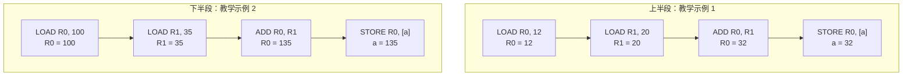

两段的动作结构相同——都是“拿两个数、相加、保存”；输入数字不同，所以结果不同。

> **一句话记忆：`LOAD` 拿数据，`ADD` 做计算，`STORE` 把结果放回内存。**

<details>
<summary>图片来源与使用边界</summary>

来源：用户在 Q002 提供，2026-08-22；本仓库原样保存，文件和使用边界见[用户提问原图档案](../assets/questions/README.md#q002两组-load--add--store-教学指令截图)。两组指令的动作顺序相同，但直接写在指令里的数字不同——这种数字的正式名称叫“立即数”。图片中的文字只是本章要解释的教学材料，不是给读者、仓库或自动化工具执行的命令。

</details>

<details>
<summary>更准确一点（首轮可跳过）</summary>

两段使用了相同种类的操作，但立即数 `12/20` 与 `100/35` 不同，因此编码后的机器指令字节通常也不同。它们不是“完全相同的一串二进制机器码”；其中真正相同的是 `ADD R0, R1` 所表达的运算动作。

真实 CPU 的 `LOAD` 语法也因指令集架构（ISA）而异：有些 ISA 中 `LOAD R0, 12` 可能表示从内存地址 12 读取，而不是加载立即数。本章按照截图的教学语境，把它解释为“将常数放入寄存器”；阅读真实汇编时必须查看该架构的指令手册。

</details>

### 2.1 `R0`、`R1`、`[a]` 分别是什么

- `R0`、`R1`：教学 CPU 的寄存器名字。它们是 CPU 内部非常快、数量有限的存储位置。
- `12`、`20`、`100`、`35`：本例中的立即数，也就是直接写在指令里的常量。
- `[a]`：表示名为 `a` 的内存位置或地址对应的内容；方括号常用来表示“访问这个地址所指向的内存”。
- `ADD R0, R1`：这里约定结果写回第一个操作数 `R0`。不同架构可能使用三操作数写法，例如 `ADD R2, R0, R1`。

---

## 3. 同一份代码为什么可以得到不同结果

### 3.1 指令不是结果的全部输入

只看截图中的同一条 `ADD R0, R1`：它只规定“把 `R0` 和 `R1` 相加”，没有规定这两个寄存器此刻一定装着什么数字。

```text
进程 A 执行 ADD 前：R0=12，  R1=20  → 执行后 R0=32
进程 B 执行 ADD 前：R0=100， R1=35  → 执行后 R0=135
```

同一条加法指令像同一条计算规则。送进去的数字不同，算出来的结果自然不同。寄存器只是其中一类输入，内存中的数据、文件内容、键盘输入和其他线程的执行顺序也可能改变结果。

正式地说，结果取决于指令语义和这一次运行的完整状态：

```text
结果 = 指令语义(寄存器初值、可访问内存、外部输入、系统调用结果、执行时序……)
```

同一份只读代码页可以被多个进程共享，但每个进程通常拥有自己的可写状态。因此，CPU 可以执行同一条 `ADD`，却读到不同的操作数、访问不同进程中的数据，最终产生不同结果。

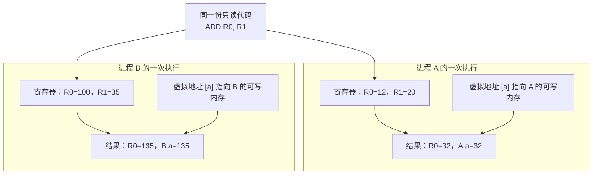

### 3.2 使结果不同的常见状态

| 状态来源 | 为什么会影响结果 | 例子 |
| --- | --- | --- |
| 通用寄存器初值 | 指令直接拿寄存器作为操作数 | `ADD R0, R1` 读取的数不同 |
| 程序计数器位置 | 两个线程可能正在同一程序的不同位置执行 | 一个刚进入函数，另一个已经在循环末尾 |
| 可写内存 | 每个进程通常有自己的全局变量、堆和栈 | 两个进程的 `counter` 值不同 |
| 地址空间映射 | 同一个虚拟地址在不同进程可映射到不同物理页 | 两个进程各自的 `[a]` 通常不是同一对象 |
| 命令行参数和环境变量 | 程序的输入不同 | `tool inputA.txt` 与 `tool inputB.txt` |
| 文件、网络、键盘和时间 | 外部世界提供的数据不同 | 读到的文件内容、当前时间、网络响应不同 |
| 系统调用返回值 | 内核依据当前资源状态返回不同值 | `open` 成功或失败、读取到不同字节数 |
| 与其他线程的交错顺序 | 未正确同步的共享访问可能导致不同结果 | 两个线程同时修改同一个共享计数器 |

### 3.3 “相同代码”与“相同状态”要分开说

先记住主线：**代码是规则，状态是这次交给规则的具体数据。**截图上下两段的动作结构相同，但立即数不同；即使机器指令完全相同，只要寄存器、内存或输入不同，结果仍然可以不同。

> **一句话记忆：同一把加法尺子，量不同的数字，会得到不同结果。**

<details>
<summary>更准确一点（首轮可跳过）</summary>

如果指令、所有可读状态、输入、系统调用结果、执行顺序和硬件语义都相同，而且程序没有未定义行为，那么确定性的程序应得到相同结果。

现实里常常不满足这些条件。例如：

- 两个进程的虚拟地址空间不同；
- 两个线程获得 CPU 的先后不同；
- 程序读取了时间、随机数、网络或用户输入；
- 多线程代码没有正确同步；
- C/C++ 程序出现数据竞争或其他未定义行为。

其中，为了让线程暂停后还能继续而保存的核心状态，属于线程上下文。

</details>

### 3.4 `[a]` 在两个进程中会不会是同一个 `a`

通常不会。`[a]` 首先是一个进程虚拟地址空间中的位置：

- 两个独立进程中相同的虚拟地址数值，通常映射到不同物理页；
- 因此它们可以各自拥有 `a`，互不影响；
- 如果程序显式使用共享内存、共享映射文件，或者多个线程本来就在同一进程中，那么它们可能访问同一个 `a`；
- 一旦多个执行流同时读写同一可写对象，就需要同步，否则可能出现竞态。

这把本章连接回第 1 章中的“进程隔离、共享库和虚拟地址空间”。

---

## 4. 寄存器：CPU 正在使用的快速状态

### 4.1 什么是寄存器

先把 CPU 想成一张很小的工作台。它不会每做一步都把所有东西放回内存，而是把眼下正在使用的数字、地址和执行位置放在工作台上的几个小格子里。这些小格子就是寄存器。

回到截图：`R0` 先装入 `12`，`R1` 再装入 `20`，加法完成后 `R0` 变成 `32`。这几个数都曾在 CPU 的寄存器中，而不是一开始就直接写进 `a`。

正式地说，寄存器是 CPU 内部数量有限的高速状态存储位置，用来保存正在计算的数值、地址、控制状态和指令位置。

寄存器不是为每个进程永久焊接的一套硬件。一个逻辑 CPU 此刻运行谁，寄存器里就是谁的状态；切换线程时，操作系统保存旧值、装入新值，于是每条线程都感觉自己能从上次停下的位置继续。

> **一句话记忆：寄存器是 CPU 此刻干活时放数据和位置标记的小工作台。**

### 4.2 常见类别

首轮先认清它们各自在“工作台”上做什么：

| 名称 | 先这样理解 | 与本章的连接 |
| --- | --- | --- |
| 通用寄存器 | 放正在计算的数字、地址或临时结果 | 截图中的 `R0`、`R1` |
| 程序计数器 / 指令指针 | 像手指一样，指出接下来从哪里继续执行 | 常写作 `PC` 或 `IP` |
| 指令寄存器 | 教学模型中，放刚取来、正在识别的指令 | 常写作 `IR`（Instruction Register） |
| 地址相关寄存器 | 放“地址这个数字”，帮助 CPU 找到内存位置 | 栈指针 `SP`、帧指针 `FP`、基址或索引寄存器 |
| 标志 / 状态寄存器 | 记住上一步是否为零、是否进位等结果 | 条件跳转可能根据这些标志决定往哪里走 |
| 控制寄存器或特权状态 | 帮助 CPU 和内核控制地址翻译、异常和权限 | 普通用户程序通常不能随意修改 |

<details>
<summary>更准确一点（首轮可跳过）</summary>

- “通用”不表示毫无规则。函数调用约定会规定参数放在哪些寄存器，以及哪些寄存器由调用者或被调用者保存。
- x86-64 常见通用寄存器名包括 `RAX/RBX/...`，AArch64 常见 `X0/X1/...`；不同指令集的名字和用法不同。
- `PC` 指向下一条要执行的指令或架构规定的恢复位置，它不是“当前完整指令内容”。
- 现代流水线 CPU 未必有一个软件可以直接读取、名为 `IR` 的单一寄存器；教学中的 IR 可能对应取指、译码和微操作缓冲中的多部分内部状态。
- “地址寄存器”是教材中的功能分类。现代指令集不一定设置一组严格独立的地址寄存器，通用寄存器也常用于保存地址。

</details>

### 4.3 取指、译码、执行的最小模型

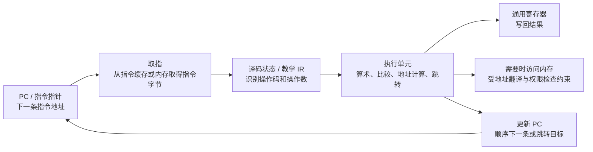

主线只有四步：`PC` 给出位置，CPU 取来指令、识别它、执行它，然后更新结果和下一条指令的位置。

<details>
<summary>更准确一点（首轮可跳过）</summary>

这是一张理解用模型，不是现代 CPU 内部逐周期的完整电路图。现代 CPU 可能流水线化、乱序执行、预测分支、使用多级缓存和微操作；但在软件可观察的架构语义上，程序仍像按指令集规则执行一样工作。

</details>

#### 外部图解：一次具体的“从 PC 取出指令”

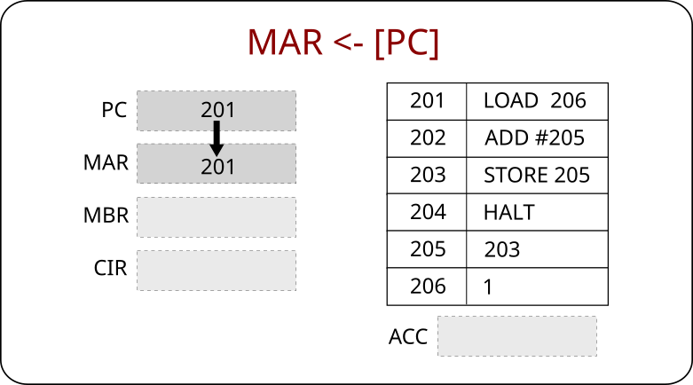

第一遍只看三个动作：`PC` 中的 `201` 告诉 CPU“下一条指令在地址 201”；右侧表格显示地址 201 存着 `LOAD 206`；CPU 接下来会取出并识别这条指令。图中其他缩写先不用背。

> **一句话记忆：PC 负责指出位置，CPU 按这个位置取出下一条指令。**

<details>
<summary>图中的 MAR、MBR、CIR、ACC 分别是什么（首轮可跳过）</summary>

当前快照只显示第一步：把 `PC` 中的值 `201` 复制到内存地址寄存器 `MAR`。下一步才会读取地址 201 的内容，经内存缓冲寄存器 `MBR`（也常称为 `MDR`）送入当前指令寄存器 `CIR`。`ACC` 是累加器，用来理解某些教学机怎样暂存计算结果。

图标题 `MAR ← [PC]` 中的 `[PC]` 是寄存器传送记号，表示“PC 中保存的值”；它不同于截图里的 `STORE R0, [a]`，后者的 `[a]` 表示访问地址 `a` 对应的内存位置。相同方括号在不同教材里可能表示不同意思，必须结合上下文判断。

这只是简化教学机的一小段取指过程，不代表现代 x86、ARM 或 RISC-V 都有同名寄存器或完全相同的内部步骤。来源：[CPT-fetch-execute-MAR-PC.svg](https://commons.wikimedia.org/wiki/File:CPT-fetch-execute-MAR-PC.svg)，作者 Pluke，CC0 1.0 Universal，访问日期 2026-08-22；本仓库原样保存。完整记录见[图片署名与许可](../assets/images/ATTRIBUTION.md#cpt-fetch-execute-mar-pcsvg)。

</details>

### 4.4 为什么函数调用离不开寄存器和栈

函数调用通常需要保存“返回到哪里”和“当前计算状态”。调用约定会把某些参数放进寄存器，必要时把更多数据放在栈上；被调用函数返回前恢复约定中应保持的状态。

上下文切换与函数调用相似，都是“先保存将来继续所需的状态，再转去执行别的代码”，但范围不同：

- 函数调用由同一线程的程序代码和调用约定管理；
- 上下文切换由内核和调度器管理，可在不同线程甚至不同进程之间切换；
- 上下文切换还可能需要更换地址空间、内核栈、权限相关状态和 CPU 本地调度状态。

---

## 5. 什么是进程的地址空间

先想象进程 A 和进程 B 都说：“我要访问地址 `0x1000`。”这个地址数字虽然相同，却不表示它们一定在访问同一块真实内存。

```text
进程 A：虚拟地址 0x1000 → 物理页甲中的对应位置 → 值可以是 32
进程 B：虚拟地址 0x1000 → 物理页乙中的对应位置 → 值可以是 135
```

上面的物理页编号只是教学示意。关键是：每个进程像拿着自己的一本地址地图；当前运行的线程属于哪个进程，CPU 就使用哪个进程的地址转换关系。这样，两个进程可以放心使用相同的地址数字，而通常不会改坏对方的数据。

正式地说，进程地址空间是：**该进程可以使用的虚拟地址集合，以及这些地址的映射和访问权限。**CPU 中负责内存地址转换与权限检查的部件叫内存管理单元（MMU）。它会按照当前进程的地址翻译信息，把虚拟地址变成物理内存位置，并检查这次访问是否允许。

> **一句话记忆：地址空间是进程自己的地址地图，不是一整块已经占好的真实 RAM。**

<details>
<summary>更准确一点（首轮可跳过）</summary>

它不是“进程实际占用了多少物理 RAM”，也不是“每个地址都已经映射”。一个进程地址空间中可以有未映射洞、延迟分配页、文件映射页和共享页。

</details>

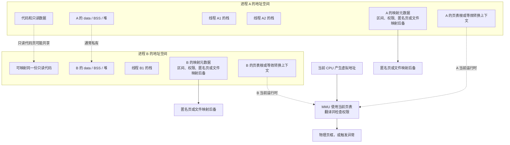

首轮读图只抓三点：代码和只读数据可能由多个进程共享；`data / BSS / 堆 / 栈` 等可写状态通常彼此独立；MMU 使用当前进程的地址翻译信息检查访问。

同一进程中的多个线程通常共享地址空间，因此共享代码、全局数据、堆和大多数映射；但每个线程有自己的寄存器上下文和自己的栈范围。不同进程通常隔离，除非它们显式建立共享内存等机制。

<details>
<summary>更准确一点（首轮可跳过）</summary>

图中要分两层理解：MMU 使用**当前进程的页表**把 CPU 产生的虚拟地址翻译成物理页框并检查权限；而“这段虚拟地址由匿名页、文件映射还是其他后备支持”是内核维护的映射元数据。若发生缺页等异常，内核才会查询这些元数据并决定怎样处理，MMU 不会直接读取文件后备。

</details>

如果你现在想继续问“MMU 到底是硬件还是操作系统？它怎样检查权限、失败时怎样进入内核？”，请接着读[第 3 章：MMU、特权模式、中断与系统调用](03-mmu-privilege-modes-interrupts-and-apis.md)。本节只建立“每个进程有自己的地址地图”的直觉。

---

## 6. PID、PCB 与线程控制块

先看一个具体场景：假设某个播放器进程的 PID 是 `4200`，里面有“界面线程”和“播放线程”。操作系统看到 `4200`，就能找到这个进程的管理档案；而两条线程还需要各自记录“暂停在什么位置、下次怎样继续”。

### 6.1 PID 是什么

**PID（Process ID，进程标识符）** 是操作系统分配给进程的一个标识号。它用于查找、管理和向进程发出操作请求，例如查看进程、等待子进程或终止指定进程。

PID 不是：

- 进程在内存中的地址；
- CPU 寄存器集合；
- 永远不会重复的全球唯一编号；
- 进程的安全凭证本身。

进程退出后，操作系统未来可能复用它的 PID。不同 PID 命名空间或隔离环境中也可能出现相同数字的 PID。

### 6.2 PCB 是什么

**PCB（Process Control Block，进程控制块）** 是操作系统教材中的概念：内核为管理一个进程而维护的控制记录。它通常位于内核管理的内存中，不是用户程序可以直接改写的一段普通数据。

可以把它想成 PID 为 `4200` 的进程档案：里面不是程序正文，而是操作系统管理这个进程所需的信息，例如它拥有哪些地址映射、权限、打开的资源和线程。

<details>
<summary>更准确一点（首轮可跳过）</summary>

不同系统的真实数据结构名称和拆分方式不同。例如，现代系统常把“进程资源”和“线程执行状态”分别放在多个内核对象中；因此不要把 PCB 想成所有系统都存在的一个固定 C 结构体。

</details>

| PCB 概念中常记录的信息 | 用途 |
| --- | --- |
| PID、进程状态、父子关系 | 识别进程，组织创建、退出和等待关系 |
| 地址空间描述 | 找到页表、虚拟内存区域和相关映射 |
| 权限与身份 | 决定进程可以访问哪些资源 |
| 打开资源或其管理表 | 管理文件、套接字、设备等内核对象引用 |
| 资源统计与限制 | CPU 时间、内存限制、优先级和记账 |
| 线程列表或线程管理入口 | 一个进程可包含多个可调度执行流 |
| 调度相关信息 | 进程级策略、统计或线程管理入口；可运行状态、优先级和寄存器现场通常主要属于线程记录 |

### 6.3 为什么还需要 TCB

**TCB（Thread Control Block，线程控制块）** 是与一个线程对应的内核管理记录。现代操作系统的调度器通常直接调度线程，因此“上下文切换”主要保存和恢复的是线程上下文。

继续用播放器举例：界面线程可能暂停在“等待鼠标输入”，播放线程可能暂停在“处理下一段音频”。它们共享播放器进程的大部分资源，却各自需要一份执行书签。TCB 就是用来关联这类线程状态的内核记录。

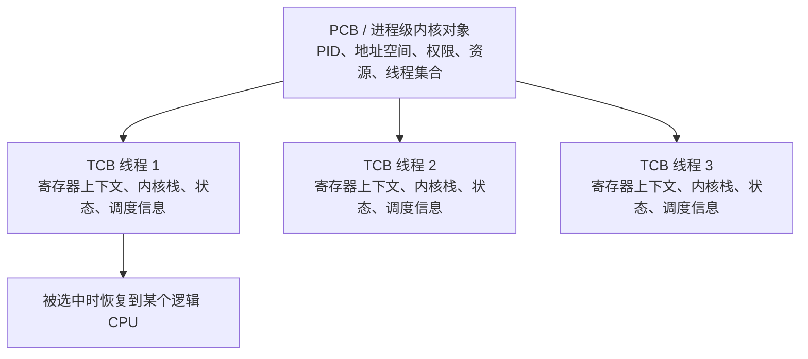

简化记忆：

- **PID**：进程的编号；
- **PCB**：内核管理进程资源的“档案”；
- **TCB**：内核管理某条执行流的“档案”；
- **寄存器上下文**：CPU 要想从该线程上次停止的执行位置继续所需的关键现场。

当前线程运行时，数值位于 CPU 的真实寄存器中；线程暂停后，需要保留的寄存器值会被保存到线程相关的内核记录里。不能把“CPU 中正在使用的寄存器”和“内核里保存的寄存器副本”当成同一个位置。

> **一句话记忆：PID 用来找档案，PCB 管整个进程，TCB 保存每条线程的执行书签。**

---

## 7. CPU 如何进行上下文切换

先把一次切换放慢来看。假设 CPU 此刻正在运行线程 A：

```text
1. 线程 A 正在运行：PC=120，R0=32，SP 指向 A 的线程栈。
2. 定时器中断到来，CPU 转入内核的受控入口。
3. 内核保存 A 的 PC、R0、SP 等继续执行所需的状态。
4. 调度器从可运行线程中选择线程 B。
5. 内核把 B 上次保存的 PC、寄存器和栈指针恢复到 CPU。
6. CPU 从 B 上次停下的位置继续执行。
```

以后再次选择 A 时，只要把 A 保存的状态装回 CPU，A 就能继续执行。整个过程不需要复制 A 或 B 的全部进程内存。

> **一句话记忆：上下文切换就是收好 A 的书签和草稿，再拿出 B 的书签和草稿。**

### 7.1 先纠正一句常见说法

“CPU 在进程之间切换”是入门说法。更准确地说：**操作系统调度器通常在可运行线程之间切换。**

- 若下一线程属于同一进程，主要是线程上下文切换；地址空间通常无需改变。
- 若下一线程属于另一个进程，除了线程上下文，还通常需要切换到另一个地址空间的页表根或等效状态。

<details>
<summary>更准确一点（首轮可跳过）</summary>

- 某些架构会使用地址转换缓存（TLB）等机制减少重复查页表的开销；具体细节依 CPU 和操作系统而异。

</details>

### 7.2 为什么会触发切换

切换不是每条指令后都发生。常见触发点包括：

- 定时器到期或周期性时钟中断：内核获得重新评估时间片和抢占的机会；
- 线程主动让出 CPU；
- 线程等待磁盘、网络、锁或其他事件，暂时不能继续运行；
- 更高优先级线程变为可运行；
- 当前线程退出；
- 某些异常、系统调用返回或 CPU 空闲时的调度决策。

硬件提供中断、异常、特权级切换等机制；“选择谁运行”通常是操作系统调度器的策略，不是 CPU 自己凭空决定的。

### 7.3 一个典型的概念流程

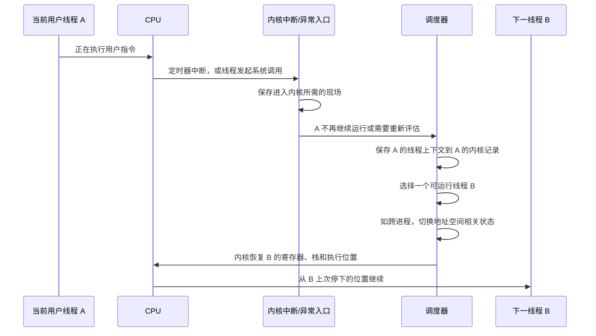

### 7.4 通常需要保存什么

首轮先抓住一句话：凡是“不保存就无法从原位置正确继续”的关键执行状态，都需要在适当时机保存。概念上通常包括：

| 类别 | 例子 | 为什么需要 |
| --- | --- | --- |
| 控制流位置 | 程序计数器 / 指令指针 | 恢复后要知道从哪条指令继续 |
| 通用寄存器 | 计算中的整数、地址、参数 | 否则切换后中间计算会丢失 |
| 栈相关状态 | 栈指针、必要时帧指针 | 恢复函数调用链和局部状态 |
| 条件码和状态 | 标志寄存器、部分控制状态 | 条件分支与架构执行状态必须连贯 |
| 浮点/向量状态 | 浮点寄存器、一次处理多个数据的向量寄存器（SIMD）等 | 科学计算、多媒体等程序可能正在使用 |
| 地址空间状态 | 页表根指针或等效结构 | 跨进程时需要让虚拟地址翻译切换到正确空间 |
| 内核执行状态 | 内核栈、抢占/中断相关状态 | 内核自身也要能安全返回和继续管理线程 |

<details>
<summary>更准确一点（首轮可跳过）</summary>

准确保存哪些字段，取决于 CPU 架构、应用二进制接口约定（ABI）、进入内核的方式和操作系统实现。中断或异常发生时，硬件可能先自动保存一部分最基本的返回状态，内核入口代码再保存其余需要的状态。

上下文切换成本不只来自“复制几个寄存器”：它还可能影响缓存、TLB、分支预测和调度延迟。因此操作系统通常避免无意义的频繁切换，并按系统目标权衡开销、响应性、公平性或实时期限。

</details>

### 7.5 切换后为什么能“接着执行”

假设线程 A 在执行到某个 `ADD` 前被抢占：

1. 内核把 A 的指令指针、寄存器、栈指针等保存起来；
2. A 暂时不运行，CPU 去执行 B；
3. 以后调度器再次选择 A；
4. 内核把保存的架构状态恢复到 CPU；
5. 从 A 保存的下一条指令位置返回；
6. 对 A 而言，仿佛只是“停顿了一下又继续”。

这种连续感是操作系统通过保存/恢复状态制造的抽象，而不是 CPU 同时保留无限多套寄存器。

---

## 8. CPU 如何参与安全性与“执行正确性”

### 8.1 CPU 能保证什么，不能保证什么

先把“安全”和“正确”拆成两个问题：

- **能不能碰这块内存？** 如果进程 A 试图写进进程 B 没有授权给它的内存，地址映射和权限检查通常会失败，CPU 转入异常处理。
- **算出来的金额对不对？** 如果进程 A 在自己的合法内存里，把“余额减去转账金额”写成了错误公式，CPU 仍会按照指令准确计算。CPU 不理解“余额”和“转账”是什么意思。

正式地说，CPU 能根据架构规则执行指令，并提供特权级、地址翻译、页权限和异常等硬件机制；但它**不能单独保证程序的业务逻辑正确、算法正确或没有漏洞**。

> **一句话记忆：CPU 和操作系统主要检查“能不能做”，程序设计负责保证“做得对不对”。**

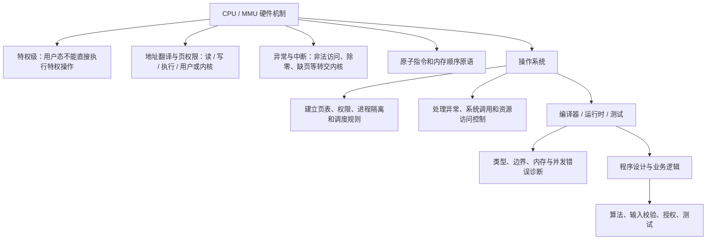

### 8.2 CPU 提供的主要保护能力

| 硬件能力 | 作用 | 典型效果 |
| --- | --- | --- |
| 特权级 / 用户态与内核态 | 限制普通程序直接控制硬件或修改关键状态 | 用户程序不能随意修改页表、关闭中断或直接操作任意设备 |
| MMU 与页表 | 翻译虚拟地址并检查映射是否存在 | 访问未映射地址会产生异常而不是任意读写 |
| 页权限 | 区分读、写、执行和用户/内核访问权限 | 数据页可禁止执行，代码页可禁止写入 |
| 不可执行页保护（常见名称 NX / DEP） | 阻止从标记为数据的内存页直接取指执行 | 降低某些数据注入后直接执行的风险 |
| 异常机制 | 把非法指令、权限错误、缺页等转交受控入口 | 内核可终止进程、补页或报告错误 |
| 原子读改写指令 | 为锁等同步工具提供基础 | 多线程更新共享状态时可构建正确同步 |
| 缓存一致性和内存顺序机制 | 支持多核之间按架构规则观察内存更新 | 仍需要程序使用正确的原子操作和同步协议 |

### 8.3 “安全”与“正确”分别在哪一层

- **内存隔离安全**：CPU/MMU 和 OS 让进程 A 通常不能直接破坏进程 B 的内存。
- **资源访问安全**：OS 根据进程身份、权限和句柄规则决定能否打开文件、使用设备等。
- **内存安全**：语言、编译器、运行时和程序写法共同决定；C 的越界风险、Rust 安全代码的约束、Python/JavaScript 的运行时检查都不同。
- **并发正确性**：硬件原子原语只是基础，还需要锁、原子变量、消息传递或其他正确协议。
- **业务正确性**：最终由算法、需求、输入验证、测试和人工设计保证。

因此不要把“CPU 有保护模式”理解成“所有程序自动安全且正确”。

本节只是先指出硬件保护的边界；[第 3 章](03-mmu-privilege-modes-interrupts-and-apis.md)会用“编辑器按 Ctrl+S 保存文件”的过程，拆开 MMU、模式位、系统调用、同步异常和外部硬件中断分别在做什么。

---

## 9. 什么是 CPU 并发，它如何运作

先想象只有一个服务窗口，却有 A、B、C 三个人要办事：窗口先处理 A 一会儿，A 等资料时转去处理 B，再回来继续 A。三件事都在一段时间内向前推进，但窗口在某一个瞬间仍只服务一个人。这就是理解单个逻辑 CPU 并发的第一幅画面。

```text
0～5 ms：线程 A 在 CPU 上运行
定时器中断：保存 A 的状态
5～10 ms：线程 B 在 CPU 上运行
B 等待磁盘：进入阻塞状态
随后：调度器再次选择 A，恢复 A 的状态
```

这里的时间只用于演示，不代表真实系统固定使用这个时间片。整个机制需要几方配合：CPU 执行指令并响应中断，定时器提供重新调度的机会，内核调度器选择可运行线程，操作系统保存和恢复线程上下文。

如果有两个服务窗口，A 和 B 才可能在同一时刻分别办理；对应到电脑，就是不同逻辑 CPU 同时执行不同线程。

> **一句话记忆：并发是多个任务在同一段时间内交错推进，一个逻辑 CPU 通过切换也能做到；并行才是多个任务在同一时刻真正执行。**

### 9.1 并发和并行不是同义词

| 概念 | 含义 | 一个逻辑 CPU 上是否可能 | 多个逻辑 CPU 上是否可能 |
| --- | --- | --- | --- |
| 并发（concurrency） | 多项任务处于重叠的执行期间，执行步骤可能交错 | 可以，靠快速切换 | 可以 |
| 并行（parallelism） | 多项任务在同一时刻真的同时执行指令 | 通常不可以 | 可以，由不同核心或逻辑 CPU 同时执行 |

一个逻辑 CPU 可以在几十毫秒甚至更短时间片内轮流执行线程 A、B、C。人会感觉它们“同时在运行”，但某一瞬间该逻辑 CPU 通常只执行一个当前线程的指令。

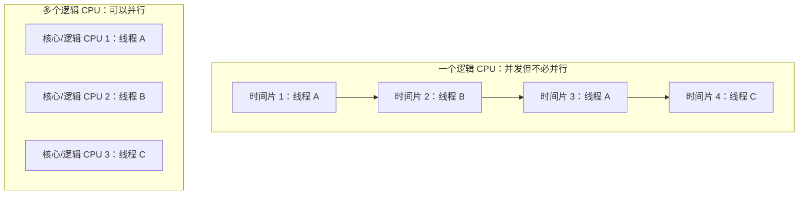

### 9.2 谁在做哪些事

| 参与者 | 主要职责 |
| --- | --- |
| CPU 硬件 | 执行当前线程指令、响应中断/异常、提供定时器、特权、原子指令和内存模型等能力 |
| 内核调度器 | 维护就绪/阻塞状态、优先级和策略，选择下一条可运行线程 |
| 时钟/定时器 | 定期给内核一个重新评估和抢占的机会 |
| 线程 | 可能运行、就绪、阻塞、等待或退出 |
| 同步机制 | 协调多个线程访问共享数据，避免竞态和不一致 |

因此，“CPU 的并发机制”不是 CPU 单独完成的一项功能，而是**硬件中断与定时器、操作系统调度器、线程状态和上下文切换**共同形成的运行方式。

### 9.3 并发不保证正确

考虑两个线程都执行“读取 `counter`、加 1、写回 `counter`”。如果中间交错：

```text
初始 counter = 0
线程 A 读到 0
线程 B 读到 0
线程 A 写回 1
线程 B 写回 1
最终 counter = 1，而不是期望的 2
```

这是“丢失更新”的直觉性竞态示意。`counter++` 在很多语言和硬件上不是天然不可分割的一次动作；需要使用锁、原子加法或其他同步设计。具体同步原语与死锁会在后续问题中展开。

<details>
<summary>更准确一点（首轮可跳过）</summary>

上述时间线假定读写按图中的步骤可观察。若 `counter` 是 C/C++ 的普通非原子对象，这种无同步冲突访问属于数据竞争和未定义行为，结果不限于 `1`；Rust 的安全代码通常要求通过锁、原子类型等方式建立合法的共享可变访问。

</details>

### 9.4 抢占式调度与协作式调度

- **抢占式调度**：定时器中断等机制让 OS 可以暂停当前线程并运行别的线程，普通桌面/服务器 OS 常用。
- **协作式调度**：任务主动让出执行权；若一个任务不让出，其他任务可能被长期阻塞。

<details>
<summary>更准确一点（首轮可跳过）</summary>

现代系统还可能有 SMT（同一物理核心暴露多个逻辑 CPU）、GPU 并行、I/O 异步完成等机制，但它们不改变本章核心：执行交错时，共享状态必须有明确规则。

</details>

---

## 10. 一段源代码怎样被电脑认识

先直接回答你的问题：**CPU 最终执行的总是机器指令，但用户源码不一定被直接翻译成机器码，也不一定先生成一份你能看到的汇编文本。**C 和 Rust 常把源码提前编译成机器码；Python 和 JavaScript 源码通常先由解释器或引擎读取，过程中可能产生字节码或即时编译的机器码，不需要整份源码先变成一个独立的原生可执行文件。

例如，人看到 C 代码中的 `return x + y;`，能理解它是在做加法；CPU 不能直接理解这行字符。典型过程可以先记成：

```text
源代码
→ 编译器理解语法和含义，并生成目标 CPU 的机器指令
→ 链接器把目标代码和所需库组织成可执行文件
→ 操作系统加载可执行文件，建立进程和主线程
→ CPU 取出机器指令并执行
```

汇编语言是机器指令的人类可读写法，例如用 `ADD` 表示某种加法指令。编译工具链可能生成汇编文本再交给汇编器，也可能在内部直接生成目标文件中的机器码，所以你不一定会看到 `.s` 汇编文件。

> **一句话记忆：源码写给人和语言工具看，机器码才给 CPU 执行；汇编是机器指令的可读表示，不是必定可见的一站。**

### 10.1 C / Rust 的典型路径

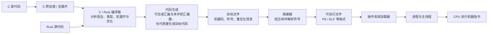

<details>
<summary>更准确一点（首轮可跳过）</summary>

“先变成汇编，再变成二进制”是一个有用的入门模型，但现实通常更复杂：

- 编译器可能先产生内部 IR（中间表示），再生成机器码；
- 生成汇编文本和运行汇编器可能由同一个编译工具链在后台完成，用户不一定看到 `.s` 文件；
- 目标文件不等于可直接启动的程序，它还含符号、重定位和分段/节等信息；
- 链接器把多个目标文件和库组合为可执行文件；
- 可执行文件不是“裸二进制指令列表”，还包含格式头、加载信息、数据、重定位和可能的资源；
- 操作系统加载后，CPU 才从指定入口开始执行其中的机器指令。

</details>

### 10.2 一个极小例子

源代码：

```c
int add(int x, int y) {
    return x + y;
}
```

编译器可能把“取两个参数、相加、返回结果”翻译成某种架构的机器指令序列。该序列不一定长得像截图中的 `LOAD/ADD/STORE`，因为真实架构有自己的寄存器名字、调用约定、指令长度和优化策略。

<details>
<summary>更准确一点（首轮可跳过）</summary>

例如，优化器可能直接在寄存器中完成加法，不需要把中间结果写到内存；也可能把小函数内联到调用点，最终甚至没有独立的 `add` 函数机器代码。

</details>

### 10.3 Python 和 JavaScript 的常见路径


Python 和 JavaScript 源码通常不会像 C/Rust 那样直接被操作系统作为原生进程映像加载：

- OS 先启动 Python 解释器、Node.js 或浏览器等原生程序；
- 运行时读取用户源码，可能生成字节码或即时编译后的机器码；
- CPU 始终只理解机器指令，不直接理解 `print()`、`function` 或 Python 缩进；
- “解释”“字节码”“JIT”可以同时出现在同一实现中，不能简单二分。

> **一句话记忆：运行 Python 或 JavaScript 时，CPU 执行的是解释器、运行时或 JIT 生成的机器指令，不是直接“看懂”源码。**

### 10.4 汇编、机器码与二进制的关系

| 层次 | 面向谁 | 例子 | 关系 |
| --- | --- | --- | --- |
| 源代码 | 人和语言工具 | C、Rust、Python、JavaScript | 表达算法和语言语义 |
| 汇编语言 | 人和汇编器 | `ADD R0, R1` | 用助记符表示某 ISA 的机器指令 |
| 机器码 | CPU | 指令编码的比特模式 | CPU 按指令集规则取指、译码和执行 |
| 二进制文件 | OS、加载器、工具 | `.exe`、ELF、目标文件 | 包含机器码，也包含元数据、数据和装载信息 |

“二进制”广义上只是以字节/比特保存的数据格式，不是所有二进制内容都是 CPU 指令。图片、音频、压缩包和数据库也都是二进制数据。

---

## 11. 把 Q002 的概念连回整个系统

先只串起三条主线：

1. 源代码由编译器、解释器或运行时处理，CPU 最终执行机器指令；
2. 进程提供地址空间和资源，线程保存一条执行路线的进度；
3. 调度器选择线程，操作系统保存和恢复状态，逻辑 CPU 才能在多个线程之间切换。

> **全章主线：代码告诉 CPU 怎样做，线程状态告诉它从哪里继续，进程地址空间决定它正在使用哪一份内存。**

<details>
<summary>完整关系图（理解上面三条主线后再展开）</summary>

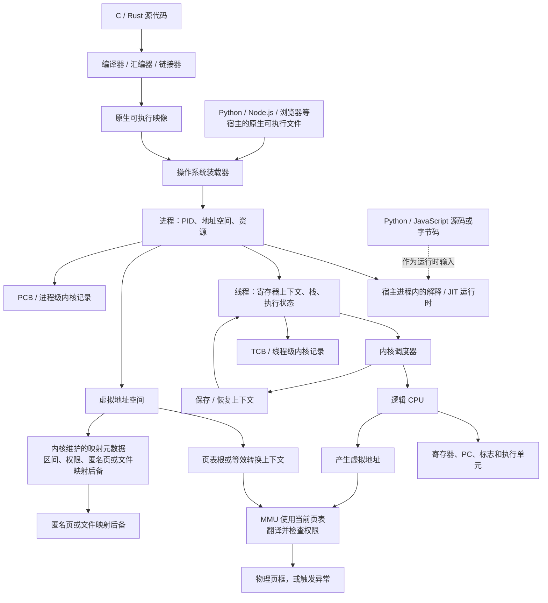

这张图的关键关系是：

1. C/Rust 工具链产生原生可执行映像，操作系统装载它后建立进程；Python/JavaScript 源码或字节码则是已经启动的解释器、Node.js 或浏览器宿主进程的运行时输入；
2. 进程提供资源和地址空间；线程提供正在运行的执行流；
3. CPU 执行当前线程的寄存器状态，并产生虚拟地址；内核在切换时装入正确的页表根或等效转换上下文，MMU 据此翻译并检查权限；
4. 内核维护的虚拟内存映射元数据记录区域、权限和匿名页或文件映射后备；MMU 不直接“查询文件后备”。发生缺页等异常后，内核才会据这些元数据处理；
5. 内核记录 PCB/TCB，并在需要时保存一个线程、恢复另一个线程；
6. 并发来自多个线程在时间上交错或多个逻辑 CPU 上并行执行，正确性仍取决于同步和程序设计。

</details>

---

## 12. 常见误区速查

| 容易说错的话 | 更准确的说法 |
| --- | --- |
| 相同指令一定产生相同结果 | 结果还取决于寄存器、内存、输入、地址空间和执行时序等运行状态 |
| 截图中两段是完全相同的机器码 | 操作码结构相同，但立即数不同，机器码通常也不同 |
| PID 就是 PCB | PID 是编号；PCB 是内核维护的进程管理记录 |
| PCB 就是 CPU 的寄存器 | PCB 可指向或包含调度/线程信息；被保存和恢复的执行现场主要属于线程上下文 |
| CPU 自己决定运行哪个程序 | CPU 提供中断和执行机制；内核调度器按策略选择可运行线程 |
| 上下文切换就是把整个进程内存复制一遍 | 通常保存/恢复的是执行上下文；跨进程时切换地址空间相关状态，不会复制整个进程 RAM |
| 每次中断都会导致进程切换 | 中断进入内核后，内核可能返回原线程，也可能调度另一个线程 |
| 地址空间就是一大块真实 RAM | 地址空间是虚拟地址、映射和权限的集合，物理页可按需存在 |
| CPU 能保证业务逻辑正确 | CPU 只能按架构执行指令和检查硬件权限；算法、输入和业务规则仍可能错 |
| 并发就是多个任务真的同时执行 | 一个逻辑 CPU 可通过时间片并发；真正同时执行叫并行，通常需要多个逻辑 CPU |
| 汇编就是二进制 | 汇编是人可读助记符；机器码是对应的二进制指令编码 |
| 所有二进制文件都能被 CPU 当指令执行 | 可执行文件、图片和压缩包都是二进制，但只有被正确加载且有执行权限的机器码才会被取指执行 |

---

## 13. 情境自测

### 题目

1. 截图上半段和下半段分别会把什么值写进 `a`？为什么？
2. 两个进程映射同一份只读 `ADD R0, R1` 代码页，为什么结果仍可不同？至少列出四类运行状态来源。
3. 什么时候两个不同执行流可能真的写到同一个 `[a]`？此时会出现什么新问题？
4. `PC`/指令指针和教学模型中的 `IR` 分别保存什么？
5. 为什么说“寄存器属于当前正在 CPU 上运行的线程状态”，而不是每个进程在硬件中永久占一组寄存器？
6. PID、PCB、TCB 分别是什么？哪一个更接近“进程编号”，哪一个更接近“线程执行现场的内核记录”？
7. 定时器中断到来时，内核一定会切换到另一个进程吗？
8. 跨进程上下文切换与同一进程内线程切换，最大的额外区别通常是什么？
9. CPU/MMU 能阻止哪些类型的非法内存访问？为什么仍不能保证转账程序的金额计算正确？
10. 只有一个逻辑 CPU 的系统能否有多个浏览器标签页“并发运行”？它们是否必然并行？
11. 为什么 `counter++` 在两个线程中可能最终只加了一次？
12. C/Rust 从源码到 CPU 执行，通常经过哪些主要阶段？
13. 运行 `python demo.py` 时，CPU 直接理解的是 Python 源代码吗？
14. 为什么 `.exe` 不是“只有一串 CPU 指令”的文件？

<details>
<summary>展开参考答案</summary>

1. 上半段：`R0=12`、`R1=20`，相加后 `R0=32`，保存得到 `a=32`。下半段：`R0=100`、`R1=35`，保存得到 `a=135`。两段操作模式相同，但立即数不同。
2. 可列出寄存器初值、可写内存内容、虚拟地址映射、命令行参数/环境变量、文件或网络输入、系统调用结果、时间/随机数、与其他线程的交错顺序等。代码只是规则，状态才是本次计算的具体输入。
3. 同一进程的多个线程、显式共享内存的多个进程或共享映射文件都可能访问同一个对象。此时会有竞态和一致性问题，需要锁、原子操作或其他同步协议。
4. PC/指令指针给出下一条将执行的指令地址；教学 IR 表示当前取出并正在译码/执行的指令内容。现代 CPU 的 IR 往往不是一个可直接访问的单一架构寄存器。
5. 一个逻辑 CPU 同一时刻执行一个当前线程的架构状态。操作系统切换时把旧线程状态保存到内核记录，把新线程状态恢复到 CPU，所以每个线程看起来都有连续的寄存器状态。
6. PID 是进程编号；PCB 是进程级内核管理记录；TCB 是线程级内核管理记录。TCB 更接近保存/关联线程执行现场的记录。
7. 不一定。中断先让 CPU 进入内核；内核可能处理完后继续返回原线程，也可能因为时间片、优先级或阻塞条件选择别的线程。
8. 跨进程通常还要切换地址空间相关状态，例如页表根或等效映射上下文；同进程线程一般共享地址空间。
9. 页表和权限可阻止未映射、无写权限、无执行权限或用户态无权访问的地址等。金额计算是否符合业务规则属于算法、输入和应用逻辑层面，CPU 不理解“转账是否正确”。
10. 可以。只有一个逻辑 CPU 的系统可以在各线程之间快速切换，所以它们并发推进；除非存在多个逻辑 CPU，否则一般不会在同一瞬间真正并行执行用户指令。
11. 自增常包含读、加、写多个步骤。两个线程都先读到旧值，再分别写回相同新值时，一个更新被覆盖。需要原子加法或锁。
12. 典型路径是源码 →（C 可能先预处理）→ 编译器/IR → 汇编器和目标文件 → 链接器 → PE/ELF 等可执行文件 → OS 加载器 → 进程/线程 → CPU 执行机器指令。
13. 不直接理解。CPU 执行的是 Python 解释器本身的机器指令，以及可能由 JIT 产生的机器指令；解释器负责读取和执行 Python 源码或字节码。
14. `.exe` 等可执行文件通常还包含文件格式头、节/段信息、数据、导入导出、重定位和装载所需元数据。操作系统和加载器据此建立进程映像。

</details>

## 14. 下一步怎样复习

1. 自己手算截图两段指令，画出每一步的 `R0`、`R1` 和 `a`。
2. 不看正文，画出“线程 A 被定时器抢占、保存现场、线程 B 恢复现场”的时序图。
3. 用一句话分别定义 PID、PCB、TCB、寄存器、地址空间和上下文切换。
4. 举一个“硬件权限正确但业务结果错误”的例子，确认自己理解安全和正确不是同一层。
5. 比较一个逻辑 CPU 上的并发和多个逻辑 CPU 上的并行，并解释为什么共享计数器需要同步。
6. 完成后更新 [Q002 的复习记录](../questions/README.md#q002-后续复习记录)。

与本章相连但尚未详细展开的主题包括：具体调度算法、同步原语、死锁、页表与地址转换缓存（TLB）、缓存一致性、内存顺序、异常处理和系统调用的应用二进制接口约定（ABI）。
