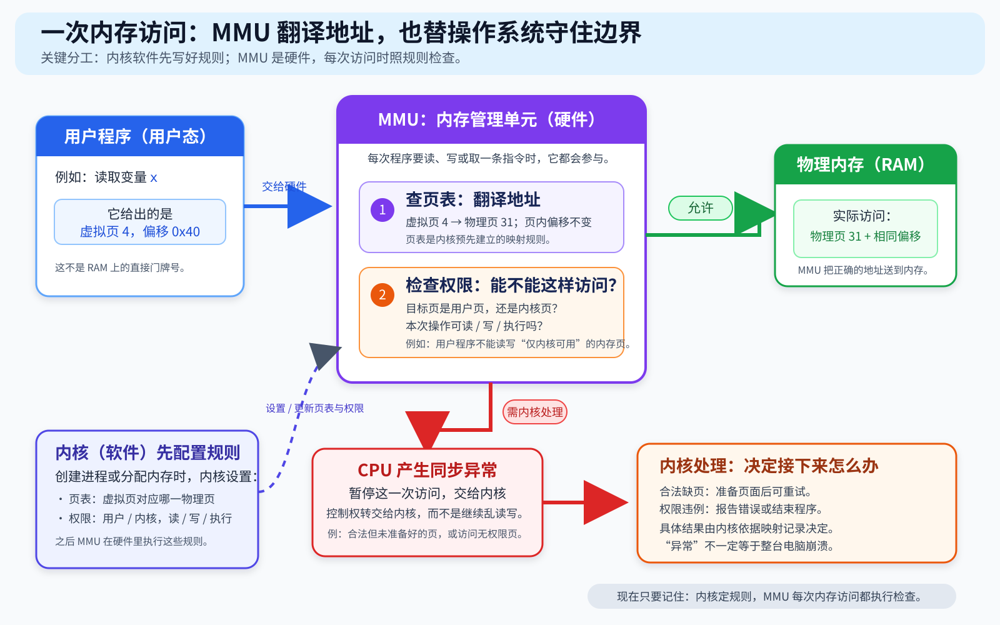
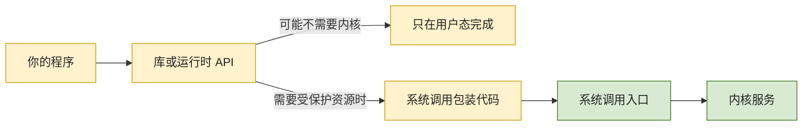
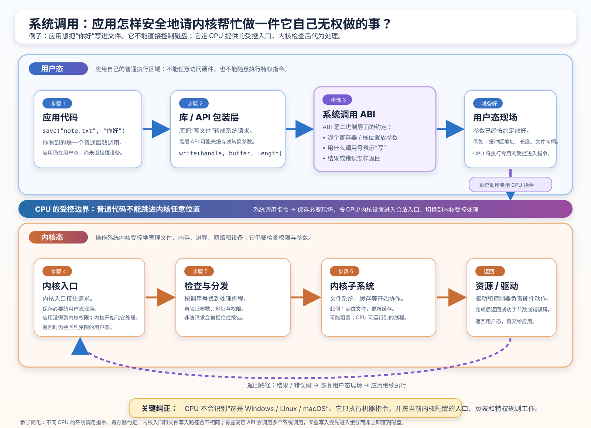
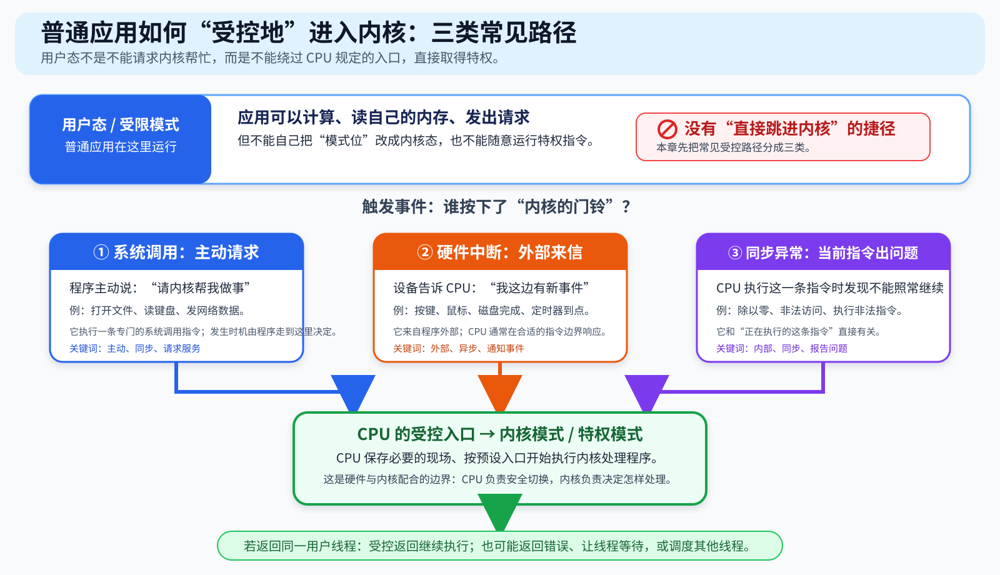
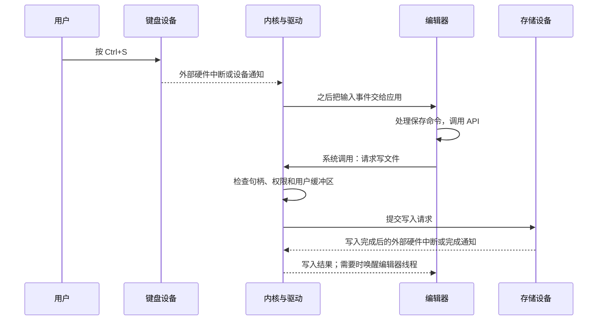
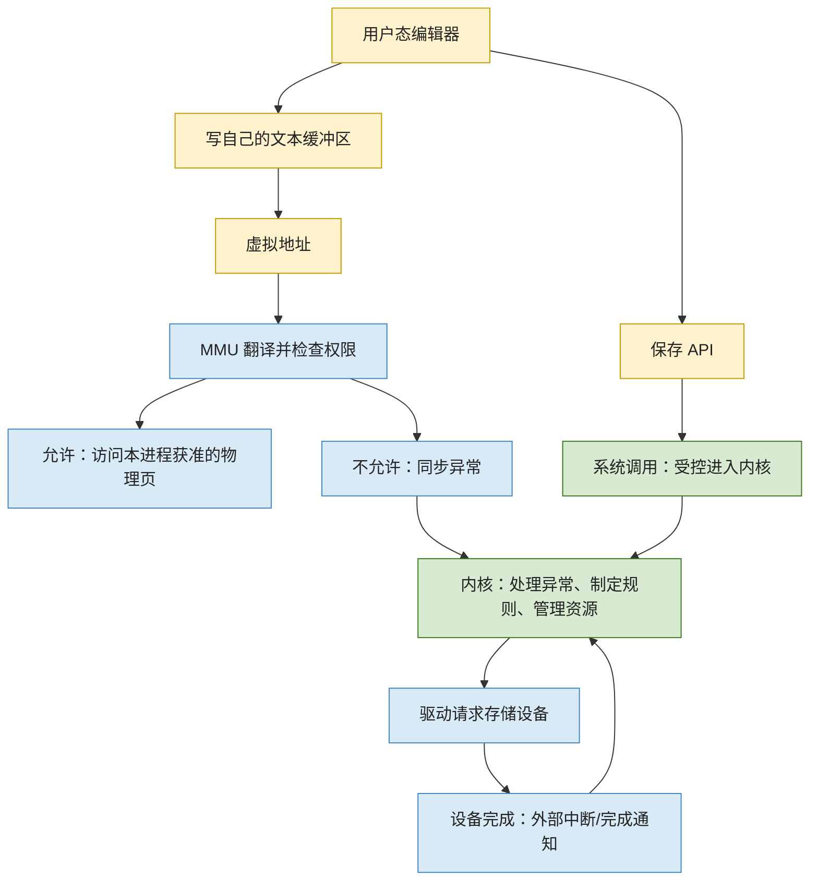

# 第 3 章：MMU、特权模式、中断与系统调用

[返回仓库首页](../README.md) · [查看知识地图](00-operating-system-knowledge-map.md) · [问题 Q003](../questions/README.md#q003mmu特权模式中断与-api) · [Q007 的中断现场慢动作](../questions/README.md#q007cpu-上下文切换中断现场与寄存器组) · [上一章：CPU、上下文与指令](02-cpu-context-registers-and-instructions.md)

> 本章来自 Q003。目标不是背一串名词，而是能把“按键、修改文本、点击保存”这件小事，在脑中慢慢演出来。

## 1. 先直接回答：这几个词到底在说什么

你这次问的七个问题，其实都在解释同一件事：

> **普通程序为什么能做自己的事，却不能随便读取别的程序、改内核、直接命令硬盘；当它确实需要这些能力时，又怎样安全地请操作系统帮忙？**

先给最短答案：

- **MMU（Memory Management Unit，内存管理单元）**是处理器里的硬件。它把程序使用的虚拟地址翻译成真正的物理内存位置，并检查这次读、写或执行是否允许。
- **用户模式 / 用户态 / 受限模式**是普通应用运行时的受限制状态。这里的“受限”通常就是“用户态”，不是第三个固定模式。
- **内核模式 / 内核态 / 特权模式**是操作系统内核处理敏感事情时的高权限状态。普通程序不能把自己随意变成内核代码。
- **系统调用**是普通程序从规定入口请求内核服务的方式，例如打开文件、读写文件、创建线程。
- **中断**在狭义上是键盘、定时器、磁盘等外部设备发来的异步通知；除零、缺页等由当前指令引起的情况更准确叫同步异常。它们都会让 CPU 按规定进入内核，但触发原因不同。
- **API**是“怎样使用某项功能”的软件约定；它不等于系统调用，也不自动拥有权限。
- **模式位**是教材对“CPU 当前处于哪一级权限”的简化说法。真实 CPU 往往用受保护的状态字段表示它，而不是让应用随手改一个普通变量。

本章会一直使用这个场景：

> 你正在用编辑器修改 note.txt。你按下键盘，编辑器改自己的文本缓冲区；随后按 Ctrl+S 保存。
> 前半段主要是编辑器在自己的内存里工作；后半段需要通过内核和驱动请求存储设备。

## 2. 先看整条故事线：一次保存不是“一次中断”

先不要急着记术语。把 Ctrl+S 想成一次接力：

这张图最重要的不是箭头数量，而是分清三件事：

1. **按键**是外部设备事件；设备可能用硬件中断提醒内核。
2. **保存 API**是编辑器代码主动调用的一个软件接口；它最后可能需要系统调用。
3. **磁盘写完**又是外部设备完成工作后的事件；设备通常再次通知内核。

因此，“我按了保存，所以发生了一次中断”说得太粗。更准确的说法是：**一次保存通常会经过输入事件、应用逻辑、API、系统调用、设备 I/O 和完成中断等多个阶段。**

| 时刻 | 谁在做事 | 当前是在做什么 | 是否必然切换到另一线程 |
| --- | --- | --- | --- |
| 你按键 | 键盘和输入设备 | 产生输入事件，可能请求硬件中断 | 不必然 |
| 编辑器收到命令 | 用户态编辑器 | 修改自己的状态，决定保存 | 不必然 |
| 编辑器请求写文件 | 用户态代码和 CPU | 通过系统调用进入内核 | 不必然 |
| 内核提交 I/O | 内核、文件系统、驱动 | 检查请求，安排设备工作 | 编辑器可能等待，但不绝对 |
| 设备完成 | 存储设备和内核 | 外部中断通知完成 | 不必然 |
| 内核返回结果 | 内核和编辑器 | 编辑器得到成功或失败结果 | 不必然 |

> **现在只要记住：进入内核，不等于一定换进程；“中断”也不是所有进入内核动作的统称。**

## 3. MMU：地址翻译员，也是每次访问内存时的门卫

### 3.1 它是不是“内存管理单元”？

**是。MMU 的英文全称是 Memory Management Unit，通常译为内存管理单元。**

但这里最容易误会的一点是：MMU 不是操作系统中的一个软件程序，也不是一张页表。它是 CPU 核心或处理器系统中的硬件机制。

你可以先把它想成两个角色合在一起：

- **地址翻译员**：编辑器说“我要访问自己的地址 0x1234”，MMU 要找出这对应哪块物理内存。
- **门卫**：它还会检查“当前是用户态吗？这页允许读、写、执行吗？这个地址存在吗？”

图中从左到右观察：

1. 黄色的编辑器只拿到一个**虚拟地址**；它不需要、也通常不知道真正的 RAM 在哪里。
2. 绿色的内核事先准备“地址地图”和权限规则。这个地址地图的常见名称是**页表**。
3. 蓝色的 MMU 每次遇到访存或取指，就按当前规则翻译并检查。
4. 允许时，CPU 才访问对应物理页；当前没有可用物理映射或权限不允许时，CPU 产生一个同步异常，转到内核预先设置好的处理入口。

这也连接了前两章：

- [第 1 章](01-from-program-to-process.md#5-典型进程虚拟地址空间)已经说明，每个进程看到的是自己的虚拟地址空间；
- [第 2 章](02-cpu-context-registers-and-instructions.md#5-什么是进程的地址空间)已经说明，跨进程切换时通常还要切换地址空间相关状态；
- 本章补上的问题是：**谁在执行地址翻译和权限检查？答案是 MMU；谁设置规则并处理失败？答案是内核。**

### 3.2 编辑器改“自己的文本”时，慢动作发生了什么

假设编辑器要把一个新字符写进自己的文本缓冲区。教学上把该位置叫作虚拟地址 0x1234：

| 慢动作 | 谁做什么 | 结果 |
| --- | --- | --- |
| 1 | 编辑器线程在用户态执行一条普通写内存指令 | 指令给出虚拟地址 0x1234 |
| 2 | MMU 查看当前进程对应的地址翻译规则 | 找到该虚拟页的映射和权限，或发现没有可用映射 |
| 3 | MMU 检查用户态是否有写权限 | 允许时，写入对应物理 RAM |
| 4 | 页面尚未准备好，或权限不允许 | CPU 产生同步异常，进入内核的异常处理入口 |
| 5 | 内核判断原因 | 合法的按需调页可能补好页面后重试；非法访问通常会让该程序收到错误或被终止 |

这里有三个明确分工：

| 对象 | 它负责什么 | 它不负责什么 |
| --- | --- | --- |
| MMU / CPU 硬件 | 地址翻译、读写执行权限检查、用户/内核权限检查、触发异常 | 不理解“这是编辑器”，不决定磁盘文件怎样读 |
| 操作系统内核 | 建立或修改页表、设定权限、决定缺页怎样处理 | 不能自动判断应用算法是否正确 |
| 编辑器程序 | 提出正常的读写请求，处理自己的文本逻辑 | 不能越过 MMU 去随意修改别的进程或内核内存 |

**MMU 不会亲自把数据从磁盘读进来。**当它发现某次访问需要内核处理时，它和 CPU 负责把事情报告给内核；内核才根据自己的记录决定补页、报错或终止进程。

> **现在只要记住：操作系统负责制定并安装地址规则；MMU 负责在 CPU 每次访问内存时执行这些规则。**

更准确一点：页表、地址转换缓存和适用范围

页表通常存放在内存中，包含“虚拟页对应哪个物理页、是否存在、读写执行和用户/内核权限”等信息。CPU 会用受保护的控制状态选择当前地址空间的页表根或等效转换上下文；MMU 常用地址转换缓存加速重复查询。

这是一台运行现代通用操作系统、并具备虚拟内存硬件的计算机的典型模型。某些小型嵌入式处理器没有完整 MMU，或采用不同保护机制；不要把本节当成所有 CPU 的绝对结构图。

## 4. 硬件与软件怎样配合，为什么普通程序不能直接操作硬盘

一句话先说清：

> **硬件提供“强制门禁”，内核制定和安装规则，应用程序只能通过规定接口申请服务。**

没有硬件门禁，恶意或出错的程序可以把“不要写这里”当作建议，直接绕过去；没有内核，硬件又不知道哪个用户能打开哪个文件、哪个程序该先运行。

| 层次 | 例子 | 主要做什么 | 不能替代什么 |
| --- | --- | --- | --- |
| 硬件 | CPU、MMU、定时器、设备控制器 | 执行指令、区分权限、检查内存访问、产生和接收中断 | 不理解文件所有者、业务规则或“这笔账算得对不对” |
| 内核与驱动 | 页表、文件系统、键盘/磁盘驱动、调度器 | 配置硬件、检查请求、管理文件和设备、处理异常与中断 | 不能自动消除内核或驱动自己的漏洞 |
| 用户程序与运行时 | 编辑器、浏览器、C/Rust/Python/JavaScript 运行时 | 实现功能、处理界面、调用 API、验证业务数据 | 不能直接绕过硬件和内核的权限边界 |

### 4.1 为什么编辑器不能直接“对硬盘发命令”

假设任何普通程序都能直接改磁盘控制器：

- 两个程序可能同时下矛盾命令，数据很容易损坏；
- 一个恶意程序可以读走别人的文件；
- 一个错误指针可能把设备配置写坏，导致整台机器异常。

所以普通程序通常不能直接执行“改页表、关闭关键中断、配置任意设备控制器”等特权操作。它应当向内核提出请求，例如“把这段数据写到我已经打开的文件中”。

内核不会因为程序“说自己有权限”就相信它。一个典型检查过程是：

1. 内核先确认文件句柄或文件描述符是否有效；
2. 再检查该进程或用户是否有相应文件权限；
3. 再检查用户传入的内存缓冲区是否是可以安全读取的地址；
4. 之后才交给文件系统和存储驱动；
5. 驱动按设备协议提交请求，设备完成后把结果交回内核。

这就是软件和硬件的巧妙配合：**硬件保证普通应用难以越权；内核把“谁可以做什么”的高层规则变成具体检查和设备操作。**

### 4.2 “安全”和“执行正确”不是同一个层次

CPU 与 MMU 能帮你守住一些边界，但它们不能读懂业务含义。

| 事情 | 谁主要负责 | 举例 |
| --- | --- | --- |
| 进程 A 不应直接读写进程 B 的受保护内存 | MMU、特权级和内核 | A 访问 B 的地址时被拦住 |
| 普通应用不应直接控制任意硬盘设备 | 特权级、内核和驱动 | 应用通过文件接口申请写入 |
| 程序不能越界写坏自己的数组 | 语言、编译器、运行时和程序写法共同负责 | C 可能写坏自己有权访问的内存；安全 Rust 会增加约束 |
| 转账金额是否计算正确 | 应用算法、输入验证、测试和业务规则 | 10 + 20 被程序误算成 40，MMU 不会知道 |

因此，“CPU 有保护机制”不等于“程序不会出错”。它主要保护**机器资源边界**，而不是保证所有计算和业务逻辑都正确。

更准确一点：设备也可能直接访问内存

许多设备会通过 DMA 直接读写内存，以免 CPU 一字节一字节搬运数据。普通 MMU 主要约束 CPU 发出的访问；完整的设备内存隔离还可能需要 IOMMU、正确的驱动配置和设备本身的可靠实现。本章只建立“CPU 访问内存时由 MMU 检查”的主线，不提前展开设备隔离。

> **现在只要记住：硬件负责强制执行底线，操作系统负责权限策略和资源管理，应用自己的算法仍要自己写对。**

## 5. 什么是接口？什么是 API？为什么它不等于系统调用

### 5.1 先说“接口”

接口就是**双方事先约定怎样合作**。

例如插头的形状和电压是硬件接口；你调用一个函数时，函数名、参数、返回值和它承诺做什么，是软件接口。

API 是 Application Programming Interface，译为**应用程序编程接口**。它是给程序使用的接口约定。你可以把它理解成一张菜单：

- 菜单告诉你可以点什么、怎么点、会得到什么；
- 菜单本身不会替你打开后厨的门；
- 厨房也仍会检查订单是否合理。

对应到电脑：

| 名词 | 大白话 | 例子 |
| --- | --- | --- |
| 接口 | 两个对象约定怎样交流 | 函数参数、网络协议、硬件插头 |
| API | 给程序调用功能的约定 | 编辑器的保存函数、文件库函数、图形库函数 |
| 系统调用 | 用户态向内核申请受保护服务的专用入口 | 打开、读、写文件；创建进程；发送网络数据 |
| 系统调用指令 | CPU 架构提供的“受控进内核”机制 | 不同架构可有不同指令和入口规则 |

### 5.2 API 和系统调用怎样连接

它们不是同义词。常见关系是：

几个容易想象的例子：

- 求两个数的最大值、把字符串长度算出来，通常只在用户态完成，不需要系统调用。
- 打印一行文字的 API 可能先把文字放入应用缓冲区，暂时也不进入内核。
- 打开文件、真正把数据写到操作系统管理的文件对象，通常最终需要一个或多个系统调用。

所以 API 更像“程序怎样说话的约定”；系统调用是“向内核申请受保护服务”的一类特别接口。

**API 不是安全许可证。**一个程序即使知道打开文件的 API 名字，也不因此获得读取任意文件的权限；内核仍会在系统调用处理中检查它。

更准确一点：API、ABI 和系统调用

API 主要描述源码层面的调用约定，例如函数名、参数和行为。ABI（应用二进制接口）还会规定编译后的机器码怎样传参数、哪些寄存器由谁保存、栈怎样使用等。系统调用接口则是用户态和内核态之间很窄的一道边界；库函数或运行时通常会把更友好的 API 包装成系统调用所需的编号和参数。

> **现在只要记住：API 是约定；系统调用是向内核申请服务的受控入口；知道 API 不等于拥有权限。**

## 6. 特权模式、用户模式、内核模式和模式位

### 6.1 这些名字怎样对应

初学时可以先用经典的“两种状态”模型：

| 说法 | 可以怎样理解 | 普通应用能否直接执行敏感操作 |
| --- | --- | --- |
| 用户模式 / 用户态 / 受限模式 | 普通应用的受限制执行状态 | 通常不能直接改页表、配置任意设备或关闭关键中断 |
| 内核模式 / 内核态 / 特权模式 | 内核处理系统资源的高权限执行状态 | 内核可执行架构允许的特权操作 |

这里的“受限模式”在大多数操作系统教材语境里，就是用户模式的另一种叫法。它**通常不是**和“用户模式、内核模式”并列的第三种基础模式。

另一个非常重要的区分是：

> 管理员账户或 root 权限，不等于 CPU 此刻就在内核模式。
> 管理员启动的编辑器通常仍是用户态程序，也仍要通过系统调用请求内核服务。

### 6.2 用户怎样进入特权模式？能不能操作特权模式？

直接回答：**用户程序不能把自己随手切成内核模式，也不能进入后任意操作特权资源。**

它能做的是执行 CPU 规定的受控入口。例如程序请求打开文件时，用户态包装代码执行专门的系统调用入口机制。接下来是 CPU 和内核做的事：

| 步骤 | 当前谁控制 | 发生什么 |
| --- | --- | --- |
| 1 | 用户态程序 | 准备“我要什么服务”和必要参数 |
| 2 | CPU 硬件 | 执行受控入口，保存必要返回状态，切换到高权限状态 |
| 3 | CPU 硬件 | 跳到内核预先登记的入口，而不是用户挑选的任意内核地址 |
| 4 | 内核代码 | 验证参数、句柄、权限和用户内存地址，决定是否提供服务 |
| 5 | 内核代码与 CPU | 若内核决定返回同一用户线程，就用受控返回机制恢复它的用户态状态 |
| 6 | 用户态程序 | 从系统调用之后继续，得到成功或失败结果 |

用户发出系统调用，不是在“自己操作特权模式”；真正运行在特权模式中的代码是可信的内核入口和内核服务代码。内核也不必批准每个请求。

### 6.3 模式位的本质

教材常把用户态和内核态画成一个“模式位”。这个画法想表达的是：

> **CPU 此刻携带着一份权限状态：它正在执行普通应用代码，还是正在执行高权限内核代码。**

这个状态会影响 CPU 是否允许某些指令、是否允许访问某些内存页、发生事件时应转到哪里。

但它不是应用内存里的一个普通变量：

- 普通程序不能通过给某个变量赋值，把自己变成内核；
- 它属于 CPU 的受保护执行状态，CPU 会强制检查；
- 若事件到来时 CPU 正在执行用户态线程，系统调用、异常或外部中断会按硬件规则保存必要状态、切换到高权限处理入口；
- 若内核决定返回同一用户线程，才通过受控返回恢复这个线程原先保存的用户态状态；若调度了另一线程，则恢复的是被选中线程的状态。

把它类比成“权限状态卡”是有用的，但要记得真实对象是 CPU 状态，而不是贴在程序文件上的一张标签。

> **现在只要记住：模式位不是程序能伪造的通行证，而是 CPU 当前权限状态的教学简化。**

更准确一点：不同 CPU 的名称不同

“模式位”是二模式教学模型。真实机器可能有多级特权状态，也不一定只有一个可见的二进制位：

| 常见架构 | 普通应用常见位置 | 操作系统内核常见位置 |
| --- | --- | --- |
| x86 / x86-64 | Ring 3 | Ring 0 |
| Arm A-profile | EL0 | EL1 |
| RISC-V | U-mode | 常见 Unix-like 系统使用 S-mode |

x86 的 ring、Arm 的 exception level、RISC-V 的 U/S/M 模式在角色上可作类比，但并不是同一套寄存器或可机械对应的实现。虚拟化、固件和安全监控还会用到其他层级，本章不提前展开。

### 6.4 一次系统调用怎样走完整一趟

前面已经知道：用户程序不能自己把权限开关拨到内核态，只能从 CPU 规定的门请求服务。现在把这扇门走慢一点。

假设编辑器要把一段文字写进文件。它先调用一个“保存”函数；这个函数可能在用户态做缓存、编码或格式转换。只有确实需要操作文件、设备或内核管理的缓冲区时，才会走系统调用。因此，**调用 API 不等于必定已经发生一次系统调用。**

这张图由本仓库为 Q006 原创绘制，未使用第三方图片。看图时先抓住三条边界：

1. 左边的应用和库仍在用户态；普通函数调用只是在这里的代码之间跳转。
2. 中间的受控进入指令才跨过用户态与内核态的边界；应用不能把“任意内核地址”当作跳转目标。
3. 右边的内核仍会检查请求。进入内核不表示请求自动获准。

#### 先把“填表规则”说清楚

要走这扇门，应用需要把“我要哪项服务、参数在哪里、结果要放在哪里”交给内核。编译后的包装代码和内核之间必须约定怎样交接这些机器级信息。

这套规则正式叫作**系统调用 ABI**。这里先把 ABI 理解成“已经编译好的两边怎样递纸条的规则”；它会规定服务编号和参数通常放在哪些寄存器或内存位置、结果怎样返回等。它不是应用源码里看到的 `save()` 函数名，也不是 CPU 的整套指令规则。关于 API、ABI、可执行文件和 CPU 架构的完整区分，见[第 6 章](06-platforms-abi-executables-and-cpu-architectures.md#4-abi编译后的程序怎样彼此接得上)。

#### 用“读取 txt 文件”慢放一次

| 步骤 | 谁在做 | 现在发生了什么 |
| --- | --- | --- |
| 1 | 用户态应用 | 编辑器调用库函数，例如“从已打开文件读取一段字节”。这仍可能只是普通函数调用。 |
| 2 | 库或运行时包装代码 | 若需要内核服务，它按当前平台的系统调用 ABI 准备服务编号、文件句柄、用户缓冲区地址和长度。 |
| 3 | CPU 硬件 | 当前线程执行架构提供的受控进入指令。x86-64 常见的是 `syscall`；AArch64 常见的是 `svc`。名字不同，作用都是请求按规定入口处理。 |
| 4 | CPU 硬件 | CPU 保存足以回到调用点的必要状态，切到规定的高权限状态，并跳到**当前内核预先设置**的入口。 |
| 5 | 内核入口代码 | 内核保存更多需要的现场，使用自己的内核栈或等效机制，识别这是什么服务请求。 |
| 6 | 内核服务代码 | 内核检查句柄、访问权限、参数长度，以及用户给出的地址是否真是这个进程可以读写的地址。 |
| 7 | 内核、设备与调度器 | 内核取得数据或提交 I/O。若必须等待磁盘、网络或锁，当前线程可以变成阻塞状态；调度器这时可去运行别的线程。 |
| 8 | 内核与 CPU | 内核把读取到的字节数或错误结果交回；受控返回恢复用户态，原线程从系统调用之后继续执行。 |

第 7 步把本章和[第 5 章的阻塞、唤醒与调度](05-multicore-scheduling-and-threads.md#3-轮转调度把就绪队列真的转起来)接了起来：系统调用不只是“跳进去、立刻跳出来”。如果资源还没准备好，线程可能暂停，之后被唤醒再继续。

#### CPU 怎么知道要进哪个操作系统？

最容易误解的一点是：**CPU 不会先判断“这个应用属于 Windows、Linux 还是 macOS”。**它没有“操作系统品牌寄存器”。开机时，固件和引导过程选择并加载了某个内核；该内核随后配置系统调用入口、异常/中断入口、页表等受保护状态。之后 CPU 只是按自己支持的指令集、当前特权级和这些已配置规则工作。

所以，PE、ELF、Mach-O 这些可执行文件格式是操作系统的加载器主要关心的东西；CPU 最终关心的是装入内存后、符合自己指令集的机器指令。这个“谁认识什么”的分工会在[第 6 章第 3 节](06-platforms-abi-executables-and-cpu-architectures.md#3-cpu-不负责判断这个应用属于哪个操作系统)继续展开。

更准确一点：别把这一节的教学流程当成一套固定寄存器表

- 不同操作系统、不同 CPU 架构会使用不同的系统调用编号、参数寄存器、返回约定、入口指令和现场保存细节；同一套寄存器规则不能从 x86-64 直接搬到 Arm64。
- 系统调用是程序主动请求的受控特权切换；它与键盘、网卡等外部设备发来的硬件中断不是同一类触发。部分教材把系统调用归入广义“陷入”讨论，但这里仍单独区分。
- Windows 普通应用应使用文档化的 Windows API，而不应把某一版本内部系统调用编号当作稳定的跨版本接口。
- 文件读取可能命中缓存、异步完成或触发多个内核步骤；表格画的是建立因果关系的典型路径，不是每一次调用的逐指令承诺。

> **现在只要记住：系统调用是“应用按约定递请求 → CPU 从规定门进入 → 内核检查并处理 → 受控返回”的完整来回，不是应用自己取得内核控制权。**

## 7. 怎样理解中断：先把三类常见“进入内核的路”分开

“中断”这个词在不同教材里有广义和狭义用法。为了不混乱，本章采用下面的说法：

- **狭义中断 / 外部硬件中断**：来自键盘、网卡、存储设备、定时器等外部硬件，和当前正在执行哪条用户指令没有直接因果关系。
- **同步异常 / 故障 / 陷入**：由当前正在执行的指令引起，例如除零、无效指令、缺页、访问权限错误。
- **系统调用**：程序故意请求内核服务的受控入口。部分教材会把它放在“软件中断/陷入”一类讨论；这里单独写出，避免把它和键盘中断画成同一件事。

观察这张图时，请抓住两件事：

1. 三条路最后都指向**内核预先设置的入口**，不是用户程序任意跳过去。
2. 它们的区别在开头：程序主动请求、当前指令出了情况、外部设备有事情发生。

### 7.1 用情境把它们分开

| 发生的事 | 真正触发者 | 和当前指令是否同步 | 更准确的名字 | 内核可能做什么 |
| --- | --- | --- | --- | --- |
| 你按下一个键 | 键盘或相关控制器 | 否 | 外部硬件中断或设备事件 | 驱动读取输入，放入输入队列 |
| 编辑器请求写文件 | 用户程序 | 是 | 系统调用 | 检查权限，提交 I/O 请求 |
| 程序执行除零 | 当前 CPU 指令 | 是 | 同步异常 | 报错、终止进程，或让运行时转换为语言异常 |
| 访问暂时没有可用物理映射、或没有权限的地址 | 当前访存指令和 MMU 检查 | 是 | 缺页或访问权限异常 | 可能补页后重试，也可能报告错误 |
| 定时器到期 | 处理器定时器 | 否 | 定时器中断 | 让内核获得重新调度的机会 |
| 磁盘完成写入 | 存储设备或控制器 | 否 | 外部硬件中断 | 标记请求完成，唤醒等待者 |

用户动作与“中断”之间，尤其容易混淆：

| 你看到的用户动作或代码 | 不能简单说成什么 | 更准确的理解 |
| --- | --- | --- |
| 按键 | “用户执行了一条中断指令” | 键盘设备产生事件，设备可能向 CPU 发出外部硬件中断；应用稍后从系统提供的输入队列拿到事件 |
| 点击保存 | “保存就是一次中断” | 应用逻辑决定保存，调用 API；真正请求内核服务的是系统调用；设备完成可能再发外部中断 |
| 普通函数调用、赋值、if 判断 | “每段程序都是中断” | 它们通常只是普通用户态指令 |
| 程序中调用写文件函数 | “一定立刻产生硬件中断” | API 可能先缓冲；需要内核时进行系统调用；设备完成时才可能有外部中断 |

### 7.2 CPU 收到事件后，大概会做什么

不管入口来自系统调用、异常还是外部中断，CPU 和内核需要合作避免“半路乱跳”：

1. CPU 按架构规则保存足以恢复的必要状态；
2. 若事件到来时 CPU 正在执行用户态线程，CPU 切换到规定的高权限状态；若本来已经在内核态，通常保持在内核态处理；
3. CPU 跳到内核预先配置的入口；
4. 内核识别事件类型，保存更多需要的上下文，执行处理代码；
5. 内核可以直接返回原线程，或者在合适时机让调度器选择其他线程；
6. 若内核决定返回同一用户线程，受控返回会恢复它原先的用户态状态；若调度了另一线程，则恢复被选中线程适合继续执行的状态。

这和上一章的上下文切换有关，但不是同一件事：

- **进入内核**：可能只是短暂处理，然后回到原线程；
- **上下文切换**：内核决定保存线程 A，恢复线程 B；这是“换了执行者”；
- 一个中断或系统调用可能触发上下文切换，也可能完全不触发。

### 7.3 再走一次 Ctrl+S，这次把三类事件标出来

真实机器上，输入可能被合并、设备可能轮询、写入可能先进入缓存、程序也可能使用异步 I/O。图画的是帮助你建立因果关系的典型路径，不是每台电脑的逐微秒承诺。

> **现在只要记住：外部中断是设备在提醒内核；异常是当前指令出了情况；系统调用是程序主动走规定的门请求服务。**

### 7.4 P08 里的“两种方式”：先问它在按什么分类

Q007 使用的课程 P08 先说“任务会被软件或硬件打断”，后面又说“硬件有两种办法帮助保存现场”。这不是同一对概念。

| 分类轴 | P08 中对应的两种 | 这一章怎样放置它 |
| --- | --- | --- |
| **事件从哪里来** | 程序主动请求服务的同步陷入 / 常被教材称作软件中断；定时器或设备发来的异步硬件中断 | 就是本节已经区分的“系统调用”与“外部硬件中断” |
| **CPU 怎样在入口处护住状态** | 先切到另一组寄存器；或硬件自动保存最小返回状态 | 它解释“内核第一条保存代码还没执行时，PC、SP 等为什么不会先丢”；详细慢动作见[第 2 章第 7.6～7.10 节](02-cpu-context-registers-and-instructions.md#76-q007-的关键分界进入内核不等于已经换了线程) |

因此，“两种主流中断方式”不能脱离上下文直接背成一个固定答案。若问的是**触发来源**，先答同步的软件受控进入与异步的外部硬件事件；若问的是 P08 后半段的**现场保护方案**，先答寄存器组切换与硬件自动保存关键状态。两者都可能让内核获得调度机会，但只有内核最后选择另一条线程时，才发生真正的上下文切换。

## 8. 把 MMU、模式位、API、系统调用和中断重新连成一张图

现在回到最初的问题：为什么普通程序既能正常工作，又很难直接破坏系统？

可以把图读成两条路：

1. **正常使用自己的内存**：用户程序给出虚拟地址 → MMU 翻译并检查 → 允许时访问 RAM。这里通常不需要系统调用。
2. **使用受保护的系统资源**：用户程序调用 API → 系统调用受控进入内核 → 内核检查 → 驱动和设备工作 → 设备完成后通知内核。

这正是“硬件和软件配合”的核心：硬件提供很难绕开的门，软件在门里面实施更丰富的权限、文件和设备规则。

## 9. 常见误区速查

| 容易说错的话 | 更准确的说法 |
| --- | --- |
| MMU 是操作系统里的一个软件模块 | MMU 是硬件；内核配置和使用它 |
| MMU 自己负责把文件从磁盘读进 RAM | MMU 主要翻译和检查 CPU 的内存访问；内核和驱动处理缺页及 I/O |
| 用户模式、受限模式、内核模式一定是三个固定层级 | 经典两模式模型里，用户模式和受限模式通常是同义描述 |
| 管理员程序就是内核态程序 | 管理员启动的普通应用通常仍处于用户态 |
| 用户程序可以切到内核态后随意执行 | 用户程序只能经受控入口请求内核服务；内核代码决定怎么处理 |
| API 就是系统调用 | API 是软件约定；一个 API 可能不需要系统调用，也可能间接调用多个系统调用 |
| 按一下键就是“程序中断” | 按键是设备事件，可能触发外部硬件中断；应用得到的是内核整理后的输入事件 |
| 保存文件就是一次中断 | 保存通常是一串过程：输入、应用逻辑、API、系统调用、I/O、完成通知 |
| 发生中断一定切换进程 | 内核可以处理完后直接返回原线程 |
| 缺页一定说明程序崩溃 | 合法的按需调页也可能触发缺页处理；是否出错要看内核判断 |
| MMU 能保证程序所有结果都正确 | 它主要保障地址和权限边界；算法、输入和业务规则仍可能错误 |
| MMU 已经保护了所有硬件 DMA 访问 | 设备 DMA 的隔离还可能涉及 IOMMU、驱动和设备配置 |

## 10. 情境自测

### 题目

1. 编辑器在用户态向虚拟地址 0x1234 写一个字符时，MMU 和内核分别可能做什么？
2. 一个用户程序能否给某个变量赋值，从而把自己切换到内核态？它应怎样请求打开文件？
3. Ctrl+S、一次写文件系统调用、磁盘完成通知，分别属于什么层次？
4. 一个程序访问未映射页面时，为什么说它更接近同步异常，而不是键盘那种外部硬件中断？
5. 定时器中断到来后，内核一定会切换到另一个线程吗？为什么？
6. 为什么“知道打开文件 API 的函数名”不等于“拥有读取任意文件的权限”？
7. 管理员账户和 CPU 内核模式有什么区别？
8. 为什么 C 程序仍可能写坏自己的数据，即使 MMU 工作完全正常？
9. 用一句话分别说明：外部硬件中断、同步异常、系统调用。
10. P08 里的“两种方式”为什么不能只背一个答案？请按“触发来源”和“现场保护方案”分别回答。

展开参考答案

1. MMU 先按当前进程的地址规则翻译并检查权限。允许时，CPU 访问对应物理页；页面缺失或权限不允许时，CPU 产生同步异常，内核再判断能否补页、重试、报错或终止程序。
2. 不能。模式位是 CPU 的受保护执行状态，不是用户程序普通变量。程序应调用库 API；需要内核服务时，包装代码通过系统调用受控进入内核。
3. Ctrl+S 是用户输入和应用逻辑；写文件系统调用是用户程序主动请求内核服务；磁盘完成通知通常是外部设备向内核报告完成的中断或完成事件。
4. 因为访问未映射页面是当前那条访存指令直接触发的，CPU 在执行它时就发现问题；键盘事件则来自外部设备，与当前执行哪条用户指令没有直接因果关系。
5. 不一定。定时器中断先让内核获得处理和调度机会；内核可以直接返回原线程，也可能根据时间片、优先级或线程状态切换。
6. API 只是调用约定。真正操作文件时，内核仍检查文件句柄、访问控制和进程身份；不符合权限规则就会失败。
7. 管理员是操作系统账户和授权层面的身份；内核模式是 CPU 当前执行权限状态。管理员应用通常仍运行在用户态。
8. MMU 允许程序访问它本来就有权限的内存页。C 程序若把数组下标写错，仍可能破坏自己地址空间内的其他数据；这属于语言、运行时和程序逻辑层面的安全问题。
9. 外部硬件中断：设备异步提醒内核；同步异常：当前指令执行时发现的问题；系统调用：用户程序主动从规定入口请求内核服务。
10. P08 既在按事件来源区分程序主动的同步陷入与外部硬件中断，也在按保护设计区分寄存器组切换与硬件自动保存最小返回状态。前者回答“谁让 CPU 进内核”，后者回答“进内核前怎样先护住现场”。

## 11. 这一章和后续主题怎样连接

本章已经回答：

- MMU 是什么，以及它为什么既是地址翻译员又是门卫；
- 硬件与内核怎样分别负责“强制规则”和“制定、处理规则”；
- 用户态、受限模式、内核态、特权模式和模式位的关系；
- 用户程序怎样通过系统调用受控进入内核，而不是自行获得内核权限；
- 外部中断、同步异常和系统调用的区别；
- 接口、API 和系统调用不在同一层的原因。

“两个默认隔离的进程怎样通过 API、系统调用、页表映射和内核对象交换数据”，已经在[第 4 章：进程协作、IPC、端口与客户端/服务器](04-process-cooperation-ipc-ports-and-client-server.md)中展开。Q006 已把一次系统调用的共同慢动作补进本章第 6.4 节，并在[第 6 章：平台、ABI、可执行文件与 CPU 架构](06-platforms-abi-executables-and-cpu-architectures.md)说明不同系统/CPU 的二进制接口为何不同。下一批问题如果出现，最自然的延伸会是：页表怎样组织、为什么有 TLB、不同架构的具体寄存器参数表、内核怎样保存中断现场、驱动怎样与设备协作、以及调度器怎样在这些事件之后选择下一个线程。它们现在只在知识地图中定位，不提前展开。

继续阅读：

- [第 1 章：虚拟地址空间与内存布局](01-from-program-to-process.md#5-典型进程虚拟地址空间)
- [第 2 章：进程地址空间、上下文切换与基础保护](02-cpu-context-registers-and-instructions.md#5-什么是进程的地址空间)
- [第 6 章：不同系统怎样运行同一份软件](06-platforms-abi-executables-and-cpu-architectures.md)
- [第 4 章：进程协作、IPC、端口与客户端/服务器](04-process-cooperation-ipc-ports-and-client-server.md)
- [问题档案中的 Q003](../questions/README.md#q003mmu特权模式中断与-api)
- [操作系统总体知识地图](00-operating-system-knowledge-map.md)

官方进一步阅读（首轮可跳过）

- [Intel 软件开发手册入口](https://www.intel.com/content/www/us/en/developer/articles/technical/intel-sdm.html)：x86 的特权级、异常和内存管理由该系列手册定义。
- [RISC-V Privileged Architecture Introduction](https://docs.riscv.org/reference/isa/priv/priv-intro.html)：RISC-V 的 U/S/M 特权模式概览。
- [Linux 内核的 entry/exit 文档](https://cdn.kernel.org/doc/html/latest/core-api/entry.html)：内核如何处理不同的进入和返回路径的开发者文档。

这些资料是架构和内核开发文档，第一遍不需要逐页阅读；本章把它们压缩成了先能建立直觉的模型。

