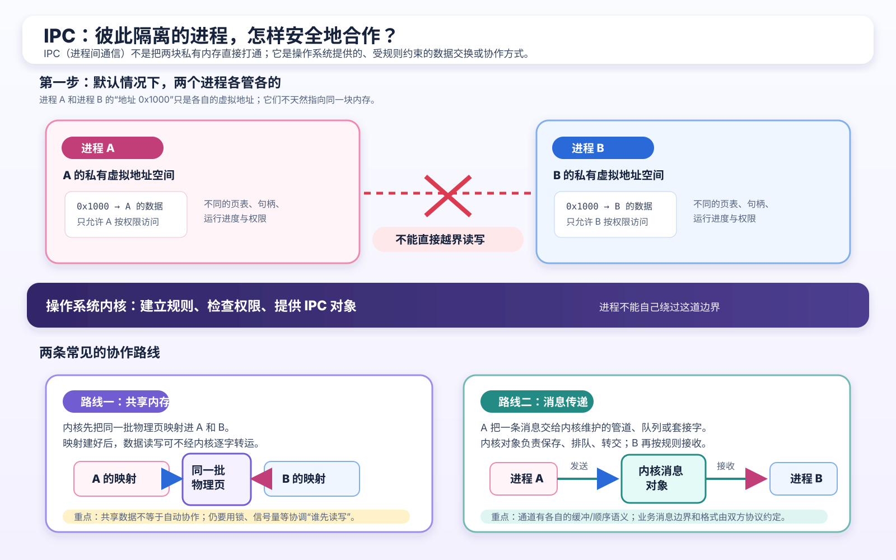
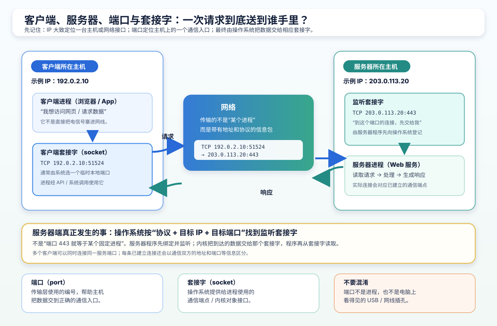
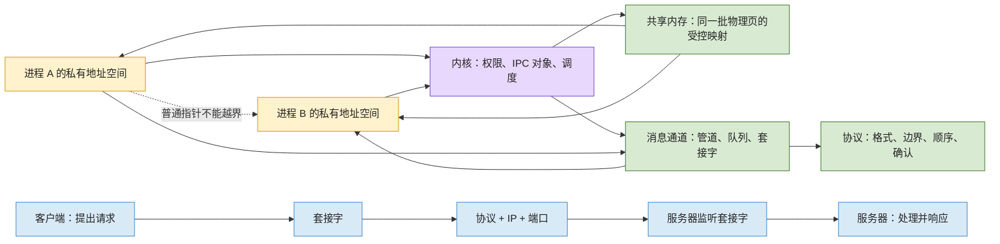

# 第 4 章：进程怎样合作：IPC、共享内存、消息、端口与客户端/服务器

[返回仓库首页](../README.md) · [查看知识地图](00-operating-system-knowledge-map.md) · [查看 Q004 问题档案](../questions/README.md#q004进程协作ipc端口与客户端服务器) · [上一章：MMU、特权模式、中断与系统调用](03-mmu-privilege-modes-interrupts-and-apis.md)

> 本章从 Q004 的六个问题出发：独立进程和协作进程、IPC 的本质、两种常见通信机制、消息传递、端口，以及客户端和服务器。

先说明一个教学约定：你问的“两种进程通信机制”，本章按多数操作系统教材中最常见的一对来讲：**共享内存**与**消息传递**。真实系统提供的具体工具更多，例如管道、命名管道、消息队列、套接字和信号；它们大多可以放进这两个大方向中理解。

## 1. 先给你能立刻记住的答案

| 你的问题 | 先说人话 | 再补一个准确边界 |
| --- | --- | --- |
| 什么是独立进程？ | 两个进程默认各管各的，不能拿着自己的指针去读对方的私有内存。 | 它们仍会一起争用 CPU、磁盘、网络；“独立”不是说彼此永远没有任何影响。 |
| 什么是协作进程？ | 两个进程通过约好的渠道交换数据、通知或工作结果。 | 协作不是取消隔离，而是只开一条明确允许的通道。 |
| IPC 的本质是什么？ | 在隔离的进程之间，建立一条受规则约束的信息通路。 | 除了搬数据，还要回答权限、对象位置、先后顺序和数据格式。 |
| 两种常见机制是什么？ | 共用一块“白板”（共享内存），或把内容交给“信箱”（消息传递）。 | 具体 API、缓冲和性能会因操作系统与机制而不同。 |
| 端口是什么？ | 在网络语境中，它像一台机器内服务入口的编号。 | 它不是实体插孔，不等于 PID，也不直接等于某个进程。 |
| 客户端和服务器是什么关系？ | 客户端主动提出请求，服务器等待并处理请求。 | 这是一次通信中的角色；同一个进程也可以同时扮演两种角色。 |

## 2. 为什么默认不能直接合作？

先想象两个正在运行的程序：

- **编辑器 A**：用户正在改一篇文章，文字暂时在 A 的内存缓冲区里；
- **备份助手 B**：它想拿到最新的文字，保存一份备份。

直觉上，你可能会说：“B 直接读 A 的那块内存不就行了？”

默认不行。A 和 B 是两个进程，各自有自己的虚拟地址空间。即使 A 和 B 都看到一个叫 “地址 0x1000” 的位置，它们通常也不是同一块数据。第 1 章讲过，进程看到的是自己的虚拟地址；第 3 章讲过，页表和 MMU 会限制这条访问是否允许。

| 情况 | A 能否直接读 B 的堆 | 需要什么 |
| --- | --- | --- |
| 两个普通进程 A、B | 通常不能 | 建立明确的 IPC 通道 |
| 同一进程中的两个线程 | 通常能访问共同的堆和全局数据 | 不是 IPC，但仍要处理同步 |
| A、B 映射同一共享内存 | 只能读写那一小块被允许共享的区域 | 共享内存 + 同步规则 |
| A、B 使用管道或套接字 | 仍不能读对方私有内存 | 通过消息通道交接数据 |

看这张图时只抓住三点：

1. 图上 A 与 B 的私有地址空间仍然分开；IPC 不是把整个 A 的内存交给 B。
2. **共享内存**：内核先让两边各自映射到同一批物理页；映射建立后，A、B 的普通读写可以直接看到那块共同数据。
3. **消息传递**：A 把数据交到受管理的通道，B 再从通道取得数据；A 的私有内存仍没有直接暴露给 B。

所以可以这样记：**独立是默认，协作是经过允许后的一小段连接。**

## 3. IPC 的本质：不是“把字节丢过去”这么简单

IPC 是 Inter-Process Communication，即“进程间通信”。

最短但不失真的定义是：

> **IPC 的本质，是让原本隔离的进程在明确的权限、端点和约定下交换信息。要把协作做正确，通常还要另外约定谁先做、谁在等、数据是否已经准备好。**

如果编辑器 A 要把文字交给备份助手 B，光有“文字内容”还不够。系统还要能回答下面五件事：

| 必须回答的事 | 在编辑器 A 与备份助手 B 的例子里 |
| --- | --- |
| 谁可以通信？ | B 有无权限打开共享区或连接这个服务？ |
| 数据放在哪里？ | 共同内存、内核队列、管道缓冲区，还是网络缓冲区？ |
| B 怎样找到数据？ | 通过对象名、句柄、文件描述符、套接字地址或端口。 |
| 什么时候可以读？ | A 是否已经写完？B 是等待、轮询，还是收到通知？ |
| B 怎样读懂它？ | 这是全文、增量修改，还是“保存成功/失败”的状态？ |

这里有三个很像、但必须分开的词：

| 名词 | 它关心什么 | 类比 |
| --- | --- | --- |
| **通信** | 信息怎样从 A 到 B | 把包裹送过去 |
| **同步** | 谁先做、谁后做、什么时候等 | 约定“写完再看” |
| **协议** | 数据格式、含义、顺序和错误怎么解释 | 包裹标签和交接暗号 |

例如 A 写共享内存时，通信已经有了：A、B 都能看见同一块白板。但若 A 写到一半，B 就开始读，B 可能拿到半成品。因此，**共享数据不自动等于正确协作**；同步仍是下一道题。

## 4. 第一种常见机制：共享内存

### 4.1 先用“共同白板”理解它

共享内存可以理解成：操作系统给 A 和 B 各自的工作间开了一扇门，这两扇门都通向同一块白板。

- A 在白板上写内容；
- B 看见的是同一块白板上的内容；
- 但 A 和 B 必须约定好，不能两个人同时乱写，也不能 A 还没写完、B 就把它当完成品。

这里的“同一块”指的是同一批底层物理页，不是说 A、B 的整个虚拟地址空间合并了。A 看到共享区的虚拟地址数值，甚至可以和 B 看到的数值不同。

### 4.2 慢动作：共享内存怎样开始工作

| 步骤 | 发生了什么 |
| --- | --- |
| 1 | A、B 通过各自系统的 API 请求或打开同一个共享内存对象。 |
| 2 | 内核检查权限，设置页表，让 A、B 的一部分虚拟地址都映射到同一批物理页。 |
| 3 | A 在共享区域写数据，例如写入新文本和“版本号 8”。 |
| 4 | A 用锁、原子状态、事件等方式声明：“第 8 版已经写完，可以读了。” |
| 5 | B 确认可读，再从共享区读取第 8 版。 |
| 6 | 双方继续约定谁能覆盖、何时关闭、谁负责释放。 |

第 2 步连接了第 3 章：内核设置映射和权限，MMU 按页表规则检查每次访问。映射已经建立以后，A 对共享区的普通读写通常不需要“每写一个字节都进入内核”；这也是共享内存适合大块数据的一个常见原因。

### 4.3 它快，但不替你保证顺序

共享内存最容易被误解成：“既然看见同一份数据，事情就完成了。”

不是。下面这段人话时间线就会出错：

| 时间 | A | B | 结果 |
| --- | --- | --- | --- |
| t1 | 开始写 10 000 个字符 | — | 数据还没完整 |
| t2 | 只写到第 3 000 个字符 | 立刻开始读 | B 得到半篇文章 |
| t3 | 继续写 | 以为半篇就是最终结果 | 错误 |

所以要记住这一句：

> **共享内存解决“看见同一份数据”；同步机制解决“什么时候安全地看”。**

锁、信号量、条件变量、原子操作和内存可见性规则会在后续真实问题出现时单独展开。本章只先建立它们为什么必须存在的直觉。

## 5. 第二种常见机制：消息传递

### 5.1 先用“信箱”理解它

消息传递的思路不同：A 不把白板开放给 B，而是把一份信息交给一个受管理的“信箱”；B 从信箱中取。

这个信箱可能是：

- 管道；
- 命名管道或 FIFO；
- 消息队列；
- 套接字；
- 某些情况下的短通知机制。

它们的接口和细节不同，但共同点是：**发送方把信息交给通信通道，接收方从通信通道获取，而不是直接读发送方的普通私有内存。**

### 5.2 慢动作：一条消息怎样走

| 步骤 | A、内核与 B 分别在做什么 |
| --- | --- |
| 1 | A 先得到一个通信端点，例如一个管道端、队列句柄或套接字。 |
| 2 | A 调用发送或写入接口，提交“请备份第 8 版文本”这份内容。 |
| 3 | 内核检查端点与权限，并把内容放入或交给对应的通道；具体是否复制、如何缓冲，取决于机制和实现。 |
| 4 | B 可能正在等待；消息到达后它被唤醒，或它稍后再来读取。 |
| 5 | B 读取内容，并按双方协议理解其中的字段。 |
| 6 | B 可以再发回“已收到”“备份完成”或错误信息。 |

消息不只是裸字节。一个更完整的消息通常至少有：**内容 + 交给谁 + 怎样解释 + 何时算完成**。例如“版本号 8、正文长度 10 000、正文内容”就比只塞一串字符清楚得多。

### 5.3 “发送成功”到底成功到哪一步？

这很重要：A 的发送接口返回“成功”，通常只说明数据已经被某一层接受，例如进入本地缓冲区或交给内核。它**不必然**表示：

- B 已经读到；
- B 已经理解；
- B 已经把备份写进磁盘；
- 跨网络时，远端业务已经完成。

如果 A 真正需要“备份已完成”这个结果，就要让 B 再回一条确认消息，或用其他协议规则表达完成状态。

### 5.4 不要把“消息”与“字节流”混成一件事

“消息传递”是一个大概念，不代表每个底层通道都天然保留一封封完整消息。

| 通道例子 | 初学时可先这样理解 | 必须补的边界 |
| --- | --- | --- |
| 管道 | 一端写、一端读的本地字节通道 | 常见管道读写会受缓冲、大小和并发写入规则影响。 |
| 命名管道 / FIFO | 有名字的本地管道 | 能否供无亲缘关系进程使用、权限如何检查，取决于平台。 |
| 消息队列 | 更像一封封排队的信 | 具体优先级、大小上限和接收规则因系统而异。 |
| TCP 套接字 | 可跨网络、按顺序传输的字节流 | TCP 不把一次业务发送自动标成“一整条业务消息”；应用要约定长度或分隔方式。 |
| UDP 套接字 | 可发送独立数据报 | 是否可靠、是否到达、顺序如何，不能按 TCP 的直觉假定。 |
| 信号 / 事件 | “有事发生了”的短提醒 | 适合通知，不适合搬运大量正文。 |

因此，消息传递的本质可以再压缩成一句：

> **它把“共同数据”变成通过受管理通道进行的交接；双方仍必须约定内容、边界和先后顺序。**

## 6. 端口到底是什么？先把五个词拆开

你在浏览器地址或开发日志里常会看到 “localhost:3000” 或 “127.0.0.1:3000”。要理解它，先不要把 API、协议、套接字、端口和 PID 混在一起。

| 名词 | 大白话 | 在一次网络访问中扮演什么 |
| --- | --- | --- |
| **API** | 程序调用某项能力的约定 | 程序用创建、连接、发送、接收等接口请求网络能力。 |
| **协议** | 通信双方怎样说话的规则 | 例如 TCP 规定传输语义；HTTP 规定请求和响应文本怎样组织。 |
| **套接字（socket）** | 操作系统管理、交给进程使用的通信端点 | 客户端与服务器程序通过各自的套接字收发数据。 |
| **端口（port）** | TCP 或 UDP 这类传输协议中用于进一步分发流量的编号 | 帮助一台主机把到达的数据交给正确的监听入口。 |
| **PID** | 内核给进程的管理编号 | 用于管理进程，不是网络数据包用来寻址服务的号码。 |

图中画的是一个**跨主机的 TCP 示例**：客户端从 “192.0.2.10:51524” 访问服务器的 “203.0.113.20:443”。这两个 IP 是专门留给文档举例的地址，不是某台真实机器。

再用常见的本地开发地址 “localhost:3000” 来读：

- **localhost**：一个表示“这台电脑自己”的主机名；它通常解析为 IPv4 回环地址 127.0.0.1 或 IPv6 回环地址 ::1。客户端和服务器即使在同一台电脑，也能走这条本地网络路径。
- **3000**：在指定传输协议语境里的端口号。它是服务入口编号，不是 USB 插孔，也不是“进程编号 3000”。
- **socket**：程序实际持有和使用的通信端点。服务器先让一个套接字绑定并监听某个本地地址和端口；内核再把匹配的数据交给它。

更准确的说法是：内核会结合**协议、本地 IP 地址和端口**等信息，找到合适的监听套接字或连接。不能把它说成“一个端口永远只属于一个固定进程”。同一个端口号在 TCP 与 UDP 中是不同协议语境；绑定、复用和访问规则也会受操作系统策略影响。

端口号本身是 16 位编号，范围是 0 到 65535；“80 常用于 HTTP”“443 常用于 HTTPS”只是常见约定，不是端口天生知道某种应用协议。

还要再补一个边界：并不是所有 IPC 都使用 TCP/UDP 端口。两个同机程序可以用命名管道、共享内存或 Unix 域套接字等方式协作，其中端点可能由名称或路径定位，而不是网络端口。

## 7. 客户端与服务器：把一次访问 localhost:3000 慢放

客户端和服务器不是两种永久身份，而是一次协作关系中的分工：

- **服务器**先把一种服务暴露出来，并等待请求；
- **客户端**知道服务地址，主动发起请求；
- 服务器处理后把结果回给客户端。

以下明确以 **TCP 上的本地 HTTP 服务**为例。假设服务器已经在同一台电脑上等待 “localhost:3000”，浏览器打开这个地址时，可以先按下面的简化过程理解：

| 步骤 | 客户端（浏览器） | 内核 / 网络栈 | 服务器程序 |
| --- | --- | --- | --- |
| 1 | 知道目标是 localhost:3000 | — | 已创建并监听一个服务器套接字 |
| 2 | 请求建立通信连接 | 把请求匹配到本机对应的监听入口 | 监听端点收到连接请求 |
| 3 | 发送 HTTP 网页请求 | 处理 IP/TCP、缓存和交付；HTTP 的含义由两端应用解释 | 接受这条连接，读取请求 |
| 4 | 等待或继续做别的事 | 持续收发数据 | 处理请求，例如读取文件或查找数据 |
| 5 | 读取响应并显示网页 | 把响应交给客户端套接字 | 发送响应，必要时关闭连接 |

这里省略了 TCP 建连、路由、防火墙、拥塞控制等后续主题，只保留最重要的“找服务”关系：**目标地址先定位主机或接口，端口帮助找到服务入口，套接字把这个入口交给具体进程使用。**

还要纠正两个常见直觉：

1. 服务器程序通常也是**用户态进程**。它叫“服务器”，不代表它自动在内核态运行。
2. 一个进程可以一边当服务器，一边当客户端。例如 Web 服务向数据库请求数据时，它对浏览器是服务器，对数据库又是客户端。

## 8. 这条链怎样保持安全和正确？

这正好接回第 3 章的 MMU、权限和系统调用。

| 层次 | 它负责什么 | 它不保证什么 |
| --- | --- | --- |
| 进程隔离、页表与 MMU | A 不能随便读写 B 的私有内存；共享页必须被明确映射。 | A、B 共享后就一定不会把共同数据写坏。 |
| 内核与 IPC 对象 | 创建、打开、连接或映射时可以检查身份、权限和资源限制。 | 业务数据一定符合“订单正确”“备份成功”这类应用规则。 |
| 通信协议与应用代码 | 定义消息格式、确认、超时和错误处理。 | 只要端口打开就自动可信。 |

所以：

- **端口不是身份认证**。能连上某个端口，不等于有权执行所有操作。
- **共享内存不是自动正确**。双方代码仍要用同步和协议避免读半成品、重复写或遗漏通知。
- **消息也要验证**。接收方不能因为“来自一个通道”就盲目相信长度、格式和业务含义。

硬件与内核负责守住底线，应用协议和程序逻辑负责把协作做对；这和第 3 章“硬件保护不等于业务正确”的结论完全一致。

## 9. 把本章的概念重新连起来

这不是说所有协作都必须经过网络。图右下角只是在解释“端口、客户端、服务器”这一种常见的套接字场景；图上半部的共享内存、管道和本地队列都可以在同一台电脑里工作。

## 10. 常见误区速查

| 误区 | 更准确的理解 |
| --- | --- |
| “独立进程完全不受彼此影响。” | 它们仍会争用 CPU、磁盘或网络；这里的独立主要指不直接共享或交换运行数据。 |
| “两个进程都有地址 0x1000，所以它们共享同一块内存。” | 地址是各自虚拟地址空间里的名字；默认不会指向同一物理页。 |
| “共享内存后不需要同步。” | 恰好相反：越能同时看见同一数据，越要约定读写顺序。 |
| “消息传递一定是一次复制、一封消息。” | 底层可以有不同缓冲或优化；有些通道是字节流，应用要自己定义业务消息边界。 |
| “发送成功就是对方业务完成。” | 往往只表示某一层接受了数据；完成需要额外确认或协议状态。 |
| “端口就是进程。” | 端口是传输层编号；内核把匹配流量交给套接字，进程再使用套接字。 |
| “服务器天然在内核态。” | 普通服务器通常也是用户态进程。 |
| “打开一个端口就安全了。” | 端口不是认证、授权或加密；这些仍需要应用和系统策略。 |

## 11. 情境自测

先自己回答，再展开答案。重点不是背术语，而是能演出数据怎样走。

1. A 和 B 都出现虚拟地址 0x1000，为什么 B 不能默认读取 A 的数据？
2. 共享内存已经建立，A 写一半内容时 B 读到它，问题出在哪里？
3. A 的发送接口返回成功，为什么不能立刻断言“B 已经完成备份”？
4. 管道、消息队列和 TCP 套接字都能传信息，为什么还要说“协议”和“消息边界”？
5. localhost:3000 里的 localhost 和 3000 各自表示什么？
6. 端口、socket 与 PID 分别在解决什么问题？
7. 服务端程序为什么通常仍在用户态？
8. 一个 Web 服务向数据库查询数据时，它是客户端还是服务器？
9. 共享内存的虚拟地址在 A、B 中必须相同吗？
10. 两个同机进程通信一定需要网络端口吗？

查看参考答案

1. 因为这是两个独立的虚拟地址空间；相同数字只是各自空间中的地址名。页表和 MMU 不会默认让 B 越过边界访问 A 的私有页。
2. 共享内存只让双方能看见同一份数据，没有规定“写完再读”。需要锁、状态位、事件等同步规则。
3. 成功可能只到“内核或本地缓冲区已经接收”。B 是否读取、理解、完成磁盘写入，需要确认消息或其他协议状态。
4. 不同通道对顺序、边界、缓冲和可靠性的语义不同。双方仍要约定一条业务消息从哪里开始、到哪里结束，以及收到错误怎么办。
5. localhost 是表示本机的主机名，通常解析为 127.0.0.1 或 ::1 这样的回环地址；3000 是在指定协议语境里的服务入口编号。
6. 端口帮助网络栈分发流量；socket 是进程使用的通信端点；PID 是内核管理进程的编号。
7. “服务器”是处理请求的角色，不是 CPU 特权级。它仍需通过系统调用使用网络、文件等资源。
8. 对浏览器它是服务器；对数据库它是客户端。角色取决于当前这条通信关系。
9. 不必须。两边可以用不同的虚拟地址映射同一批物理页。
10. 不一定。共享内存、命名管道或 Unix 域套接字等本地 IPC 可以使用映射、名称或路径，而不是 TCP/UDP 端口。

## 12. 这一章和后续主题怎样连接

本章已经把 Q004 的六个问题接到了前面三章：

- 进程隔离为什么存在，以及协作为什么需要受控通道；
- 共享内存和消息传递这两种常见思路；
- 通信、同步和协议为什么必须分开理解；
- 端口、套接字、API、协议和 PID 的区别；
- 客户端、服务器与内核网络栈怎样协作；
- 为什么安全边界不能替代同步、输入验证和业务正确性。

下一批自然问题可能是：锁和信号量到底怎样避免竞态？管道和 socket 的缓冲区怎样工作？TCP 为什么可靠却仍需要应用协议？服务器如何同时处理很多客户端？这些主题已在知识地图中定位，但会等你提出具体问题后再详细展开。

继续阅读：

- [第 1 章：进程、线程与虚拟地址空间](01-from-program-to-process.md#2-程序进程与线程)
- [第 2 章：并发、竞态与上下文切换](02-cpu-context-registers-and-instructions.md#9-什么是-cpu-并发它如何运作)
- [第 3 章：MMU、受控入口与 API](03-mmu-privilege-modes-interrupts-and-apis.md)
- [问题档案中的 Q004](../questions/README.md#q004进程协作ipc端口与客户端服务器)
- [操作系统总体知识地图](00-operating-system-knowledge-map.md)

官方进一步阅读（首轮可跳过）

- [Microsoft：Interprocess Communications](https://learn.microsoft.com/en-us/windows/win32/ipc/interprocess-communications)：Windows 列出的进程间通信机制概览。
- [Linux：pipe(7)](https://man7.org/linux/man-pages/man7/pipe.7.html)：管道和 FIFO 的读写端、容量与阻塞行为。
- [Linux：unix(7)](https://man7.org/linux/man-pages/man7/unix.7.html)：同机 Unix 域套接字的地址形式。
- [RFC 9293：TCP](https://datatracker.ietf.org/doc/html/rfc9293)：TCP 的端口字段和字节流语义。

这些材料面向系统或网络开发者。第一遍不必逐页阅读；本章的任务是先把“谁、通过什么、把什么交给谁”演出来。

