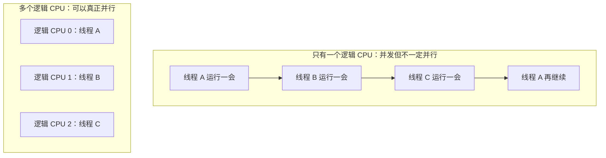
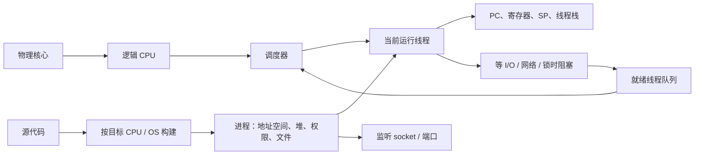

# 第 5 章：多核 CPU、轮转调度、并发与线程

[返回仓库首页](../README.md) · [查看知识地图](00-operating-system-knowledge-map.md) · [查看 Q005](../questions/README.md#q005多核轮转调度线程栈堆监听与可移植性) · [回顾第 1 章：进程、内存与栈](01-from-program-to-process.md) · [回顾第 2 章：CPU 上下文](02-cpu-context-registers-and-instructions.md) · [回顾第 4 章：监听 socket](04-process-cooperation-ipc-ports-and-client-server.md) · [继续第 7 章：完整调度策略与 I/O](07-cpu-scheduling-process-states-and-io.md)

## 1. 这组问题到底在追问什么

你这次的问题其实都围绕同一件事：**电脑上明明有很多任务，CPU 到底有几张“真正干活的桌子”，谁坐哪一张桌子，坐多久，等外部事情时又怎么办？**

先给九个最短答案，读完后再把每一句拆开：

1. 多核里的“核”是芯片中实际能推进指令执行的硬件工作单元；操作系统看到的调度位置叫逻辑 CPU。
2. 轮转调度把可运行线程排成队，每人领一小段时间片；用完还没结束就排到队尾。
3. CPU 利用率不是越高越好；目标是单位时间完成更多**有效工作**，而不是让无意义循环把百分比刷到 100%。
4. 栈让一条线程按函数调用的倒序返回；堆让动态对象不必随某次函数返回立即消失；SP 是记住当前栈位置的寄存器。详见[第 1 章的慢放](01-from-program-to-process.md#64-栈堆和栈指针)。
5. 网络语境中的监听进程是持有监听 socket 的普通服务器进程或线程；没连接时它通常在等待，不会一直烧 CPU。详见[第 4 章](04-process-cooperation-ipc-ports-and-client-server.md#71-监听进程到底在监听什么)。
6. 并发是多个任务在同一段时间都有进展；并行是多个任务在同一瞬间分别在不同逻辑 CPU 上执行。
7. CPU 需要的是“下一条在哪、寄存器是什么、当前调用到哪”的一条执行路线；这套现场在**线程**上，所以线程通常是调度单位。
8. 可移植通常指同一份主要逻辑能为不同目标重新构建；同一个已编译文件能否直接运行是另一回事。先回看[第 2 章](02-cpu-context-registers-and-instructions.md#105-程序为什么可移植)，再到[第 6 章](06-platforms-abi-executables-and-cpu-architectures.md#7-相同软件怎样在不同系统下兼容)看不同系统、ABI 和 CPU 架构怎样影响它。
9. 同一瞬间能由操作系统安排运行的线程数，通常接近可用**逻辑 CPU**数，不是物理核心数，也不等于系统只能创建这么多软件线程。

### 1.1 先放进一个具体场景

假设一台电脑有 **4 个物理核心**，每个核心开启了 **2 路 SMT**（常被叫作“超线程”，但不是所有 CPU 都有）。任务管理器可能显示 **8 个逻辑处理器**。此时浏览器、视频导出、音乐播放器和后台同步一共创建了 100 条软件线程。

你现在应该能先猜到两件事：

- 系统可以保留远多于 8 条软件线程；大多数会处于就绪、等待、睡眠或暂时没有工作等状态。
- 从操作系统的调度视角看，某一瞬间通常至多有约 8 条可运行的 OS 线程分别占住这 8 个逻辑 CPU；其他可运行线程要排队，或在以后轮到它们。

本章学完后，你应该能：

- 看见“8 核 16 线程”时，分别说清物理核心、逻辑 CPU 和软件线程；
- 亲手把 A、B、C 三条线程按轮转调度走一遍；
- 解释“CPU 100%”为什么不一定代表更快、更正确；
- 判断一个例子是并发、并行，还是两者都有；
- 解释为什么进程仍然重要，但调度器通常挑线程运行。

---

## 2. 多核 CPU 里的“核”是什么

先别把“核心”想成一个小程序。**物理核心（physical core）是芯片里一套真实的主要执行硬件。**它有让指令向前推进所需的硬件资源，例如保存当前执行状态的架构寄存器、取指/译码和执行部件等。它能在某个时刻推进一条或多条硬件执行上下文中的指令。

操作系统不直接按“芯片的硅片面积”排队，它需要知道“我现在可以把一条线程放到哪个执行位置上”。这个位置叫作**逻辑 CPU / 逻辑处理器（logical processor）**。可以先把它理解为调度器看见的一张工作桌。


看图时只抓四个位置：最上方是一个 CPU 包装（package），里面画了两个**物理核心**；每个核心若支持并启用 SMT，就会向操作系统暴露两个**逻辑 CPU**；中间的队列放的是等待 CPU 的**可运行线程**；右下角对比的是“一张桌子轮流做事”和“两张桌子同时做事”。这是原创教学示意，不代表所有 CPU 都有相同的缓存、执行单元或 SMT 数量；完整记录见[图片署名与边界](../assets/images/ATTRIBUTION.md#q005-multicore-schedulingsvg)。

### 2.1 物理核心、逻辑 CPU 与软件线程不是同一种东西

| 名词 | 它是什么 | 谁拥有它 | 不要误解成 |
| --- | --- | --- | --- |
| CPU 包装 / 插槽 | 一颗安装到主板上的处理器封装，里面可有多个核心 | 硬件 | 必然只有一个核心 |
| 物理核心 | 实际的主要硬件执行单元 | 硬件 | 一个应用程序或一个进程 |
| 逻辑 CPU | 操作系统看到的可安排线程执行的位置 | 硬件提供、OS 调度 | 一个“额外复制出来的完整物理核心” |
| OS 线程 | 程序的一条执行路线，带有自己的 PC、寄存器状态、栈等 | 进程 / 内核 | CPU 芯片中固定的一根线 |

没有 SMT 时，一个物理核心通常暴露一个逻辑 CPU。有 SMT 时，一个物理核心可以同时暴露多个逻辑 CPU；它们能保存不同的架构执行状态，但仍会共享该物理核心的一部分真实资源。因此“4 核 8 线程”常表示“4 个物理核心、8 个逻辑 CPU”，**不表示 8 个完全独立、性能必然相同的物理核心**。

还要把“CPU 的硬件线程”和“软件线程”分开说。产品宣传里的“16 线程”常指 16 个逻辑 CPU；你的程序里的 1,000 条 `std::thread`、Python 线程或 JavaScript 运行时工作线程，是软件层的线程数量。两边只是会被调度器对应起来，不是同一个名词。

> **一句话记忆：物理核心是真实工作单元；逻辑 CPU 是操作系统可安排线程的位置；软件线程是排队等位置的执行路线。**

<details>
<summary>更准确一点（首轮可跳过）</summary>

- 同一颗处理器可能有性能不同的异构核心；“核心数 × 每核 2 条硬件线程”不是通用公式。
- SMT 对不同工作负载的收益差异很大，因为同一物理核心上的逻辑 CPU 会共享部分执行资源、缓存或前端资源；逻辑 CPU 数翻倍不等于速度翻倍。
- Windows 将逻辑处理器作为调度视角的处理器位置；相关拓扑 API 会分别报告 core 和 logical processor 的关系，见 [GetLogicalProcessorInformationEx](https://learn.microsoft.com/en-us/windows/win32/api/sysinfoapi/nf-sysinfoapi-getlogicalprocessorinformationex)。

</details>

---

## 3. 轮转调度：把就绪队列真的转起来

先采用一个刻意简单的教学前提：**只有一个逻辑 CPU，A、B、C 三条线程优先级相同，三者开始时都能继续运行。**这时不能让 A 永远霸占 CPU，否则 B 和 C 会饿着。轮转调度（Round Robin，RR）给每条线程一段短时间，叫**时间片（time quantum）**。

先认清三种状态：

| 状态 | 人话 | 这条线程会不会在普通就绪队列里等 CPU |
| --- | --- | --- |
| 运行中（running） | 它此刻正占用一个逻辑 CPU | 不在普通就绪队列里 |
| 就绪 / 可运行（ready / runnable） | 它已经准备好，只差一个 CPU 位置 | 会 |
| 阻塞 / 等待（blocked / waiting） | 它在等磁盘、网络、锁或用户输入，暂时不能继续 | 不会；等到事件发生后才重新就绪 |

### 3.1 A、B、C 的慢动作

| 时刻 | 当前占用 CPU 的线程 | 当前动作 | 队列怎样变 |
| --- | --- | --- |
| 开始 | 尚未选中 | 三条都可运行 | `[A, B, C]` |
| 第 1 个时间片 | A | A 用完时间片，仍没做完 | A 回到队尾，变成 `[B, C, A]` |
| 第 2 个时间片 | B | B 发起磁盘读取，不能继续算 | B 进入等待，变成 `[C, A]` |
| 第 3 个时间片 | C | 磁盘读取期间，C 可以运行 | 若 B 的 I/O 完成，它回到就绪队尾，例如 `[A, B]` |
| 以后 | A、B、C 轮流 | 时间片到、主动让出或再次阻塞时，调度器重新选择 | 队列持续变化 |

可以把“轮转”记成一句规则：**同等级的可运行线程依次拿时间片；时间用完仍可运行，就从队首移到队尾。**它的公平感来自“大家都能再次轮到”，不是来自“每条线程总能在同一时刻运行”。

当 A 的时间片到期，通常会发生这条短链：定时器事件使内核有机会运行 → 硬件先保护最小返回状态，内核再保存 A 的执行现场（PC、寄存器、SP 等）→ 调度器从可运行线程中选择 B → 恢复 B 的现场 → CPU 从 B 上次停下的位置继续。时间片到期只保证内核获得重新评估机会；没有合适的 B 时，内核也可能返回 A。有关“硬件先保存什么、内核再保存什么”的 P08 慢动作，请看[第 2 章第 7.6～7.10 节](02-cpu-context-registers-and-instructions.md#76-q007-的关键分界进入内核不等于已经换了线程)。

### 3.2 时间片为什么不能无限短或无限长

| 时间片设置 | 你会感受到什么 | 代价 |
| --- | --- | --- |
| 太短 | 各任务更快得到回应，交互看起来更顺滑 | 更频繁地保存/恢复上下文，缓存和分支预测也更容易被扰动 |
| 太长 | 切换次数少，连续计算更省切换成本 | 其他就绪任务可能等很久，界面或服务响应变慢 |

所以时间片不是“越小越高级”或“越大越快”的单一答案。操作系统还要考虑优先级、响应时间、实时任务、CPU 亲和性和负载平衡等目标。

还有一个关键点：**时间片到期不保证一定换到另一个线程。**如果没有其他同等级可运行线程，系统可能继续让当前线程运行；如果有更高优先级线程就绪，也可能在时间片之前抢占它。轮转只是“当需要在同类可运行线程之间公平分配时”的一条规则。

> **一句话记忆：轮转不是让线程同时跑，而是让可运行线程按时间片轮流坐上同一个逻辑 CPU。**

<details>
<summary>更准确一点（首轮可跳过）</summary>

上面的单队列是为了让你看清动作，并不是对所有现代桌面系统内部队列的逐字节描述。现代通用调度器通常会加入优先级、每 CPU 队列、交互响应、负载均衡和实时策略。Linux 的确提供 `SCHED_RR` 实时轮转策略，但不能因此反推 Linux 或 Windows 的每条普通线程都只按一条全局 RR 队列运行；参见 [Linux `sched(7)`](https://man7.org/linux/man-pages/man7/sched.7.html) 和 [Microsoft 的调度优先级说明](https://learn.microsoft.com/en-us/windows/win32/procthread/scheduling-priorities)。

</details>

> 你后来问到的 FCFS、SJF、优先级、多级队列、反馈规则、抢占和调度延迟，已在[第 7 章](07-cpu-scheduling-process-states-and-io.md#6-cpu-调度都有哪些策略)单独展开。这里仍只保留“用 RR 建立时间片与状态变化直觉”的基础。

---

## 4. 如何提高 CPU 利用率：先别把 100% 当作唯一目标

CPU 利用率可以粗略理解为：

```text
一段时间内，逻辑 CPU 处于忙碌状态的时间 ÷ 观察总时间
```

多核机器的监控软件可能把每个逻辑 CPU 分别显示，也可能汇总为一个平均值。这个数字回答的是“CPU 忙不忙”，不直接回答“用户得到的结果多不多”。

例如：

- 一个无限循环什么也不产出，也能让一个逻辑 CPU 接近 100%；
- 一个下载器正等待网络，CPU 利用率可能很低，但它正在正确等待，而不是坏掉；
- 所有核心 100%，也可能是大量线程抢同一把锁、忙等、错误重试或彼此频繁切换。

因此更好的目标是：**在响应时间、能耗、正确性和资源成本能接受的前提下，提高单位时间完成的有效工作。**

### 4.1 程序、操作系统和硬件各能做什么

| 层次 | 有帮助的做法 | 为什么有帮助 | 不要机械地做 |
| --- | --- | --- | --- |
| 程序设计 | 把彼此独立的工作拆开，例如四张图片分别处理 | 多个逻辑 CPU 才有事可做 | 强行把本来完全串行的步骤拆成互相等待的线程 |
| I/O 等待 | 读磁盘、网络、监听 socket 时使用阻塞或事件等待 | 等待中的线程让出 CPU，别的就绪线程可以运行 | 用空循环反复问“好了没”，把 CPU 烧在等待上 |
| 并发数量 | 采用适合负载的工作线程数或线程池 | 避免一个线程不够用，也避免过多线程互相切换 | 看到 8 个逻辑 CPU 就固定创建 8,000 条线程 |
| 共享数据 | 减少不必要的全局锁和串行瓶颈 | 多线程不用排在同一把锁前面 | 为了“无锁”而写未经验证的并发代码 |
| 调度与系统 | 内核平衡可运行线程，选择合适 CPU | 尽量避免一边空闲、一边排长队 | 假设调度器能把不可并行的程序变快 |
| 测量 | 看 CPU、等待时间、吞吐量、延迟和锁竞争 | 找到真正瓶颈 | 只盯住一个 CPU 百分比猜原因 |

刚才的“监听进程”就是很好的例子：没有客户端时，监听线程通常阻塞等待，CPU 可以安排别的线程；客户端来了，监听线程被唤醒再处理。这比不断轮询端口是否有连接更节省 CPU。有关监听链路请看[第 4 章](04-process-cooperation-ipc-ports-and-client-server.md#71-监听进程到底在监听什么)。

> **一句话记忆：想提高效率，先让 CPU 多做有效工作、少做无意义等待和互相阻塞；不要把“占用率高”误当成唯一胜利。**

<details>
<summary>更准确一点（首轮可跳过）</summary>

内核在非常短的、确实必须等待硬件的场景可能使用忙等；这不代表普通应用也应把“忙等”当作默认方案。Linux 内核文档也区分延迟/睡眠方式，并强调应选择合适的等待机制，见 [Delay and sleep mechanisms](https://docs.kernel.org/timers/delay_sleep_functions.html)。应用优化应以实际测量为准：CPU 密集型、I/O 密集型、延迟敏感型和能耗敏感型任务的最佳取舍并不相同。

</details>

---

## 5. 多核下怎样同时处理：并发和并行不是同义词

先用最短的区分：

- **并发（concurrency）**：多个任务在同一段时间内都在推进。一个逻辑 CPU 快速轮流运行 A、B、C，也算并发。
- **并行（parallelism）**：多个任务在同一瞬间分别占用不同逻辑 CPU 执行指令。



图上半部分像一个人先回邮件、再写文档、再接电话；每件事都在一段时间内有进展，但同一瞬间只有一件在做。下半部分像三个人各坐一张桌子，同时做三件互不依赖的事。这是多核带来的**可能性**，不是自动获得的加速。

要真正并行，三方都得配合：

| 谁 | 要做的事 |
| --- | --- |
| 程序 | 找出可以独立推进的工作，并定义共享数据怎样正确交接 |
| 操作系统调度器 | 把可运行线程分配给可用的逻辑 CPU，必要时做负载平衡 |
| 硬件 | 提供多个可用逻辑 CPU、缓存和内存带宽，让多个执行流有机会同时推进 |

假设一张大图片可分为四块，四块的滤镜计算互不读取对方的中间结果。程序可以创建四条工作线程，调度器可把它们放到四个逻辑 CPU 上，于是它们并行完成四块。可如果最后四条线程都要排队写同一份结果表，或都争用同一块内存带宽，那么新的瓶颈又会出现。

并行不等于正确。多条线程同时访问同一个可写对象时，仍需要同步；这部分会等你之后提出锁、原子操作或死锁相关问题时再展开。

> **一句话记忆：并发强调“都在往前走”，并行强调“此刻真的一起做”；多核让后者成为可能，但程序必须有能同时做的工作。**

---

## 6. 为什么线程通常是执行和调度的基本单位

CPU 不会拿到“整个进程”就知道从哪里开始。它至少要知道：下一条指令在哪（PC/IP）、寄存器现在是什么、当前函数调用到哪里（栈和 SP）、这条执行路线是在运行还是等待。**拥有这套执行书签的是线程。**

| 对象 | 它主要保管什么 | 为什么不能互相替代 |
| --- | --- | --- |
| 进程 | 地址空间、打开文件、权限、堆、全局数据等资源和隔离边界 | 它回答“这一套资源属于哪次运行” |
| 线程 | PC、寄存器、SP、线程栈、运行/等待状态等一条执行路线 | 它回答“现在从哪条指令继续” |
| 调度器 | 从可运行线程中选择一个给逻辑 CPU | 它负责决定“下一张桌子给谁坐” |

想象一个浏览器进程：一条线程负责界面输入，另一条等待网络，第三条做后台计算。网络线程等数据时不该把整个浏览器进程冻住；调度器可以让界面线程继续运行。若机器有多个逻辑 CPU，多个线程还可能真正并行。

这就是把线程作为调度单位的好处：

1. 一个进程可以有多条独立执行路线；若只说“调度进程”，仍然要继续问“这个进程里哪一条路线在执行”。
2. 同一进程内的线程共享地址空间和资源，切到同进程另一线程通常不必换成另一套完整的进程地址空间。
3. 线程可分别等待不同事情：A 等网络时，B 可以计算，C 可以响应用户。

这不是说进程“不重要”。进程通常仍是资源分配、权限和隔离的基本单位；线程通常是 CPU 实际挑选运行的基本单位。第 1 章已经展示过每条线程有自己栈，第 2 章已经展示过线程上下文如何被保存和恢复。

> **一句话记忆：进程像一套被隔离的资源，线程像其中一条带着 PC、寄存器和栈的执行路线；CPU 要续上哪条路线，就调度哪条线程。**

<details>
<summary>更准确一点（首轮可跳过）</summary>

现代操作系统通常调度内核可见线程；Linux 文档把同一进程中的线程描述为共享一组资源、各自拥有部分独立执行状态。某些语言运行时还会把很多用户态协程或绿色线程复用到少量内核线程上，所以语言里叫“线程”的对象不一定和内核调度实体一一对应。可参考 [Linux `pthreads(7)`](https://man7.org/linux/man-pages/man7/pthreads.7.html) 和 [Microsoft 的 Processes and Threads 概览](https://learn.microsoft.com/en-us/windows/win32/procthread/about-processes-and-threads)。

</details>

---

## 7. 核心数和最大执行线程数有什么关系

下面这张表是回答这个问题最可靠的起点：

| 名词 | 它限制或描述什么 |
| --- | --- |
| 物理核心数 | 芯片里真实主要执行单元的数量 |
| 活跃逻辑 CPU 数 | 操作系统此刻可安排 OS 线程运行的位置数量 |
| 软件线程总数 | 系统和应用已经创建或保留的线程数量；通常可以远大于逻辑 CPU 数 |
| 可运行线程数 | 此刻没有阻塞、正在排队或运行的线程数量 |
| 同时运行的 OS 线程数 | 从 OS 调度视角，同一瞬间通常至多约等于可用逻辑 CPU 数 |

继续用开头的例子：

```text
4 个物理核心，没有 SMT
→ 通常有 4 个逻辑 CPU
→ 同一瞬间通常最多约 4 条 OS 线程真正占住 CPU。

4 个物理核心，每核心 2 路 SMT
→ 通常有 8 个逻辑 CPU
→ 同一瞬间通常最多约 8 条 OS 线程可被安排运行。
→ 但每对 SMT 线程会共享同一物理核心的一部分资源，速度不保证是前一种的两倍。
```

这里的“最多约 8 条”说的是**CPU 上正在执行的 OS 线程**，不是“电脑最多只能创建 8 条线程”。系统完全可以有 100、1,000 或更多线程；有的在等 I/O，有的睡眠，有的就在就绪队列里等轮到自己。实际可用位置还会受虚拟机配额、CPU 亲和性、被禁用的核心、容器限制、操作系统策略和硬件拓扑影响。

另一个常见误区是：一个逻辑 CPU 同时也可能在硬件内部利用流水线、向量单元或乱序执行加速**同一条**软件线程。这不是说操作系统凭空多调度了一条软件线程；它属于 CPU 微体系结构怎样加快指令执行的另一个层次。

> **一句话记忆：逻辑 CPU 数给出“同时可安排多少条 OS 线程”的常见上限直觉；软件线程总数可以远大于它，性能也不会按数字线性翻倍。**

---

## 8. 把 Q005 的九个问题重新接起来



这张图读成一句话就是：程序先针对一个目标平台被构建成可运行产物；操作系统建立进程，进程提供资源和隔离；其中多条线程各自带着 PC、寄存器、SP 和栈；调度器把就绪线程分给逻辑 CPU；线程等网络、磁盘或锁时会阻塞，等事件完成后再回到队列。监听 socket 是进程资源的一种，监听线程等待连接时正好可以把 CPU 让给其他线程。

| 你的问题 | 这次放在哪里 |
| --- | --- |
| 多核中的“核”是什么？ | [本章第 2 节](#2-多核-cpu-里的核是什么) |
| CPU 怎样轮转调度？ | [本章第 3 节](#3-轮转调度把就绪队列真的转起来) |
| 怎样提高 CPU 利用率？ | [本章第 4 节](#4-如何提高-cpu-利用率先别把-100-当作唯一目标) |
| 栈、堆、SP 是什么？ | [第 1 章第 6.4 节](01-from-program-to-process.md#64-栈堆和栈指针) |
| 什么是监听进程？ | [第 4 章第 7.1 节](04-process-cooperation-ipc-ports-and-client-server.md#71-监听进程到底在监听什么) |
| 多核下的并发和并行？ | [本章第 5 节](#5-多核下怎样同时处理并发和并行不是同义词) |
| 为什么调度线程而不是进程？ | [本章第 6 节](#6-为什么线程通常是执行和调度的基本单位) |
| 为什么程序可移植？ | [第 2 章第 10.5 节](02-cpu-context-registers-and-instructions.md#105-程序为什么可移植)；[第 6 章第 7 节](06-platforms-abi-executables-and-cpu-architectures.md#7-相同软件怎样在不同系统下兼容) |
| 核心数与最大执行线程数？ | [本章第 7 节](#7-核心数和最大执行线程数有什么关系) |

---

## 9. 常见误区速查

| 容易说错的话 | 更准确的说法 |
| --- | --- |
| “8 核 16 线程就是 16 个物理核心。” | 常见意思是 8 个物理核心、16 个逻辑 CPU；SMT 逻辑 CPU 会共享一部分核心资源。 |
| “16 线程 CPU 最多只能创建 16 条线程。” | 它通常只给出同一瞬间可安排运行的 OS 线程数的上限直觉；软件线程总数可以大得多。 |
| “轮转调度就是所有现代系统唯一的调度算法。” | RR 是重要的教学模型和某些策略；现代通用调度还会考虑优先级、实时和负载平衡。 |
| “CPU 越接近 100% 越好。” | 无意义循环、锁竞争和忙等也能 100%；应看有效吞吐量、延迟、正确性和能耗。 |
| “多核一定让程序更快。” | 程序要有可独立推进的工作；锁、串行步骤、内存带宽和 I/O 都可能限制加速。 |
| “并发就是并行。” | 单逻辑 CPU 也能通过切换做到并发；并行要求不同逻辑 CPU 同时执行。 |
| “线程是调度单位，所以进程不重要。” | 进程通常仍负责地址空间、资源和隔离；线程负责一条可恢复的执行路线。 |
| “监听服务器一直用 CPU 检查端口。” | 常见监听线程会在 `accept` 或事件等待中阻塞，连接到来才被唤醒。 |
| “可移植就是把同一个 .exe 复制到任何系统。” | 更常见的是源代码/主要逻辑能为不同目标重新构建；二进制兼容是更严格的问题。 |

---

## 10. 情境自测

### 题目

1. 一台电脑显示“6 核 12 线程”。这两个数字最常见地分别在说什么？为什么不能直接说它有 12 个完全独立的核心？
2. 单逻辑 CPU 的就绪队列为 `[A, B, C]`。A 用完时间片仍可运行，B 随后运行时发起 I/O 并阻塞。写出这两次之后队列的变化。
3. B 正在等网络数据时，为什么让它阻塞通常比它不停循环检查更好？
4. 一个程序让所有 8 个逻辑 CPU 都达到 100%，但用户界面卡住、吞吐量也没提高。至少给出两种可能原因。
5. 两条线程各处理一半图片，算并发、并行，还是两者都有？分别说明“只有一个逻辑 CPU”和“有两个空闲逻辑 CPU”时的答案。
6. 为什么“调度进程”还不足以说清 CPU 下一步运行什么？
7. 某进程有两个线程。它们的堆、地址空间、栈和 SP 哪些通常共享，哪些通常分别拥有？
8. 函数 `make_document` 返回了一个动态分配对象的地址。为什么函数返回后该对象不必立刻消失？
9. 4 个物理核心、每核心 2 路 SMT 的机器上，有 80 条可运行 OS 线程。能否说有 80 条线程在同一瞬间都执行 CPU 指令？为什么？
10. 一份 Python 脚本在 Windows 能运行，复制到 Linux 后装好解释器仍可能要修改吗？举一个平台差异例子。

<details>
<summary>展开参考答案</summary>

1. 最常见是 6 个物理核心、12 个逻辑 CPU，通常来自每核心两路 SMT。两个逻辑 CPU 会共享同一个物理核心的一部分硬件资源，因此不等于 12 个完全独立核心。
2. A 用完时间片后变成 `[B, C, A]`。B 阻塞后不再留在就绪队列，变成 `[C, A]`；等 I/O 完成时，B 会在合适的时机回到队尾。
3. 阻塞表示 B 现在没有数据就无法做有效工作。它让出逻辑 CPU，使 A/C 等可运行线程能做事；忙等会把 CPU 时间花在反复检查上。
4. 例如线程都抢同一把锁；大量线程频繁切换；程序在无意义重试或无限循环；内存带宽饱和；真正的瓶颈在 I/O 或串行步骤。需要测量，而不是只看百分比。
5. 一个逻辑 CPU 时，两条线程交替推进，是并发但一般不并行。两个空闲逻辑 CPU 时，它们可以同时运行，因此既并发又并行。
6. 一个进程可能有多条线程。CPU 需要具体恢复哪条线程的 PC、寄存器、SP 和栈，才能知道从哪条指令继续；“这个进程”只回答资源属于谁，不够具体。
7. 同一进程的两个线程通常共享地址空间、堆、代码、全局数据和打开资源；各自拥有自己的寄存器上下文、线程栈和 SP。
8. 动态对象的生命周期由分配/回收规则决定，不由创建它的那个函数是否返回自动决定。C 需正确 `free`，其他语言可由所有权规则或垃圾回收处理。
9. 不能。从 OS 调度视角，这台机器通常只有 8 个可用逻辑 CPU，因此某一瞬间通常至多约 8 条 OS 线程可占住执行位置；其余可运行线程等待轮转。SMT 也不保证等价于 8 个独立核心的速度。
10. 仍可能要修改。例如路径分隔符、文件权限、外部命令、动态库、第三方原生模块、系统 API 或大小写敏感文件名都可能不同。解释器使很多语言层逻辑更方便移植，但不消除所有平台差异。

</details>

---

## 11. 继续怎样复习

1. 不看正文，在纸上画“物理核心 → 逻辑 CPU → 就绪线程 → 当前运行线程”的箭头图。
2. 用 A、B、C 三张纸模拟轮转：一张写“就绪队列”，一张写“正在运行”，一张写“等待 I/O”。
3. 打开一个本地服务后，用自己的话说清“监听 socket、监听线程、端口、已连接 socket”各是什么。
4. 选一个你熟悉的任务，判断它是 CPU 密集还是 I/O 密集；说出“增加线程”可能帮助什么、又可能带来什么代价。
5. 回答第 10 节情境题后，再更新 [Q005 的复习记录](../questions/README.md#q005-后续复习记录)。

优先级、SJF、MLQ / MLFQ、状态队列、CPU / I/O 突发和文件 I/O 的调度关系，已经在[第 7 章](07-cpu-scheduling-process-states-and-io.md)展开。实时调度、具体系统的负载平衡、线程同步原语、死锁、缓存一致性、内存顺序和性能分析工具仍留待后续问题；它们会继续沿“核心 → 逻辑 CPU → 线程 → 调度”主线接上。
