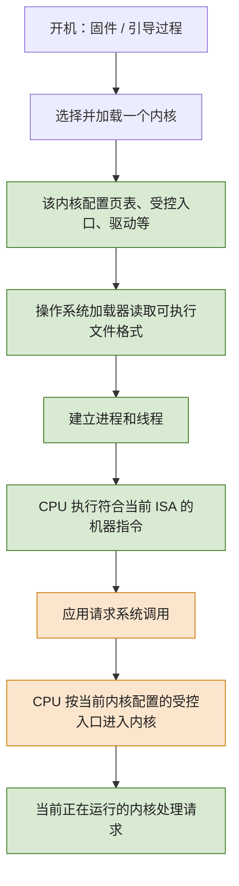
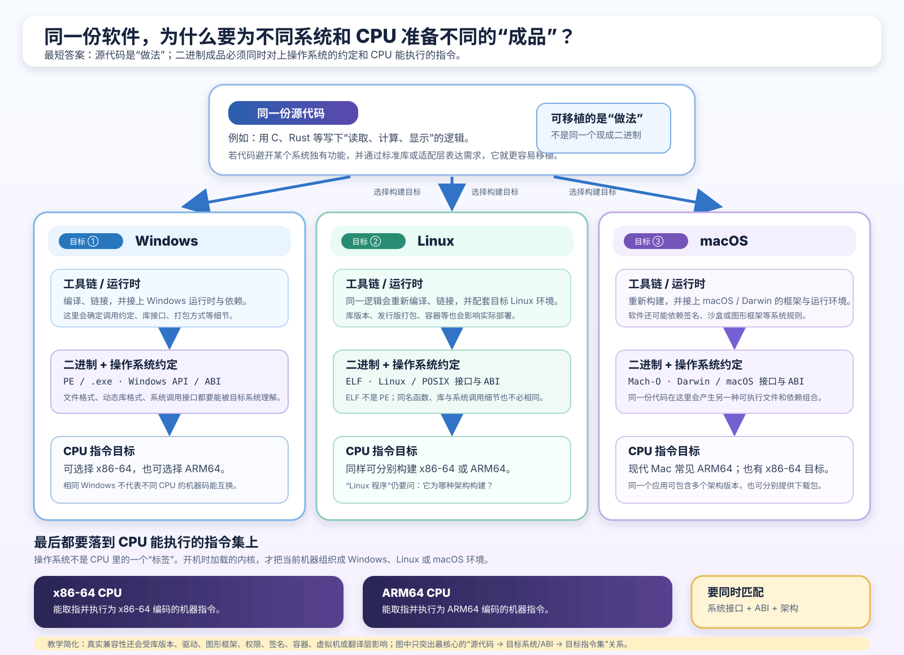
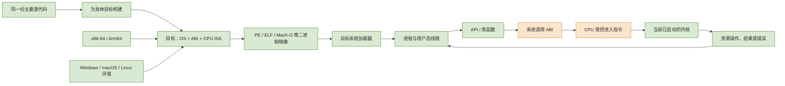

# 第 6 章：不同系统怎样运行同一份软件：平台、ABI、可执行文件与 CPU 架构

[返回仓库首页](../README.md) · [查看知识地图](00-operating-system-knowledge-map.md) · [查看 Q006](../questions/README.md#q006不同操作系统系统调用abi可执行文件与-cpu-架构) · [先回顾系统调用慢动作](03-mmu-privilege-modes-interrupts-and-apis.md#64-一次系统调用怎样走完整一趟) · [回顾源码到机器码](02-cpu-context-registers-and-instructions.md#10-一段源代码怎样被电脑认识)

## 1. 这组问题到底在追问什么

你问的七件事表面上分散，其实都在追问同一个问题：**同一份“软件想做的事”，为什么到了不同电脑上，常常需要换一种成品、换一种说话方式，甚至换一种机器指令？**

先给七个最短答案。后面再把每一句拆开：

1. 你说的 “Mac 系统”通常指 **macOS**；Windows、macOS 和日常所说的 Linux 系统，都管理 CPU、内存、文件和设备，但它们提供的接口、库、打包方式和生态不同。
2. 系统调用是应用从用户态按规定入口请求内核服务的一次受控来回；它的慢动作已经补进[第 3 章](03-mmu-privilege-modes-interrupts-and-apis.md#64-一次系统调用怎样走完整一趟)。
3. “同一个软件”最常见的兼容方式是共享主要源代码，再分别为每个目标构建；同一个现成二进制文件能直接运行，是更严格的要求。
4. CPU 不会判断“这是谁家的系统”。它只执行自己支持的机器指令，并按当前已经启动的内核配置好的入口和保护规则工作。
5. ABI 是编译后的二进制部件之间的交接规则：参数怎样交、返回值放哪、栈怎样用、库怎样链接等。
6. `.exe` 是 Windows 中常见的可启动程序扩展名；它不等于所有系统的可执行文件，也不保证任何 `.exe` 都能在当前机器启动。
7. x86-64 和 Arm64 是不同的 CPU 指令集目标；同一段 C 或 Rust 逻辑会被编译成不同的机器码。

### 1.1 先放进一个具体场景

假设你写了一个很小的“记事本”程序：读取 `note.txt`，算出字符数，显示到窗口，再保存文件。它的**逻辑**可以相同，但你准备发布三份原生版本：

| 目标 | 需要准备的成品 | 为什么不能直接拿另一份顶替 |
| --- | --- | --- |
| Windows x86-64 | Windows 可加载的 PE 映像、Windows 的库与 ABI、x86-64 指令 | Linux/macOS 的加载器、库接口和文件格式不同 |
| Linux Arm64 | Linux 常见的 ELF 映像、Linux 环境的库与 ABI、Arm64 指令 | 即使功能相同，Arm64 CPU 也不能直接执行 x86-64 机器码 |
| macOS Arm64 | macOS 可加载的 Mach-O 映像、macOS/Darwin 的库与 ABI、Arm64 指令 | 同为 Arm64 也不自动拥有 Linux 或 Windows 的二进制接口 |

这一章学完后，你应该能：

- 说清 macOS、Windows 和“Linux 系统”在什么层次上不同；
- 用“应用 → 包装代码 → 受控入口 → 内核检查 → 返回”复述系统调用；
- 分开 API、ABI、CPU 指令集（ISA）和可执行文件格式；
- 看见 “Windows x86-64 PE” 或 “Linux Arm64 ELF” 时，知道至少要检查哪几层；
- 解释为什么 `.exe` 不是“所有可执行文件”的同义词。

---

## 2. 先把 macOS、Linux、Windows 放到同一层

### 2.1 “Mac 系统”通常是 macOS；“Linux 系统”要多说半句

- **Mac** 是苹果的电脑硬件品牌；日常说的 “Mac 系统”通常是指运行在 Mac 上的 **macOS**。
- **Windows** 是微软的操作系统产品家族；它的系统核心属于 Windows NT 系列。
- **Linux** 严格说首先是内核名称。平时说“Linux 系统”往往是 “Linux 内核 + 发行版提供的库、命令、桌面、包管理器等”的组合，例如 Ubuntu 或 Fedora。

这不是在抠字眼，而是在避免误会：两个 Linux 发行版可以共享 Linux 内核，却在桌面环境、预装库、软件仓库或默认配置上不同。因此“它能在 Linux 跑吗？”有时还要继续问“哪个发行版、什么架构、哪些库版本？”

### 2.2 三者都做相似的工作，但给应用的约定不同

| 观察层次 | Windows | macOS | 日常所说的 Linux 系统 |
| --- | --- | --- | --- |
| 都在做什么 | 管理进程、内存、文件、网络、设备与权限 | 管理进程、内存、文件、网络、设备与权限 | 管理进程、内存、文件、网络、设备与权限 |
| 应用常接触的接口 | Windows API / Win32、.NET 等 | Apple 平台框架、Cocoa、POSIX 等 | POSIX、发行版提供的库、桌面框架等 |
| 常见原生可执行文件格式 | PE/COFF，常见启动文件名为 `.exe` | Mach-O，常见应用以 `.app` 包呈现 | ELF，常常没有统一文件后缀 |
| 常见动态库名称 | `.dll` | `.dylib` 或框架等 | `.so` 等 |
| 容易影响部署的差异 | 系统 API、DLL、签名/策略、驱动生态 | 应用包、框架、签名/沙盒、硬件平台 | 发行版、库版本、包管理器、桌面与驱动组合 |

不要把这张表读成“三者完全没有共同点”。例如 macOS 与许多 Linux 系统都有不少 Unix/POSIX 概念，源码往往较容易共享；但这并不让一个 Linux 的 ELF 文件直接变成 macOS 可加载的 Mach-O 文件。

> **现在只要记住：三种系统都在管理同一类资源；软件是否能直接跑，关键看它们给应用、库、加载器和硬件约定的规则是否对得上。**

---

## 3. CPU 不负责判断“这个应用属于哪个操作系统”

先纠正一个非常重要的画面：CPU 里没有一块地方写着“当前是 Windows”或“当前是 Linux”。CPU 也不会在每次启动应用时给它盖一个操作系统标签。

CPU 主要知道的是：

- 自己能解码哪一种**指令集**；
- 当前在用户态还是内核态等受保护执行状态；
- 当前内核已经配置好的内存翻译、异常/中断入口、系统调用入口等规则。

真正的分工更像这样：

### 3.1 “谁认识什么”要分开

| 对象 | 它主要认识或检查什么 | 它不负责什么 |
| --- | --- | --- |
| CPU | 当前 ISA 的机器指令、特权级、页权限、已配置的受控入口 | 解析 `.exe`/ELF/Mach-O 的文件结构；判断“软件品牌” |
| 操作系统加载器 | 文件头、目标机器类型、段/依赖/权限等装载信息 | 把不匹配的机器码变成另一种 ISA 的原生指令 |
| 内核 | 系统调用请求、资源、权限、进程调度、驱动协作 | 替应用自动修正所有逻辑错误 |
| 编译器 / 运行时 | 把源码或字节码变成可执行步骤，或解释/JIT 它 | 代替内核授予任意硬件权限 |

例如，一份 PE、ELF 或 Mach-O 文件先由目标系统的加载器按格式处理；进入进程内存后，CPU 才取出其中适合自己 ISA 的指令。**文件格式**和**CPU 指令集**是两层不同的要求。

### 3.2 用“保存文件”再看一次系统调用

当你的程序想保存 `note.txt`，它调用 API 或库函数；需要内核服务时，包装代码按当前系统调用 ABI 准备请求，CPU 执行受控进入指令，跳到**已经启动的那个内核**配置的入口。CPU 没有先问“这是 Linux 的保存还是 Windows 的保存”。

这就是为什么“系统调用怎样实现”必须和用户态、内核态、模式位连起来理解。请先读[第 3 章 6.4 节的慢动作图](03-mmu-privilege-modes-interrupts-and-apis.md#64-一次系统调用怎样走完整一趟)：它把参数准备、受控进入、内核检查、可能阻塞与受控返回都画出来了。

### 3.3 非 Mermaid 图：同一份逻辑怎样落到不同目标

这张图由本仓库为 Q006 原创绘制，未使用第三方图片。按从上到下的顺序观察：

1. 最上方的“同一份源代码”是你写下的主要逻辑；它更像一份可以交给不同厨房的食谱。
2. 中间三列不是把同一个二进制复制三次，而是分别选择目标、重新编译/链接，并接上各自系统的运行库、API 与 ABI。
3. 每列的 PE、ELF、Mach-O 是加载器需要看懂的**文件格式**；每列最下方的 x86-64 或 Arm64 是 CPU 必须能执行的**机器指令目标**。
4. 右下角“要同时匹配”是重点：一个原生二进制能直接运行，通常既要对上操作系统环境，也要对上 CPU 架构。

它省略了动态库版本、签名、图形框架、容器、虚拟机、兼容层和翻译器等分支；这些会在第 7 节作为“额外帮助”出现，而不是推翻这条主线。

> **现在只要记住：CPU 不识别操作系统名字；加载器识别二进制格式，CPU 执行目标 ISA 的机器指令，内核处理受控的系统服务请求。**

---

## 4. ABI：编译后的程序怎样彼此接得上

### 4.1 先用两个独立编译的函数理解它

设想你把程序分成两部分：`main.c` 负责调用 `add(a, b)`，`math.c` 负责实现 `add`。它们可以分别编译，最后再链接到一起。

那么两边必须对“把 `a` 和 `b` 交过去”达成一致：是放进哪个寄存器？返回的结果去哪里？函数调用中谁负责恢复哪些寄存器？栈要留多少空间？如果两边各自猜一套规则，哪怕函数名都写对，也可能拿错数或破坏调用现场。

**ABI（Application Binary Interface，应用二进制接口）**就是这类“编译完成后，二进制部件怎样交接”的规则集合。你可以先把它当作机器码世界的快递面单格式。

### 4.2 API、ABI、ISA、文件格式和系统调用 ABI 不要混成一个词

| 名词 | 人话 | 主要面对谁 | 例子 |
| --- | --- | --- | --- |
| API | 源码层“怎样调用一个能力”的约定 | 写程序的人、库作者 | `open(path)`、`ReadFile(...)` 的函数名、参数和语义 |
| ABI | 编译后“二进制怎样交接”的约定 | 编译器、链接器、二进制库 | 参数寄存器、栈对齐、结构体布局、动态库符号 |
| ISA | CPU “能听懂哪些指令”的规则 | CPU、编译器 | x86-64 指令、Arm64 指令 |
| 可执行文件格式 | 文件怎样装入机器码、数据和装载信息 | 加载器、链接器、工具 | PE、ELF、Mach-O |
| 系统调用 ABI | 用户态包装代码怎样把请求交给内核的二进制规则 | 库、CPU 入口、内核 | 调用号、参数位置、返回值/错误状态 |

它们是一条链，但不是同义词：应用先按 API 写代码；工具链按 ABI 与 ISA 生成二进制；加载器按文件格式建立进程；需要内核服务时，包装代码再按系统调用 ABI 走受控入口。

### 4.3 ABI 实际会约定什么

- 函数参数和返回值放在什么寄存器或栈位置；
- 哪些寄存器由调用者保存，哪些由被调用函数保存；
- 栈如何对齐；
- `int`、指针、结构体等数据怎样布局和对齐；
- 符号怎样命名、动态库怎样链接；
- 目标文件与可执行文件怎样组织；在用户态/内核态边界，还有相应的系统调用参数约定。

一个特别有用的反例是：两台机器都可能是 x86-64，但 Windows x64 ABI 与常见 Unix-like System V AMD64 ABI 的函数调用规则并不完全相同。于是“CPU 架构一样”仍不能推出“任意二进制库能直接混用”。

更准确一点：ABI 不是一张永远不变、全球通用的表

ABI 常由 CPU 架构、操作系统、编译器工具链和语言运行时共同约束。C 风格的稳定二进制接口与 C++、Rust、Swift 或带垃圾回收运行时的库接口，稳定程度也可能不同。遇到“这个库能否直接加载”时，要问清目标 CPU、操作系统、编译器/运行时和库版本，不能只看语言名称。

> **现在只要记住：API 告诉你源码怎么叫人帮忙；ABI 规定已经编译好的机器码怎样把话和数据真正交出去。**

---

## 5. `.exe` 文件就是可执行文件吗

最短答案是：**在 Windows 的日常语境中，`.exe` 常表示可启动的程序文件；但它既不是所有系统可执行文件的统称，也不是“这个文件一定能运行”的保证。**

把下面四件事分开，就不容易混乱：

| 你看到的东西 | 它到底说明什么 | 它还不能保证什么 |
| --- | --- | --- |
| `.exe` 扩展名 | Windows 常见的启动程序命名习惯 | 文件内容一定合法、当前 CPU/系统一定支持 |
| PE 映像格式 | Windows 加载器常见的可执行/对象容器格式，里面有头、代码、数据、依赖等信息 | 它一定适合当前机器的架构和系统策略 |
| 机器码 | CPU 最终取指执行的指令字节 | 文件怎样装载、依赖库是否齐全、权限是否允许 |
| “能启动” | 当前系统愿意装载它并能满足格式、架构、依赖、权限/策略等条件 | 程序逻辑一定正确，或一定没有运行时错误 |

这些格式名也有全称：PE 是 **Portable Executable**，ELF 是 **Executable and Linkable Format**，Mach-O 通常指 **Mach Object** 格式。PE 名称中的 “Portable” 不表示它能直接跨 Windows、Linux、macOS 运行；它仍需要匹配目标系统、架构和依赖。

### 5.1 为什么 Windows 常见 `.exe`，Linux/macOS 却通常不是

- Windows 常见原生程序文件名是 `.exe`，常见动态库是 `.dll`；`.dll` 里也可以有机器码，但它通常是给别的程序加载的组件，不是一个普通双击启动的完整应用。
- Linux 中的原生程序常是 ELF 文件，文件名可能没有扩展名；是否可执行还受文件权限和启动方式等影响。
- macOS 中常见的 `.app` 是一个应用包目录；真正要被装载的 Mach-O 可执行文件通常在包内部。
- 脚本文件、批处理文件或解释型文件也可能“能运行”，但它们通常先交给解释器或命令处理器，而不是由 CPU 直接把文本当作机器码执行。
- 有些 Windows `.exe` 还会依赖 .NET CLR 等运行时来继续处理其中的托管代码；所以看见 `.exe` 也不能直接断言“文件里的每一段都是当前 CPU 马上取指执行的原生机器码”。

所以，“可执行文件”是一个更宽的概念：**某个系统能按它自己的规则启动、装载或交给合适运行时处理的文件。** `.exe` 只是这个大类中的一个常见 Windows 名字。

### 5.2 用一个失败例子检查理解

如果把一个 `Windows x86-64 .exe` 直接复制到 `Linux Arm64` 机器上，至少可能有三层对不上：

1. Linux 的原生加载器主要期待 ELF，而不是 Windows PE；
2. 这份文件通常依赖 Windows 的 API、ABI 和 DLL 环境；
3. x86-64 机器码不能由 Arm64 CPU 原生执行。

兼容层、虚拟机或二进制翻译有时能补其中一部分缺口，但那不是“扩展名改一改”或“CPU 自动理解另一种指令”。

> **现在只要记住：`.exe` 是 Windows 常见的程序名字；真正能否启动要同时看文件格式、目标架构、依赖和系统策略。**

---

## 6. x86 与 Arm：同一个算法怎样变成两套机器指令

这里最好比较今天最常见的 64 位目标：**x86-64（也叫 AMD64 / Intel 64）**和**AArch64 / Arm64**。只说“x86”和“ARM”会把 32 位、64 位和许多历史版本混在一起。

两者都是 **ISA（Instruction Set Architecture，指令集架构）**：它规定一段机器码怎样表示加法、跳转、访问内存、调用函数，以及 CPU 的寄存器和异常/特权机制怎样工作。

| 维度 | x86-64 | AArch64 / Arm64 |
| --- | --- | --- |
| 能直接执行的机器码 | x86-64 编码的指令 | Arm64 编码的指令 |
| 指令编码直觉 | 指令长度可变 | 常见 A64 指令长度为固定 32 位 |
| 寄存器与调用规则 | 有自己的寄存器命名和 ABI 约定 | 有自己的寄存器命名和 ABI 约定 |
| 特权/异常模型 | 有自己的特权级与入口机制 | 常见以 Exception Level（如 EL0/EL1）描述 |
| 能运行哪些操作系统 | 取决于系统是否为 x86-64 构建 | 取决于系统是否为 Arm64 构建 |

编译器可以把同一段 `total = a + b` 的 C/Rust 逻辑分别翻译为 x86-64 或 Arm64 指令；它们完成的**逻辑目标**相似，但指令字节、寄存器使用和调用约定不同。CPU 只能原生解码自己的那一种。

### 6.1 不要把 CPU 架构和操作系统品牌绑死

- x86 不等于 Windows：Linux、Windows、macOS 都曾或可在 x86-64 机器上运行。
- Arm 不等于手机或 macOS：Windows、Linux、macOS 等都可以有 Arm64 版本。
- 64 位也不等于同一份机器码：x86-64 和 Arm64 都是 64 位，却仍是不同 ISA。

常见的 “x86 比 Arm 更快” 或 “Arm 天生只省电” 都太粗糙。功耗和性能还取决于具体芯片设计、制程、频率、内存、散热、操作系统调度和工作负载。ISA 名称本身不能直接给出答案。

> **现在只要记住：x86-64 与 Arm64 是两种 CPU 语言；同一份源码可以分别翻译，但一套机器码不能被另一套 CPU 原生当作自己的语言读懂。**

---

## 7. 相同软件怎样在不同系统下兼容

“相同软件”至少可能指三件不同的事：

| 你说的“相同” | 实际意思 | 最常见的兼容方式 |
| --- | --- | --- |
| 同一份主要源代码 | 业务逻辑相同 | 分别为不同目标重新编译、链接和测试 |
| 同一个产品 | 用户看到相同功能和界面 | 发布多份原生版本，或使用跨平台框架/运行时 |
| 同一个二进制文件 | 文件字节完全相同 | 要同时匹配 OS、CPU ISA、ABI、动态库和策略；要求最高 |

### 7.1 最常见：重新构建 + 小的适配层

好的跨平台程序会尽量把“计算逻辑”与“平台差异”分开：

- 核心逻辑：文本处理、算法、数据结构，尽量使用语言标准库或可跨平台的库；
- 适配层：窗口、文件选择器、通知、路径习惯、权限申请、图形/音频/驱动调用等，针对各系统实现；
- 构建与测试：为 `Windows x86-64`、`Linux Arm64`、`macOS Arm64` 等具体目标分别产出和验证。

这就是“源码可移植”的主要含义，不是把 Windows `.exe` 原样拖到所有机器。

### 7.2 运行时、翻译器和虚拟机怎样帮忙

| 办法 | 它帮助解决什么 | 它没有自动消除什么 |
| --- | --- | --- |
| Python、JavaScript 等解释器/运行时 | 同一份脚本或字节码可在不同平台的运行时里执行 | 解释器/运行时本身仍必须是目标平台可运行的程序；原生扩展也可能不兼容 |
| JVM、.NET 等虚拟机/托管运行时 | 在各平台提供相近的执行环境 | 运行时、库、操作系统 API 仍需适配；不是所有 native 库都能直接复用 |
| 兼容层 / 二进制翻译 | 尝试把一个系统接口或一种机器码转换给另一个环境 | 可能有性能、功能、调试、驱动或版本边界；不是原生兼容 |
| 虚拟机 | 在宿主上模拟或虚拟一套可启动的客体系统 | 需要额外资源与配置；客体系统仍有自己的架构与内核规则 |

例如，某些 macOS 应用可以把多个架构的代码放进同一 Universal Binary，由系统选择匹配的一份；这仍是“准备了多份机器码”，不是一条指令同时属于 x86-64 与 Arm64。

更准确一点：容器不等于把任意系统二进制装进盒子就能跑

容器主要复用宿主内核；它能帮助打包 Linux 用户空间依赖，但不会天然把 Windows 内核接口变成 Linux 接口，也不会让 Arm64 CPU 原生执行 x86-64 指令。实际跨架构或跨内核兼容仍可能需要虚拟机、模拟或翻译层。

> **现在只要记住：跨平台最稳的办法通常是“共享逻辑、分别构建、集中适配、逐目标测试”；运行时和翻译层是额外助手，不是魔法。**

---

## 8. 把 Q006 的七个问题重新接起来

把它读成一句话：**同一份主要逻辑可以针对不同“操作系统环境 + ABI + CPU 架构”构建成不同二进制；加载器建立进程，线程通过 API 和系统调用 ABI 请求当前内核服务，CPU 只执行匹配 ISA 的指令。**

这条线又把之前的内容接上了：

- [第 1 章](01-from-program-to-process.md)解释可执行文件被装载后怎样成为进程；
- [第 2 章](02-cpu-context-registers-and-instructions.md#10-一段源代码怎样被电脑认识)解释源码、汇编、机器码与二进制的基础关系；
- [第 3 章](03-mmu-privilege-modes-interrupts-and-apis.md#64-一次系统调用怎样走完整一趟)解释用户态请求如何受控进入内核；
- 本章补上“不同目标为什么要有不同成品，以及 API、ABI、文件格式、ISA 怎样分工”。

---

## 9. 常见误区速查

| 容易说错的话 | 更准确的说法 |
| --- | --- |
| CPU 会识别当前是 Windows 还是 Linux | CPU 按 ISA、特权状态和内核已配置的入口工作；系统品牌不是 CPU 逐应用识别的标签 |
| PE、ELF、Mach-O 就是 CPU 架构 | 它们是二进制文件格式；x86-64、Arm64 才是 CPU 指令集目标 |
| 两台都是 x86-64，就一定能直接互跑二进制 | OS 的加载器、ABI、系统 API、动态库、策略和版本仍可能不同 |
| `.exe` 就是所有可执行文件 | `.exe` 是 Windows 常见扩展名；Linux/macOS 的可执行形式不同，脚本也可能通过运行时执行 |
| 把文件改成 `.exe` 就能让它可执行 | 扩展名不能把任意字节变成有效 PE、正确机器码或满足依赖的程序 |
| API 和 ABI 是同义词 | API 偏源码调用约定；ABI 偏编译后二进制交接规则 |
| Arm 只能跑手机系统，x86 只能跑 Windows | 操作系统与 ISA 是不同维度；多种系统都可为多种架构构建 |
| 用 Python/JavaScript 就完全不需要关心平台 | 脚本更容易共享，但解释器、原生模块、系统路径、库和权限仍有平台差异 |
| 兼容层或虚拟机证明二进制天然兼容 | 它们是在中间补了转换或另一个环境，仍有边界和代价 |

## 10. 情境自测

### 题目

1. 为什么把一份 Windows x86-64 `.exe` 复制到 Linux Arm64 机器，不能只用“后缀不同”解释它无法原生启动？
2. 用一句话分别说明 CPU、加载器和内核在启动一个应用时“主要认识什么”。
3. `drawButton()` 是一个 API；它的参数如何放到寄存器或栈里，是哪一层更关心的问题？
4. 两台机器都是 x86-64，为什么一个为 Windows 构建的二进制库仍可能不能直接给 Linux 程序加载？
5. 用户程序执行系统调用时，是它自己获得内核权限，还是内核代表它处理请求？
6. `.dll`、`.exe`、ELF、Mach-O、Arm64 分别处在“扩展名 / 文件格式 / CPU 架构”的哪一层？
7. 为什么 Python 脚本常比本机 `.exe` 更容易跨平台，但仍不能承诺“到处不改就跑”？
8. 某个翻译层让 x86 程序在 Arm 设备上运行，这说明 CPU 原生学会了 x86 指令吗？为什么？

展开参考答案

1. 至少有文件格式/加载器、操作系统 API/ABI/依赖、CPU ISA 三层可能不匹配；`.exe` 只是其中一个表面名字。
2. CPU 主要执行当前 ISA 指令并遵守受保护状态；加载器解析文件格式和装载信息；内核管理进程、权限、系统调用和资源。
3. ABI 更关心。API 先描述源码怎样调用，ABI 再规定已编译机器码怎样传递参数和返回结果。
4. 因为相同 ISA 不代表相同 OS ABI、可执行/动态库格式、系统 API、动态库和加载规则。它们也需要对得上。
5. 内核代表它处理请求。应用只能走受控入口；内核仍会验证参数、权限和用户地址，并可拒绝请求。
6. `.dll`、`.exe` 常是 Windows 文件扩展名；ELF、Mach-O 是文件格式；Arm64 是 CPU 架构/ISA 目标。`.dll` 常是可被加载的库，不等于普通启动程序。
7. 因为不同平台只要安装了合适解释器，往往可运行同一脚本；但解释器本身、原生扩展、系统 API、路径、权限和第三方依赖仍可能不同。
8. 不说明。翻译层或模拟器在中间把指令或接口转换了；Arm CPU 原生仍只解码 Arm64 指令。

## 11. 下一步怎样复习

1. 在纸上写出 `Windows x86-64 PE`、`Linux Arm64 ELF`、`macOS Arm64 Mach-O`，并在每一行标出“OS 环境、CPU ISA、文件格式”三层。
2. 不看图复述一次：“应用 API → 系统调用 ABI → 受控进入 → 内核检查 → 可能阻塞 → 受控返回”。
3. 找一个你电脑上的 `.exe`，用本章的四层表解释：扩展名、文件格式、机器码、是否能启动分别不是一回事。
4. 用自己的话区分“同源代码”“同产品”“同一二进制文件”这三种“相同软件”。
5. 完成后更新[Q006 的复习记录](../questions/README.md#q006-后续复习记录)。

官方进一步阅读（首轮可跳过）

- [Microsoft PE Format](https://learn.microsoft.com/en-us/windows/win32/debug/pe-format)：Windows PE/COFF 映像的文件结构和目标机器字段。
- [Linux `syscall(2)`](https://man7.org/linux/man-pages/man2/syscall.2.html)：不同 CPU 架构的系统调用入口和参数约定为何不同。
- [Linux Kernel: What is Linux?](https://www.kernel.org/linux.html)：Linux 内核与发行版的说明。
- [Microsoft x64 calling convention](https://learn.microsoft.com/en-us/cpp/build/x64-calling-convention?view=msvc-170)：一个具体 ABI 的参数、寄存器和栈约定例子。
- [Arm A64 instruction set architecture](https://developer.arm.com/-/media/Arm%20Developer%20Community/PDF/Learn%20the%20Architecture/Armv8-A%20Instruction%20Set%20Architecture.pdf)：A64 指令、异常层级和 `SVC` 的架构资料。
- [Apple: Building a universal macOS binary](https://developer.apple.com/documentation/Apple-Silicon/building-a-universal-macos-binary)：一个文件中携带多套目标架构代码的官方例子。

这些是参考资料，不必第一遍逐页读完。本章先要求你能解释“为什么同源代码可以有多份目标成品，而 CPU 并不认识操作系统品牌”。

