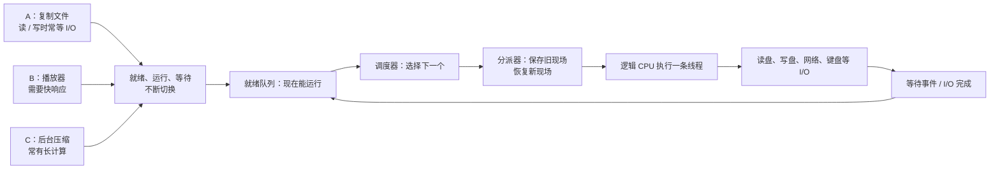
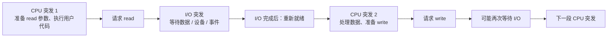
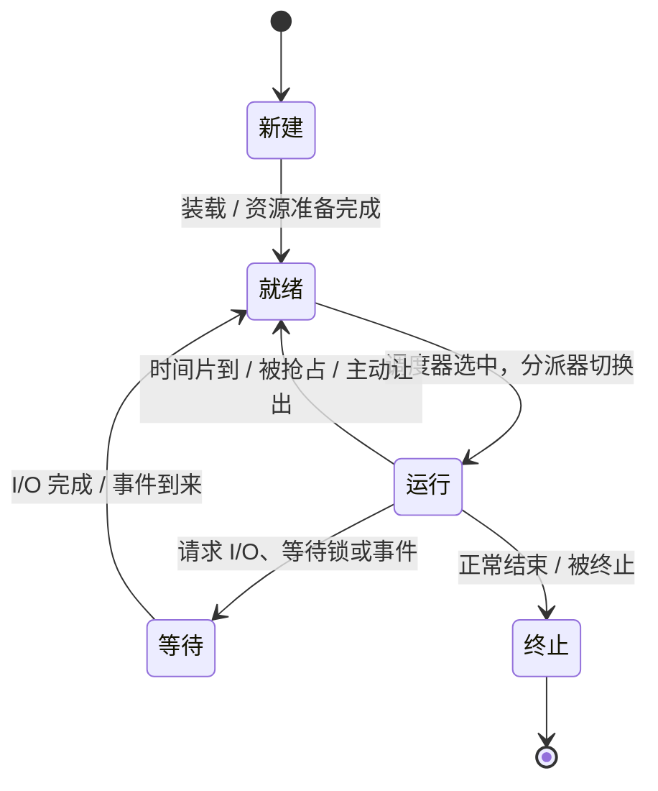
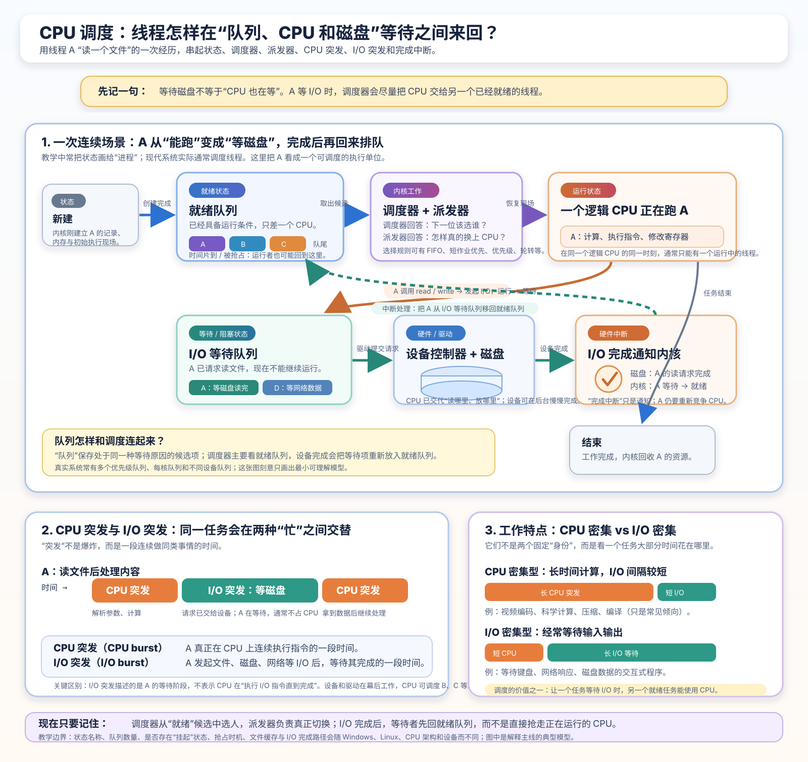
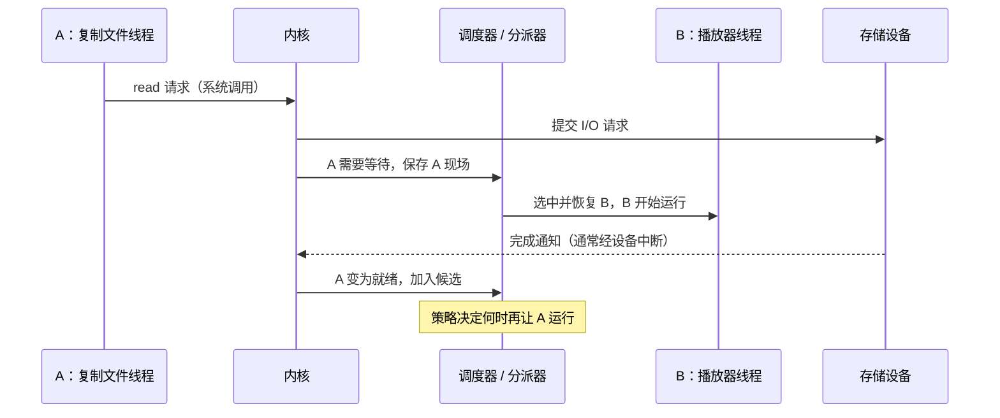
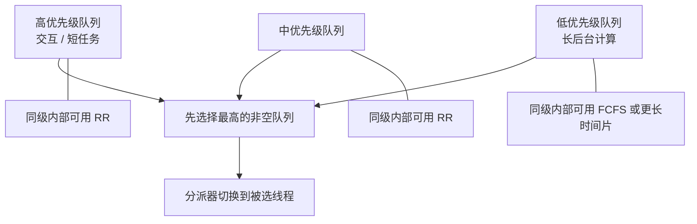
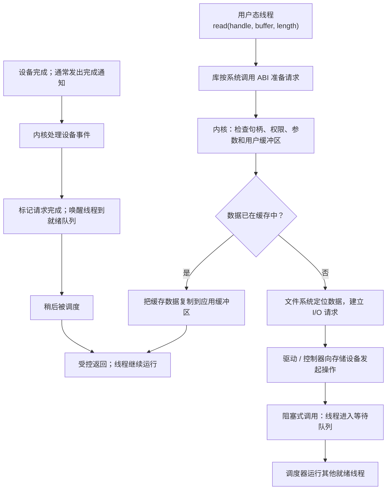

# 第 7 章：CPU 调度、进程状态、队列与 I/O

[返回仓库首页](../README.md) · [操作系统知识地图](00-operating-system-knowledge-map.md) · [问题档案 Q008](../questions/README.md#q008cpu-调度进程状态队列与-io) · [第 2 章：上下文切换](02-cpu-context-registers-and-instructions.md#7-cpu-如何进行上下文切换) · [第 3 章：系统调用与中断](03-mmu-privilege-modes-interrupts-and-apis.md#64-一次系统调用怎样走完整一趟) · [第 5 章：轮转基础](05-multicore-scheduling-and-threads.md#3-轮转调度把就绪队列真的转起来)

> 本章根据你的 Q008 问题，以及你提供的 P09《让电脑更流畅的调度算法》课程文稿整理。课程文稿没有提交到仓库，也没有逐字转载；下面的图、场景、解释和自测均为重新组织的原创学习材料。P09 对“文件复制为何会等待 I/O”给出了主线，本章在此基础上补充了文件缓存、文件系统、驱动和完成通知等必要连接，并明确标为扩展解释。

## 1. 这组问题到底在追问什么

你真正想弄清的，不只是“有几个调度算法”。你是在追问：

> 电脑同时开着播放器、浏览器、文件复制和后台任务时，谁决定下一瞬间 CPU 先帮谁？一个任务在等磁盘时，它的进度放在哪里？文件读到一半、时间片到期、I/O 完成后，任务又怎样重新排回去？

先把场景固定下来：

- **A：文件复制线程**。它每次读一小块源文件，再写到目标文件。
- **B：播放器线程**。它需要规律地醒来，及时处理音频数据。
- **C：后台压缩线程**。它可以连续计算很久，但用户不希望它让桌面卡住。

它们都想使用 CPU，可 A 经常等磁盘，B 很怕响应晚，C 又很能算。操作系统的调度机制，就是在这些不同需求之间做选择。



这张图先只看一条线：**能继续运行的线程排在就绪队列；暂时必须等事件的线程离开这条队列；调度器从就绪者中挑一个，分派器才真的把 CPU 切过去。**

### 1.1 学完这一章，你应该能做到什么

1. 看懂“CPU 使用率 100% 但电脑仍然流畅”为什么可能成立；
2. 用 A、B、C 演出一次“运行 → 等 I/O → 就绪 → 再运行”；
3. 分清 `FIFO` 这个队列规则，与 FCFS、SJF、RR、优先级等**选择策略**；
4. 解释抢占、时间片、调度延迟为什么都和上下文切换有关；
5. 用一条完整链路说明一次文件 `read` / `write` 为什么有时很快、有时会让线程等待；
6. 说清 I/O 密集和 CPU 密集不是给程序贴的永久标签，而是观察某段工作行为得到的画像。

### 1.2 先记住这三个不容易混淆的对象

| 你听到的词 | 先用人话理解 | 这里真正指什么 |
| --- | --- | --- |
| **调度器**（scheduler） | 决定“下一位谁上 CPU”的规则执行者 | 内核中根据状态、优先级、队列等挑选可运行线程的部分 |
| **分派器**（dispatcher） | 把“选中 B”落实成真的从 A 切到 B | 保存 A 的可恢复现场、恢复 B 的现场，并让 B 获得执行机会 |
| **上下文切换**（context switch） | 把 A 暂停时的进度收好，再拿出 B 的进度继续 | 主要涉及寄存器、程序计数器、栈指针、内核栈、可能的地址空间相关状态等 |

中文资料有时会把 scheduler 和 dispatcher 都叫“调度程序”，容易混淆。本章固定采用：**调度器负责“选谁”，分派器负责“真的切过去”。**

> **现在只要记住：调度不是让 CPU “搬到某个程序里”；而是内核选择一条可运行线程，并把 CPU 的执行现场切换到那条线程。**

## 2. CPU 突发、I/O 突发：为什么程序不会一直占着 CPU

### 2.1 什么是 I/O 操作

**I/O** 是 input / output（输入 / 输出）的缩写。先把它理解成：程序要和 CPU、内存以外的世界交接数据，或等待外部事件。

常见例子：

- 从 SSD、硬盘或 U 盘读文件；
- 把内容写入文件；
- 等网络包到来或把网络数据发出去；
- 读取键盘、鼠标输入；
- 把图像交给显示、声音交给声卡；
- 等待一个定时器、设备或内核事件。

“调用了系统调用”不自动等于“做了 I/O”。例如，请求内核分配虚拟内存和读磁盘文件都可能经过系统调用，但后者才是典型 I/O。本章把重点放在**文件、网络、输入设备等需要与设备或外部事件协作的操作**。

### 2.2 用复制两个 txt 文件的动作看见两个突发

把 A 简化成下面这件事。它不是完整 C 代码，只表示动作顺序：

```text
反复执行：
  读一小块 source.txt 到内存缓冲区
  把这小块写到 target.txt
```

在“准备参数、做循环判断、复制少量字节”时，A 正在实际使用 CPU。可一旦它请求的数据还没有准备好，或者需要等写入请求推进，A 就暂时没有下一步能做的有效计算。



| 名词 | 此刻电脑里在发生什么 | 不要误解成 |
| --- | --- | --- |
| **CPU 突发**（CPU burst） | 这条线程连续需要 CPU 执行指令的一段需求，例如计算、判断、准备下一次系统调用 | 固定长度的“时间片” |
| **I/O 突发**（I/O burst） | 线程暂时要等 I/O 或外部事件，无法继续完成这段工作 | CPU 正在替它慢慢读硬盘 |
| **时间片**（time quantum） | 轮转调度允许当前线程一次最多连续使用 CPU 的配额 | 程序天然的一次 CPU 突发 |

最容易混淆的是最后一行。假设 A 原本还需要 20 ms 的 CPU 工作，轮转调度给它 5 ms 时间片。5 ms 到了以后，A 的这段 CPU 工作会被**暂停并切成几次运行片段**；这不表示它的“需求”突然变成了四个天然独立的 CPU 突发。

### 2.3 I/O 密集和 CPU 密集是什么

| 观察到的工作模式 | 人话 | 常见现象 | 优化时首先要看什么 |
| --- | --- | --- | --- |
| **I/O 密集型**（I/O-bound） | 经常只算一小会儿，就要等磁盘、网络、用户或其他设备 | 很多较短的 CPU 突发，中间夹着较多等待 | I/O 延迟、缓存、并发请求方式、是否让等待线程让出 CPU |
| **CPU 密集型**（CPU-bound） | 很长时间都在计算，较少需要等外部设备 | 较长的 CPU 突发，例如压缩、渲染、科学计算 | CPU 性能、并行拆分、缓存/内存带宽、算法 |

这不是永久身份：

- 同一个进程里的 UI 线程可以很像 I/O / 交互型，而视频渲染线程很像 CPU 密集型；
- 同一条线程在不同阶段也会改变行为；
- “CPU 密集”不等于“不重要”，“I/O 密集”也不等于“优先级必然更高”。

调度器只是在观察到“短 CPU 突发、经常等待、对响应敏感”等信号后，尝试作出更合适的选择。

> **现在只要记住：CPU 突发是“这条线程此刻真需要算多久”，I/O 突发是“它现在不得不等多久”；等待 I/O 时，最有价值的动作通常是把 CPU 让给别的就绪线程。**

## 3. 进程（更准确地说：线程）会经历哪些状态

P09 用“进程状态”讲这个模型很适合入门。现实中的现代通用操作系统通常把**线程**作为可被 CPU 直接调度的对象，因此下图中的“进程”在需要精确时可读成“可调度线程”。进程仍然很重要：它通常拥有地址空间、打开文件、权限等资源；线程则带着自己的寄存器、PC、SP 和执行进度。



### 3.1 五个基础状态，逐个看

| 状态 | 人话 | 它在等什么 | 常见下一步 |
| --- | --- | --- | --- |
| **新建**（new） | 程序刚被启动，内核还在建立运行所需资源 | 装载、初始化、资源准备 | 变成就绪 |
| **就绪 / 可运行**（ready / runnable） | 所有条件都够了，只差一个逻辑 CPU 的执行位置 | CPU 时间 | 被选中后运行 |
| **运行**（running） | 它此刻真正在某个逻辑 CPU 上执行 | 不在等；正在执行 | 阻塞、被抢占、结束，或继续运行 |
| **等待 / 阻塞**（waiting / blocked） | 即使现在给它 CPU，它也不知道下一步怎么继续 | I/O 完成、锁、子进程、键盘输入、网络包等 | 事件到来后变回就绪 |
| **终止**（terminated） | 这条执行流已结束 | 不再等待 CPU | 内核回收剩余资源；有的系统会把清理过程分得更细 |

有两个关键分界：

1. **就绪不等于运行。**A 的磁盘读完了，它只是又具备运行资格；如果 B 当前正在运行，A 先回到就绪队列。
2. **被抢占不等于阻塞。**时间片到期时，A 仍然可以继续算，所以它通常从“运行”回“就绪”；它没有在等 I/O。

### 3.2 一次状态变化的慢动作

假设 A 正在复制文件，B 正在播放音频：

| 时刻 | A 的状态 | B 的状态 | 内核 / 调度器正在做什么 |
| --- | --- | --- | --- |
| 1 | 运行 | 就绪 | A 占用逻辑 CPU，B 在就绪队列中等 |
| 2 | 运行 → 等待 | 就绪 | A 发起需要等待的读取；内核把 A 关联到相应等待条件 |
| 3 | 等待 | 就绪 → 运行 | 调度器看见 CPU 可用，选择 B；分派器恢复 B 的现场 |
| 4 | 等待 → 就绪 | 运行 | 磁盘完成请求，设备通知内核；内核把 A 放回就绪队列 |
| 5 | 就绪 | 运行 → 就绪 | B 时间片到；若策略决定轮到 A，就切换过去 |
| 6 | 运行 | 就绪 | A 从上次系统调用返回后的正确位置继续 |

第 4 步特别重要：**I/O 完成只是“叫醒 A”，不是“把 B 从 CPU 上瞬移走”。**是否马上抢占 B，取决于当前策略、优先级和系统实现。

> **现在只要记住：就绪是在排队等 CPU；等待是在等一个条件；运行才是真正占着一个逻辑 CPU。**

## 4. 队列：调度如何和“排队”真正接上

### 4.1 队列里放的不是一个活生生的进程

你可以先把队列看成医院候诊名单。名单里不是病人本人，而是“这个人是谁、该等什么、从哪里继续”的记录。

操作系统里，教学材料常说把 **PCB**（进程控制块）放进队列。更准确一些：

- PCB 保存进程层面的管理信息，例如 PID、地址空间、打开资源等；
- 线程有自己的执行现场，现实内核往往还有 TCB 或类似的任务控制记录；
- 调度队列链接的是这些**内核管理记录**，不是把整个进程内存复制进队列。



图中请按这条路看：

1. 所有“现在能跑”的线程在**就绪队列**等待；
2. 一个逻辑 CPU 当前只运行其中一条线程；
3. 线程一旦请求尚未完成的 I/O，就离开就绪队列，进入与等待条件相关的等待队列；
4. 设备完成后，内核把它重新标成可运行，放回就绪队列；
5. 调度器再按规则选它，而不是设备直接把它塞进 CPU。

这张图是原创教学简化图，来源与边界见[图片说明](../assets/images/ATTRIBUTION.md#q008-scheduling-queues-and-iosvg)。真实内核可能为每个逻辑 CPU、优先级或设备维护更多队列；I/O 请求的设备队列也不等于“等待线程队列”。

### 4.2 常见队列分别负责什么

| 队列或记录 | 里面是谁 / 什么 | 什么时候进入 | 什么时候离开 |
| --- | --- | --- | --- |
| **就绪队列**（ready queue） | 已经可以执行的线程控制记录 | 新线程准备完毕、I/O 完成、被抢占、被唤醒 | 被调度器选中运行 |
| **等待队列**（wait / blocked queue） | 正在等某个特定条件的线程记录 | 发起会阻塞的 I/O、等锁、等事件 | 条件满足、超时或被取消后回就绪 |
| **设备请求队列** | 交给磁盘、网卡等设备或驱动处理的 I/O 请求 | 内核向设备提交请求 | 设备完成、失败或取消 |
| **当前运行记录** | 当前逻辑 CPU 正在运行的那条线程 | 分派器刚切换到它 | 阻塞、被抢占、退出或继续运行 |

最后一行为什么不叫“运行队列”？因为一个逻辑 CPU 某一时刻只执行一条线程。它有“当前是谁”的引用，但不是一长串排队者。多核机器则会同时有多个逻辑 CPU，各自有当前线程和常见的本地/共享就绪队列设计。

### 4.3 哪些事件会让调度器重新有机会工作

| 发生的事 | 当前线程状态怎样变 | 调度器为什么可能重新选择 |
| --- | --- | --- |
| 线程请求会等待的文件读取、网络读取、锁或事件 | 运行 → 等待 | 它自己暂时无法继续，CPU 可给其他就绪线程 |
| 线程正常退出 | 运行 → 终止 | 当前执行位置空出来 |
| 时间片到期 | 运行 → 就绪（通常） | 抢占式策略要防止一条线程长期独占 CPU |
| I/O 完成或事件到达 | 等待 → 就绪 | 新出现一个可运行候选者；是否立刻抢占当前线程取决于策略 |
| 高优先级线程变为就绪 | 等待 / 新建 → 就绪 | 某些抢占式优先级策略会马上重新评估 |

无论哪种情况，内核都必须先在受控入口中保存必要现场。有关“定时器中断让内核获得调度机会，但不保证必然切到另一线程”的慢动作，见[第 2 章](02-cpu-context-registers-and-instructions.md#76-q007-的关键分界进入内核不等于已经换了线程)。

> **现在只要记住：队列把“谁现在能跑、谁在等什么”变成内核可管理的名单；调度器只从就绪者里选，不能把仍在等磁盘的线程当作下一位。**

## 5. 调度器怎样工作：选择、分派、延迟与抢占

### 5.1 一次典型调度的七步

仍以 A 等磁盘、B 等待运行来演出：

1. A 在用户态运行，执行到一次可能阻塞的 `read`；
2. A 通过系统调用受控进入内核，内核检查句柄、参数和权限，并提交必要的 I/O；
3. 若数据还不能得到，A 从运行态变为等待态；
4. 内核保存 A 将来继续需要的执行现场，并把它关联到等待条件；
5. **调度器**查看就绪队列和当前策略，选中 B；
6. **分派器**恢复 B 的 PC、寄存器、栈等现场，让逻辑 CPU 开始执行 B；
7. 日后设备完成，外部硬件中断让内核知道 A 可以醒来；A 回到就绪队列，等待下一次被选中。



这幅时序图没有把“读文件”写成 CPU 一直忙着等磁盘。等待期间，CPU 可以执行 B；设备自己或其控制器也在推进 I/O。

### 5.2 什么是调度延迟

**调度延迟**（常与 dispatcher latency / 分派延迟关联）是指：内核决定停止 A 后，到 B 真正开始运行之间花掉的那一小段时间。

它可能包含：

- 进入内核、保存 A 的寄存器和控制状态；
- 选择 B 所需的少量调度工作；
- 恢复 B 的状态，必要时改变地址空间相关状态；
- 执行受控返回，让 CPU 从 B 的 PC 位置继续。

这段时间不是“某个应用完成了有用工作”，而是系统为了安全切换必须付出的管理开销。它必须尽量短，但不能把它想成一个所有系统都相同的固定数字；CPU 架构、缓存、是否跨进程、是否需要迁移到另一核、内核实现都会改变它。

### 5.3 抢占式和非抢占式：谁有权把 A 请下来

| 类型 | A 什么时候离开 CPU | 好处 | 主要风险 |
| --- | --- | --- | --- |
| **非抢占式调度**（non-preemptive） | A 自己阻塞、主动让出、完成当前 CPU 突发或退出时 | 简单，切换点少 | A 若长时间计算甚至死循环，别的可运行任务可能一直等 |
| **抢占式调度**（preemptive） | 内核可在合适时机强制暂停 A，例如时间片到期、出现更高优先级任务 | 保持交互响应，避免单个任务长期独占 | 切换和同步更复杂，频繁抢占也有开销 |

抢占常依赖定时器硬件：定时器到期发出事件，CPU 进入内核，内核才能安全评估是否重选。但请继续保留已学过的边界：**进内核 ≠ 一定换线程；定时器到 ≠ 一定换到 B。**

> **现在只要记住：调度器负责决定，分派器负责切换；调度延迟是切换本身的成本；抢占则是内核不必等当前线程自愿交出 CPU。**

## 6. CPU 调度都有哪些策略

先给出总览：下面是 P09 重点讲到的经典策略。它们是理解现代调度器的积木，不意味着每个现代系统都逐字实现其中某一个，也不意味着所有策略会按固定顺序轮流作用在同一条线程上。

| 策略 | 怎样选下一位 | 通常是否抢占 | 它特别照顾什么 | 典型问题 |
| --- | --- | --- | --- | --- |
| **FCFS / 先来先服务** | 最早进入就绪队列者先运行 | 常见教学模型是非抢占 | 简单、按到达顺序 | 长任务挡住短任务，出现车队效应 |
| **SJF / 最短作业优先** | 估计下一次 CPU 突发最短者先运行 | 经典 SJF 通常非抢占 | 降低平均等待时间 | 未来突发难预测，长任务可能饥饿 |
| **SRTF / 最短剩余时间优先** | 剩余估计最短者优先 | 是，属于抢占式 SJF 变体 | 新来的短任务可快速响应 | 更频繁重选，预测误差仍存在 |
| **RR / 轮转** | 同级就绪者按 FIFO 轮流拿时间片 | 是，时间片到会抢占 | 公平与交互响应 | 时间片太大像 FCFS，太小则切换过多 |
| **优先级调度** | 优先级高者先运行 | 可抢占也可非抢占 | 让重要/交互任务更快响应 | 低优先级可能饥饿 |
| **多级队列**（MLQ） | 先选哪个类别队列，再按该队列规则选 | 取决于设计 | 不同类型任务有不同待遇 | 固定归属不够灵活 |
| **多级反馈队列**（MLFQ） | 任务会因行为在多级队列间升降 | 通常可抢占 | 根据短突发、交互性等动态调整 | 规则多，参数和实现复杂 |

### 6.1 FIFO 是结构；FCFS 才是策略

**FIFO**（first in, first out）只说明队列的进出顺序：先入队的记录先出队。

**FCFS**（first come, first served）才是调度策略：调度器从就绪者里先服务最早到达者。

因此可以说“FCFS 常用 FIFO 就绪队列实现”，但不能把两个词当作完全同义词。

P09 中的一个重要修正是：FCFS 实际服务的通常是“下一段可运行 CPU 工作”，而不是“让一个进程从启动一直独占 CPU 到退出”。一个线程一旦开始等 I/O，就会让出 CPU，后面的就绪线程仍能运行。

#### 车队效应为什么会出现

想象就绪队列是 `[C, A, B]`：

- C 是 CPU 密集型，下一次要连续计算很久；
- A、B 是 I/O 密集型，只需很短 CPU 突发就能再次发起 I/O。

如果 C 先被 FCFS 选中且不可抢占，A、B 会在就绪队列中排长队。它们没能及时跑到“发起下一次 I/O”的那一步，设备可能也闲着。等 C 终于去等自己的 I/O，A、B 又快速运行、一起去等 I/O，随后 CPU 反而可能闲下来。这一串“所有人跟在一辆慢车后面”的现象叫**车队效应**（convoy effect）。

FCFS 不是错误算法；它非常容易理解和实现。但它没有利用“短 CPU 突发通常很多、长 CPU 突发通常少”这个工作负载特点。

### 6.2 SJF：优先让短下一段 CPU 工作通过

**最短作业优先**（shortest job first，SJF）更准确的人话是：

> 从就绪者中挑“预计下一段 CPU 突发最短”的那条先运行。

若两个估计相同，常用 FCFS 打破平局。它通常用优先队列实现，优先级依据是预计突发时长。

为什么它有吸引力？在一个已知或能准确估计下一次 CPU 突发长度的教科书模型里，它能使一组任务的**平均等待时间**最小。让几个只需几毫秒的任务先过，往往只会让那个要算很久的任务晚开始几毫秒，却能大幅减少短任务的排队时间。

但内核没有水晶球。程序下一步走多少循环、用户会输入多少字符、网络何时返回，都会影响下一次 CPU 突发。常见的近似是用历史观测做**指数平均**：

```text
下一次估计 = α × 最近一次实际突发
           + (1 - α) × 上一次估计
其中 0 ≤ α ≤ 1
```

- `α` 大：更相信最近一次表现；
- `α` 小：更相信较长的历史；
- 每条线程依据自己的历史估计，不是拿别人的 CPU 突发来预测自己。

**抢占版** SJF 通常叫 **SRTF**（shortest remaining time first，最短剩余时间优先）。A 已在跑，B 带着更短的剩余估计到来时，SRTF 可以抢占 A；非抢占 SJF 则让 A 结束当前 CPU 突发后再比较。

两种 SJF 都要面对饥饿：如果不断有更短的任务到来，长任务可能一直排不上。

### 6.3 RR：用时间片防止一人长期占用

**轮转调度**（round robin，RR）是抢占式调度的经典模型：

1. 同一等级的可运行线程以 FIFO 方式排在就绪队列；
2. 调度器取队首线程，给它一个时间片 `q`；
3. 若它在 `q` 用完前就阻塞或结束，CPU 立刻可交给下一位；
4. 若 `q` 到期它仍可运行，定时器给内核一个抢占机会；它通常回到就绪队列尾部；
5. 下一位取得自己的时间片。

这就是[第 5 章](05-multicore-scheduling-and-threads.md#3-轮转调度把就绪队列真的转起来)中 A、B、C 慢动作的完整策略位置。

| 时间片 | 会像什么 | 代价 |
| --- | --- | --- |
| 太大 | 很多线程都在被抢占前完成一段工作，RR 越来越像 FCFS | 其他交互线程等得更久 |
| 合适 | 同级线程能较快得到首次和后续响应，切换次数仍可接受 | 需要结合实际负载权衡 |
| 太小 | 看起来每人很快又轮到一次 | CPU 大量时间花在保存 / 恢复 / 缓存扰动上，吞吐量下降 |

在“固定的 `n` 个同级可运行线程（计入当前运行者）、没有新任务加入、忽略切换延迟”的简化模型中，一个刚进入就绪队列的线程首次运行前，最多可等约 `(n - 1) × q`。真实系统还会受动态到达、优先级、I/O 唤醒、多核和调度延迟影响，不能把这个式子当成所有情形的承诺。

### 6.4 优先级调度：先问“谁更急”

优先级调度给每个可运行线程一项优先级，然后优先选更高优先级者。

这里有三个必须说清的边界：

1. 有的系统数值越小优先级越高，有的反过来；不能只背“0 一定最高”。
2. 优先级调度既可以抢占，也可以非抢占。
3. “高优先级”不等于“更值得尊敬”，而是系统策略认为它更需要及时获得 CPU，例如交互任务、音频处理、重要系统服务或实时类工作。

它的危险是**饥饿**（starvation）：高优先级任务不断到来时，低优先级任务可能永远不能运行。

常见缓解办法叫**老化**（aging）：等待越久，优先级逐步提高。这样低优先级任务不必依赖“全世界刚好都空闲”才能得到 CPU。

### 6.5 多级队列和多级反馈队列：策略怎样组合，而不是互相打架

这是回答“这些调度算法如何紧密配合”的关键。



**多级队列**（multilevel queue，MLQ）先按类别把任务放进不同队列。例如：

- 前台交互队列内部用 RR，确保按钮、输入、播放器较快得到 CPU；
- 后台批处理队列可以给更长时间片，或采用 FCFS；
- 队列之间再用优先级或比例规则决定“这次先服务哪个队列”。

MLQ 的特点是：一个任务进入后，类别通常比较固定。简单，但不够灵活。

**多级反馈队列**（multilevel feedback queue，MLFQ）则让任务根据近期行为在队列之间移动：

1. 新来的任务先有机会进入较高优先级队列；
2. 它若很快主动等待 I/O，表现得像短突发 / 交互任务，常可留在较高层；
3. 它若反复用满时间片，说明需要较长 CPU 工作，可能被降到较低层并获得更长时间片；
4. 等待太久的低层任务可通过老化或周期性提升重新上来，防止饥饿。

短 CPU 突发只是调度器可以使用的行为线索，不是“这个任务一定更重要”的证明。I/O 密集和交互式也常有关联，但不是同一个概念；具体操作系统会结合自己的优先级规则、用户动作和其他信息。

所以“各种算法紧密配合”不是指：

```text
先跑一遍 FCFS → 再跑一遍 SJF → 再跑一遍 RR → 再跑一遍优先级
```

而更像：

```text
优先级 / 队列层级：决定先看哪一组任务
同级 RR：让同一组任务公平轮流
反馈规则：根据近期 CPU / I/O 行为调整任务所在层级
老化：防止长期等待者饿死
定时器中断：让抢占和重新选择有机会发生
```

SJF 也可以理解成一种“优先级依据是预测 CPU 突发长度”的思路。不同操作系统会采用不同组合；不要反推 Windows、Linux 或 macOS 的普通线程一定逐字使用这里某个教科书模型。

> **现在只要记住：FCFS、SJF、RR、优先级不是一串必须依次执行的按钮；现代调度思想更常把“先分组、再选组内下一位、再根据行为调整”组合起来。**

## 7. 调度到底想优化什么

“CPU 越接近 100% 越好”不完整。一个无限循环、忙等或错误重试也能让 CPU 满载，却没有给用户带来更多价值。

| 指标 | 人话 | 例子 |
| --- | --- | --- |
| **CPU 利用率** | 逻辑 CPU 有多少时间在忙 | 但忙可能是有用计算，也可能是无意义循环 |
| **吞吐量**（throughput） | 单位时间完成了多少任务 / 请求 | 服务器每秒完成多少请求 |
| **周转时间**（turnaround time） | 从任务进入系统到真正完成，一共花多久 | 批量压缩从开始到产出文件 |
| **等待时间**（waiting time） | 已经可运行，却在就绪队列里等 CPU 的累计时间 | A 的 I/O 已完成，却暂时排不上 CPU |
| **响应时间**（response time） | 请求提交到第一次得到可见回应花多久 | 点击菜单到界面开始有反应 |

交互式桌面更在乎响应时间；批处理任务可能更在乎吞吐量和周转时间；音频播放可能尤其怕错过及时处理的时机。调度没有一张“对所有任务永远最优”的成绩单，只能按目标和负载取舍。

### 7.1 为什么高负载下桌面仍可能流畅

回到 C 的后台压缩：

- C 可以在低优先级队列里持续吃剩余 CPU；
- B 的音频线程每次只需很短 CPU 突发，却需要很快重新得到机会；
- 调度器若能及时让 B 抢到 CPU，声音就不会轻易卡顿；
- 这时 CPU 仍可能接近 100%，但用户最敏感的任务保持低响应延迟。

这也解释了为什么“给每个任务一样多 CPU 时间”不一定是最好的体验。公平是一个目标，响应性是另一个目标，切换开销又是第三个目标。

> **现在只要记住：优秀调度不是单纯让 CPU 忙，而是在可接受的切换成本下，让该快响应的任务及时响应，让总体有效工作持续推进。**

## 8. 读写文件操作的底层原理：从 `read` / `write` 到完成通知

这一节是基于 P09“复制 txt 文件会等 I/O”的例子向下补的一层。它描述的是常见操作系统模型，不是 Windows、Linux 或 macOS 的逐指令实现。

### 8.1 先把“打开、读取、写入、保存”分开

| 动作 | 程序通常拿到什么 | 它并不自动保证什么 |
| --- | --- | --- |
| 打开文件 | 一个句柄（Windows 常见说法）或文件描述符（Unix 常见说法）等访问凭证 | 整个文件已进入内存 |
| `read` / 读取 | 一段字节被交到应用提供的内存缓冲区，或报告暂时无法得到 | 一定刚从物理磁盘读取 |
| `write` / 写入 | 应用请求把一段字节交给内核处理 | 字节已经永久落到存储介质 |
| 保存 | 应用把编辑缓冲区的修改提交到文件路径对应的存储链路 | 所有硬件写缓存都已完成持久化 |

“文件、句柄、应用缓冲区和未保存修改”的对象区分已经在[第 1 章](01-from-program-to-process.md#6-打开两个-txt文件到底发生了什么)建立；本节重点是它们怎样触发等待、唤醒和调度。

### 8.2 一次可能阻塞的读取，慢放成八步



按时间一步一步读：

1. **应用层**：A 调用库函数或运行时提供的读取 API，交出句柄 / 文件描述符、目标缓冲区地址和长度。
2. **受控进入内核**：若需要内核服务，包装代码按系统调用 ABI 准备参数，CPU 按规定入口进入内核。详情见[第 3 章的系统调用慢放](03-mmu-privilege-modes-interrupts-and-apis.md#64-一次系统调用怎样走完整一趟)。
3. **内核检查**：内核确认这个句柄指向什么、当前进程是否有权限、长度是否合理、应用提供的内存地址是否可以安全写入。
4. **先看缓存**：所需数据可能已经在内核缓存中。命中时不必再等物理磁盘，读取可能很快返回。
5. **缓存未命中时建立 I/O 请求**：文件系统把“文件的这个偏移量”转换为底层数据位置，交给驱动和设备控制器。
6. **线程等待而不是空转**：对于阻塞式读，A 当前没有数据可处理，就进入等待队列。分派器可以把 CPU 给 B 或 C。
7. **设备完成通知**：存储设备 / 控制器完成请求后，通常通过中断等机制通知内核；内核的驱动处理完成结果。
8. **唤醒与恢复**：内核把 A 变回就绪；调度器以后选中 A 时，系统调用返回读取结果，A 从正确的位置继续。

现代设备常能用 DMA（direct memory access，直接内存访问）等机制在设备与内存之间搬运大量数据，不需要 CPU 逐字节替它复制。这里不继续展开 DMA、IOMMU 或具体驱动队列；它们已经在知识地图中有位置，等你专门问到再深入。

### 8.3 写文件为什么“返回成功”不一定等于“已经落盘”

写入的常见路径也很像：应用把字节交给内核 → 内核检查并更新缓存 / 文件系统状态 → 之后由内核、驱动、设备把数据推向存储介质。

因此一次 `write` 返回成功，常常只说明“内核已接受这些字节并按接口语义处理”，不必然说明断电后仍能保存。想要更强持久化保证时，程序会使用平台提供的同步 / 刷新机制，例如 POSIX 环境中的 `fsync` 或 Windows 的相应刷新 API；具体保证还与文件系统、设备缓存和硬件有关。

这不是说“保存没用”，而是把两件事分开：

- **应用可继续工作**：内核已接受写入；
- **数据已稳定持久化**：要看后续缓存刷写与存储设备确认。

### 8.4 三种看起来不同的读写结果

| 情形 | A 会不会明显等待 | 为什么 |
| --- | --- | --- |
| 读取命中缓存 | 可能几乎不等 | 数据已在内存中，未必需要新设备操作 |
| 阻塞式读取且数据尚未就绪 | 常会等待 | A 不能继续处理所需数据，于是让出 CPU |
| 异步 / 非阻塞 I/O | 当前调用可能先返回 | 程序稍后通过回调、事件、完成队列或再次查询取得结果；底层仍要处理 I/O |

所以不能死记“`read` 一定让线程阻塞”或“`write` 一定立刻落盘”。真正要问的是：**数据是否已可用？接口是阻塞还是异步？缓存与持久化语义是什么？**

> **现在只要记住：文件读写是“应用提出请求 → 内核检查与缓存判断 → 必要时设备处理 → 完成事件唤醒 → 线程重新被调度”的链路；I/O 完成后先回就绪，不是直接绕过调度器占住 CPU。**

## 9. 常见误区速查

| 容易这样想 | 更准确的理解 |
| --- | --- |
| “FIFO 和 FCFS 是同一个词。” | FIFO 是队列的先入先出规则；FCFS 是按先到者先服务的调度策略，常用 FIFO 实现。 |
| “CPU 突发就是轮转时间片。” | CPU 突发是程序的计算需求；时间片是调度器施加的上限，能把一个突发切成多个片段。 |
| “I/O 完成后，线程马上继续执行。” | 它通常先从等待变成就绪；是否立刻运行仍看 CPU 是否空闲和当前策略。 |
| “被抢占说明它在等 I/O。” | 不对。抢占时它通常仍可运行，所以回到就绪队列。 |
| “调度器把整个进程推入队列。” | 队列链接的是 PCB / TCB 等内核管理记录；现代系统通常实际调度线程。 |
| “所有 I/O 都排在一个 FIFO 队列。” | 不同设备、驱动、请求类型和优先级会有不同队列与策略；教学图把它简化了。 |
| “读取文件一定读物理磁盘，写入返回一定已落盘。” | 缓存可能让读取很快；写入可能先进入缓存，持久化是另一层保证。 |
| “RR 是所有现代系统唯一的普通调度算法。” | RR 是重要基础；现实系统通常还叠加优先级、反馈、每 CPU 队列、实时策略和负载平衡。 |
| “CPU 100% 就说明调度最好。” | 还要看响应时间、吞吐、等待、能耗和工作是否真的有价值。 |

## 10. 情境自测

### 题目

1. A 在运行时请求磁盘读取，数据还没准备好；A 应从运行态变成就绪还是等待？为什么？
2. A 的读取完成了，但 B 正在运行。A 是否必然立刻运行？
3. 轮转调度中，A 用完时间片但仍能继续计算。A 会进入等待队列还是就绪队列？
4. 为什么说“CPU 突发”和“时间片”不能画等号？
5. 就绪队列里有 `[C, A, B]`，C 有一个很长的 CPU 突发，A、B 都只需很短 CPU 突发就能再次发 I/O。FCFS 可能出现什么问题？
6. SJF 为什么难以完美实现？指数平均试图补什么缺口？
7. 一个持续有高优先级任务到来的系统，低优先级线程会遇到什么问题？老化怎样缓解？
8. “优先级 + 同级 RR + 多级反馈”是先后执行三套独立算法吗？请用一句话说明它们各自扮演的角色。
9. 某次 `read` 很快返回，能否据此证明磁盘很快？为什么？
10. 某次 `write` 返回成功，能否据此证明突然断电后数据一定还在？为什么？
11. 一个进程的 UI 线程短小、常等待输入，渲染线程长时间计算。为什么它们不应被粗暴地贴上同一种“进程优先级”标签？
12. 定时器中断到来后，为什么不能直接说“CPU 一定切换到另一线程”？

<details>
<summary>展开参考答案</summary>

1. A 应进入等待 / 阻塞，因为即使给它 CPU，它也暂时没有所需数据继续工作。它离开就绪队列，让其他可运行线程得到机会。
2. 不必然。A 先变为就绪；B 是否被抢占取决于优先级、策略、是否还有空闲逻辑 CPU 等条件。
3. 通常进入就绪队列尾部。它没有在等待外部事件，只是本轮 CPU 配额用完了。
4. CPU 突发描述线程自然需要多少连续计算工作；时间片是调度器为了公平和响应性设置的最长连续运行配额。一个长突发可跨越多个时间片。
5. C 会像一辆慢车挡住 A、B；A、B 迟迟不能发起下一次 I/O，可能造成车队效应，CPU 和设备都未必被有效利用。
6. 内核不能预知程序接下来会循环多久、用户输入是什么或网络何时变化，因此无法知道真实下一次突发。指数平均用过去实际突发和旧估计做一个近似。
7. 它可能饥饿，长期得不到 CPU。老化会随着等待时间逐步提高其优先级，使它最终能被选中。
8. 队列优先级决定先服务哪组，同级 RR 决定这一组内怎样轮流，反馈规则决定任务因近期行为怎样在组之间移动。
9. 不能。数据可能早在内核缓存中，读取根本没有等待新的物理磁盘操作。
10. 不能。写入可能已被内核缓存接受，但设备缓存或实际介质的持久化尚未完成；需看接口的刷新 / 同步语义。
11. 调度对象通常是线程。UI 线程和渲染线程的响应需求与 CPU 突发模式不同，调度器可以按线程行为和优先级作出不同处理。
12. 定时器事件只让 CPU 受控进入内核并获得重新评估机会；内核可能发现没有更合适的就绪线程，于是恢复原线程继续运行。

</details>

## 11. 把 Q008 的问题重新接回知识体系

| 你的问题 | 本章回答位置 | 已连接的旧知识 |
| --- | --- | --- |
| CPU 调度有哪些策略？ | [第 6 节](#6-cpu-调度都有哪些策略) | 第 5 章的轮转直觉 |
| 调度器怎样工作、算法怎样配合、抢占和调度延迟是什么？ | [第 5 节](#5-调度器怎样工作选择分派延迟与抢占) 与 [第 6.5 节](#65-多级队列和多级反馈队列策略怎样组合而不是互相打架) | 第 2 章的上下文切换与第 5 章的时间片 |
| 读写文件的底层原理？ | [第 8 节](#8-读写文件操作的底层原理从-read--write-到完成通知) | 第 1 章的文件 / 句柄 / 缓冲区，第 3 章的系统调用与中断 |
| 什么是 CPU 突发和 I/O 突发？ | [第 2 节](#2-cpu-突发io-突发为什么程序不会一直占着-cpu) | 第 5 章的阻塞和 CPU 利用率 |
| 进程分哪些状态？ | [第 3 节](#3-进程更准确地说线程会经历哪些状态) | 进程、线程、PCB / TCB |
| 调度怎样和队列结合？ | [第 4 节](#4-队列调度如何和排队真正接上) | 上下文、就绪与等待 |
| 什么是 I/O、I/O 密集与 CPU 密集？ | [第 2.1、2.3 节](#21-什么是-io-操作) | 文件、网络、设备与多任务 |

### 下一次复习怎么做

1. 拿三张纸写 A（复制）、B（播放器）、C（压缩），再拿三张纸写“就绪、运行、等待”，手动演出第 3.2 节的六步。
2. 再加一张“时间片到期”卡：判断 A 应回就绪还是等待。
3. 用自己的话从 `read` 讲到“设备完成 → A 回就绪”，中间至少说出句柄、内核、缓存、等待队列、完成通知五个节点。
4. 选一个熟悉的应用，分别指出它可能有的 I/O 密集线程和 CPU 密集线程；不要只给整个应用贴一个标签。
5. 完成第 10 节后，在[Q008 的复习记录](../questions/README.md#q008-后续复习记录)写下实际结果。

本章已经详细回答了你本次问到的经典调度、状态、队列、文件 I/O 主线。实时调度、具体 Linux / Windows / macOS 调度器实现、负载均衡、CPU 亲和性、NUMA、I/O 调度器、DMA / IOMMU 细节、文件系统崩溃一致性和同步原语仍只保留在知识地图中；等你围绕其中一个继续提问，再从这里向下接。
