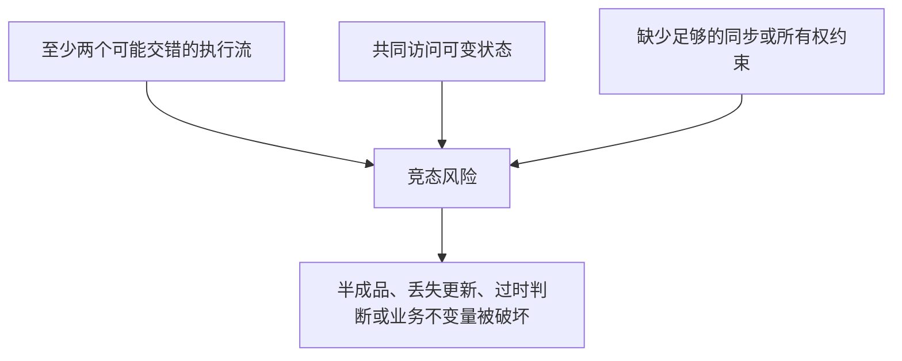
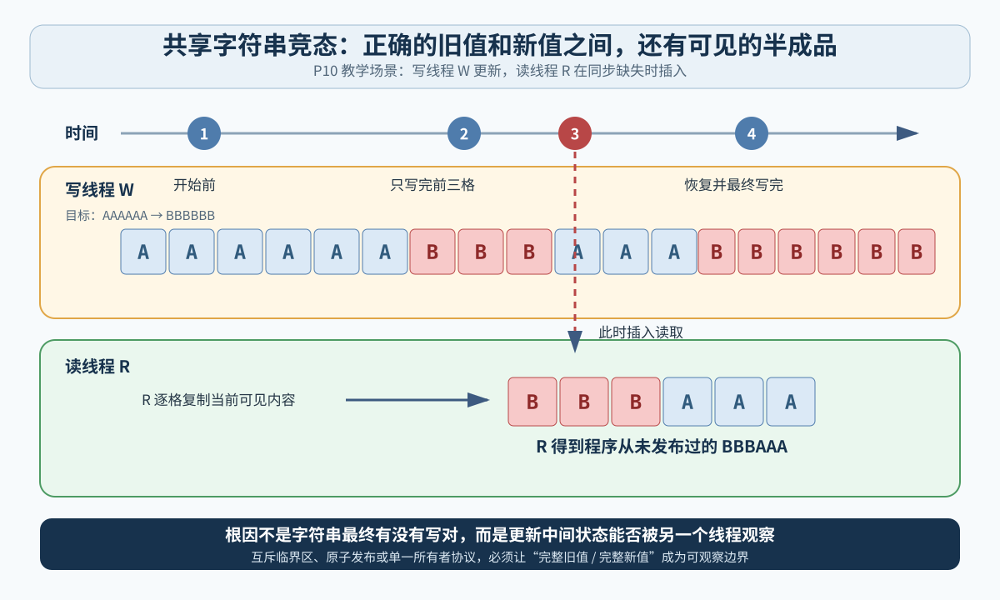

# 第 8 章：竞态条件、原子性与同步

[返回知识地图](00-operating-system-knowledge-map.md) · [返回问题档案](../questions/README.md#q009p10-竞态条件原子性与同步) · [上一章：CPU 调度、进程状态、队列与 I/O](07-cpu-scheduling-process-states-and-io.md) · [下一章：内存隔离、基址限长与分页保护](09-memory-isolation-base-limit-and-paging.md)

> 对应学习材料：P10《编程中最诡异的 Bug：竞态条件》。本章保留课程的共享字符串、共享计数器和普通标志变量三个核心场景，但使用重新组织的中文解释，不逐段转载文稿。

## 1. 这次要解决什么

你的原始要求是：

> 现在将 P10 和 P11 的视频文稿内容里面所有的核心知识点，整理进我的知识体系。

P10 实际在追问：**同一段代码单独运行明明没有问题，为什么让多个线程一起运行后，结果会偶尔出错，而且每次错法还可能不同？**

学完本章，你应该能够：

- 把一行 `count++` 拆成读取、计算、写回三个动作；
- 演出共享字符串为什么会被读成“新旧内容拼接的半成品”；
- 区分并发、并行、原子操作、竞态条件和更严格的“数据竞争”；
- 解释为什么“操作很短”“只有一个 CPU 核”“加一个普通布尔标志”都不能证明安全；
- 根据共享数据的形态，判断应优先减少共享、使用互斥量、使用原子读改写，还是改用消息传递。

> **先给结论：多个线程共享可变数据时，正确性不能依赖“它们大概不会刚好撞上”；必须由同步机制明确规定谁能访问、何时访问，以及更新何时对其他线程可见。**

## 2. 先放进一个能在脑中演出来的场景

假设一个 HTTP 服务器中有三条线程：

- **主线程**：继续接收新请求；
- **写线程 W**：定期把全局字符串换成下一句提示语；
- **读线程 R**：收到请求时复制这段字符串，并把副本发给客户端。

如果 W 和 R 各自只操作自己的数据，调度顺序通常不会改变结果。问题出现在它们共同访问同一块可变字符串时：

```text
旧字符串：AAAAAA
新字符串：BBBBBB
```

W 不是按一个不可分割的动作把六个字符全部换完。它可能先写好前三个字符，此时共享内存暂时是：

```text
BBBAAA
```

如果 R 恰好在这一刻复制，客户端就会收到程序从未打算发布的混合结果。

这不是字符串业务逻辑写错了，而是程序没有规定：**写线程更新期间，读线程能不能进入同一块共享数据。**

> **现在只要记住：只要别的线程能看见一次更新的中间状态，这次更新对整个程序来说就不是原子的。**

## 3. 一行源代码不等于一个 CPU 动作

### 3.1 把 `count++` 拆开

源代码写成一行：

```c
count++;
```

在常见的教学模型中，它至少包含三类动作：

```text
1. load：从内存读取 count 到寄存器
2. add：在寄存器中加 1
3. store：把新值写回内存
```

编译器可能选择不同指令，某些 CPU 也提供原子“读—改—写”指令；但**普通变量上的普通 `++` 不能仅凭外观被认定为跨线程原子操作**。

| 层次 | 看到的对象 | 能否据此断言原子 |
| --- | --- | --- |
| 源代码 | `count++` 一行 | 不能 |
| 编译结果 | 一条或多条机器指令 | 仍要看指令语义和内存模型 |
| 硬件执行 | 加载、计算、缓存一致性、写回等动作 | 只有架构明确保证的原子操作才可依赖 |
| 语言并发模型 | 原子类型、锁、先行发生关系 | 程序真正应依赖的契约层 |

### 3.2 字符串复制为什么更容易看到“半成品”

C 风格字符串通常是一串字符，末尾带空字符 `\0`。复制较长字符串时，程序要循环或分块搬运数据；即使 CPU 一次能复制多个字节，整个字符串仍可能需要多个步骤。

因此：

- W 已写完前半段，不代表后半段也完成；
- R 从头读到尾，也不代表这期间 W 没有继续修改；
- `printf`、网络发送或日志记录看到的，可能是跨越多个时刻取得的数据。

字符串只是为了把问题画得明显。结构体、数组、链表、对象的多个字段、文件元数据和“余额 + 交易状态”也可能存在同样的**跨字段不变量**。

### 3.3 “原子”到底是什么意思

原子操作（atomic operation）可以先理解为：**其他并发执行者不能观察到它只完成了一半；对它们而言，这个动作像一个不可再分的整体。**

但要加两条边界：

1. 一个变量的原子读写，不代表由多次原子读写组成的整个业务流程也是原子的。
2. 原子性只解决一部分问题；跨线程还要考虑可见性和顺序约束。

例如，`balance` 和 `status` 都使用原子变量，仍不自动保证另一线程一定同时看到“新余额 + 新状态”这一对一致快照。

## 4. 竞态条件到底是什么

**竞态条件（race condition）**是指程序的正确结果依赖多个操作之间没有被可靠约束的相对顺序或时机，而这些顺序又可能由调度、核心并行、系统负载和外部事件改变。

可以把风险压缩成一个三角形：



三点里最值得注意的是“共享可变状态”。并发本身不是错误：两个线程分别处理完全独立的数据时，即使顺序变化，结果也可能始终正确。

### 4.1 竞态条件与数据竞争不是完全同义词

日常讲解常把两者混用，但严格一点要分开：

| 名词 | 关注点 | 例子 |
| --- | --- | --- |
| 竞态条件 | 程序结果是否错误地依赖时序 | 两个线程都先检查“库存大于 0”，再各自扣减一次 |
| 数据竞争（data race） | 两个并发访问是否冲突且缺少语言规定的同步，其中至少一个是写 | 一个线程写普通全局整数，另一个线程同时读它 |

在 C 和 C++ 的语言内存模型中，普通内存上的数据竞争通常会导致**未定义行为**。这意味着不能只假设“最多读到旧值”；编译器优化和 CPU 执行都可能让结果超出这种朴素想象。

反过来，即使所有单次访问都使用原子类型，仍可能有较高层的竞态条件，例如“先检查余额，再扣款”在两步之间被另一个线程插入。

> **现在只要记住：数据竞争是更严格的内存访问问题；竞态条件是更广的时序正确性问题。消除数据竞争，不自动等于消除所有竞态。**

## 5. P10 的第一个核心案例：共享字符串被读成半成品



- 标题：共享字符串怎样在一次交错中变成半成品
- 来源：本仓库为 Q009 绘制的原创 SVG，无外部素材
- 应观察：W 写完前三格后停住，R 读取的不是完整旧值或完整新值，而是中间状态 `BBBAAA`
- 简化边界：真实字符串函数可能分块、向量化或被编译器优化；图只用于说明“多步更新可被其他执行流观察”

把图中的动作慢放：

| 时刻 | 写线程 W | 读线程 R | 共享字符串 |
| --- | --- | --- | --- |
| 0 | 尚未开始 | 尚未开始 | `AAAAAA` |
| 1 | 写第 1 个 `B` | — | `BAAAAA` |
| 2 | 写第 2、3 个 `B` | — | `BBBAAA` |
| 3 | 被抢占或另一个核心上的 R 同时运行 | 开始复制 | `BBBAAA` |
| 4 | — | 完成副本并发送 | R 得到 `BBBAAA` |
| 5 | 恢复并写完 | — | `BBBBBB` |

程序最终内存看起来是正确的 `BBBBBB`，但客户端已经收到错误快照。这说明**只检查最终状态会漏掉曾被别人观察到的中间状态**。

这个案例还揭示两个不同责任：

- 写线程必须把“一次发布”定义成完整事务或受保护的临界区；
- 读线程也必须遵守同一同步协议，不能只要求写线程“小心一点”。

## 6. P10 的第二个核心案例：共享计数器丢失更新

### 6.1 两个线程都从 10 开始

期望两个线程各发现一个质数后，`count` 从 10 变成 12：

| 步骤 | 线程 A | 线程 B | 内存中的 `count` |
| --- | --- | --- | --- |
| 1 | 读取 10 | — | 10 |
| 2 | 计算 11 | 读取 10 | 10 |
| 3 | — | 计算 11 | 10 |
| 4 | 写回 11 | — | 11 |
| 5 | — | 写回 11 | 11 |

两个“加一”都运行了，但最终只增加一次。这叫**丢失更新（lost update）**。

### 6.2 旧计算还可能覆盖更晚的新结果

P10 还给出更反直觉的情况：

1. A 读取 10，算出 11，但还没写回就暂停；
2. B、C、D、E 依次正确把计数更新到 14；
3. A 恢复后把自己早先算出的 11 写回；
4. 新值 14 被旧计算结果 11 覆盖。

这里不只是“少加一次”，而是**较晚发生的写入携带了较旧的逻辑状态**。

### 6.3 多核不需要等待一次抢占

在单核系统中，A 和 B 通过调度交错就能产生上述结果；在多核系统中，两条线程可以真正同时在不同逻辑 CPU 上运行，所以即使没有哪条线程恰好被时间片中断，也可能读取同一个旧值。

这把第 5、7 章的知识接了回来：

- **并发**：多个任务在重叠时间段推进，单核交错也可以；
- **并行**：多个执行单元在同一时刻真正执行；
- **竞态**：共享状态的正确性没有被同步规则保护；并发和并行都可能触发。

## 7. 为什么“时间很短”与“只有单核”都不能保证安全

P10 把竞态和抢占式调度连接起来是有帮助的，但根因不能写成“发生了中断”。真正的问题是：**程序允许冲突访问以未规定的顺序交错。**

一次很短的更新仍可能：

- 在时间片接近结束时才开始；
- 在系统调用、异常或设备事件处理前后被重新调度；
- 与另一个逻辑 CPU 上的线程并行；
- 被编译器重排为与源码直觉不同的访存顺序；
- 因缓存和内存模型，让另一个核心暂时看不到预期更新。

| 想当然的做法 | 为什么不是正确证明 |
| --- | --- |
| “这几条指令很快，不会撞上” | 概率低不等于不可能，且负载和硬件会变化 |
| “把时间片调长” | 不能消除多核并行，也不能建立内存顺序契约 |
| “关闭抢占” | 普通应用通常无权这样做；还会破坏响应性，且不能普遍解决多核问题 |
| “测试跑了一百万次没错” | 只说明这百万次没有观察到失败，不构成并发正确性证明 |

> **现在只要记住：调度器决定一次交错是否容易出现；同步规则决定交错出现时程序是否仍然正确。**

## 8. 为什么普通标志变量不是锁

假设新增一个普通变量：

```text
writing = 0：当前没人写
writing = 1：写线程正在修改字符串
```

读线程先检查 `writing`，如果是 0 再复制字符串。问题是“检查”和“开始复制”不是同一个不可分割动作：

| 时刻 | 读线程 R | 写线程 W |
| --- | --- | --- |
| 1 | 读取 `writing == 0` | — |
| 2 | 检查通过后被暂停 | — |
| 3 | — | 设置 `writing = 1`，开始改字符串 |
| 4 | 恢复，沿用刚才的判断并开始复制 | 写到一半 |

这叫**检查后使用（check-then-act）**窗口。即使单次读取和单次写入碰巧是原子的，两个动作组成的协议仍然有洞。

此外，普通变量还可能遇到：

- 线程继续使用寄存器或缓存中的旧值；
- 编译器认为没有合法的并发修改，从而重排或省略访问；
- 一个核心的写入没有按程序期待的时机对另一个核心可见。

`volatile` 通常也不能修补这些问题。它在 C/C++ 中主要用于特定外部可见访问等场景，不会自动提供互斥、原子读改写或完整的跨线程先后关系。

<details>
<summary>更准确一点：P10 提到的佩特森算法为什么不能随手照抄</summary>

佩特森算法展示了在非常具体的参与者数量和内存顺序假设下，软件怎样尝试实现互斥。它对学习“意愿标志 + 轮到谁”很有价值，但现代编译器和弱内存顺序 CPU 会让朴素源码版本需要额外的原子与内存序语义。

工程代码应优先使用语言运行时、标准库或操作系统提供的成熟同步原语，而不是凭普通变量重新发明锁。

</details>

## 9. 正确方向：先确定共享什么，再选择同步方式

P10 把具体同步工具留给后续内容。本章只补到足以解决三个课程案例的程度，不提前展开信号量、读写锁、无锁数据结构和死锁处理。

### 9.1 最优先：减少共享可变状态

如果每条线程处理自己的数据，最后通过消息汇总，就不需要让它们随时写同一个对象。

```text
每线程局部计数 → 任务完成后汇总
```

这通常比“所有线程不停修改一个全局计数器”更容易证明正确，也可能减少缓存争用。

### 9.2 互斥量：把多步不变量包进临界区

对于共享字符串，“复制完整新值”涉及多步，适合让读写双方遵守同一个互斥量：

```c
lock(mutex);
copy_or_read(shared_string);
unlock(mutex);
```

这段代码只表达概念，不是完整 API 示例。真正关键的是：

- W 修改期间，R 不能进入受保护区域；
- R 复制期间，W 也不能把对象改到一半；
- 解锁和随后加锁之间建立由同步原语定义的可见性与顺序关系。

### 9.3 原子读改写：适合单个简单状态

共享计数器可以使用语言/平台提供的原子递增，使“读旧值 → 加一 → 写新值”成为一个受保证的读改写操作。

但原子计数器不适合自动保护任意长字符串或多个字段组成的复杂不变量。**不要因为对象里每个字段都能原子访问，就推断整个对象始终是一致快照。**

### 9.4 不可变快照与发布

写线程可以先在私有位置构造完整新字符串，完成后再用受支持的原子引用/指针发布；读线程只读取已经完成的不可变快照。

这种方式仍要正确处理对象生命周期、原子发布和内存序，不能把“换一个指针”写成普通无同步赋值。

### 9.5 消息传递

让一个线程独占可变状态，其他线程通过队列发送“读取”或“更新”请求，可以把“谁能改状态”变成清楚的所有权规则。这和[第 4 章的消息传递](04-process-cooperation-ipc-ports-and-client-server.md#5-第二种常见机制消息传递)直接相连。

| 共享状态形态 | 首选思路 | 为什么 |
| --- | --- | --- |
| 每条线程可独立处理 | 线程局部数据，最后汇总 | 根本减少共享 |
| 一个简单计数器 | 原子读改写，或局部计数后汇总 | 操作边界清楚 |
| 多字段对象 / 字符串 | 互斥临界区或不可变快照 | 要保护整体不变量 |
| 一个状态机由多方请求修改 | 单一所有者 + 消息队列 | 集中修改权限和顺序 |

## 10. `pthread_create` 在这条链上处于哪里

P10 用 `pthread_create` 回顾线程创建。更准确地说：

- 它是 POSIX Threads API 中的库函数，不是 C 语言关键字；
- 它不是所有平台统一的一条“C 系统调用”；
- 具体实现会通过运行时和操作系统机制建立可调度线程；不同系统的底层入口并不相同；
- 调用成功后，创建者与新线程可以并发推进，谁先执行到哪一步不能靠源码排列猜测。

线程函数收到的参数、返回结果、共享对象生命周期以及何时 `join`，也都属于并发程序必须明确的协议。

## 11. 为什么这类 Bug 难以复现和调试

P10 最重要的工程直觉之一是：**发生概率越低的竞态，可能越危险。**

课程服务器在大量请求中只出现少量错误，这类问题常具有以下特征：

- 同一程序多次运行得到不同结果；
- 调试器、日志和断点改变线程时序，问题反而消失；
- 开发机器很少出现，高负载、多核或不同 CPU 上更容易出现；
- 最终坏值可能早已被覆盖，崩溃位置不是根因位置。

更可靠的排查思路包括：

1. 明确列出所有共享可变对象和每个访问者；
2. 写出对象必须始终满足的不变量；
3. 检查每次访问是否由同一锁、原子契约或消息协议约束；
4. 通过高并发、随机延迟和重复运行扩大调度组合；
5. 使用语言或工具链支持的线程竞态检测器；
6. 不把“这次没复现”当成修复证据，而要给出同步层面的原因。

测试能发现部分交错，不能枚举所有可能时序。并发正确性的核心仍是：**可以解释为什么任意合法交错都不会破坏不变量。**

## 12. 这三层保护不能互相替代

| 层次 | 保护什么 | 不能替代什么 |
| --- | --- | --- |
| MMU / 进程隔离 | 阻止一个进程默认读写另一个进程的地址空间 | 不阻止同一进程内线程互相写共享堆 |
| 锁、原子与消息协议 | 约束合法参与者访问共享状态的顺序和可见性 | 不负责文件权限或跨进程地址授权 |
| 业务规则与测试 | 保证余额、库存、状态机等含义正确 | 不提供硬件内存权限 |

所以 P10 和 P11 正好回答两个不同问题：

- P10：**已经有权访问同一块内存的线程，怎样避免彼此踩坏数据？**
- P11：**没有被授权的另一个进程，为什么连这块内存都碰不到？**

## 13. 常见误区速查

| 容易这样想 | 更准确的理解 |
| --- | --- |
| 一行代码就是一条 CPU 指令 | 一行可能变成零条、一条或多条指令；并发契约不能靠行数判断 |
| 一个整数读写是原子的，所以 `count++` 安全 | 读、加、写组成的读改写整体未必原子 |
| 只有多核并行才会有竞态 | 单核抢占和交错也足够产生竞态 |
| 没有发生中断，就不会竞态 | 多核可同时访问；编译器和内存模型也影响可见顺序 |
| 操作很短，失败概率可以忽略 | 低概率不等于正确，长时间和高负载会放大风险 |
| 普通布尔变量可以充当锁 | 检查与使用之间有窗口，变量本身也缺少同步语义 |
| `volatile` 可以解决多线程可见性 | 它通常不提供互斥、原子读改写或完整先后关系 |
| 使用原子变量后没有任何竞态 | 多步骤业务协议仍可能依赖错误时序 |
| 加锁范围越大越安全 | 过大范围会降低并发并增加死锁风险；范围应覆盖真正不变量，本章暂不展开死锁 |
| 测试没复现就说明没有问题 | 测试只采样了有限交错；应检查同步理由和共享状态所有权 |

## 14. 情境自测

### 题目

1. 两条线程分别操作完全独立的数组，即使执行顺序变化，也一定构成竞态吗？
2. 为什么 `count++` 看起来是一行，仍可能丢失更新？
3. 单核 CPU 上没有真正同时执行，为什么仍可能读到共享字符串半成品？
4. 两个核心同时执行普通 `count++`，是否必须先发生定时器中断才会出错？
5. 普通 `writing` 标志为何会在“检查通过”后失效？
6. 如果把 `count` 改成原子计数器，能否顺便保证另一个普通字符串也一致？
7. 互斥量保护共享字符串时，为什么读线程和写线程都必须遵守同一把锁？
8. “线程 A 写普通整数，线程 B 同时读”在 C/C++ 中为什么不能只按“可能读旧值”理解？
9. 日志加多后错误消失，能否说明日志修复了问题？
10. 共享字符串、共享计数器和每线程局部计数，分别更适合先考虑哪种同步/所有权思路？
11. MMU 为什么不能解决同一进程内两条线程的竞态？
12. 使用了原子变量，为什么“先检查库存再扣减”仍可能出错？

<details>
<summary>展开参考答案</summary>

1. 不一定。并发顺序变化本身不是错误；如果没有共享可变状态或外部顺序约束，结果可以始终正确。
2. 普通 `++` 往往包含读、加、写多个步骤。两个线程可能都读到同一个旧值，再各自写回相同新值。
3. 调度器可以在写线程完成多步更新前切换到读线程；读线程随后观察中间状态。
4. 不需要。两个核心可并行读取同一旧值并各自写回，竞态可以在没有相关抢占的情况下发生。
5. 检查和真正访问数据不是一个不可分割动作。R 检查后可能暂停，W 随后开始写；R 恢复后沿用过时判断。
6. 不能。原子计数器只约束该计数器的访问；字符串的一致性需要自己的同步协议。
7. 只有双方都遵守同一协议，锁住期间才不会有冲突访问。单方面加锁无法挡住不加锁的另一方。
8. 因为语言对数据竞争有更严格规则；普通冲突访问缺少同步时可能构成未定义行为，编译器不必只表现为读旧值。
9. 不能。日志改变了执行时间，可能只把问题隐藏起来，这正是并发 Bug 常见的“观察改变时序”。
10. 字符串是多步整体更新，可先考虑互斥或不可变快照；计数器可考虑原子读改写；局部计数优先减少共享，最后汇总。
11. MMU 允许同一进程线程访问该进程获准的页，不理解哪个线程此刻“应该”写某个对象。线程同步要由语言/运行时/程序协议完成。
12. 单次原子读写不自动把“检查 + 扣减”合成一个原子事务；两条线程仍可能都检查成功，再各自扣减。

</details>

## 15. 把 Q009 重新接回知识体系

| 这次要整理的核心点 | 本章位置 | 接回的旧知识 |
| --- | --- | --- |
| 一行源码为何不是一个不可分割动作 | [第 3 节](#3-一行源代码不等于一个-cpu-动作) | 第 2 章的寄存器、机器指令与执行上下文 |
| 共享字符串为何出现混合结果 | [第 5 节](#5-p10-的第一个核心案例共享字符串被读成半成品) | 第 1 章的地址空间、堆与线程共享数据 |
| 共享计数器为何丢失更新 | [第 6 节](#6-p10-的第二个核心案例共享计数器丢失更新) | 第 5 章的并发/并行与第 7 章的抢占 |
| 为什么短操作、单核和普通标志都不安全 | [第 7、8 节](#7-为什么时间很短与只有单核都不能保证安全) | 时间片、中断、上下文恢复和内存可见性 |
| 怎样建立正确同步方向 | [第 9 节](#9-正确方向先确定共享什么再选择同步方式) | 第 4 章的共享内存与消息传递 |
| P10 与 P11 的保护层次区别 | [第 12 节](#12-这三层保护不能互相替代) | 第 3 章的 MMU 与下一章的进程隔离 |

### 下一次复习怎么做

1. 不看正文，在纸上把 `count++` 写成 A/B 两线程的六步交错。
2. 用六个方格演出 `AAAAAA → BBBBBB`，指出 R 在哪一刻会读到 `BBBAAA`。
3. 对一个自己写过的多线程程序，列出“共享对象、读者、写者、同步机制、不变量”五列。
4. 分别解释为什么互斥量适合完整字符串、原子递增适合简单计数器、线程局部数据可以减少共享。
5. 完成第 14 节后，在[Q009 的复习记录](../questions/README.md#q009-后续复习记录)记录仍然不确定的地方。

本章已经展开 P10 直接触及的竞态、原子性、丢失更新、过时判断和基础同步方向。信号量、条件变量、读写锁、屏障、无锁算法、ABA 问题、完整语言内存序和死锁仍保留在知识地图中，等后续真实问题再继续深入。
