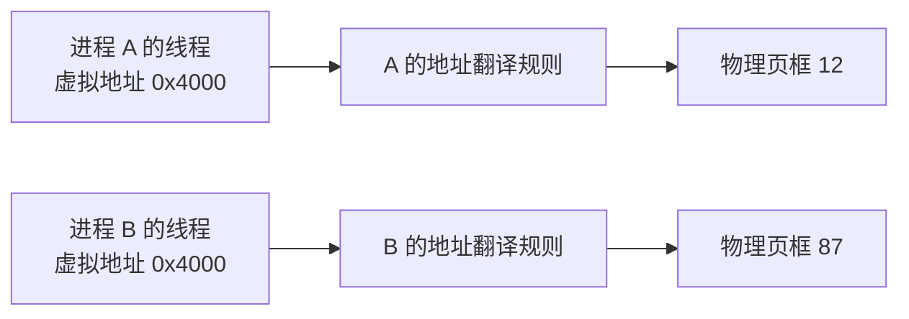
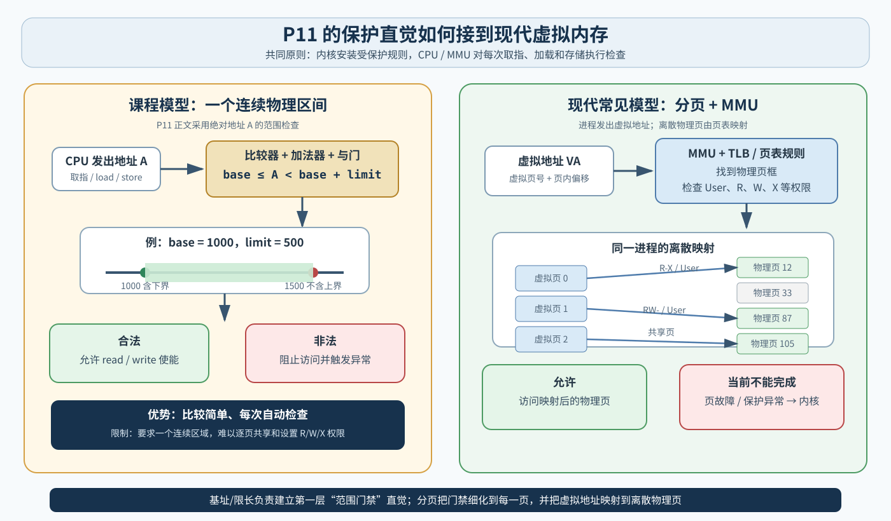
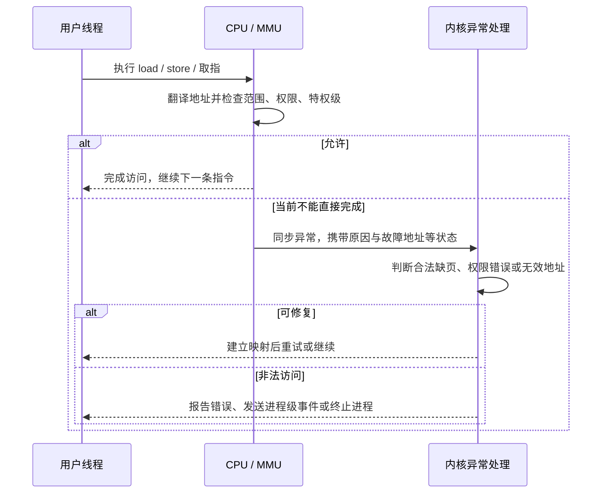
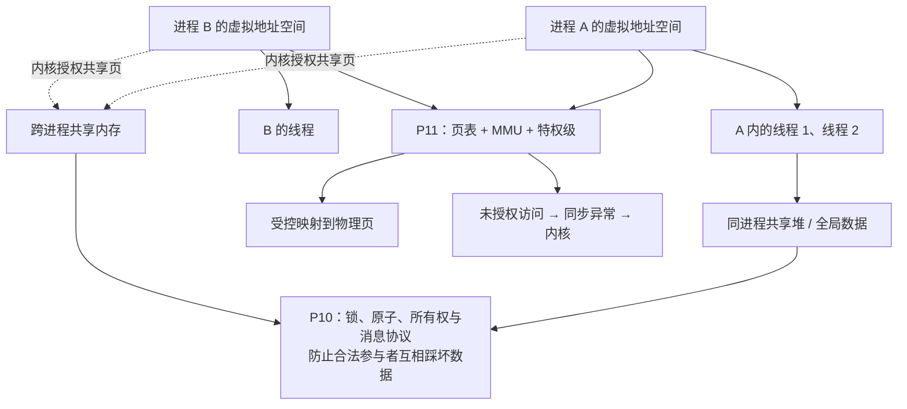

# 第 9 章：内存隔离、基址限长与分页保护

[返回知识地图](00-operating-system-knowledge-map.md) · [返回问题档案](../questions/README.md#q010p11-进程内存隔离基址限长与分页保护) · [上一章：竞态条件、原子性与同步](08-race-conditions-atomicity-and-synchronization.md) · [返回第 3 章：MMU、特权模式、中断与系统调用](03-mmu-privilege-modes-interrupts-and-apis.md)

> 对应学习材料：P11《为什么程序不能访问彼此的内存》。本章保留课程的支付表单、基址/限长寄存器、硬件比较器、非法访问异常和上下文切换场景，并把它们接到已经学过的虚拟地址、页表、MMU 与特权模式。

## 1. 这次要解决什么

你的原始要求是：

> 现在将 P10 和 P11 的视频文稿内容里面所有的核心知识点，整理进我的知识体系。

P11 实际在追问：**内存硬件只收到地址和读写请求，它并不知道“这是支付程序、那是恶意程序”。操作系统怎样保证一个进程不能随便读取、篡改或执行另一个进程的内存？**

学完本章，你应该能够：

- 解释指令获取、加载和存储为什么都离不开内存地址；
- 区分程序、进程、虚拟地址空间、物理内存和磁盘文件；
- 用半开区间 `base ≤ A < base + limit` 检查 P11 教学模型中的合法地址；
- 说明硬件为什么要在每次访存时检查，而内核为什么只需预先配置规则并处理异常；
- 演出上下文切换时地址空间保护状态怎样一起切换；
- 区分课程的连续物理内存基址/限长模型与现代分页、页表、TLB 和 R/W/X 权限；
- 解释默认隔离、共享内存、调试接口和同进程线程共享为何并不矛盾。

> **先给结论：内核决定每个进程拥有哪些映射和权限，CPU/MMU 在每次取指、读取或写入时强制执行这些规则；不允许的访问不会因为应用“坚持执行”就绕过去，而会触发同步异常交给内核。**

## 2. 先看支付表单：没有内存隔离会发生什么

假设同时运行两个进程：

- **进程 A：支付程序**，地址空间里暂存收款人、金额和身份信息；
- **进程 B：普通下载工具**，本应只处理自己的网络和文件数据。

如果 B 可以任意给 CPU 一个物理地址并直接读写：

| 越权动作 | 直接后果 | 破坏的性质 |
| --- | --- | --- |
| 读取 A 的支付缓冲区 | 窃取账号、金额或口令 | 机密性 |
| 修改 A 的金额或收款人 | 用户界面显示一套值，实际提交另一套值 | 完整性 |
| 修改 A 的可执行代码 | 改变 A 接下来会执行的指令 | 代码完整性 |
| 修改内核内存 | 破坏权限、调度或设备管理 | 整个系统稳定性与安全性 |

因此，“每个进程默认拥有自己的地址空间”不只是为了编程方便，而是现代多任务系统的基本保护边界。

不过标题里的“程序”要更准确地改成“进程”：磁盘上的程序文件不会自己访问内存；真正发出访存指令的是某个正在运行的线程，它处在某个进程的地址空间中。

> **现在只要记住：内存隔离保护的是运行实例之间的机密性、完整性和稳定性；真正被限制的是进程中线程发出的内存访问。**

## 3. CPU 怎样看待内存：地址、字节、取指、加载与存储

### 3.1 位、字节和机器字不要混成同一个单位

- **位（bit）**：只能表示 0 或 1。
- **字节（byte）**：现代通用计算机中通常由 8 位组成，也是常见的最小可寻址单位。
- **机器字（word）**：处理器天然擅长处理的一组位，大小与架构和语境有关，例如 32 位或 64 位；它不是“字节”的另一个固定名字。

可以先把内存想成一排带编号的字节格：

```text
地址       0x1000  0x1001  0x1002  0x1003  ...
字节内容      2A      00      7F      31    ...
```

这个模型帮助理解“地址定位字节”，但真实主存还涉及缓存行、内存控制器、多个通道和硬件一致性协议，不能把它当作 DRAM 的完整电路图。

### 3.2 CPU 访问内存的三类典型动作

| 动作 | 人话 | 示例 |
| --- | --- | --- |
| 取指（instruction fetch） | 取得接下来要执行的机器指令 | 根据程序计数器所指地址获取指令字节 |
| 加载（load） | 把内存中的数据读进寄存器 | 读取 `count` 的当前值 |
| 存储（store） | 把寄存器或计算结果写入内存 | 把新 `count` 写回 |

P11 说 CPU 能直接使用寄存器和主存，而不能对“磁盘地址”执行普通加载/存储，这条主干是对的：普通程序要使用文件数据，通常必须先经操作系统和 I/O 链路把数据放进可访问内存。

更准确一点：现代 CPU 取指和读写经常命中缓存，不必每次真的访问 DRAM；内存映射文件、内存映射 I/O 和设备 DMA 又会增加其他路径。但在程序可见的指令语义上，CPU 仍是在对**地址空间中的地址**取指、加载或存储。

## 4. 地址空间不是“一整块已经装进 RAM 的程序”

### 4.1 进程看到的是虚拟地址

现代通用操作系统通常让每个进程看到自己的**虚拟地址空间**。某个虚拟地址是否可用、映射到哪个物理页、能否读写执行，由内核建立的映射和权限描述。



两个进程都可以使用数值相同的虚拟地址 `0x4000`，却访问不同物理内存。因此：

- 地址数值相同，不代表对象相同；
- 进程的虚拟地址空间可以远大于当前实际驻留 RAM 的部分；
- 代码、堆、栈和映射区是虚拟地址空间中的区域，不要求在物理内存中连续排列；
- 装载程序也不等于启动时把整个文件完整复制进 RAM。

### 4.2 地址空间属于进程，执行现场属于线程

同一进程内的线程通常共享：

- 代码和全局数据；
- 堆及内存映射；
- 打开的文件等进程资源。

每条线程通常拥有自己的寄存器状态、程序计数器和栈。由于线程共享进程地址空间，MMU 一般不会阻止线程 A 读写该进程获准的共享堆；这正是 P10 仍然需要锁、原子操作和消息协议的原因。

### 4.3 默认隔离不是“物理 RAM 从不共享”

不同进程的虚拟地址空间默认彼此隔离，但物理层仍可能安全共享：

- 同一程序的只读代码页可以映射给多个进程；
- 共享内存把同一批物理页显式映射到多个进程；
- 文件映射可以让多个地址空间指向相同文件支持页；
- 写时复制允许开始时共享只读页，某方写入时再复制。

安全边界依赖的是**每个地址空间的映射和权限**，不是“每个进程必须独占一组永不重用的物理芯片单元”。

## 5. 为什么不能让操作系统软件逐条检查

假设用户线程每执行一次内存访问，都先调用一段内核代码：

```text
用户指令想读地址
→ 暂停用户程序
→ 运行内核检查函数
→ 检查通过
→ 回用户程序执行真正读取
```

这个方案既慢又出现循环问题：为了取出“检查函数本身”的指令，CPU 仍然要访问内存；谁先检查这次访问？

取指、加载和存储发生得极其频繁，保护必须成为处理器执行路径中的硬件机制。内核适合做的是：

1. 建立进程时决定映射和权限；
2. 调度进程前安装对应保护上下文；
3. 硬件发现访问不能直接完成时，处理异常并决定后续策略。

这就是第 3 章总结的分工：**内核制定和安装规则，CPU/MMU 逐次执行规则。**

## 6. P11 的基址/限长模型：先建立最小保护直觉



- 标题：从基址/限长连续区域到现代分页保护
- 来源：本仓库为 Q010 绘制的原创 SVG，无外部素材
- 应观察：左图只接受一个连续半开区间；右图允许虚拟页映射到离散物理页，并分别设置读、写、执行和用户权限
- 简化边界：图没有画多级页表、TLB 未命中遍历、缓存、缺页 I/O、ASID/PCID 或具体 CPU 信号

### 6.1 两个特权寄存器

课程模型为当前进程准备：

- **基址寄存器（base register）**：合法连续物理区域的起点；
- **限长寄存器（limit register）**：这段区域的长度。

如果 CPU 准备访问绝对地址 `A`，合法条件是：

```text
base ≤ A < base + limit
```

例如：

```text
base  = 1000
limit = 500
合法范围 = [1000, 1500)
```

| 地址 A | 是否允许 | 原因 |
| ---: | --- | --- |
| 999 | 否 | 小于基址 |
| 1000 | 是 | 包含下界 |
| 1499 | 是 | 仍小于上界 |
| 1500 | 否 | 上界不包含 |

`[1000, 1500)` 叫**左闭右开的半开区间**。使用 `< base + limit` 而不是 `≤`，正好让区域包含 500 个地址单位，而不是 501 个。

### 6.2 比较器怎样变成“门卫”

教学电路可按下面组合：

1. 比较器 1 检查 `A ≥ base`；
2. 加法器计算 `upper = base + limit`；
3. 比较器 2 检查 `A < upper`；
4. 与门要求两个结果同时为真；
5. 合法信号门控内存读使能或写使能；
6. 不合法时阻止访问，并触发 CPU 异常入口。

主存不需要理解“哪个进程正在运行”。CPU 内的保护逻辑已经在请求真正提交前检查了当前保护上下文。

### 6.3 另一种经典模型：重定位加边界检查

教材还常见另一种写法。程序产生的是从 0 开始的逻辑偏移 `VA`：

```text
先检查：0 ≤ VA < limit
再计算：PA = base + VA
```

这里 `VA` 不是 P11 正文公式中直接与 `base` 比较的绝对地址 `A`。两种模型都能建立连续区域保护直觉，但不能把公式的一半从一种模型拿来与另一种拼接。

### 6.4 这个模型解决什么，又解决不了什么

| 能力 | 基址/限长模型表现 |
| --- | --- |
| 阻止访问区域下方或上方 | 可以 |
| 上下文切换时换一组边界 | 可以 |
| 让进程位于任意连续物理区 | 可以，通过设置基址 |
| 让一个进程由许多离散物理页组成 | 不方便 |
| 给不同页设置只读、可执行、不可执行 | 一个简单范围不足以表达 |
| 高效共享某几页但隔离其余区域 | 一个简单范围难以表达 |
| 缓解外部碎片 | 不能；连续分配仍受限制 |

所以它是优秀的第一层保护模型，却不是现代桌面/服务器虚拟内存的完整实现。

## 7. 非法访问怎样从硬件回到内核

假设当前用户线程执行一条写指令，目标地址不在允许区域，或页表权限标记为只读：



这属于**同步异常**：触发原因就是当前这条取指、加载或存储。它不同于键盘或网卡在外部异步到来的硬件中断。

### 7.1 “段错误”并不只表示跨进程访问

在类 Unix 系统中，非法内存访问常让进程收到 `SIGSEGV`，用户常看到“Segmentation fault”。它可能来自：

- 访问未映射地址；
- 向只读页面写入；
- 在不可执行页面取指；
- 指针越界后落到无权访问的页面；
- 栈增长超过可处理范围等情况。

Windows 常见用户表现是 access violation（访问冲突）。不同 CPU 和操作系统的异常编号、信号与错误文本并不统一。

还要区分：合法的按需分页也可能先触发页故障。**“发生页故障”不必然等于程序非法；内核要根据映射记录判断能否补页并重试。**

## 8. 为什么基址、限长或页表根必须是特权状态

如果用户程序可以自己把 `limit` 改大，或把页表项改成“允许访问内核页”，所有检查都会失去意义。因此用于选择地址空间和保护规则的寄存器/控制状态必须受特权级保护。

### 8.1 上下文切换慢放

从进程 A 的线程切换到进程 B 的线程时，概念上会发生：

1. 硬件先保护返回所需的最小状态；
2. 内核保存 A 线程其余需要恢复的寄存器现场；
3. 调度器选中 B；
4. 内核恢复 B 的线程寄存器与栈；
5. 如果 A、B 属于不同地址空间，内核切换页表根、地址空间标识或 P11 模型中的 `base/limit`；
6. CPU 回到用户态；
7. B 的访存从此按 B 的规则翻译和检查。

这不是把 A 的整块内存复制走，再把 B 的整块内存复制进来。真正切换的是**CPU 当前执行现场和用于解释地址的受保护上下文**；物理页仍由内核管理，并按映射保持关联。

### 8.2 硬件与内核的责任表

| 对象 | 负责什么 | 不负责什么 |
| --- | --- | --- |
| CPU / MMU | 每次翻译和检查；不允许时产生异常 | 不理解支付金额、文件所有者或业务授权 |
| 内核 | 分配/回收地址空间，建立页表和权限，切换保护上下文，处理异常 | 不能自动修正应用自己的数组下标或竞态 |
| 用户程序 | 使用自己的虚拟地址，实现应用逻辑，通过 API 请求资源 | 不能直接改保护寄存器或任意页表 |

## 9. 现代分页保护怎样扩展课程模型

### 9.1 从一个连续区间变成一组页映射

分页把虚拟地址空间和物理内存切成固定大小的页/页框。对一个虚拟地址，概念上分成：

```text
虚拟地址 = 虚拟页号 + 页内偏移
```

MMU 使用当前地址空间的页表规则：

1. 根据虚拟页号找到页表项；
2. 检查该页是否存在或当前可用；
3. 检查用户/内核、读、写、执行等权限；
4. 取得物理页框号；
5. 拼回相同页内偏移，得到物理地址；
6. 允许访问，或产生页故障/保护异常。

页表通常在内存中，CPU 会用 **TLB（Translation Lookaside Buffer，地址转换缓存）**缓存近期转换，避免每次都完整查询页表结构。

### 9.2 页表项不只回答“在哪儿”

现代页表项通常还能表达一部分保护状态：

| 权限/状态 | 回答的问题 |
| --- | --- |
| Present / Valid | 当前是否有可用映射，或是否需要内核处理 |
| User / Supervisor | 用户态是否可以访问 |
| Read | 是否允许读取（具体表达随架构而异） |
| Write | 是否允许写入 |
| Execute / NX | 是否允许把该页内容当指令执行 |

例如代码页可以设为可读、可执行但不可写；普通数据页可以可读写但不可执行。真实规则依 CPU 架构和操作系统策略而异，不能把表格当作所有页表项的固定位布局。

### 9.3 同一个虚拟地址为何属于不同对象

切换地址空间上下文后，同一个虚拟页号会查不同映射：

```text
进程 A：VA 0x4000 → 物理页框 12，用户可读写
进程 B：VA 0x4000 → 物理页框 87，用户只读
```

所以 B 用指针数值 `0x4000`，不会自然碰到 A 的物理页框 12。它只会按 B 当前页表解释。

### 9.4 分页与“内存不够”要准确地说

分页让虚拟页面可以映射到离散物理页，并支持按需装入、换出或文件支持映射。它为虚拟内存提供重要基础，但“分页本身”不等于凭空增加 RAM。

系统看起来可使用超过物理 RAM 的地址空间，还依赖：

- 未触碰的虚拟区域暂不分配物理页；
- 文件支持页面需要时可重新读取；
- 某些匿名页面可以换出到后备存储；
- 内核的内存承诺、回收和超额分配策略。

页面置换算法和完整缺页处理仍留待后续问题。

## 10. “进程不能访问彼此内存”的受控例外

更准确的说法是：**用户进程默认不能凭任意普通指针直接访问另一个进程的私有映射。**操作系统可以建立受控例外：

| 例外 | 为什么仍不破坏原则 |
| --- | --- |
| 共享内存 | 内核明确把同一物理页映射给多个参与进程，并设置权限 |
| 调试器读取目标进程 | 需要调试权限、目标关系或系统授权；不是普通指针越界 |
| 跨进程内存 API | Windows 等系统提供受权限检查的接口，内核代表调用者执行 |
| 内核复制用户数据 | 内核在特权上下文中执行，并必须验证用户地址和长度 |
| 共享库只读代码页 | 多个地址空间都得到合法只读/执行映射 |

这与[第 4 章的 IPC](04-process-cooperation-ipc-ports-and-client-server.md)完全一致：隔离是默认规则，协作是经过授权建立的关系。

共享映射只解决“双方都能看见这几页”，不解决 P10 的“双方同时修改时顺序是否安全”。共享内存仍需要同步。

## 11. P11 模型没有覆盖的保护边界

### 11.1 MMU 不保证程序自己的算法正确

如果 C 程序的错误指针仍落在本进程拥有写权限的页面里，MMU 可能允许它破坏自己的其他对象。语言类型系统、边界检查、运行时、代码审查和测试承担另一层责任。

### 11.2 用户进程隔离不等于内核永远不会出错

内核和高权限驱动负责配置页表、处理异常和访问设备；它们的漏洞可能破坏更大范围。硬件门禁降低普通应用的能力，但不能证明内核实现没有缺陷。

### 11.3 CPU 的 MMU 不自动约束所有设备 DMA

能直接访问内存的设备可能绕过 CPU 普通加载/存储路径。系统通常还需要 IOMMU、驱动和设备配置来限制 DMA。P11 只讲 CPU 访存保护，不展开设备隔离。

### 11.4 地址权限也不是全部安全问题

侧信道、推测执行、共享缓存时序、内存内容加密和物理攻击属于更深主题。地址访问被拒绝，不代表所有可能的信息泄露路径都已消失。

## 12. P10 与 P11 怎样拼成一张完整边界图



读图时抓住两道门：

1. **进程之间的门**：页表、MMU、特权级和内核授权决定能不能访问；
2. **共享之后的秩序**：锁、原子、所有权和协议决定多个合法访问者怎样不互相破坏。

## 13. 常见误区速查

| 容易这样想 | 更准确的理解 |
| --- | --- |
| 程序文件在访问内存 | 运行中的线程发出访问，它属于一个进程地址空间 |
| 地址空间就是一整块已经占用的物理 RAM | 现代地址空间是虚拟地址集合、映射和权限；页面可不驻留或分散映射 |
| 两个进程都用地址 `0x4000`，就访问同一数据 | 不同页表可把相同虚拟地址映射到不同物理页 |
| P11 的基址/限长就是现代 MMU 的完整实现 | 它是连续物理区域的教学模型；现代系统通常分页并提供逐页权限 |
| 上限地址 `base + limit` 也合法 | 半开区间不包含上限，合法条件是 `< base + limit` |
| 内核软件在每条 load 前运行检查函数 | CPU/MMU 硬件逐次检查；内核预先配置并在异常时介入 |
| 段错误一定表示读了另一个进程 | 未映射、只读写入、不可执行取指等都可能导致类似结果 |
| 页故障一定是程序错误 | 合法按需分页也可能由内核补页后重试 |
| 上下文切换会复制整个进程内存 | 通常切换寄存器现场和地址空间上下文，映射/物理页由内核继续维护 |
| 进程完全不能共享任何物理页 | 只读代码、文件映射和共享内存都可以被内核受控共享 |
| MMU 能阻止同进程线程竞态 | 同进程线程通常共享获准页面，仍需 P10 的同步机制 |
| 分页凭空增加物理内存 | 它提供映射粒度；超出 RAM 的使用还依赖按需分配、回收和后备存储等机制 |

## 14. 情境自测

### 题目

1. 进程 A 和 B 都使用虚拟地址 `0x4000`，为什么通常不会访问同一变量？
2. `base = 2000`、`limit = 100` 时，地址 1999、2000、2099、2100 哪些合法？
3. 为什么 `base + limit` 使用 `<` 而不是 `≤`？
4. P11 的绝对地址范围检查与“逻辑偏移 + 重定位”模型有什么不同？
5. 为什么不能让内核函数在每条用户访存前手工检查？
6. 页表由内核配置，MMU 负责什么？
7. 用户程序为什么不能自行修改页表根或基址/限长？
8. 写入只读页面时，为什么说它属于同步异常而不是键盘那样的外部中断？
9. 页故障发生后，内核为什么不一定终止进程？
10. 从进程 A 切到进程 B 时，是否必须复制 A、B 的全部地址空间？
11. 共享内存为什么既不违反进程隔离，也不能自动解决竞态？
12. 同一进程的两个线程为什么能写同一堆对象，而两个普通进程默认不能？
13. `write` 系统调用中，内核为什么要检查用户传来的缓冲区地址？
14. MMU 正常工作时，C 程序为什么仍可能写坏自己的数据？

<details>
<summary>展开参考答案</summary>

1. 两个进程使用不同地址翻译上下文；相同虚拟地址可以查到不同页表项并映射到不同物理页。
2. 合法范围是 `[2000, 2100)`，所以 2000、2099 合法；1999、2100 不合法。
3. `limit` 表示长度。排除上限才能正好包含 `limit` 个地址单位，并方便相邻区间无重叠衔接。
4. P11 正文模型直接检查绝对地址 `base ≤ A < base + limit`；重定位模型先检查逻辑偏移 `0 ≤ VA < limit`，再计算 `PA = base + VA`。
5. 访存极其频繁，软件检查开销巨大；检查代码自己取指也需要访问内存。保护必须在硬件执行路径中强制。
6. MMU 在每次访存时按当前规则翻译虚拟地址、检查权限，并在不能直接完成时触发异常。
7. 否则程序可以把自己的范围扩大或映射到内核/其他进程，保护规则就能被保护对象自行绕过。
8. 错误由当前这条写指令直接触发，CPU 执行它时就发现权限不允许；键盘事件来自外部设备，与当前指令没有直接因果关系。
9. 它可能是合法的按需分配或页面尚未驻留。内核可以建立映射、调入页面后重试原指令。
10. 不需要。通常切换线程寄存器和地址空间上下文；物理页及映射由内核数据结构继续维护。
11. 共享内存是内核明确授权的共同页，所以没有绕过隔离；双方同时读写时仍需锁、原子或协议约束顺序。
12. 地址空间属于进程，同一进程线程通常共享其映射；不同进程默认使用不同页表和权限上下文。
13. 内核将在高权限下代表应用读写该缓冲区，必须确认地址范围和访问方向合法，避免越权或内核故障。
14. MMU 允许它访问本进程获准页面；错误指针若仍落在这些页面内，可能破坏其他本进程对象。语言和程序正确性是另一层责任。

</details>

## 15. 把 Q010 重新接回知识体系

| 这次要整理的核心点 | 本章位置 | 接回的旧知识 |
| --- | --- | --- |
| 位、字节、地址与 CPU 访存 | [第 3 节](#3-cpu-怎样看待内存地址字节取指加载与存储) | 第 2 章的取指、寄存器与机器指令 |
| 为什么进程必须默认隔离 | [第 2、4 节](#2-先看支付表单没有内存隔离会发生什么) | 第 1 章的进程、地址空间与线程 |
| 基址/限长硬件怎样检查 | [第 6 节](#6-p11-的基址限长模型先建立最小保护直觉) | 第 3 章的硬件强制与特权状态 |
| 非法访问怎样进入内核 | [第 7 节](#7-非法访问怎样从硬件回到内核) | 同步异常、受控入口与内核处理 |
| 上下文切换为何要换保护状态 | [第 8 节](#8-为什么基址限长或页表根必须是特权状态) | 第 2 章的上下文保存/恢复 |
| 现代分页怎样扩展课程模型 | [第 9 节](#9-现代分页保护怎样扩展课程模型) | 第 3 章的页表、MMU 和权限 |
| 默认隔离与 IPC 为什么不冲突 | [第 10 节](#10-进程不能访问彼此内存的受控例外) | 第 4 章的共享内存与消息传递 |
| P10 同步与 P11 隔离如何分工 | [第 12 节](#12-p10-与-p11-怎样拼成一张完整边界图) | 第 8 章的竞态和同步 |

### 下一次复习怎么做

1. 自己选一组 `base`、`limit`，列出下界、最后一个合法地址和第一个非法地址。
2. 画出 A、B 都访问虚拟地址 `0x4000`，却分别映射到不同物理页的图。
3. 从“一条用户态 store”开始，复述“MMU 检查 → 成功或异常 → 内核判断 → 重试或终止”。
4. 用一句话分别说明 CPU/MMU、内核、应用在内存保护中的职责。
5. 解释“共享内存是隔离的受控例外，但共享后仍要同步”。
6. 完成第 14 节后，在[Q010 的复习记录](../questions/README.md#q010-后续复习记录)写下仍需澄清的地方。

本章已经详细展开 P11 直接触及的内存寻址、进程隔离、基址/限长、硬件门控、异常和特权配置，并补齐现代分页的必要对照。多级页表具体格式、TLB 一致性、页面置换、交换策略、ASLR、内存加密、侧信道、IOMMU 和具体 Linux/Windows/macOS 内核实现仍保留在知识地图中，等后续真实问题再深入。
